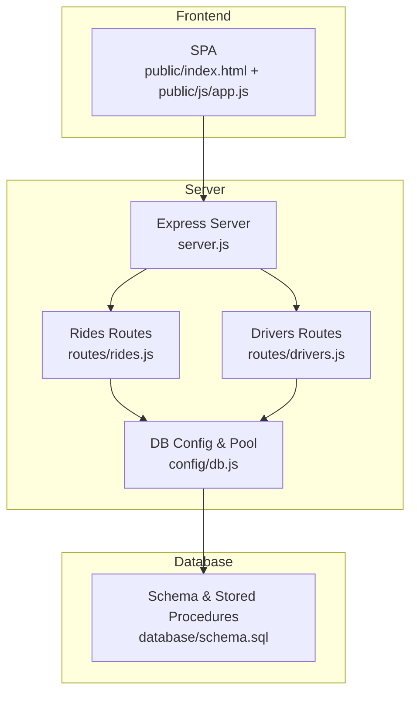
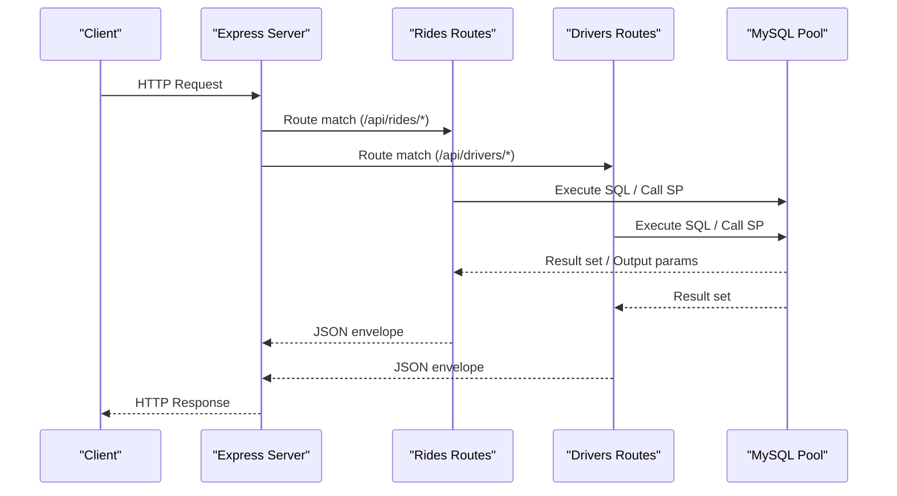
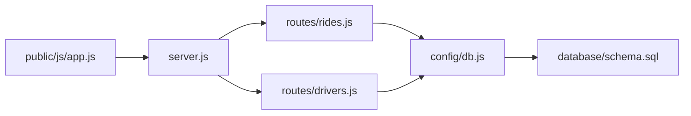

# API Reference

<cite>
**Referenced Files in This Document**
- [server.js](file://server.js)
- [routes/rides.js](file://routes/rides.js)
- [routes/drivers.js](file://routes/drivers.js)
- [config/db.js](file://config/db.js)
- [database/schema.sql](file://database/schema.sql)
- [public/js/app.js](file://public/js/app.js)
- [public/index.html](file://public/index.html)
- [package.json](file://package.json)
- [README.md](file://README.md)
</cite>

## Table of Contents
1. [Introduction](#introduction)
2. [Project Structure](#project-structure)
3. [Core Components](#core-components)
4. [Architecture Overview](#architecture-overview)
5. [Detailed Component Analysis](#detailed-component-analysis)
6. [Dependency Analysis](#dependency-analysis)
7. [Performance Considerations](#performance-considerations)
8. [Troubleshooting Guide](#troubleshooting-guide)
9. [Conclusion](#conclusion)
10. [Appendices](#appendices)

## Introduction
This document provides a comprehensive API reference for the RESTful endpoints of the ride-sharing matching system. It covers:
- Authentication methods
- Request/response schemas
- Status codes and error handling
- Rate limiting considerations
- Common use cases and client implementation guidelines
- Performance optimization tips for high-concurrency scenarios

Endpoints documented:
- Ride management: GET /api/rides/active, GET /api/rides/pending, POST /api/rides/request, POST /api/rides/match, PUT /api/rides/:id/status, GET /api/rides/stats
- Driver management: GET /api/drivers, GET /api/drivers/available, POST /api/drivers/register, PUT /api/drivers/:id/location, PUT /api/drivers/:id/status, GET /api/drivers/:id/rides
- System: GET /api/health

## Project Structure
The backend is an Express.js server with modular route handlers and a MySQL database with connection pooling and stored procedures for atomic operations. The frontend is a static SPA that consumes the API.

**Diagram sources**
- [server.js:1-84](file://server.js#L1-L84)
- [routes/rides.js:1-272](file://routes/rides.js#L1-L272)
- [routes/drivers.js:1-182](file://routes/drivers.js#L1-L182)
- [config/db.js:1-50](file://config/db.js#L1-L50)
- [database/schema.sql:1-297](file://database/schema.sql#L1-L297)
- [public/index.html:1-239](file://public/index.html#L1-L239)
- [public/js/app.js:1-373](file://public/js/app.js#L1-L373)

**Section sources**
- [server.js:1-84](file://server.js#L1-L84)
- [routes/rides.js:1-272](file://routes/rides.js#L1-L272)
- [routes/drivers.js:1-182](file://routes/drivers.js#L1-L182)
- [config/db.js:1-50](file://config/db.js#L1-L50)
- [database/schema.sql:1-297](file://database/schema.sql#L1-L297)
- [public/index.html:1-239](file://public/index.html#L1-L239)
- [public/js/app.js:1-373](file://public/js/app.js#L1-L373)

## Core Components
- Express server with CORS, JSON parsing, and static file serving
- Route modules for rides and drivers
- MySQL connection pool with timeouts and queue limits
- Stored procedures for atomic matching and status updates
- Frontend SPA that calls the API endpoints

Key behaviors:
- Connection pooling tuned for peak-hour concurrency
- Atomic operations via stored procedures to prevent race conditions
- Structured response envelopes with a success flag and payload/error field
- Health endpoint for database connectivity checks

**Section sources**
- [server.js:1-84](file://server.js#L1-L84)
- [config/db.js:1-50](file://config/db.js#L1-L50)
- [database/schema.sql:160-272](file://database/schema.sql#L160-L272)
- [routes/rides.js:1-272](file://routes/rides.js#L1-L272)
- [routes/drivers.js:1-182](file://routes/drivers.js#L1-L182)

## Architecture Overview
The API follows a layered architecture:
- Presentation layer: Express routes
- Business logic: Route handlers and stored procedures
- Data access: mysql2 promise pool
- Persistence: MySQL tables with strategic indexes

**Diagram sources**
- [server.js:37-51](file://server.js#L37-L51)
- [routes/rides.js:10-259](file://routes/rides.js#L10-L259)
- [routes/drivers.js:10-179](file://routes/drivers.js#L10-L179)
- [config/db.js:7-30](file://config/db.js#L7-L30)

## Detailed Component Analysis

### Authentication Methods
- No authentication middleware is implemented in the server. All endpoints are open.
- Production deployments should integrate JWT, session-based auth, or API keys.

**Section sources**
- [server.js:16-30](file://server.js#L16-L30)

### System Endpoint
- GET /api/health
  - Purpose: Verify database connectivity
  - Response: JSON envelope with health status and timestamp
  - Typical success: { success: true, status: "healthy", database: "connected", timestamp: "...Z" }
  - Typical failure: { success: false, error: "<message>" }

**Section sources**
- [server.js:43-51](file://server.js#L43-L51)
- [config/db.js:32-41](file://config/db.js#L32-L41)

### Ride Management Endpoints

#### GET /api/rides/active
- Purpose: Retrieve recent active and pending ride requests for dashboards
- Query parameters: None
- Response envelope: { success: boolean, count: number, rides: [...row...] }
- Success code: 200
- Error codes: 500 on internal errors

Response fields (selected):
- request_id, status, pickup_lat, pickup_lng, dropoff_lat, dropoff_lng, pickup_address, dropoff_address, fare_estimate, created_at, rider_name, driver_name, vehicle

Notes:
- Limits to 100 rows
- Joins users and drivers via matches

**Section sources**
- [routes/rides.js:10-41](file://routes/rides.js#L10-L41)

#### GET /api/rides/pending
- Purpose: Provide driver apps with nearby pending requests
- Query parameters:
  - lat (optional): numeric
  - lng (optional): numeric
  - radius (optional, default 5): numeric (km)
- Response envelope: { success: boolean, count: number, requests: [...row...] }
- Success code: 200
- Error codes: 500 on internal errors

Response fields (selected):
- request_id, pickup_lat, pickup_lng, dropoff_lat, dropoff_lng, pickup_address, dropoff_address, fare_estimate, priority_score, created_at, rider_name

Notes:
- Optional Haversine-based distance filter
- Orders by priority_score desc, created_at asc
- Limits to 50 rows

**Section sources**
- [routes/rides.js:43-86](file://routes/rides.js#L43-L86)

#### POST /api/rides/request
- Purpose: Create a new ride request
- Request body (selected fields):
  - user_id (required)
  - pickup_lat (required)
  - pickup_lng (required)
  - dropoff_lat (required)
  - dropoff_lng (required)
  - pickup_address (optional)
  - dropoff_address (optional)
  - fare_estimate (optional)
- Response envelope: { success: boolean, request_id: number, message: string }
- Success code: 201 (implicit via JSON response)
- Error codes: 500 on internal errors

Behavior:
- Inserts into ride_requests with calculated priority score
- Uses transaction for atomicity

**Section sources**
- [routes/rides.js:88-133](file://routes/rides.js#L88-L133)

#### POST /api/rides/match
- Purpose: Atomically match a driver to a pending ride
- Request body:
  - request_id (required)
  - driver_id (required)
  - fare_estimate (optional)
- Response envelope: On success { success: true, match_id: number, message: string }; on conflict { success: false, error: string }
- Success code: 200
- Conflict code: 409
- Error codes: 500 on internal errors

Behavior:
- Calls stored procedure sp_match_ride
- Uses FOR UPDATE locks to prevent race conditions

**Section sources**
- [routes/rides.js:135-167](file://routes/rides.js#L135-L167)
- [database/schema.sql:167-234](file://database/schema.sql#L167-L234)

#### PUT /api/rides/:id/status
- Purpose: Update ride and match status with driver availability sync
- Path parameters:
  - id: request_id
- Request body:
  - status (required): one of pending, matched, picked_up, completed, cancelled
  - version (optional): optimistic locking support
- Response envelope: { success: boolean, request_updated: number, match_updated: number, message: string }
- Success code: 200
- Error codes: 500 on internal errors

Behavior:
- Updates ride_requests and syncs ride_matches status
- Frees driver on completion/cancellation
- Uses transaction for consistency

**Section sources**
- [routes/rides.js:169-224](file://routes/rides.js#L169-L224)

#### GET /api/rides/stats
- Purpose: Provide dashboard statistics for monitoring
- Query parameters: None
- Response envelope: { success: boolean, stats: { pending_requests, matched_rides, active_trips, available_drivers, completed_today } }
- Success code: 200
- Error codes: 500 on internal errors

**Section sources**
- [routes/rides.js:226-259](file://routes/rides.js#L226-L259)

### Driver Management Endpoints

#### GET /api/drivers
- Purpose: List all drivers with optional current location
- Query parameters: None
- Response envelope: { success: boolean, count: number, drivers: [...row...] }
- Success code: 200
- Error codes: 500 on internal errors

Response fields (selected):
- driver_id, name, email, phone, vehicle_model, vehicle_plate, status, rating, total_trips, latitude, longitude, location_updated

**Section sources**
- [routes/drivers.js:10-36](file://routes/drivers.js#L10-L36)

#### GET /api/drivers/available
- Purpose: Find available drivers near a given coordinate
- Query parameters:
  - lat (optional)
  - lng (optional)
  - radius (optional, default 5)
- Response envelope: { success: boolean, count: number, drivers: [...row...] }
- Success code: 200
- Error codes: 500 on internal errors

Response fields (selected):
- driver_id, name, vehicle_model, vehicle_plate, rating, latitude, longitude, location_updated

Notes:
- Optional Haversine-based distance filter
- Orders by location updated_at desc
- Limits to 50 rows

**Section sources**
- [routes/drivers.js:38-77](file://routes/drivers.js#L38-L77)

#### POST /api/drivers/register
- Purpose: Register a new driver
- Request body:
  - name (required)
  - email (required)
  - phone (required)
  - vehicle_model (required)
  - vehicle_plate (required)
- Response envelope: { success: boolean, driver_id: number, message: string }
- Success code: 201 (implicit via JSON response)
- Error codes: 500 on internal errors

**Section sources**
- [routes/drivers.js:79-99](file://routes/drivers.js#L79-L99)

#### PUT /api/drivers/:id/location
- Purpose: Update driver GPS location (frequent updates)
- Path parameters:
  - id: driver_id
- Request body:
  - latitude (required)
  - longitude (required)
  - accuracy (optional)
- Response envelope: { success: boolean, message: string }
- Success code: 200
- Error codes: 500 on internal errors

Behavior:
- Upserts driver_locations using INSERT ... ON DUPLICATE KEY UPDATE

**Section sources**
- [routes/drivers.js:101-126](file://routes/drivers.js#L101-L126)

#### PUT /api/drivers/:id/status
- Purpose: Toggle driver availability
- Path parameters:
  - id: driver_id
- Request body:
  - status (required): offline, available, busy, on_trip
- Response envelope: { success: boolean, message: string }
- Success code: 200
- Not found code: 404
- Error codes: 500 on internal errors

**Section sources**
- [routes/drivers.js:128-148](file://routes/drivers.js#L128-L148)

#### GET /api/drivers/:id/rides
- Purpose: Retrieve a driver’s recent ride history
- Path parameters:
  - id: driver_id
- Response envelope: { success: boolean, count: number, rides: [...row...] }
- Success code: 200
- Error codes: 500 on internal errors

Response fields (selected):
- match_id, status, fare_final, distance_km, created_at, started_at, completed_at, pickup_address, dropoff_address, rider_name

Notes:
- Limits to 20 rows

**Section sources**
- [routes/drivers.js:150-179](file://routes/drivers.js#L150-L179)

### Request/Response Envelope and Status Codes
- All endpoints return a JSON envelope with:
  - success: boolean
  - On success: payload fields (e.g., rides, drivers, stats, message, count)
  - On error: error: string
- Standard HTTP status codes:
  - 200 OK for successful GET/PUT/DELETE
  - 201 Created for successful POST (implicit)
  - 404 Not Found for missing resources
  - 409 Conflict for business conflicts (e.g., double match)
  - 500 Internal Server Error for server failures

**Section sources**
- [routes/rides.js:11-41](file://routes/rides.js#L11-L41)
- [routes/rides.js:135-167](file://routes/rides.js#L135-L167)
- [routes/drivers.js:128-148](file://routes/drivers.js#L128-L148)
- [server.js:58-67](file://server.js#L58-L67)

### Error Handling Strategies
- Centralized error handling:
  - 404 handler for unknown routes
  - Global error handler for uncaught exceptions
- Route-level try/catch blocks return structured JSON errors
- Health endpoint returns explicit database connectivity status

**Section sources**
- [server.js:58-67](file://server.js#L58-L67)
- [routes/rides.js:37-40](file://routes/rides.js#L37-L40)
- [routes/drivers.js:32-35](file://routes/drivers.js#L32-L35)

### Rate Limiting Considerations
- No built-in rate limiting in the server
- Recommended approaches:
  - Use a reverse proxy (e.g., Nginx) or middleware (e.g., express-rate-limit)
  - Apply per-IP quotas for high-volume endpoints (e.g., /api/rides/pending, /api/drivers/available)
  - Throttle frequent location updates (/api/drivers/:id/location)

**Section sources**
- [server.js:16-30](file://server.js#L16-L30)

### Common Use Cases and Client Implementation Guidelines
- Request a ride:
  - POST /api/rides/request with coordinates and optional addresses
  - Client should parse success flag and show feedback
- Match a driver:
  - GET /api/rides/pending to discover nearby pending requests
  - GET /api/drivers/available to discover nearby available drivers
  - POST /api/rides/match with request_id and driver_id
- Update ride status:
  - PUT /api/rides/:id/status with status values (pending, matched, picked_up, completed, cancelled)
- Monitor system:
  - GET /api/rides/stats for dashboard metrics
  - GET /api/health for DB connectivity

Client-side examples (from frontend):
- API helpers: apiGet, apiPost, apiPut
- Auto-refresh intervals for stats, rides, drivers
- Modal-driven form submissions

**Section sources**
- [public/js/app.js:326-347](file://public/js/app.js#L326-L347)
- [public/js/app.js:25-29](file://public/js/app.js#L25-L29)
- [public/js/app.js:71-91](file://public/js/app.js#L71-L91)
- [public/js/app.js:124-144](file://public/js/app.js#L124-L144)
- [public/js/app.js:214-223](file://public/js/app.js#L214-L223)
- [public/js/app.js:155-169](file://public/js/app.js#L155-L169)
- [public/js/app.js:171-199](file://public/js/app.js#L171-L199)
- [public/js/app.js:225-250](file://public/js/app.js#L225-L250)
- [public/js/app.js:262-288](file://public/js/app.js#L262-L288)
- [public/js/app.js:290-315](file://public/js/app.js#L290-L315)

## Dependency Analysis
- Route handlers depend on:
  - MySQL pool from config/db.js
  - Stored procedures defined in database/schema.sql
- Server depends on:
  - Express, cors, dotenv
  - Route modules mounted under /api/rides and /api/drivers
- Frontend depends on:
  - Static assets served by Express
  - Calls to API endpoints defined here

**Diagram sources**
- [server.js:6-8](file://server.js#L6-L8)
- [routes/rides.js:3](file://routes/rides.js#L3)
- [routes/drivers.js:3](file://routes/drivers.js#L3)
- [config/db.js:1-2](file://config/db.js#L1-L2)
- [database/schema.sql:1-10](file://database/schema.sql#L1-L10)
- [public/js/app.js:5](file://public/js/app.js#L5)

**Section sources**
- [server.js:6-8](file://server.js#L6-L8)
- [routes/rides.js:3](file://routes/rides.js#L3)
- [routes/drivers.js:3](file://routes/drivers.js#L3)
- [config/db.js:1-2](file://config/db.js#L1-L2)
- [database/schema.sql:1-10](file://database/schema.sql#L1-L10)
- [public/js/app.js:5](file://public/js/app.js#L5)

## Performance Considerations
- Connection pooling:
  - Pool size 50 with queue limit 100 for peak-hour bursts
  - Timeouts configured to prevent hanging connections
- Atomic operations:
  - Stored procedures with FOR UPDATE locks prevent race conditions
- Indexing:
  - Strategic indexes on status, created_at, and location fields
- Upsert pattern:
  - INSERT ... ON DUPLICATE KEY UPDATE for frequent location updates
- Priority scoring:
  - Higher priority during peak hours (7-9 AM, 5-8 PM) to manage queue fairness
- Frontend refresh cadence:
  - Auto-refresh intervals reduce manual polling overhead

**Section sources**
- [config/db.js:7-30](file://config/db.js#L7-L30)
- [database/schema.sql:46-98](file://database/schema.sql#L46-L98)
- [database/schema.sql:167-234](file://database/schema.sql#L167-L234)
- [routes/rides.js:262-269](file://routes/rides.js#L262-L269)
- [public/js/app.js:25-29](file://public/js/app.js#L25-L29)

## Troubleshooting Guide
Common issues and resolutions:
- Database connectivity failures:
  - Use GET /api/health to confirm connectivity
  - Check DB_HOST, DB_PORT, DB_USER, DB_PASSWORD, DB_NAME in environment
- Port conflicts:
  - Change PORT in environment if 3000 is in use
- Missing tables:
  - Run database/schema.sql to initialize schema and stored procedures
- Slow queries during peak hours:
  - Monitor stats and consider increasing pool size or optimizing queries

Operational checks:
- Server startup logs indicate database connection status
- Frontend shows connection status and auto-refreshes stats

**Section sources**
- [server.js:72-81](file://server.js#L72-L81)
- [server.js:43-51](file://server.js#L43-L51)
- [README.md:265-274](file://README.md#L265-L274)

## Conclusion
The API provides a robust foundation for a ride-sharing matching system with strong concurrency controls and clear response envelopes. For production, add authentication, rate limiting, and consider caching for read-heavy endpoints. The frontend demonstrates practical usage patterns for common workflows.

## Appendices

### Endpoint Summary
- Rides:
  - GET /api/rides/active
  - GET /api/rides/pending
  - POST /api/rides/request
  - POST /api/rides/match
  - PUT /api/rides/:id/status
  - GET /api/rides/stats
- Drivers:
  - GET /api/drivers
  - GET /api/drivers/available
  - POST /api/drivers/register
  - PUT /api/drivers/:id/location
  - PUT /api/drivers/:id/status
  - GET /api/drivers/:id/rides
- System:
  - GET /api/health

**Section sources**
- [routes/rides.js:10-259](file://routes/rides.js#L10-L259)
- [routes/drivers.js:10-179](file://routes/drivers.js#L10-L179)
- [server.js:43-51](file://server.js#L43-L51)