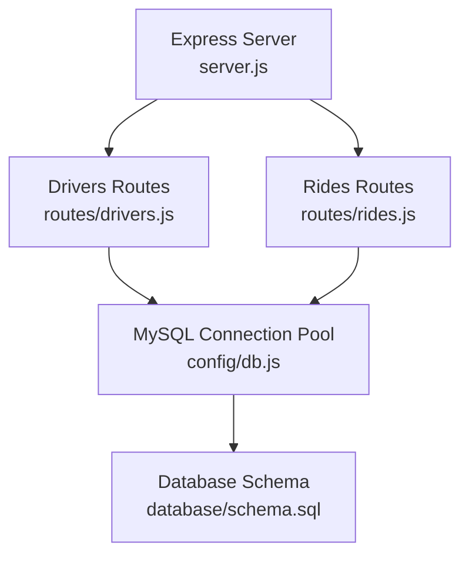
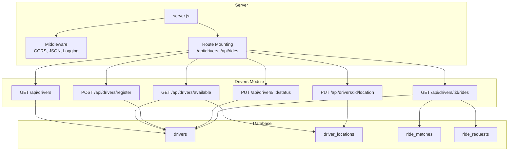
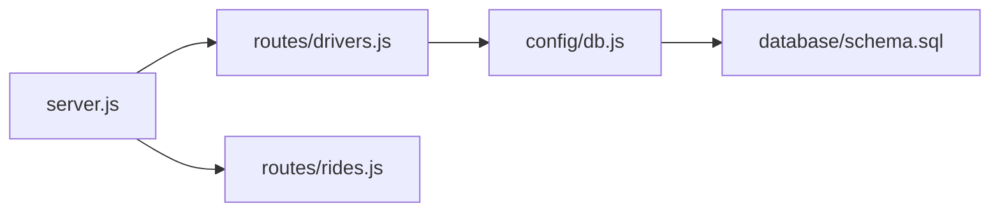
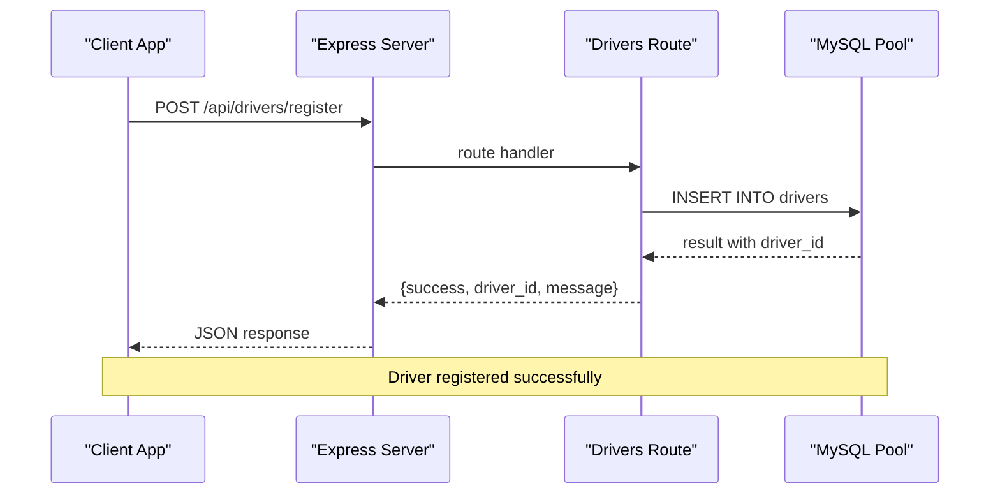
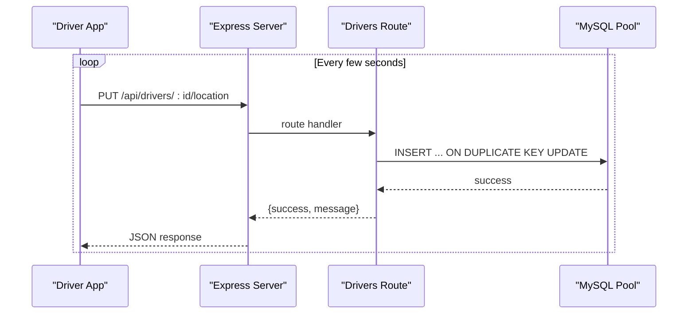
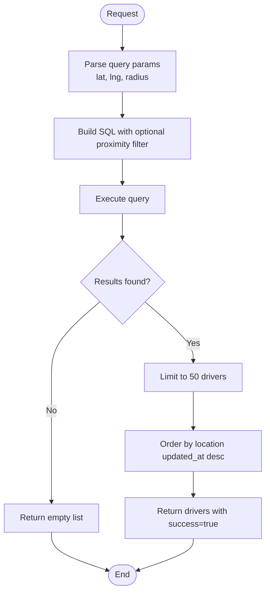

# Driver Management API Endpoints

<cite>
**Referenced Files in This Document**
- [server.js](file://server.js)
- [drivers.js](file://routes/drivers.js)
- [rides.js](file://routes/rides.js)
- [db.js](file://config/db.js)
- [schema.sql](file://database/schema.sql)
- [README.md](file://README.md)
</cite>

## Table of Contents
1. [Introduction](#introduction)
2. [Project Structure](#project-structure)
3. [Core Components](#core-components)
4. [Architecture Overview](#architecture-overview)
5. [Detailed Component Analysis](#detailed-component-analysis)
6. [Dependency Analysis](#dependency-analysis)
7. [Performance Considerations](#performance-considerations)
8. [Troubleshooting Guide](#troubleshooting-guide)
9. [Conclusion](#conclusion)
10. [Appendices](#appendices)

## Introduction
This document provides comprehensive API documentation for the driver management endpoints in the ride-sharing system. It covers all driver-related endpoints, including listing drivers, finding available drivers with location-based filtering, registering new drivers, updating driver locations frequently, managing driver availability status, and retrieving driver-specific ride history. The documentation includes request/response schemas, authentication requirements, rate limiting considerations, error handling patterns, and practical examples for common workflows such as driver onboarding and real-time location updates.

## Project Structure
The backend is implemented using Node.js and Express, with MySQL as the persistence layer. The server exposes REST endpoints under the /api namespace, with dedicated route modules for drivers and rides. The database schema defines tables for drivers, driver locations, ride requests, and ride matches, along with stored procedures for atomic operations.

**Diagram sources**
- [server.js:1-84](file://server.js#L1-L84)
- [drivers.js:1-182](file://routes/drivers.js#L1-L182)
- [rides.js:1-272](file://routes/rides.js#L1-L272)
- [db.js:1-50](file://config/db.js#L1-L50)
- [schema.sql:1-297](file://database/schema.sql#L1-L297)

**Section sources**
- [server.js:1-84](file://server.js#L1-L84)
- [drivers.js:1-182](file://routes/drivers.js#L1-L182)
- [rides.js:1-272](file://routes/rides.js#L1-L272)
- [db.js:1-50](file://config/db.js#L1-L50)
- [schema.sql:1-297](file://database/schema.sql#L1-L297)

## Core Components
- Express server with middleware for CORS, JSON parsing, and slow request logging.
- Route modules for drivers and rides, each exposing REST endpoints.
- MySQL connection pool configured for high concurrency and peak-hour load.
- Database schema with tables for drivers, driver locations, ride requests, and ride matches, plus stored procedures for atomic operations.

Key characteristics:
- Connection pool size tuned for peak-hour concurrency.
- Upsert operations for frequent location updates to avoid race conditions.
- Stored procedures for atomic matching and status updates to prevent conflicts.
- Strategic indexing to optimize read-heavy operations and location-based queries.

**Section sources**
- [server.js:10-67](file://server.js#L10-L67)
- [db.js:7-30](file://config/db.js#L7-L30)
- [schema.sql:29-126](file://database/schema.sql#L29-L126)

## Architecture Overview
The driver management API is part of a larger ride-sharing system with separate routes for rides and drivers. The server initializes middleware, mounts route handlers, and exposes health checks. The drivers module handles CRUD-like operations for drivers and integrates with the driver_locations table for real-time tracking.

**Diagram sources**
- [server.js:10-41](file://server.js#L10-L41)
- [drivers.js:10-179](file://routes/drivers.js#L10-L179)
- [schema.sql:29-126](file://database/schema.sql#L29-L126)

## Detailed Component Analysis

### GET /api/drivers
Purpose: Retrieve a list of all drivers with basic profile information and their latest location if available.

Behavior:
- Performs a LEFT JOIN between drivers and driver_locations to include location data when present.
- Orders results by driver status and then by name for consistent presentation.
- Returns a success flag, total count, and an array of driver records.

Response schema:
- success: boolean
- count: number
- drivers: array of driver objects containing:
  - driver_id: integer
  - name: string
  - email: string
  - phone: string
  - vehicle_model: string
  - vehicle_plate: string
  - status: enum string
  - rating: decimal
  - total_trips: integer
  - latitude: decimal (nullable)
  - longitude: decimal (nullable)
  - location_updated: timestamp (nullable)

Notes:
- Pagination is not implemented; the endpoint returns all drivers.
- Filtering capabilities are not exposed by this endpoint.

Common use cases:
- Driver dashboard overview
- Administrative reporting
- Initial load of driver roster

**Section sources**
- [drivers.js:10-36](file://routes/drivers.js#L10-L36)
- [schema.sql:29-69](file://database/schema.sql#L29-L69)

### GET /api/drivers/available
Purpose: Find available drivers with optional real-time location filtering.

Behavior:
- Filters drivers by status = 'available'.
- Supports optional query parameters for geographic proximity:
  - lat: latitude for center point
  - lng: longitude for center point
  - radius: search radius in kilometers (default 5)
- Applies a Haversine-based distance calculation to filter nearby drivers.
- Orders results by location updated_at descending to prioritize fresher data.
- Limits results to 50 drivers to control response size.

Response schema:
- success: boolean
- count: number
- drivers: array of driver objects containing:
  - driver_id: integer
  - name: string
  - vehicle_model: string
  - vehicle_plate: string
  - rating: decimal
  - latitude: decimal
  - longitude: decimal
  - location_updated: timestamp

Notes:
- Requires both lat and lng for proximity filtering; otherwise returns all available drivers.
- Uses a radius parameter with a default of 5km.
- Limits result set to 50 entries for performance.

Common use cases:
- Real-time dispatch of nearby drivers
- Driver availability monitoring
- Proximity-based driver selection

**Section sources**
- [drivers.js:38-77](file://routes/drivers.js#L38-L77)
- [schema.sql:39-69](file://database/schema.sql#L39-L69)

### POST /api/drivers/register
Purpose: Register a new driver with basic profile information.

Behavior:
- Extracts name, email, phone, vehicle_model, and vehicle_plate from the request body.
- Inserts a new record into the drivers table with default status 'offline'.
- Returns the newly assigned driver_id upon successful creation.

Response schema:
- success: boolean
- driver_id: integer
- message: string

Validation and constraints:
- The underlying schema enforces uniqueness for email and vehicle_plate.
- The status field defaults to 'offline' for new registrations.

Common use cases:
- Driver onboarding workflow
- New driver enrollment
- Initial driver setup

**Section sources**
- [drivers.js:79-99](file://routes/drivers.js#L79-L99)
- [schema.sql:32-49](file://database/schema.sql#L32-L49)

### PUT /api/drivers/:id/location
Purpose: Update a driver's GPS location frequently with upsert semantics.

Behavior:
- Validates path parameter id (driver identifier).
- Accepts latitude, longitude, and optional accuracy in the request body.
- Performs an atomic upsert using INSERT ... ON DUPLICATE KEY UPDATE to handle existing records.
- Updates the location fields and refreshes updated_at to the current timestamp.
- Returns a success message upon completion.

Response schema:
- success: boolean
- message: string

Upsert mechanics:
- Uses a unique constraint on driver_id in driver_locations to trigger the upsert.
- Updates latitude, longitude, and accuracy atomically.
- Timestamps the update to track freshness.

Common use cases:
- Real-time location tracking during trips
- Periodic GPS updates from driver apps
- Location synchronization

**Section sources**
- [drivers.js:101-126](file://routes/drivers.js#L101-L126)
- [schema.sql:54-69](file://database/schema.sql#L54-L69)

### PUT /api/drivers/:id/status
Purpose: Update a driver's availability status.

Behavior:
- Validates path parameter id.
- Accepts status in the request body.
- Executes an UPDATE statement against the drivers table.
- Returns a success message upon successful update.
- Returns a 404 error if the driver does not exist.

Response schema:
- success: boolean
- message: string

Notes:
- The status field is an enum with values: offline, available, busy, on_trip.
- No automatic conflict resolution is implemented; external coordination is required if multiple clients may update status concurrently.

Common use cases:
- Driver sign-in/sign-out
- Availability toggling
- Status synchronization

**Section sources**
- [drivers.js:128-148](file://routes/drivers.js#L128-L148)
- [schema.sql:39](file://database/schema.sql#L39)

### GET /api/drivers/:id/rides
Purpose: Retrieve a driver's recent ride history.

Behavior:
- Validates path parameter id.
- Joins ride_matches, ride_requests, and users to provide comprehensive ride details.
- Limits results to 20 most recent rides.
- Orders by creation time descending for recency.

Response schema:
- success: boolean
- count: number
- rides: array of ride objects containing:
  - match_id: integer
  - status: enum string
  - fare_final: decimal (nullable)
  - distance_km: decimal (nullable)
  - created_at: timestamp
  - started_at: timestamp (nullable)
  - completed_at: timestamp (nullable)
  - pickup_address: string (nullable)
  - dropoff_address: string (nullable)
  - rider_name: string

Notes:
- Filtering by date ranges and status is not implemented by this endpoint.
- The limit of 20 provides a reasonable default for driver dashboards.

Common use cases:
- Driver performance analytics
- Trip history review
- Earnings and rating tracking

**Section sources**
- [drivers.js:150-179](file://routes/drivers.js#L150-L179)
- [schema.sql:103-126](file://database/schema.sql#L103-L126)

## Dependency Analysis
The drivers module depends on the MySQL connection pool for database operations and the database schema for table definitions. The server mounts the drivers routes and applies global middleware. The rides module provides complementary endpoints for ride lifecycle management.

**Diagram sources**
- [drivers.js:1-3](file://routes/drivers.js#L1-L3)
- [db.js:1-3](file://config/db.js#L1-L3)
- [schema.sql:1-10](file://database/schema.sql#L1-L10)
- [server.js:6-8](file://server.js#L6-L8)

**Section sources**
- [drivers.js:1-3](file://routes/drivers.js#L1-L3)
- [db.js:1-3](file://config/db.js#L1-L3)
- [schema.sql:1-10](file://database/schema.sql#L1-L10)
- [server.js:6-8](file://server.js#L6-L8)

## Performance Considerations
- Connection pooling: The pool is configured with a connectionLimit suitable for peak-hour concurrency, helping to handle bursts without dropping requests.
- Upsert strategy: Using INSERT ... ON DUPLICATE KEY UPDATE eliminates race conditions and reduces round-trips for frequent location updates.
- Indexing: Strategic indexes on drivers (status, updated_at) and driver_locations (location, updated_at) support efficient queries for availability and proximity filtering.
- Result limits: Endpoints limit result sets (available drivers: 50; driver rides: 20) to control payload sizes and query times.
- Slow request logging: Middleware logs requests exceeding a threshold to monitor performance under load.

[No sources needed since this section provides general guidance]

## Troubleshooting Guide
Common issues and resolutions:
- Database connectivity failures: Verify DB_HOST, DB_PORT, DB_USER, DB_PASSWORD, and DB_NAME in the environment configuration. Use the /api/health endpoint to check database connectivity.
- Driver not found errors: Ensure the driver_id exists in the drivers table before attempting status or location updates.
- Duplicate registration errors: The schema enforces unique constraints on email and vehicle_plate; resolve duplicates before reattempting registration.
- Slow queries during peak hours: Monitor slow request logs and consider adjusting pool size or optimizing queries if necessary.

**Section sources**
- [server.js:44-51](file://server.js#L44-L51)
- [db.js:33-41](file://config/db.js#L33-L41)
- [schema.sql:35-38](file://database/schema.sql#L35-L38)

## Conclusion
The driver management API provides essential endpoints for driver onboarding, real-time location tracking, availability management, and ride history access. The implementation emphasizes performance and reliability through connection pooling, atomic upserts, strategic indexing, and careful result limiting. While some endpoints lack pagination and advanced filtering, they are designed for simplicity and speed, suitable for typical driver management scenarios.

[No sources needed since this section summarizes without analyzing specific files]

## Appendices

### Authentication and Authorization
- No explicit authentication or authorization mechanisms are implemented in the server.js middleware. All endpoints are publicly accessible.
- For production deployments, integrate middleware such as JWT verification or API key validation before mounting the drivers routes.

**Section sources**
- [server.js:16-30](file://server.js#L16-L30)

### Rate Limiting Considerations
- No built-in rate limiting is implemented. For production environments, consider adding rate limiting middleware to protect endpoints from abuse, especially the frequent location update endpoint.

**Section sources**
- [drivers.js:101-126](file://routes/drivers.js#L101-L126)

### Error Handling Patterns
- All endpoints return a standardized response structure with a success flag and either data or an error message.
- Global error handlers catch unhandled exceptions and return a generic internal server error response.
- Specific endpoints log detailed errors to the console for debugging.

**Section sources**
- [drivers.js:32-35](file://routes/drivers.js#L32-L35)
- [drivers.js:73-76](file://routes/drivers.js#L73-L76)
- [drivers.js:95-98](file://routes/drivers.js#L95-L98)
- [drivers.js:122-125](file://routes/drivers.js#L122-L125)
- [drivers.js:144-147](file://routes/drivers.js#L144-L147)
- [drivers.js:175-178](file://routes/drivers.js#L175-L178)
- [server.js:63-67](file://server.js#L63-L67)

### Example Workflows

#### Driver Onboarding Workflow
- Register a new driver via POST /api/drivers/register.
- Verify the returned driver_id.
- Optionally update the driver's initial status via PUT /api/drivers/:id/status.

**Diagram sources**
- [drivers.js:79-99](file://routes/drivers.js#L79-L99)

#### Real-Time Location Updates
- During active trips, drivers' apps send periodic location updates to PUT /api/drivers/:id/location.
- The endpoint performs an atomic upsert to ensure consistency and freshness.

**Diagram sources**
- [drivers.js:101-126](file://routes/drivers.js#L101-L126)

#### Finding Available Drivers
- Dispatchers or riders can query nearby available drivers via GET /api/drivers/available with optional lat/lng/radius parameters.

**Diagram sources**
- [drivers.js:38-77](file://routes/drivers.js#L38-L77)