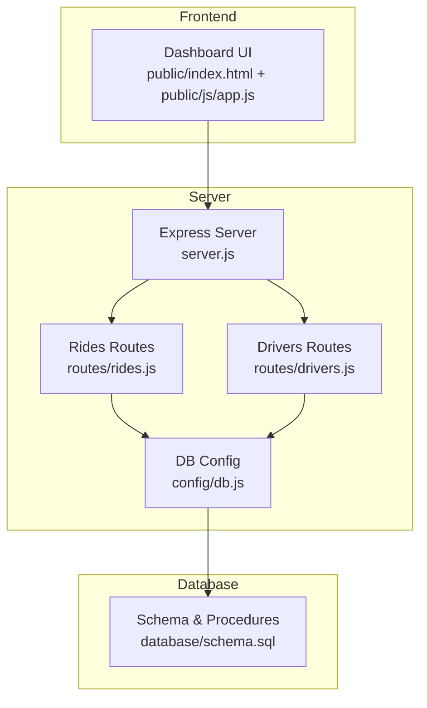
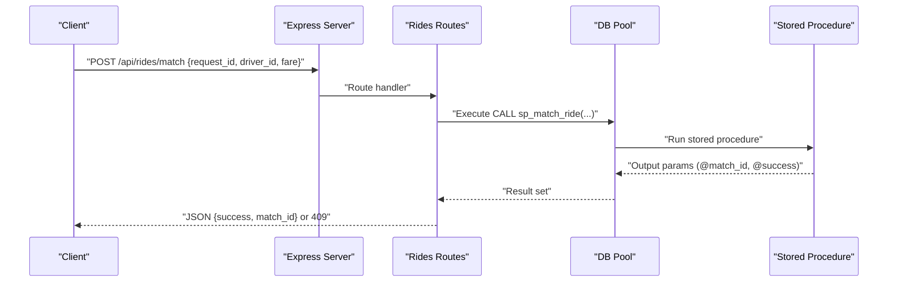
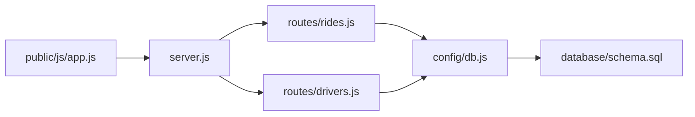

# Ride Management API Endpoints

<cite>
**Referenced Files in This Document**
- [server.js](file://server.js)
- [routes/rides.js](file://routes/rides.js)
- [routes/drivers.js](file://routes/drivers.js)
- [config/db.js](file://config/db.js)
- [database/schema.sql](file://database/schema.sql)
- [public/js/app.js](file://public/js/app.js)
- [README.md](file://README.md)
</cite>

## Table of Contents
1. [Introduction](#introduction)
2. [Project Structure](#project-structure)
3. [Core Components](#core-components)
4. [Architecture Overview](#architecture-overview)
5. [Detailed Component Analysis](#detailed-component-analysis)
6. [Dependency Analysis](#dependency-analysis)
7. [Performance Considerations](#performance-considerations)
8. [Troubleshooting Guide](#troubleshooting-guide)
9. [Conclusion](#conclusion)

## Introduction
This document provides comprehensive API documentation for the ride management endpoints in a high-concurrency ride-sharing system. It covers:
- Retrieving active rides with status tracking
- Finding nearby pending rides with geospatial filtering
- Creating ride requests with transaction handling and priority scoring
- Atomic ride-driver matching using stored procedures
- Updating ride and match status with optimistic locking and driver availability management
- Real-time peak-hour monitoring statistics

The backend is built with Node.js and Express, using MySQL 8.0 with connection pooling and stored procedures to ensure atomicity and concurrency safety. The frontend demonstrates typical usage patterns for these endpoints.

## Project Structure
The project follows a layered architecture:
- Server entry point initializes middleware, routes, and health checks
- Routes define API endpoints for rides and drivers
- Database schema defines tables, indexes, and stored procedures
- Frontend demonstrates API usage and auto-refresh behavior

**Diagram sources**
- [server.js:1-84](file://server.js#L1-L84)
- [routes/rides.js:1-272](file://routes/rides.js#L1-L272)
- [routes/drivers.js:1-182](file://routes/drivers.js#L1-L182)
- [config/db.js:1-50](file://config/db.js#L1-L50)
- [database/schema.sql:1-297](file://database/schema.sql#L1-L297)
- [public/js/app.js:1-373](file://public/js/app.js#L1-L373)

**Section sources**
- [server.js:1-84](file://server.js#L1-L84)
- [routes/rides.js:1-272](file://routes/rides.js#L1-L272)
- [routes/drivers.js:1-182](file://routes/drivers.js#L1-L182)
- [config/db.js:1-50](file://config/db.js#L1-L50)
- [database/schema.sql:1-297](file://database/schema.sql#L1-L297)
- [public/js/app.js:1-373](file://public/js/app.js#L1-L373)

## Core Components
- Express server with CORS, JSON parsing, static serving, and global error handling
- Connection pool configured for peak-hour concurrency with timeouts and keep-alive
- Rides routes implementing:
  - GET /api/rides/active
  - GET /api/rides/pending
  - POST /api/rides/request
  - POST /api/rides/match
  - PUT /api/rides/:id/status
  - GET /api/rides/stats
- Drivers routes for driver management and availability queries
- Stored procedures for atomic matching and status updates

**Section sources**
- [server.js:1-84](file://server.js#L1-L84)
- [config/db.js:1-50](file://config/db.js#L1-L50)
- [routes/rides.js:1-272](file://routes/rides.js#L1-L272)
- [routes/drivers.js:1-182](file://routes/drivers.js#L1-L182)
- [database/schema.sql:160-272](file://database/schema.sql#L160-L272)

## Architecture Overview
The system emphasizes high read throughput, frequent updates, and peak-hour concurrency. Key design choices:
- Connection pooling with queue limits to handle bursts
- Stored procedures for atomic operations preventing race conditions
- Strategic indexing for status filters, location searches, and queue ordering
- Version columns enabling optimistic locking on critical entities

**Diagram sources**
- [routes/rides.js:135-167](file://routes/rides.js#L135-L167)
- [database/schema.sql:166-234](file://database/schema.sql#L166-L234)

## Detailed Component Analysis

### GET /api/rides/active
Purpose: Retrieve active and pending rides for dashboard display with status tracking and driver info.

- Query parameters: None
- Response fields:
  - success: boolean
  - count: integer
  - rides: array of objects containing:
    - request_id, status, pickup_lat, pickup_lng, dropoff_lat, dropoff_lng
    - pickup_address, dropoff_address, fare_estimate, created_at
    - rider_name, driver_name, vehicle
- Behavior:
  - Joins ride_requests with users and optional ride_matches/drivers
  - Filters statuses: pending, matched, picked_up
  - Limits to 100 latest records
- Status codes:
  - 200 on success
  - 500 on internal error

Example request:
- GET /api/rides/active

Example response:
- 200 OK with rides array and metadata

**Section sources**
- [routes/rides.js:10-41](file://routes/rides.js#L10-L41)

### GET /api/rides/pending
Purpose: Driver app endpoint to discover nearby pending rides with optional geospatial filtering.

- Query parameters:
  - lat: number (optional)
  - lng: number (optional)
  - radius: number in kilometers, default 5
- Response fields:
  - success: boolean
  - count: integer
  - requests: array of objects with:
    - request_id, pickup_lat, pickup_lng, dropoff_lat, dropoff_lng
    - pickup_address, dropoff_address, fare_estimate, priority_score, created_at
    - rider_name
- Behavior:
  - Filters by status = pending
  - Optionally applies Haversine formula to restrict by radius around lat/lng
  - Orders by priority_score desc, created_at asc, limits to 50
- Status codes:
  - 200 on success
  - 500 on internal error

Example request:
- GET /api/rides/pending?lat=40.7128&lng=-74.0060&radius=5

Example response:
- 200 OK with requests array

Validation notes:
- Radius is parsed to float; invalid values are handled by the underlying SQL engine
- Missing lat/lng omits the spatial filter

**Section sources**
- [routes/rides.js:43-86](file://routes/rides.js#L43-L86)

### POST /api/rides/request
Purpose: Create a new ride request with transaction handling and priority scoring.

- Request body fields:
  - user_id, pickup_lat, pickup_lng, dropoff_lat, dropoff_lng
  - pickup_address (optional), dropoff_address (optional), fare_estimate (optional)
- Response fields:
  - success: boolean
  - request_id: integer
  - message: string
- Behavior:
  - Begins transaction, inserts ride_requests row with calculated priority_score
  - Commits on success, rolls back on error
  - Priority score is higher during peak hours (7–9 AM and 5–8 PM)
- Status codes:
  - 201 Created implicitly via 200 with success payload
  - 500 on internal error

Example request:
- POST /api/rides/request
- Body: { user_id, pickup_lat, pickup_lng, dropoff_lat, dropoff_lng, pickup_address, dropoff_address, fare_estimate }

Example response:
- 200 OK with { success: true, request_id, message }

Notes:
- Transaction ensures atomicity of insert
- Priority scoring is computed in the route layer

**Section sources**
- [routes/rides.js:88-133](file://routes/rides.js#L88-L133)
- [routes/rides.js:261-269](file://routes/rides.js#L261-L269)

### POST /api/rides/match
Purpose: Atomically match a driver to a ride using stored procedures to prevent race conditions.

- Request body fields:
  - request_id: integer
  - driver_id: integer
  - fare_estimate: number (optional)
- Response fields:
  - success: boolean
  - match_id: integer
  - message: string
- Behavior:
  - Calls stored procedure sp_match_ride with input parameters
  - Reads output parameters @match_id and @success
  - On success: returns match_id and success message
  - On failure: returns 409 Conflict with error message indicating existing match or unavailability
- Status codes:
  - 200 on success
  - 409 on conflict (already matched or driver unavailable)
  - 500 on internal error

Example request:
- POST /api/rides/match
- Body: { request_id, driver_id, fare_estimate }

Example response (success):
- 200 OK with { success: true, match_id, message }

Example response (conflict):
- 409 Conflict with { success: false, error }

Stored procedure behavior:
- Locks the ride request row and driver row using FOR UPDATE
- Updates request status to matched and increments versions
- Sets driver status to on_trip and increments version
- Inserts a new ride_matches record
- Returns match_id and success flag

**Section sources**
- [routes/rides.js:135-167](file://routes/rides.js#L135-L167)
- [database/schema.sql:166-234](file://database/schema.sql#L166-L234)

### PUT /api/rides/:id/status
Purpose: Update ride and match status with optimistic locking and driver availability management.

- Path parameter:
  - id: integer (request_id)
- Request body fields:
  - status: string (pending, matched, picked_up, completed, cancelled)
  - version: integer (expected version for optimistic locking)
- Response fields:
  - success: boolean
  - request_updated: integer
  - match_updated: integer
  - message: string
- Behavior:
  - Begins transaction, updates ride_requests status and increments version
  - Synchronizes match status based on mapping:
    - matched -> assigned
    - picked_up -> in_progress
  - If status is completed or cancelled, updates driver status to available
  - Commits on success, rolls back on error
- Status codes:
  - 200 on success
  - 500 on internal error

Example request:
- PUT /api/rides/123/status
- Body: { status: "picked_up", version: 1 }

Example response:
- 200 OK with { success: true, request_updated, match_updated, message }

Notes:
- Optimistic locking uses version increments to detect conflicts
- Driver availability is managed automatically upon completion/cancellation

**Section sources**
- [routes/rides.js:169-224](file://routes/rides.js#L169-L224)

### GET /api/rides/stats
Purpose: Provide real-time statistics for peak-hour monitoring.

- Query parameters: None
- Response fields:
  - success: boolean
  - stats: object with:
    - pending_requests, matched_rides, active_trips, available_drivers, completed_today
- Behavior:
  - Counts requests by status
  - Counts matches by active statuses
  - Counts available drivers
  - Counts completed matches for the current day
- Status codes:
  - 200 on success
  - 500 on internal error

Example request:
- GET /api/rides/stats

Example response:
- 200 OK with { success: true, stats }

**Section sources**
- [routes/rides.js:226-259](file://routes/rides.js#L226-L259)

## Dependency Analysis
Key dependencies and relationships:
- server.js mounts routes and enables CORS/JSON middleware
- routes/rides.js and routes/drivers.js depend on config/db.js for database operations
- database/schema.sql defines tables, indexes, and stored procedures used by routes
- public/js/app.js demonstrates client-side usage of these endpoints

**Diagram sources**
- [server.js:1-84](file://server.js#L1-L84)
- [routes/rides.js:1-272](file://routes/rides.js#L1-L272)
- [routes/drivers.js:1-182](file://routes/drivers.js#L1-L182)
- [config/db.js:1-50](file://config/db.js#L1-L50)
- [database/schema.sql:1-297](file://database/schema.sql#L1-L297)
- [public/js/app.js:1-373](file://public/js/app.js#L1-L373)

**Section sources**
- [server.js:1-84](file://server.js#L1-L84)
- [routes/rides.js:1-272](file://routes/rides.js#L1-L272)
- [routes/drivers.js:1-182](file://routes/drivers.js#L1-L182)
- [config/db.js:1-50](file://config/db.js#L1-L50)
- [database/schema.sql:1-297](file://database/schema.sql#L1-L297)
- [public/js/app.js:1-373](file://public/js/app.js#L1-L373)

## Performance Considerations
- Connection pooling:
  - Pool size 50 with queue limit 100 to handle peak-hour bursts
  - Timeouts configured to prevent hanging connections
- Atomic operations:
  - Stored procedures with FOR UPDATE locks prevent race conditions during matching
- Indexing strategy:
  - Status-based indexes for fast pending queues and available-driver queries
  - Location indexes for geospatial filtering
  - Priority score index for peak-hour queue ordering
- Upsert pattern:
  - INSERT ... ON DUPLICATE KEY UPDATE for driver location updates eliminates race conditions
- Frontend refresh cadence:
  - Stats refresh every 5 seconds, rides every 15 seconds, drivers every 30 seconds

Recommendations for high-concurrency scenarios:
- Consider adding Redis caching for frequently accessed reads (e.g., driver availability)
- Implement pagination for large result sets in active rides and stats
- Add rate limiting and circuit breakers at the gateway level
- Scale horizontally with multiple Node.js instances behind a load balancer

**Section sources**
- [config/db.js:7-30](file://config/db.js#L7-L30)
- [database/schema.sql:94-98](file://database/schema.sql#L94-L98)
- [database/schema.sql:46-49](file://database/schema.sql#L46-L49)
- [database/schema.sql:66-69](file://database/schema.sql#L66-L69)
- [database/schema.sql:166-234](file://database/schema.sql#L166-L234)
- [public/js/app.js:25-29](file://public/js/app.js#L25-L29)

## Troubleshooting Guide
Common issues and resolutions:
- Database connectivity failures:
  - Verify DB_HOST, DB_PORT, DB_USER, DB_PASSWORD, DB_NAME in environment
  - Use /api/health to check database connectivity
- Table not found errors:
  - Ensure database/schema.sql has been executed to create tables and stored procedures
- Connection refused or access denied:
  - Confirm MySQL service is running and credentials are correct
- Slow queries during peak hours:
  - Monitor stats and consider increasing pool size or optimizing queries
- 409 Conflict on match:
  - Indicates the ride is already matched or the driver is unavailable; retry selection
- 500 Internal Server Error:
  - Check server logs for stack traces; verify stored procedure existence and permissions

Operational checks:
- Health endpoint: GET /api/health returns database connectivity status
- Logging: Slow requests (>500ms) are logged with warning messages
- Global error handler: Centralized 500 error response

**Section sources**
- [server.js:43-67](file://server.js#L43-L67)
- [config/db.js:32-41](file://config/db.js#L32-L41)
- [README.md:265-274](file://README.md#L265-L274)

## Conclusion
The ride management API is designed for high-concurrency environments with robust transaction handling, atomic stored procedures, and strategic indexing. The endpoints support real-time dashboards, geospatial filtering, and peak-hour optimizations. By leveraging connection pooling, optimistic locking, and FOR UPDATE locks, the system minimizes race conditions and maintains data consistency under load. The frontend demonstrates practical usage patterns for request creation, matching, and status updates, while the stats endpoint provides operational visibility.