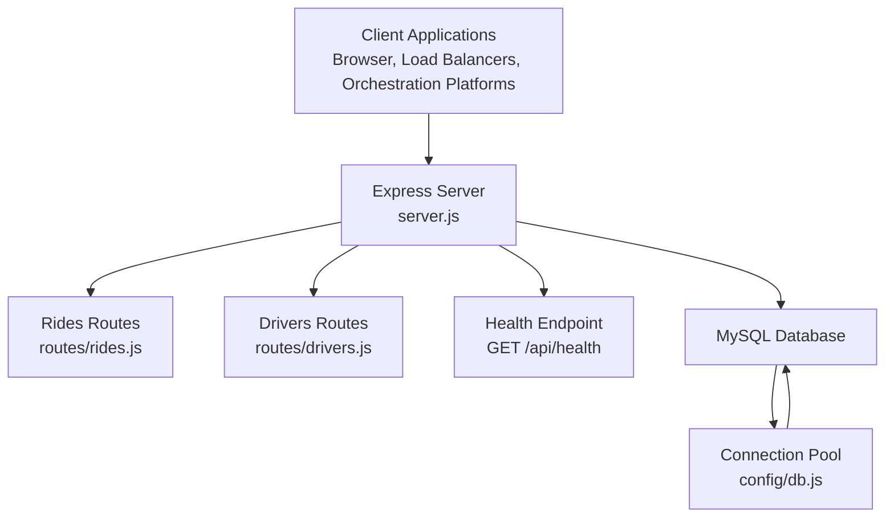
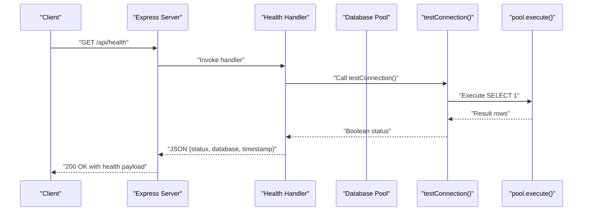
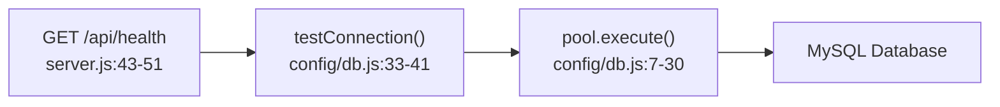

# System API Endpoints

<cite>
**Referenced Files in This Document**
- [server.js](file://server.js)
- [config/db.js](file://config/db.js)
- [routes/rides.js](file://routes/rides.js)
- [routes/drivers.js](file://routes/drivers.js)
- [database/schema.sql](file://database/schema.sql)
- [scripts/init-db.js](file://scripts/init-db.js)
- [package.json](file://package.json)
- [public/js/app.js](file://public/js/app.js)
- [public/index.html](file://public/index.html)
- [README.md](file://README.md)
</cite>

## Table of Contents
1. [Introduction](#introduction)
2. [Project Structure](#project-structure)
3. [Core Components](#core-components)
4. [Architecture Overview](#architecture-overview)
5. [Detailed Component Analysis](#detailed-component-analysis)
6. [Dependency Analysis](#dependency-analysis)
7. [Performance Considerations](#performance-considerations)
8. [Troubleshooting Guide](#troubleshooting-guide)
9. [Conclusion](#conclusion)
10. [Appendices](#appendices)

## Introduction
This document provides comprehensive API documentation for system-level endpoints, focusing on the database connectivity health check at GET /api/health. It covers endpoint behavior, response schemas, authentication and authorization requirements, monitoring and alerting integration points, and practical examples for load balancers and container orchestration platforms. It also includes troubleshooting guidance for common connectivity issues and performance monitoring recommendations, along with integration tips for external monitoring systems and logging strategies.

## Project Structure
The system is a Node.js/Express application with a MySQL backend. The server exposes system and business endpoints, manages a connection pool for database operations, and serves a static frontend dashboard.

**Diagram sources**
- [server.js:43-51](file://server.js#L43-L51)
- [config/db.js:7-30](file://config/db.js#L7-L30)
- [routes/rides.js:1-272](file://routes/rides.js#L1-L272)
- [routes/drivers.js:1-182](file://routes/drivers.js#L1-L182)

**Section sources**
- [server.js:1-84](file://server.js#L1-L84)
- [config/db.js:1-50](file://config/db.js#L1-L50)
- [package.json:1-24](file://package.json#L1-L24)

## Core Components
- Health endpoint: GET /api/health performs a database connectivity check and returns a simple health status payload.
- Connection pool: Configured with timeouts, queue limits, and keep-alive to manage peak-hour concurrency.
- Middleware: Logging middleware detects slow requests and logs warnings for performance monitoring.
- Frontend integration: The dashboard polls health and other endpoints to reflect system status.

Key implementation references:
- Health endpoint definition and response shape: [server.js:43-51](file://server.js#L43-L51)
- Connection pool configuration and health check helper: [config/db.js:7-41](file://config/db.js#L7-L41)
- Slow request logging middleware: [server.js:20-30](file://server.js#L20-L30)
- Frontend polling and status display: [public/js/app.js:155-169](file://public/js/app.js#L155-L169), [public/index.html:15-18](file://public/index.html#L15-L18)

**Section sources**
- [server.js:43-51](file://server.js#L43-L51)
- [config/db.js:7-41](file://config/db.js#L7-L41)
- [server.js:20-30](file://server.js#L20-L30)
- [public/js/app.js:155-169](file://public/js/app.js#L155-L169)
- [public/index.html:15-18](file://public/index.html#L15-L18)

## Architecture Overview
The health endpoint integrates with the database connection pool to verify connectivity. The pool is configured for high concurrency and includes timeouts to prevent hanging connections. The server logs slow requests to aid monitoring and alerting.

**Diagram sources**
- [server.js:43-51](file://server.js#L43-L51)
- [config/db.js:33-41](file://config/db.js#L33-L41)

## Detailed Component Analysis

### GET /api/health
Purpose:
- Verify database connectivity and report system readiness.
- Provide a minimal response indicating health status and timestamp.

Behavior:
- Executes a simple SELECT statement against the database through the connection pool.
- Returns a JSON object with:
  - status: "healthy" or "unhealthy"
  - database: "connected" or "disconnected"
  - timestamp: ISO date string

Response schema:
- status: string ("healthy" | "unhealthy")
- database: string ("connected" | "disconnected")
- timestamp: string (ISO 8601)

Error handling:
- On successful connectivity check, returns 200 OK.
- On failure, returns 200 OK with unhealthy status and logs an error message.

Monitoring integration:
- Clients can poll this endpoint for readiness probes and liveness checks.
- Combine with slow request logging middleware to detect performance degradation.

Authentication and authorization:
- No authentication or authorization is enforced for this endpoint.
- Treat as publicly accessible for health checks.

Operational notes:
- The pool enforces timeouts to prevent long hangs.
- The endpoint does not expose pool utilization metrics; consider extending it if needed.

Example usage:
- Load balancer readiness probe: GET /api/health
- Kubernetes readiness/liveness probes: GET /api/health
- Container orchestrator health checks: GET /api/health

**Section sources**
- [server.js:43-51](file://server.js#L43-L51)
- [config/db.js:33-41](file://config/db.js#L33-L41)
- [config/db.js:19-27](file://config/db.js#L19-L27)

### Connection Pool Configuration
The pool is tuned for peak-hour concurrency:
- connectionLimit: 50
- queueLimit: 100
- waitForConnections: true
- connectTimeout: 10000 ms
- acquireTimeout: 10000 ms
- timeout: 10000 ms
- keepAlive: enabled with initial delay

These settings help prevent resource exhaustion and ensure timely failures when the database is unavailable.

**Section sources**
- [config/db.js:7-30](file://config/db.js#L7-L30)

### Slow Request Detection Middleware
The server logs warnings for requests exceeding a threshold duration (e.g., 500 ms), aiding in identifying performance bottlenecks and informing alerting policies.

**Section sources**
- [server.js:20-30](file://server.js#L20-L30)

### Frontend Integration
The dashboard polls health and other endpoints to reflect system status and connection health indicators.

**Section sources**
- [public/js/app.js:155-169](file://public/js/app.js#L155-L169)
- [public/index.html:15-18](file://public/index.html#L15-L18)

## Dependency Analysis
The health endpoint depends on the database pool and the testConnection helper. The pool configuration influences health check reliability and responsiveness.

**Diagram sources**
- [server.js:43-51](file://server.js#L43-L51)
- [config/db.js:33-41](file://config/db.js#L33-L41)
- [config/db.js:7-30](file://config/db.js#L7-L30)

**Section sources**
- [server.js:43-51](file://server.js#L43-L51)
- [config/db.js:33-41](file://config/db.js#L33-L41)
- [config/db.js:7-30](file://config/db.js#L7-L30)

## Performance Considerations
- Pool sizing: The pool is configured for high concurrency; monitor queue usage and adjust limits if requests frequently wait.
- Timeouts: Short timeouts prevent indefinite blocking; ensure clients retry appropriately.
- Slow request logging: Use the built-in middleware to identify hotspots and tune queries.
- Monitoring: Combine health checks with slow request alerts to track system readiness and performance.

[No sources needed since this section provides general guidance]

## Troubleshooting Guide
Common issues and resolutions:
- Database connection refused: Ensure the MySQL service is running and reachable on the configured host/port.
- Access denied: Verify DB_USER and DB_PASSWORD in the environment configuration.
- Table not found: Initialize the database using the schema script.
- Port conflicts: Change the server port in the environment configuration.
- Slow queries during peak hours: Monitor peak-hour statistics and consider increasing pool size if needed.

**Section sources**
- [README.md:265-274](file://README.md#L265-L274)

## Conclusion
The GET /api/health endpoint provides a reliable mechanism to verify database connectivity and system readiness. Combined with the connection pool configuration and slow request logging, it enables robust monitoring and alerting. While the current implementation focuses on basic connectivity, extensions can incorporate pool utilization metrics and richer status indicators to support advanced operational needs.

[No sources needed since this section summarizes without analyzing specific files]

## Appendices

### API Definition: GET /api/health
- Method: GET
- Path: /api/health
- Authentication: None
- Authorization: None
- Response:
  - status: "healthy" | "unhealthy"
  - database: "connected" | "disconnected"
  - timestamp: ISO date string

**Section sources**
- [server.js:43-51](file://server.js#L43-L51)

### Monitoring and Alerting Integration
- Health checks: Poll GET /api/health for readiness and liveness.
- Slow requests: Use the slow request logging middleware to trigger alerts for prolonged response times.
- Frontend status: The dashboard reflects connection status and can be used as a quick operational indicator.

**Section sources**
- [server.js:20-30](file://server.js#L20-L30)
- [public/js/app.js:155-169](file://public/js/app.js#L155-L169)
- [public/index.html:15-18](file://public/index.html#L15-L18)

### Load Balancer and Orchestration Examples
- Load balancer readiness probe: Configure a GET /api/health probe with appropriate thresholds.
- Kubernetes: Use readiness and liveness probes pointing to GET /api/health.
- Container orchestration: Use the same endpoint for platform-specific health checks.

[No sources needed since this section provides general guidance]

### Database Initialization and Schema
- Initialize the database using the schema script to ensure all tables and stored procedures are present.
- The schema defines tables, indexes, and stored procedures used by the application.

**Section sources**
- [scripts/init-db.js:1-46](file://scripts/init-db.js#L1-L46)
- [database/schema.sql:1-297](file://database/schema.sql#L1-L297)