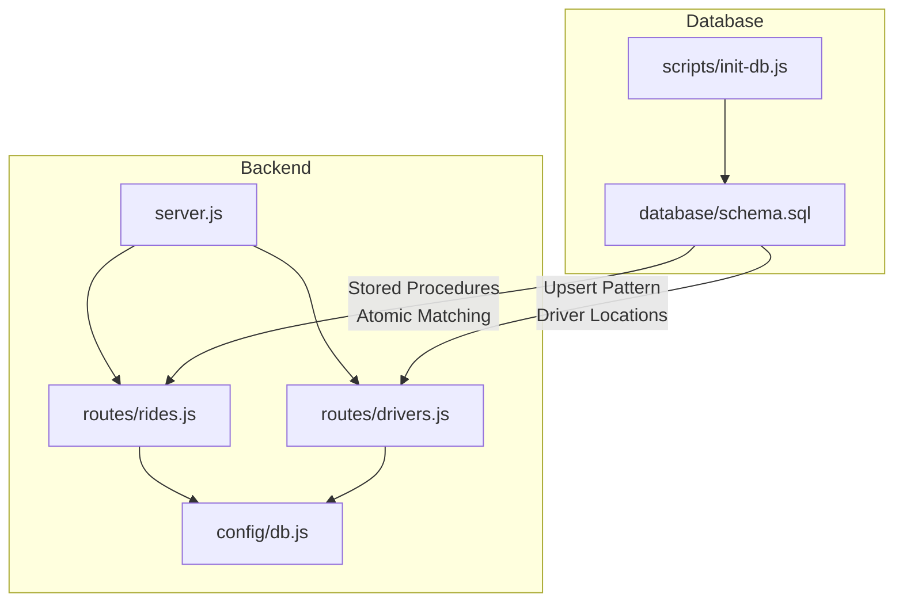
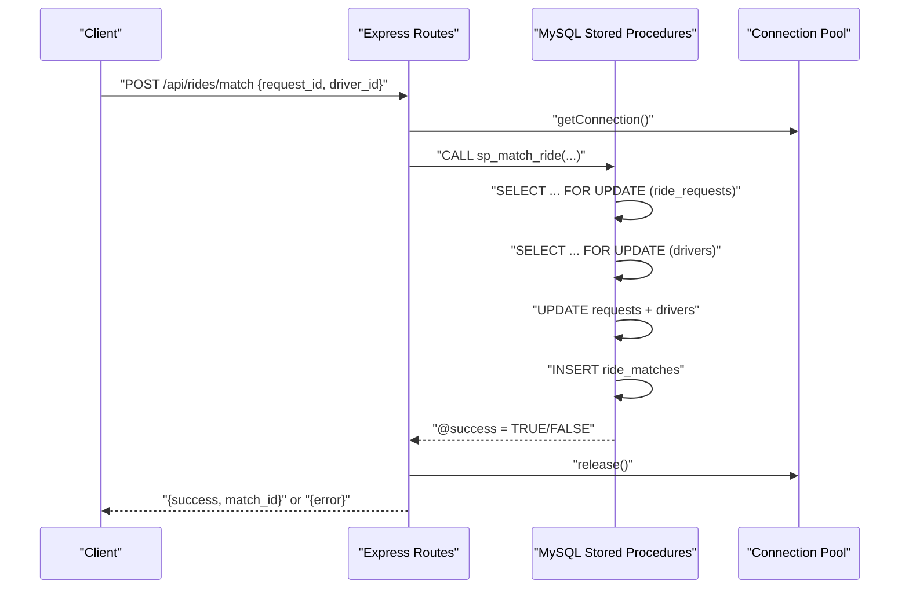
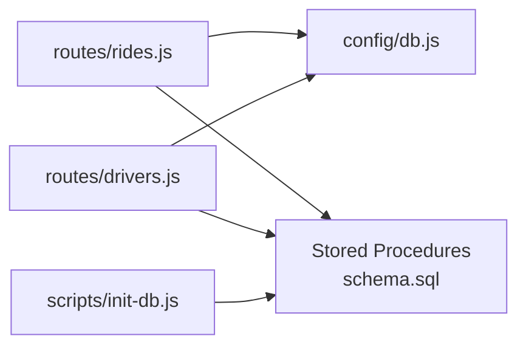

# Atomic Operations and Locking Strategies

<cite>
**Referenced Files in This Document**
- [rides.js](file://routes/rides.js)
- [drivers.js](file://routes/drivers.js)
- [db.js](file://config/db.js)
- [schema.sql](file://database/schema.sql)
- [init-db.js](file://scripts/init-db.js)
- [server.js](file://server.js)
- [README.md](file://README.md)
</cite>

## Table of Contents
1. [Introduction](#introduction)
2. [Project Structure](#project-structure)
3. [Core Components](#core-components)
4. [Architecture Overview](#architecture-overview)
5. [Detailed Component Analysis](#detailed-component-analysis)
6. [Dependency Analysis](#dependency-analysis)
7. [Performance Considerations](#performance-considerations)
8. [Troubleshooting Guide](#troubleshooting-guide)
9. [Conclusion](#conclusion)

## Introduction
This document explains the atomic operations and locking strategies used to prevent race conditions in the ride-sharing system. It focuses on:
- Atomic ride-driver matching using SELECT ... FOR UPDATE locks inside stored procedures
- Optimistic locking with version columns on drivers and ride_requests
- Upsert operations for frequent driver location updates using INSERT ... ON DUPLICATE KEY UPDATE
- Transaction isolation levels and their impact on consistency
- Deadlock prevention, lock timeouts, and rollback procedures
- Solutions to common concurrency issues such as phantom reads, dirty reads, and lost updates

## Project Structure
The system is a Node.js/Express backend with MySQL 8.0+ persistence. The backend exposes REST endpoints for rides and drivers, while the database defines tables, indexes, and stored procedures that enforce atomicity and consistency.

**Diagram sources**
- [server.js:1-84](file://server.js#L1-L84)
- [rides.js:1-272](file://routes/rides.js#L1-L272)
- [drivers.js:1-182](file://routes/drivers.js#L1-L182)
- [db.js:1-50](file://config/db.js#L1-L50)
- [schema.sql:160-272](file://database/schema.sql#L160-L272)
- [init-db.js:1-46](file://scripts/init-db.js#L1-L46)

**Section sources**
- [README.md:29-48](file://README.md#L29-L48)
- [server.js:10-41](file://server.js#L10-L41)
- [db.js:7-30](file://config/db.js#L7-L30)
- [schema.sql:160-272](file://database/schema.sql#L160-L272)

## Core Components
- Atomic matching via stored procedure with SELECT ... FOR UPDATE locks
- Optimistic locking with version columns on drivers, ride_requests, and ride_matches
- Upsert pattern for driver_locations to avoid race conditions on frequent updates
- Connection pooling and timeouts to manage peak-hour concurrency
- Indexes designed to minimize contention and support high-read, high-update workloads

**Section sources**
- [rides.js:135-167](file://routes/rides.js#L135-L167)
- [drivers.js:101-126](file://routes/drivers.js#L101-L126)
- [schema.sql:42-49](file://database/schema.sql#L42-L49)
- [schema.sql:87-98](file://database/schema.sql#L87-L98)
- [schema.sql:113-126](file://database/schema.sql#L113-L126)
- [db.js:14-27](file://config/db.js#L14-L27)

## Architecture Overview
The backend orchestrates transactions and calls stored procedures that encapsulate atomic logic. The database enforces consistency through:
- Pessimistic locking (FOR UPDATE) during matching
- Optimistic locking checks (version comparisons)
- Single-statement upserts for location updates

**Diagram sources**
- [rides.js:135-167](file://routes/rides.js#L135-L167)
- [schema.sql:167-234](file://database/schema.sql#L167-L234)
- [db.js:7-30](file://config/db.js#L7-L30)

## Detailed Component Analysis

### Atomic Ride-Driver Matching with SELECT ... FOR UPDATE
The matching process is encapsulated in a stored procedure that:
- Starts a transaction
- Locks the ride request row with FOR UPDATE to ensure exclusivity
- Locks the driver row with FOR UPDATE to ensure availability
- Updates statuses and increments versions
- Inserts a new match record
- Commits or rolls back on failure

Key implementation references:
- Stored procedure definition and locking logic: [schema.sql:167-234](file://database/schema.sql#L167-L234)
- Route invoking the stored procedure: [rides.js:135-167](file://routes/rides.js#L135-L167)

Lock acquisition and release pattern:
- Lock acquisition: SELECT ... FOR UPDATE on ride_requests and drivers
- Release: implicit on commit/rollback within the stored procedure

Deadlock prevention:
- Always lock in a consistent order (request then driver)
- Keep transactions short by limiting work inside the stored procedure

Rollback procedures:
- Automatic rollback on exceptions within the stored procedure
- Client-side rollback on route error handling

**Section sources**
- [schema.sql:167-234](file://database/schema.sql#L167-L234)
- [rides.js:135-167](file://routes/rides.js#L135-L167)

### Optimistic Locking with Version Columns
Optimistic locking is implemented using a version column on drivers, ride_requests, and ride_matches. The backend increments the version on updates and relies on the database to detect conflicts.

Key implementation references:
- Version columns in schema: [schema.sql:42-49](file://database/schema.sql#L42-L49), [schema.sql:87-98](file://database/schema.sql#L87-L98), [schema.sql:113-126](file://database/schema.sql#L113-L126)
- Version increment in ride status update: [rides.js:179-184](file://routes/rides.js#L179-L184)
- Stored procedure for optimistic status update: [schema.sql:237-263](file://database/schema.sql#L237-L263)

Common issues and solutions:
- Lost updates: handled by version checks in stored procedures and explicit version increments in routes
- Dirty reads: prevented by default transaction isolation and explicit locking where needed
- Phantom reads: mitigated by indexes and controlled scanning; consider repeatable read for long-running scans

**Section sources**
- [schema.sql:42-49](file://database/schema.sql#L42-L49)
- [schema.sql:87-98](file://database/schema.sql#L87-L98)
- [schema.sql:113-126](file://database/schema.sql#L113-L126)
- [rides.js:179-184](file://routes/rides.js#L179-L184)
- [schema.sql:237-263](file://database/schema.sql#L237-L263)

### Upsert Operations for Driver Location Updates
To avoid race conditions during frequent location updates, the driver location endpoint performs an atomic upsert using INSERT ... ON DUPLICATE KEY UPDATE. This ensures that a single statement handles insertion or update of a driver’s location.

Key implementation references:
- Upsert pattern for driver_locations: [drivers.js:101-126](file://routes/drivers.js#L101-L126)
- Unique constraint on driver_id in driver_locations: [schema.sql:66](file://database/schema.sql#L66)

Benefits:
- Eliminates read-modify-write races
- Reduces round-trips and contention
- Keeps driver_locations synchronized with minimal overhead

**Section sources**
- [drivers.js:101-126](file://routes/drivers.js#L101-L126)
- [schema.sql:66](file://database/schema.sql#L66)

### Transaction Isolation Levels and Consistency Guarantees
- Default isolation level in MySQL is REPEATABLE READ, which prevents dirty reads and non-repeatable reads.
- For the ride matching stored procedure, explicit FOR UPDATE locks provide stronger mutual exclusion and prevent lost updates.
- For read-heavy endpoints, consider READ COMMITTED if phantom reads are acceptable and performance is prioritized.

Impact on consistency:
- Dirty reads: prevented by default isolation
- Non-repeatable reads: prevented by REPEATABLE READ
- Phantom reads: can occur; use indexes and bounded scans or adjust isolation as needed

**Section sources**
- [schema.sql:167-234](file://database/schema.sql#L167-L234)
- [rides.js:103-119](file://routes/rides.js#L103-L119)

### Deadlock Prevention, Lock Timeout Configurations, and Rollback Procedures
Deadlock prevention strategies:
- Consistent lock ordering: always lock the ride request row before the driver row
- Short transactions: keep stored procedures minimal and fast
- Retry logic: implement exponential backoff on deadlock errors at the application layer

Lock timeout configurations:
- Connection pool timeouts: acquireTimeout, connectTimeout, timeout
- Statement-level timeouts: configure per-query timeouts if needed

Rollback procedures:
- Stored procedures roll back on exceptions and set success flags
- Routes wrap operations in transactions and rollback on errors

Key implementation references:
- Pool timeouts: [db.js:19-27](file://config/db.js#L19-L27)
- Transaction usage in routes: [rides.js:103-119](file://routes/rides.js#L103-L119), [rides.js:176-223](file://routes/rides.js#L176-L223)
- Stored procedure rollback on error: [schema.sql:177-182](file://database/schema.sql#L177-L182)

**Section sources**
- [db.js:19-27](file://config/db.js#L19-L27)
- [rides.js:103-119](file://routes/rides.js#L103-L119)
- [rides.js:176-223](file://routes/rides.js#L176-L223)
- [schema.sql:177-182](file://database/schema.sql#L177-L182)

### Common Concurrency Issues and Resolutions
- Dirty reads: prevented by default isolation; avoid reading uncommitted data
- Non-repeatable reads: prevented by REPEATABLE READ; re-query data if needed
- Phantom reads: mitigate with indexes and bounded scans; consider adjusting isolation for long scans
- Lost updates: handled by optimistic locking (version checks) and explicit version increments
- Race conditions on location updates: solved by atomic upserts

**Section sources**
- [schema.sql:167-234](file://database/schema.sql#L167-L234)
- [drivers.js:101-126](file://routes/drivers.js#L101-L126)
- [rides.js:179-184](file://routes/rides.js#L179-L184)

## Dependency Analysis
The backend depends on the database schema and stored procedures to enforce atomicity. The connection pool manages concurrency and timeouts.

**Diagram sources**
- [rides.js:1-4](file://routes/rides.js#L1-L4)
- [drivers.js:1-4](file://routes/drivers.js#L1-L4)
- [db.js:1-2](file://config/db.js#L1-L2)
- [schema.sql:160-272](file://database/schema.sql#L160-L272)
- [init-db.js:17-34](file://scripts/init-db.js#L17-L34)

**Section sources**
- [rides.js:1-4](file://routes/rides.js#L1-L4)
- [drivers.js:1-4](file://routes/drivers.js#L1-L4)
- [db.js:1-2](file://config/db.js#L1-L2)
- [schema.sql:160-272](file://database/schema.sql#L160-L272)
- [init-db.js:17-34](file://scripts/init-db.js#L17-L34)

## Performance Considerations
- Connection pool sizing: 50 connections with queue limit to handle peak-hour bursts
- Indexes: strategic indexes on status, timestamps, and coordinates reduce contention
- Upserts: atomic upserts minimize round-trips for location updates
- Stored procedures: encapsulate atomic logic and reduce network latency

**Section sources**
- [db.js:14-27](file://config/db.js#L14-L27)
- [schema.sql:46-49](file://database/schema.sql#L46-L49)
- [schema.sql:94-98](file://database/schema.sql#L94-L98)
- [drivers.js:101-126](file://routes/drivers.js#L101-L126)

## Troubleshooting Guide
- Connection failures: verify DB_HOST, DB_PORT, DB_USER, DB_PASSWORD in environment
- Table not found: run the schema initialization script
- Slow endpoints: monitor health and consider increasing pool size or optimizing queries
- Deadlocks: retry with backoff; ensure consistent lock ordering

**Section sources**
- [README.md:68-80](file://README.md#L68-L80)
- [init-db.js:14-42](file://scripts/init-db.js#L14-L42)
- [server.js:44-51](file://server.js#L44-L51)

## Conclusion
The ride-sharing system achieves concurrency safety through a combination of stored procedures with SELECT ... FOR UPDATE locks, optimistic locking with version columns, and atomic upserts for frequent updates. Connection pooling and strategic indexing support peak-hour performance. Proper transaction management, timeouts, and rollback procedures ensure robustness against deadlocks and transient failures.