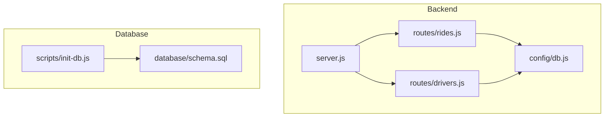
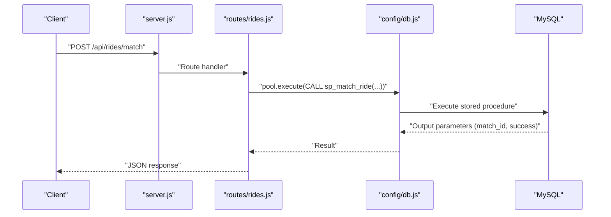
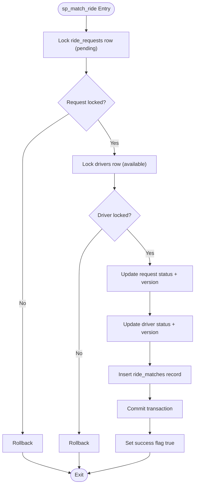
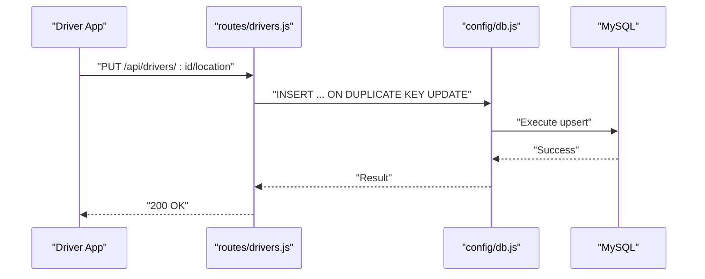
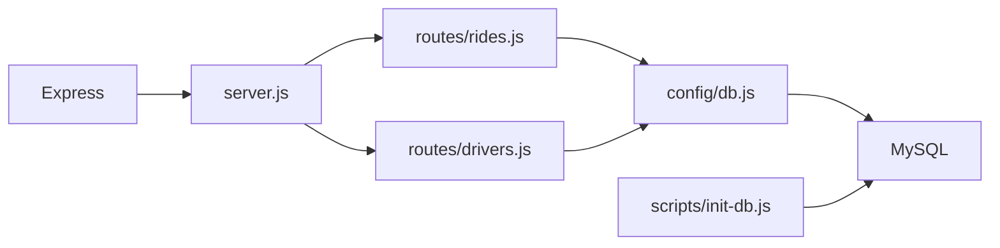

# Concurrency and Performance

<cite>
**Referenced Files in This Document**
- [config/db.js](file://config/db.js)
- [database/schema.sql](file://database/schema.sql)
- [routes/drivers.js](file://routes/drivers.js)
- [routes/rides.js](file://routes/rides.js)
- [scripts/init-db.js](file://scripts/init-db.js)
- [server.js](file://server.js)
- [package.json](file://package.json)
- [README.md](file://README.md)
</cite>

## Table of Contents
1. [Introduction](#introduction)
2. [Project Structure](#project-structure)
3. [Core Components](#core-components)
4. [Architecture Overview](#architecture-overview)
5. [Detailed Component Analysis](#detailed-component-analysis)
6. [Dependency Analysis](#dependency-analysis)
7. [Performance Considerations](#performance-considerations)
8. [Troubleshooting Guide](#troubleshooting-guide)
9. [Conclusion](#conclusion)

## Introduction
This document focuses on concurrency control and performance optimization in the ride-sharing system. It explains connection pooling configuration with 50 concurrent connections and queue management for peak-hour handling, race condition prevention strategies (atomic operations via stored procedures with SELECT ... FOR UPDATE locks, optimistic locking with version columns, and upsert operations), strategic indexing approach, priority scoring for peak hours, and operational monitoring and tuning guidelines.

## Project Structure
The system is a Node.js/Express backend with a MySQL 8.0+ database. The backend uses a connection pool to handle high read and frequent write loads typical of peak hours. The database schema defines tables for riders, drivers, live driver locations, ride requests, ride matches, peak-hour analytics, and a driver queue. Stored procedures encapsulate atomic operations to prevent race conditions.

**Diagram sources**
- [server.js:1-84](file://server.js#L1-L84)
- [routes/rides.js:1-272](file://routes/rides.js#L1-L272)
- [routes/drivers.js:1-182](file://routes/drivers.js#L1-L182)
- [config/db.js:1-50](file://config/db.js#L1-L50)
- [database/schema.sql:1-297](file://database/schema.sql#L1-L297)
- [scripts/init-db.js:1-46](file://scripts/init-db.js#L1-L46)

**Section sources**
- [README.md:29-48](file://README.md#L29-L48)
- [package.json:1-24](file://package.json#L1-L24)

## Core Components
- Connection pool configuration optimized for peak-hour concurrency with 50 connections and queue limits.
- Atomic matching via stored procedures with SELECT ... FOR UPDATE to prevent double-booking.
- Optimistic locking using version columns on drivers and ride_requests.
- Upsert operations for frequent driver location updates.
- Strategic indexing to support available-driver queries, pending-queue ordering, geo-radius searches, and driver activity tracking.
- Priority scoring for peak hours (7–9 AM, 5–8 PM) integrated into ride request creation.

**Section sources**
- [config/db.js:7-30](file://config/db.js#L7-L30)
- [database/schema.sql:160-272](file://database/schema.sql#L160-L272)
- [database/schema.sql:46-98](file://database/schema.sql#L46-L98)
- [routes/rides.js:88-133](file://routes/rides.js#L88-L133)
- [routes/drivers.js:101-126](file://routes/drivers.js#L101-L126)
- [routes/rides.js:261-269](file://routes/rides.js#L261-L269)

## Architecture Overview
The backend exposes REST endpoints for ride requests and driver management. Ride matching is performed atomically via a stored procedure to ensure consistency under high concurrency. The database schema includes indexes and a stored procedure for atomic updates. The server logs slow requests and exposes health checks.

**Diagram sources**
- [routes/rides.js:135-167](file://routes/rides.js#L135-L167)
- [config/db.js:14-30](file://config/db.js#L14-L30)

## Detailed Component Analysis

### Connection Pooling and Queue Management
- Pool size: 50 concurrent connections to absorb peak-hour bursts.
- Queue limit: 100 extra requests are queued when pool is saturated.
- Timeouts: connect, acquire, and query timeouts set to 10 seconds to prevent hanging connections.
- Keep-alive: enabled to keep connections fresh.
- Health checks and graceful shutdown helpers are included.

Operational implications:
- With 50 connections, the system can sustain sustained high load without immediate rejection.
- Queueing prevents immediate failures under overload; however, clients should still implement retry/backoff policies.
- Short timeouts reduce resource exhaustion risk.

**Section sources**
- [config/db.js:7-30](file://config/db.js#L7-L30)
- [config/db.js:32-47](file://config/db.js#L32-L47)

### Atomic Matching via Stored Procedures (SELECT ... FOR UPDATE)
The stored procedure ensures:
- Pessimistic locking of the ride request and driver rows before updates.
- Atomic update of request status, driver status, and insertion of a match record.
- Rollback on failure and explicit success flag.

Key behaviors:
- Prevents race conditions where two drivers could match the same request.
- Prevents a driver from being assigned multiple rides concurrently.
- Uses transaction boundaries to ensure consistency.

**Diagram sources**
- [database/schema.sql:167-234](file://database/schema.sql#L167-L234)

**Section sources**
- [database/schema.sql:160-272](file://database/schema.sql#L160-L272)
- [routes/rides.js:135-167](file://routes/rides.js#L135-L167)

### Optimistic Locking with Version Columns
Tables with version columns:
- drivers: version column for optimistic locking.
- ride_requests: version column for optimistic locking.
- ride_matches: version column for optimistic locking.

Strategy:
- On updates, increment the version column.
- Use a conditional update that checks the expected version to detect conflicts.
- If the update affects zero rows, treat as a conflict and retry or inform the caller.

Benefits:
- Reduces lock contention compared to pessimistic locking.
- Suitable for scenarios where conflicts are infrequent.

**Section sources**
- [database/schema.sql:42](file://database/schema.sql#L42)
- [database/schema.sql:87](file://database/schema.sql#L87)
- [database/schema.sql:113](file://database/schema.sql#L113)
- [database/schema.sql:237-263](file://database/schema.sql#L237-L263)

### Upsert Operations for Frequent Location Updates
- Endpoint: PUT /api/drivers/:id/location.
- Implementation: INSERT ... ON DUPLICATE KEY UPDATE.
- Purpose: Single atomic operation to avoid race conditions during frequent GPS updates.

Behavior:
- Inserts a new location row if the driver does not have one.
- Updates existing row if present, refreshing updated_at and coordinates.

**Diagram sources**
- [routes/drivers.js:101-126](file://routes/drivers.js#L101-L126)
- [database/schema.sql:66](file://database/schema.sql#L66)

**Section sources**
- [routes/drivers.js:101-126](file://routes/drivers.js#L101-L126)
- [database/schema.sql:54-69](file://database/schema.sql#L54-L69)

### Strategic Indexing Approach
Indexes designed for performance:
- idx_status on drivers: fast retrieval of available drivers.
- idx_status_created on ride_requests: efficient pending-queue ordering by status and creation time.
- idx_pickup on ride_requests: supports geo-radius searches for nearby requests.
- idx_driver_status on ride_matches: tracks driver activity and recent matches.
- Additional indexes: driver_locations (location coordinates and updated_at), users (email and created_at), and others for common joins and filters.

Impact:
- Improves read performance for high-frequency queries during peak hours.
- Supports sorting and filtering for dashboards and driver apps.

**Section sources**
- [database/schema.sql:46](file://database/schema.sql#L46)
- [database/schema.sql:94](file://database/schema.sql#L94)
- [database/schema.sql:96](file://database/schema.sql#L96)
- [database/schema.sql:123](file://database/schema.sql#L123)
- [database/schema.sql:67](file://database/schema.sql#L67)
- [database/schema.sql:24](file://database/schema.sql#L24)
- [database/schema.sql:48](file://database/schema.sql#L48)
- [database/schema.sql:97](file://database/schema.sql#L97)

### Priority Scoring System for Peak Hours
- Automatic priority score is calculated based on the current hour.
- Peak hours (7–9 AM and 5–8 PM) receive a higher score.
- Pending requests are ordered by priority_score DESC, then created_at ASC.

Implementation:
- Helper function computes priority score at request creation time.
- Stored in ride_requests.priority_score.

Effect:
- Ensures fair queue ordering under heavy load, prioritizing peak-hour demand.

**Section sources**
- [routes/rides.js:261-269](file://routes/rides.js#L261-L269)
- [database/schema.sql:86](file://database/schema.sql#L86)
- [routes/rides.js:43-86](file://routes/rides.js#L43-L86)

### Queue Management Strategies
- driver_queue table maintains a FIFO queue per zone for fair matching.
- Index idx_zone_time supports efficient queue ordering by zone and time.
- Zone identifier allows geographic fairness and scalability.

Operational note:
- The schema includes the queue table and index; queueing logic can be integrated into the matching flow to enforce FIFO per zone.

**Section sources**
- [database/schema.sql:144-158](file://database/schema.sql#L144-L158)

### Performance Monitoring Guidelines
- Slow request detection: middleware logs requests exceeding a threshold (e.g., 500 ms).
- Health check endpoint: /api/health validates database connectivity.
- Stats endpoint: /api/rides/stats provides counts for pending, matched, active trips, available drivers, and completed rides today.

Recommendations:
- Track slow endpoints and error rates; alert on sustained degradation.
- Monitor pool utilization and queue depth; scale pool size or add nodes if needed.
- Use EXPLAIN to verify index usage for hot queries.

**Section sources**
- [server.js:20-30](file://server.js#L20-L30)
- [server.js:43-51](file://server.js#L43-L51)
- [routes/rides.js:226-259](file://routes/rides.js#L226-L259)

## Dependency Analysis
- Backend depends on Express and mysql2/promise for HTTP and database operations.
- Routes depend on the shared connection pool.
- Stored procedures encapsulate atomic logic, reducing application-level complexity.
- Initialization script applies schema and sample data.

**Diagram sources**
- [package.json:14-19](file://package.json#L14-L19)
- [server.js:1-84](file://server.js#L1-L84)
- [routes/rides.js:1-272](file://routes/rides.js#L1-L272)
- [routes/drivers.js:1-182](file://routes/drivers.js#L1-L182)
- [config/db.js:1-50](file://config/db.js#L1-L50)
- [scripts/init-db.js:1-46](file://scripts/init-db.js#L1-L46)

**Section sources**
- [package.json:14-19](file://package.json#L14-L19)
- [server.js:1-84](file://server.js#L1-L84)

## Performance Considerations
- Connection pool sizing: 50 connections with queue limit 100 balance throughput and resource safety.
- Timeouts: short connect/acquire/query timeouts prevent long-lived connections from accumulating.
- Index coverage: targeted indexes reduce scan costs for high-frequency queries.
- Atomic operations: stored procedures and upserts minimize contention and race conditions.
- Priority scoring: improves fairness and responsiveness during peak hours.
- Monitoring: slow request logging and health/stats endpoints enable proactive tuning.

[No sources needed since this section provides general guidance]

## Troubleshooting Guide
Common issues and resolutions:
- ECONNREFUSED: Verify MySQL service is running and reachable.
- Access denied: Confirm DB_USER and DB_PASSWORD in environment configuration.
- Table doesn't exist: Initialize the database using the schema file.
- Port 3000 in use: Change PORT in environment configuration.
- Slow queries during peak: Review peak-hour analytics and consider increasing pool size or adding nodes.

**Section sources**
- [README.md:265-274](file://README.md#L265-L274)

## Conclusion
The system employs a robust combination of connection pooling, atomic stored procedures, optimistic locking, strategic indexing, and priority scoring to achieve concurrency control and performance under peak-hour loads. The modular design and clear separation of concerns in the backend and database schema facilitate maintainability and scalability. Monitoring and operational practices further support reliability and responsiveness.