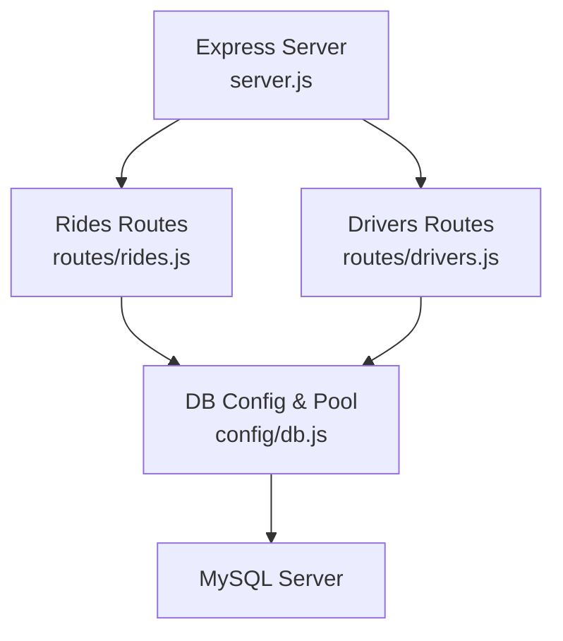
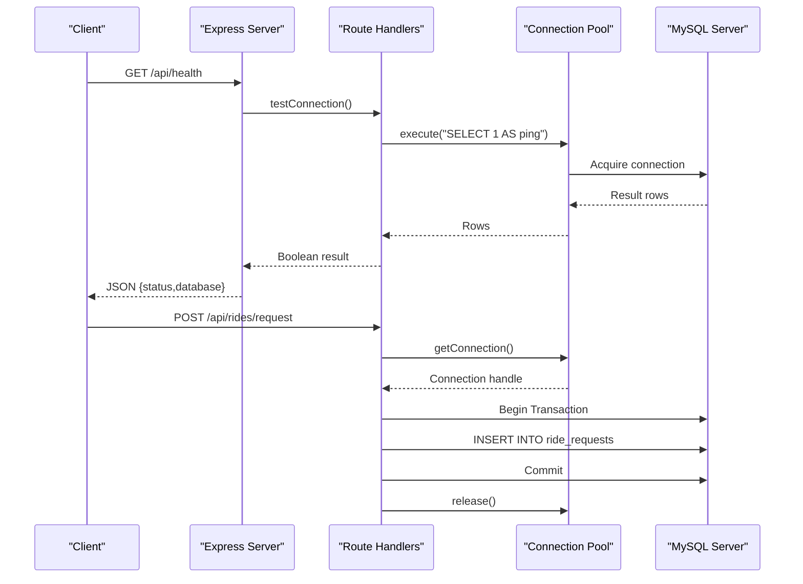
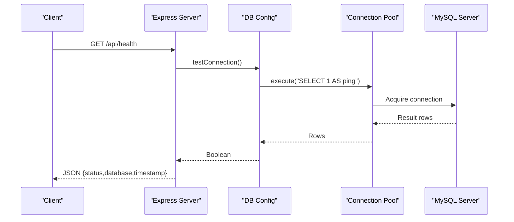
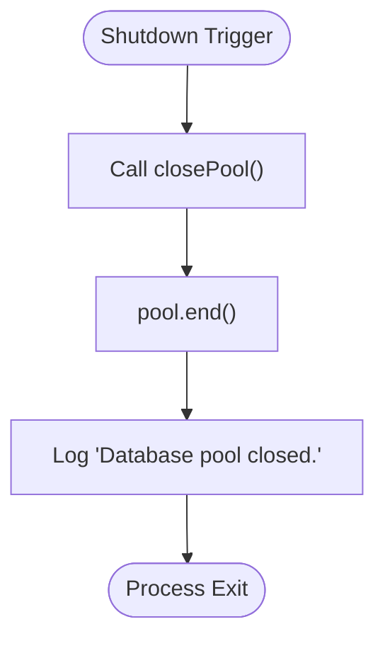
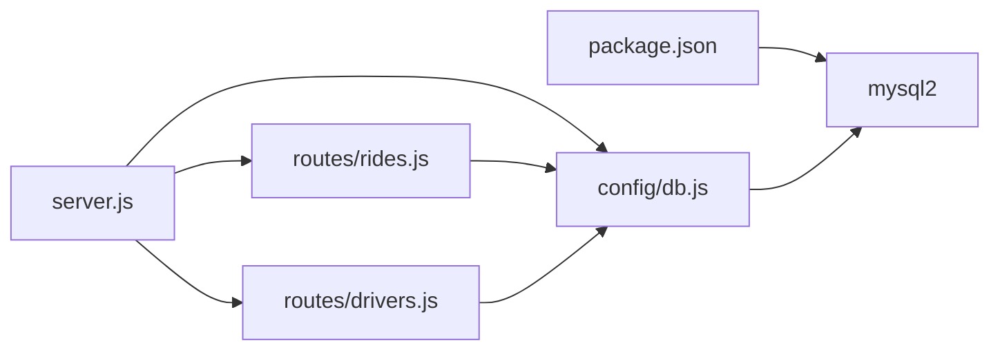

# Connection Pooling and Resource Management

<cite>
**Referenced Files in This Document**
- [config/db.js](file://config/db.js)
- [server.js](file://server.js)
- [routes/rides.js](file://routes/rides.js)
- [routes/drivers.js](file://routes/drivers.js)
- [database/schema.sql](file://database/schema.sql)
- [package.json](file://package.json)
- [README.md](file://README.md)
</cite>

## Table of Contents
1. [Introduction](#introduction)
2. [Project Structure](#project-structure)
3. [Core Components](#core-components)
4. [Architecture Overview](#architecture-overview)
5. [Detailed Component Analysis](#detailed-component-analysis)
6. [Dependency Analysis](#dependency-analysis)
7. [Performance Considerations](#performance-considerations)
8. [Troubleshooting Guide](#troubleshooting-guide)
9. [Conclusion](#conclusion)

## Introduction
This document explains the connection pooling configuration and resource management strategy for the ride-sharing system. It focuses on the MySQL connection pool setup optimized for peak-hour handling during morning and evening rush hours, queue management, timeouts, connection lifecycle, row streaming, health checks, graceful shutdown, and monitoring guidelines.

## Project Structure
The connection pool is centralized in the configuration module and consumed by route handlers. The Express server exposes a health endpoint that validates database connectivity.

**Diagram sources**
- [server.js:1-84](file://server.js#L1-L84)
- [routes/rides.js:1-272](file://routes/rides.js#L1-L272)
- [routes/drivers.js:1-182](file://routes/drivers.js#L1-L182)
- [config/db.js:1-50](file://config/db.js#L1-L50)

**Section sources**
- [server.js:1-84](file://server.js#L1-L84)
- [config/db.js:1-50](file://config/db.js#L1-L50)
- [routes/rides.js:1-272](file://routes/rides.js#L1-L272)
- [routes/drivers.js:1-182](file://routes/drivers.js#L1-L182)

## Core Components
- Connection pool configuration with mysql2/promise
- Health check and graceful shutdown helpers
- Route handlers using the pool for queries and transactions

Key pool settings and behaviors:
- Pool sizing for peak-hour concurrency: connectionLimit and queueLimit
- Timeouts to prevent hanging connections: connectTimeout, acquireTimeout, timeout
- Connection lifecycle: enableKeepAlive and keepAliveInitialDelay
- Row streaming: rowsAsArray for efficient large result sets
- Health check: testConnection() using a simple SELECT ping
- Graceful shutdown: closePool() via pool.end()

**Section sources**
- [config/db.js:7-30](file://config/db.js#L7-L30)
- [config/db.js:32-47](file://config/db.js#L32-L47)
- [server.js:43-51](file://server.js#L43-L51)

## Architecture Overview
The backend uses a shared connection pool for all database operations. Route handlers either execute direct queries against the pool or acquire connections for transactional operations. The Express server exposes a health endpoint that runs a connectivity test against the pool.

**Diagram sources**
- [server.js:43-51](file://server.js#L43-L51)
- [config/db.js:32-41](file://config/db.js#L32-L41)
- [routes/rides.js:88-133](file://routes/rides.js#L88-L133)

## Detailed Component Analysis

### Connection Pool Configuration
The pool is created with the following characteristics:
- connectionLimit: 50 concurrent connections to handle bursty traffic during peak hours
- queueLimit: 100 to queue excess requests gracefully
- waitForConnections: true to queue requests when pool is exhausted
- connectTimeout: 10000ms to fail fast on connection establishment issues
- acquireTimeout: 10000ms to fail fast when acquiring a connection from the pool
- timeout: 10000ms for general operations
- enableKeepAlive: true to keep connections fresh
- keepAliveInitialDelay: 10000ms to stagger keep-alive probes
- rowsAsArray: false to return rows as objects for easier processing

These settings collectively ensure:
- High concurrency during morning/evening rush hours
- Controlled queuing to avoid unbounded growth
- Early failure detection to prevent hanging operations
- Fresh connections to reduce stale connection issues
- Efficient processing of large result sets

**Section sources**
- [config/db.js:7-30](file://config/db.js#L7-L30)

### Health Check Mechanism
The health check executes a simple SELECT statement against the pool and returns a boolean indicating connectivity. The Express server exposes a GET /api/health endpoint that calls this function and returns a JSON response with status and timestamp.

**Diagram sources**
- [server.js:43-51](file://server.js#L43-L51)
- [config/db.js:32-41](file://config/db.js#L32-L41)

**Section sources**
- [config/db.js:32-41](file://config/db.js#L32-L41)
- [server.js:43-51](file://server.js#L43-L51)

### Graceful Shutdown Procedures
Graceful shutdown closes the connection pool to ensure all connections are released before the process exits. This prevents resource leaks and ensures clean termination.

**Diagram sources**
- [config/db.js:43-47](file://config/db.js#L43-L47)

**Section sources**
- [config/db.js:43-47](file://config/db.js#L43-L47)

### Route-Level Usage Patterns
- Direct queries against the pool for read-heavy endpoints
- Transactional operations using acquired connections for write-heavy endpoints
- Proper release of connections in finally blocks to avoid leaks

Examples:
- Rides routes use pool.execute() for read queries and pool.getConnection() for transactional writes
- Drivers routes use pool.execute() for read queries and UPSERT for frequent location updates

**Section sources**
- [routes/rides.js:10-41](file://routes/rides.js#L10-L41)
- [routes/rides.js:88-133](file://routes/rides.js#L88-L133)
- [routes/drivers.js:10-36](file://routes/drivers.js#L10-L36)
- [routes/drivers.js:101-126](file://routes/drivers.js#L101-L126)

### Database Schema Implications
The schema supports the connection pool configuration through:
- Strategic indexing to minimize query latency and reduce connection contention
- Stored procedures for atomic operations to reduce round trips and improve throughput
- Version columns enabling optimistic locking to reduce conflicts

**Section sources**
- [database/schema.sql:14-141](file://database/schema.sql#L14-L141)
- [database/schema.sql:164-272](file://database/schema.sql#L164-L272)

## Dependency Analysis
The system depends on mysql2 for connection pooling and Promise-based operations. The Express server depends on the DB configuration module for health checks and route handlers depend on the pool for database operations.

**Diagram sources**
- [package.json:14-18](file://package.json#L14-L18)
- [server.js:1-8](file://server.js#L1-L8)
- [config/db.js:1](file://config/db.js#L1)

**Section sources**
- [package.json:14-18](file://package.json#L14-L18)
- [server.js:1-8](file://server.js#L1-L8)
- [config/db.js:1](file://config/db.js#L1)

## Performance Considerations
- Pool sizing: 50 concurrent connections with queueLimit of 100 provide headroom for peak-hour bursts while preventing unlimited queuing
- Timeouts: 10000ms connect/acquire/timeout values ensure timely failure detection and prevent resource starvation
- Keep-alive: enableKeepAlive with keepAliveInitialDelay helps maintain healthy connections and reduces reconnection overhead
- Row streaming: rowsAsArray false improves readability and processing of large result sets
- Monitoring: auto-refresh intervals in the frontend simulate peak-hour load; monitor slow requests and adjust pool settings accordingly

[No sources needed since this section provides general guidance]

## Troubleshooting Guide
Common issues and resolutions:
- ECONNREFUSED: Ensure MySQL is running on the configured host/port
- Access denied: Verify DB_USER and DB_PASSWORD in environment configuration
- Table doesn't exist: Initialize the database by running the schema SQL
- Port 3000 in use: Change PORT in environment configuration
- Slow queries during peak: Monitor peak-hour statistics and consider increasing pool size if needed

Health check failures indicate connectivity problems; verify database credentials and network configuration.

**Section sources**
- [README.md:265-274](file://README.md#L265-L274)
- [server.js:43-51](file://server.js#L43-L51)

## Conclusion
The connection pool configuration balances high concurrency with controlled queuing and robust timeout handling. Together with health checks, graceful shutdown, and strategic database design, the system is optimized for peak-hour operations in a ride-sharing environment. Monitoring pool utilization and adjusting timeouts and pool sizes based on observed load will ensure reliable performance during high-demand periods.