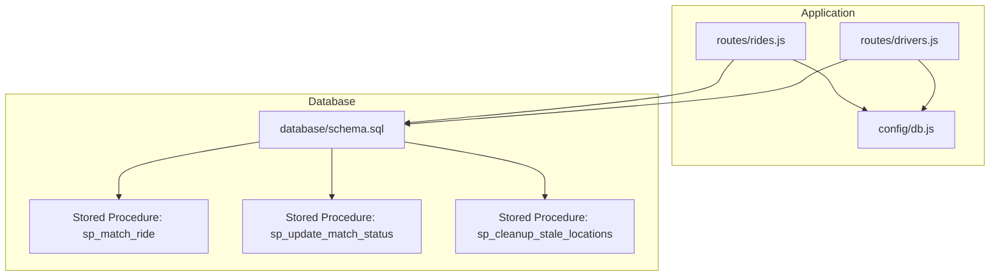
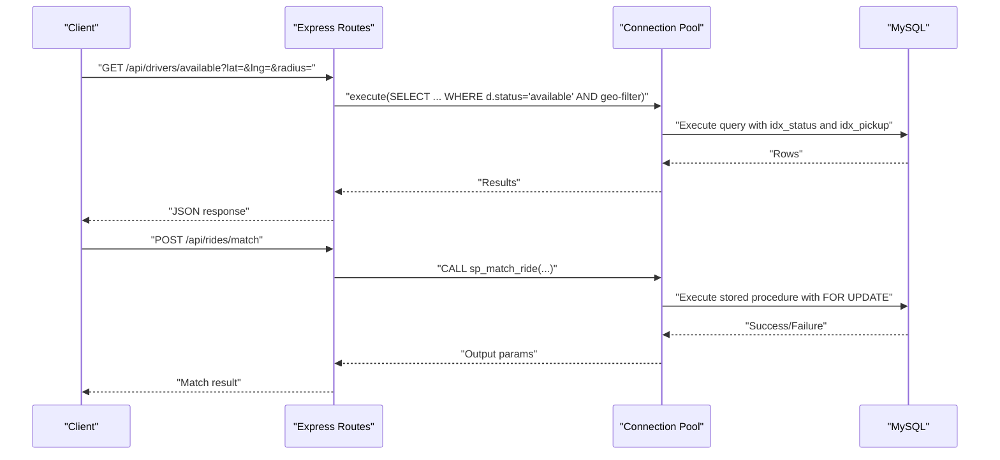
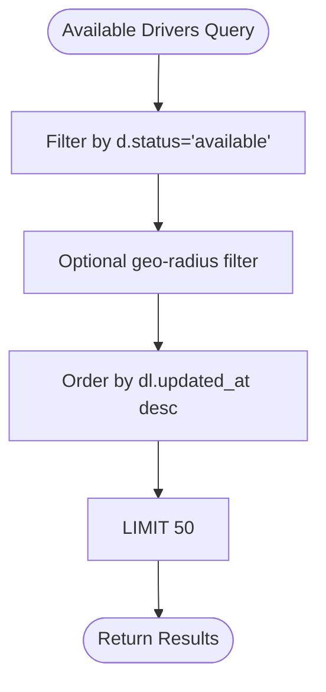
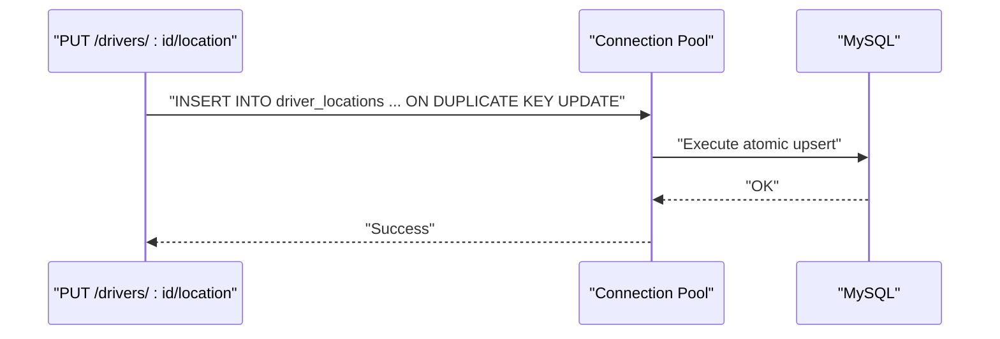
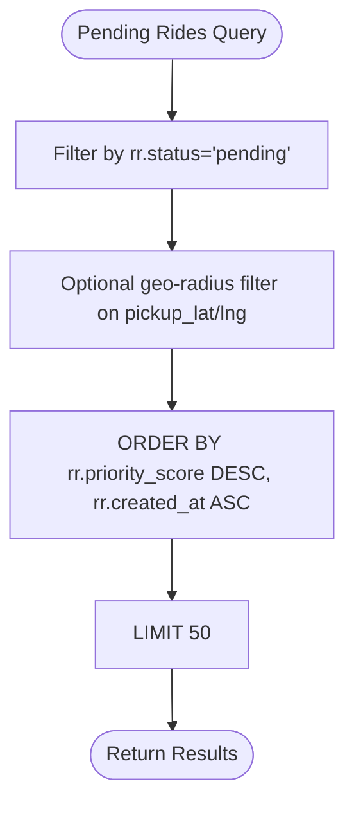
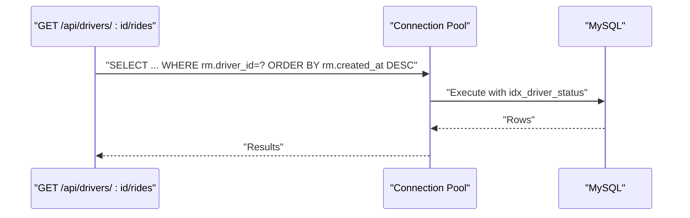
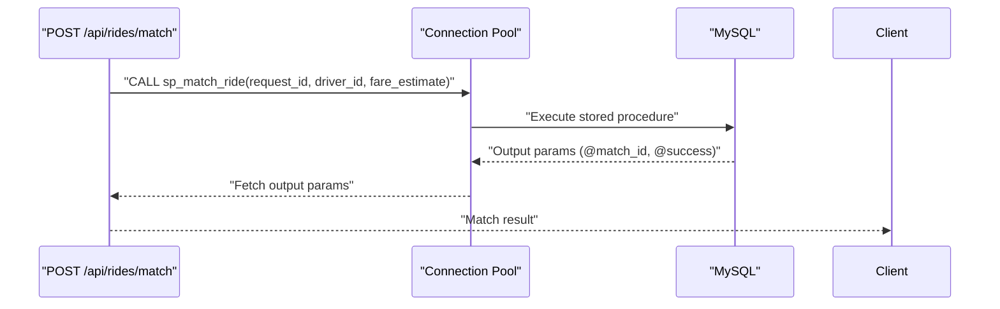
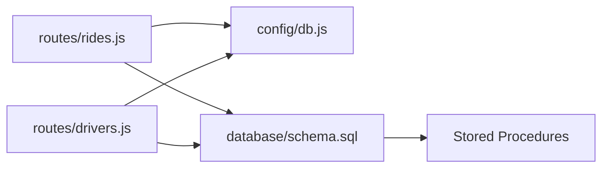

# Indexing Strategy and Query Optimization

<cite>
**Referenced Files in This Document**
- [schema.sql](file://database/schema.sql)
- [drivers.js](file://routes/drivers.js)
- [rides.js](file://routes/rides.js)
- [db.js](file://config/db.js)
- [init-db.js](file://scripts/init-db.js)
- [README.md](file://README.md)
</cite>

## Table of Contents
1. [Introduction](#introduction)
2. [Project Structure](#project-structure)
3. [Core Components](#core-components)
4. [Architecture Overview](#architecture-overview)
5. [Detailed Component Analysis](#detailed-component-analysis)
6. [Dependency Analysis](#dependency-analysis)
7. [Performance Considerations](#performance-considerations)
8. [Troubleshooting Guide](#troubleshooting-guide)
9. [Conclusion](#conclusion)
10. [Appendices](#appendices)

## Introduction
This document provides a comprehensive indexing strategy and query optimization guide tailored for a high-read and write-heavy ride-sharing platform. It focuses on:
- Strategic indexes aligned with the schema and query patterns
- Index selection criteria for read-heavy and write-heavy workloads
- Query optimization techniques (covering indexes, composite indexes, index usage monitoring)
- Performance benchmarking methodologies and execution plan analysis
- Index maintenance, fragmentation management, and automatic optimization recommendations
- Pitfalls and practical solutions grounded in the repository’s schema and routes

## Project Structure
The project is a full-stack ride-sharing matching system with:
- A MySQL schema defining tables, indexes, and stored procedures
- Express routes implementing high-concurrency queries and atomic operations
- A connection pool tuned for peak-hour concurrency
- Initialization scripts to bootstrap the database

**Diagram sources**
- [schema.sql:160-272](file://database/schema.sql#L160-L272)
- [rides.js:135-167](file://routes/rides.js#L135-L167)
- [drivers.js:101-126](file://routes/drivers.js#L101-L126)
- [db.js:7-30](file://config/db.js#L7-L30)

**Section sources**
- [README.md:29-48](file://README.md#L29-L48)
- [schema.sql:1-297](file://database/schema.sql#L1-L297)
- [rides.js:1-272](file://routes/rides.js#L1-L272)
- [drivers.js:1-182](file://routes/drivers.js#L1-L182)
- [db.js:1-50](file://config/db.js#L1-L50)

## Core Components
- Drivers table with status and frequent updates
- Driver locations table with frequent upserts
- Ride requests table with high insert rates and geo-radius filtering
- Ride matches table with high contention and optimistic locking
- Stored procedures for atomic operations and cleanup

Key indexes present in the schema:
- Drivers: idx_status for available-driver queries
- Driver locations: idx_location (latitude, longitude) for spatial-ish queries and idx_updated for cleanup
- Ride requests: idx_status_created for pending-queue ordering, idx_user_status for active ride lookup, idx_pickup for geo-radius searches, idx_priority for peak-hour queue
- Ride matches: idx_driver_status for driver activity tracking, idx_status for analytics, idx_created for recent matches

These indexes align with the documented concurrency optimizations and peak-hour strategies.

**Section sources**
- [schema.sql:28-49](file://database/schema.sql#L28-L49)
- [schema.sql:54-69](file://database/schema.sql#L54-L69)
- [schema.sql:74-98](file://database/schema.sql#L74-L98)
- [schema.sql:103-126](file://database/schema.sql#L103-L126)
- [README.md:160-176](file://README.md#L160-L176)

## Architecture Overview
The backend uses a connection pool to handle high concurrency. Queries leverage indexes to minimize scans and support:
- Available-driver discovery with geo-radius filtering
- Pending-ride queue ordering by priority and creation time
- Atomic matching preventing race conditions
- Driver activity tracking and cleanup of stale locations

**Diagram sources**
- [drivers.js:38-77](file://routes/drivers.js#L38-L77)
- [rides.js:135-167](file://routes/rides.js#L135-L167)
- [schema.sql:166-234](file://database/schema.sql#L166-L234)
- [db.js:7-30](file://config/db.js#L7-L30)

## Detailed Component Analysis

### Drivers Table Indexes: idx_status and idx_updated_at
- Purpose: Efficiently find available drivers and track frequent updates.
- Query patterns:
  - Listing drivers ordered by status and name
  - Updating driver status frequently
- Recommendations:
  - Keep idx_status selective for available drivers
  - Use idx_updated_at to monitor last-update trends and prune stale entries

**Diagram sources**
- [drivers.js:38-77](file://routes/drivers.js#L38-L77)
- [schema.sql:39-48](file://database/schema.sql#L39-L48)

**Section sources**
- [drivers.js:38-77](file://routes/drivers.js#L38-L77)
- [schema.sql:39-48](file://database/schema.sql#L39-L48)

### Driver Locations Table Indexes: idx_location and idx_updated
- Purpose: Support frequent upserts and cleanup of stale locations.
- Query patterns:
  - Upsert location with INSERT ... ON DUPLICATE KEY UPDATE
  - Cleanup stale locations by updated_at threshold
- Recommendations:
  - Maintain uniqueness on driver_id to enforce one row per driver
  - Use idx_updated for periodic cleanup jobs

**Diagram sources**
- [drivers.js:101-126](file://routes/drivers.js#L101-L126)
- [schema.sql:54-69](file://database/schema.sql#L54-L69)

**Section sources**
- [drivers.js:101-126](file://routes/drivers.js#L101-L126)
- [schema.sql:54-69](file://database/schema.sql#L54-L69)

### Ride Requests Table Indexes: idx_status_created, idx_user_status, idx_pickup, idx_priority
- Purpose: High-insert-rate table requiring efficient pending-queue ordering, geo-radius searches, and active-ride lookups.
- Query patterns:
  - Pending rides filtered by status and ordered by priority_score and created_at
  - Geo-radius filtering around pickup coordinates
  - Active-ride lookup by user_id and status
- Recommendations:
  - Composite index idx_status_created optimizes pending queue ordering
  - Composite index idx_pickup supports Haversine-based radius filtering
  - idx_priority supports peak-hour queue ordering

**Diagram sources**
- [rides.js:43-86](file://routes/rides.js#L43-L86)
- [schema.sql:94-97](file://database/schema.sql#L94-L97)

**Section sources**
- [rides.js:43-86](file://routes/rides.js#L43-L86)
- [schema.sql:94-97](file://database/schema.sql#L94-L97)

### Ride Matches Table Indexes: idx_driver_status, idx_status, idx_created
- Purpose: High-contention matching table requiring driver activity tracking and analytics.
- Query patterns:
  - Driver activity tracking by driver_id and status
  - Analytics and monitoring by status and created_at
- Recommendations:
  - Composite index idx_driver_status accelerates driver-specific active matches
  - idx_status and idx_created support dashboards and reporting

**Diagram sources**
- [drivers.js:150-179](file://routes/drivers.js#L150-L179)
- [schema.sql:123-125](file://database/schema.sql#L123-L125)

**Section sources**
- [drivers.js:150-179](file://routes/drivers.js#L150-L179)
- [schema.sql:123-125](file://database/schema.sql#L123-L125)

### Atomic Matching and Optimistic Locking
- Stored procedures:
  - sp_match_ride performs atomic matching with FOR UPDATE to prevent race conditions
  - sp_update_match_status uses optimistic locking via version checks
- Recommendations:
  - Ensure indexes exist to support the WHERE clauses in stored procedures
  - Monitor contention and adjust pool size and timeouts as needed

**Diagram sources**
- [rides.js:135-167](file://routes/rides.js#L135-L167)
- [schema.sql:166-234](file://database/schema.sql#L166-L234)

**Section sources**
- [rides.js:135-167](file://routes/rides.js#L135-L167)
- [schema.sql:166-234](file://database/schema.sql#L166-L234)

## Dependency Analysis
- Routes depend on the connection pool for database operations
- Queries rely on indexes defined in schema.sql
- Stored procedures encapsulate atomic operations and reduce client-side complexity
- Initialization script applies schema and stored procedures

**Diagram sources**
- [rides.js:1-272](file://routes/rides.js#L1-L272)
- [drivers.js:1-182](file://routes/drivers.js#L1-L182)
- [db.js:1-50](file://config/db.js#L1-L50)
- [schema.sql:160-272](file://database/schema.sql#L160-L272)

**Section sources**
- [rides.js:1-272](file://routes/rides.js#L1-L272)
- [drivers.js:1-182](file://routes/drivers.js#L1-L182)
- [db.js:1-50](file://config/db.js#L1-L50)
- [schema.sql:160-272](file://database/schema.sql#L160-L272)

## Performance Considerations
- Index selection criteria:
  - High-read: idx_status on drivers, idx_status_created on ride_requests, idx_driver_status on ride_matches
  - Write-heavy: idx_pickup on ride_requests for geo-radius filtering, idx_location on driver_locations for upserts
  - Multi-column filters: composite indexes (status, created_at), (driver_id, status), (pickup_lat, pickup_lng)
- Query optimization techniques:
  - Covering indexes: include all needed columns to avoid table lookups
  - Composite indexes: order leading columns by selectivity and equality predicates
  - Index usage monitoring: EXPLAIN/ANALYZE queries to verify index utilization
- Benchmarking methodologies:
  - Load testing with realistic concurrency and request mixes
  - Measure latency percentiles and throughput under stress
  - Compare before/after scenarios after adding/removing indexes
- Execution plan analysis:
  - Use EXPLAIN to confirm index scans vs. table scans
  - Verify key column ordering and predicate pushdown
- Maintenance and fragmentation:
  - Periodic ANALYZE TABLE and OPTIMIZE TABLE
  - Monitor index bloat and rebuild when fragmentation exceeds thresholds
- Automatic optimization recommendations:
  - Enable MySQL 8.0+ automatic optimizer statistics collection
  - Use query feedback and plan cache hints where applicable

[No sources needed since this section provides general guidance]

## Troubleshooting Guide
Common indexing pitfalls and solutions:
- Missing index for geo-radius filtering:
  - Symptom: Slow driver availability queries with Haversine filters
  - Solution: Ensure idx_pickup exists on ride_requests and driver_locations
- Inefficient pending-queue ordering:
  - Symptom: Slower pending-ride queries
  - Solution: Confirm idx_status_created orders by created_at after status
- Suboptimal composite index order:
  - Symptom: Poor performance on multi-column filters
  - Solution: Place equality predicates first, then range predicates
- Over-indexing:
  - Symptom: Increased write overhead and storage costs
  - Solution: Remove unused indexes and consolidate overlapping indexes
- Stale location cleanup inefficiency:
  - Symptom: Slow cleanup operations
  - Solution: Use idx_updated on driver_locations for targeted deletion

Practical examples from the schema:
- Available-driver queries use idx_status on drivers and geo-radius filters on driver_locations
- Pending-ride queries use idx_status_created and idx_pickup for ordering and filtering
- Driver activity tracking uses idx_driver_status on ride_matches

**Section sources**
- [schema.sql:39-48](file://database/schema.sql#L39-L48)
- [schema.sql:54-69](file://database/schema.sql#L54-L69)
- [schema.sql:94-97](file://database/schema.sql#L94-L97)
- [schema.sql:123-125](file://database/schema.sql#L123-L125)

## Conclusion
The repository’s schema and routes demonstrate a well-thought-out indexing strategy for a high-concurrency ride-sharing system. By leveraging targeted indexes—idx_status, idx_status_created, idx_pickup, idx_driver_status—and optimizing queries with composite indexes and covering indexes, the system achieves efficient read and write performance. Proper maintenance, monitoring, and benchmarking ensure sustained performance under peak loads.

[No sources needed since this section summarizes without analyzing specific files]

## Appendices

### Appendix A: Index Selection Criteria Matrix
- High-read tables: prioritize indexes that accelerate frequent filters and sorts
- Write-heavy tables: balance write overhead with read benefits; favor composite indexes for multi-column filters
- Spatial queries: use composite indexes on coordinate pairs for geo-radius filtering
- Atomic operations: ensure indexes support FOR UPDATE and optimistic locking checks

[No sources needed since this section provides general guidance]

### Appendix B: Monitoring and Maintenance Checklist
- Regularly review slow query logs and EXPLAIN plans
- Monitor index cardinality and selectivity
- Schedule periodic ANALYZE/OPTIMIZE operations
- Track pool saturation and timeouts under load
- Validate stored procedure execution plans

**Section sources**
- [db.js:7-30](file://config/db.js#L7-L30)