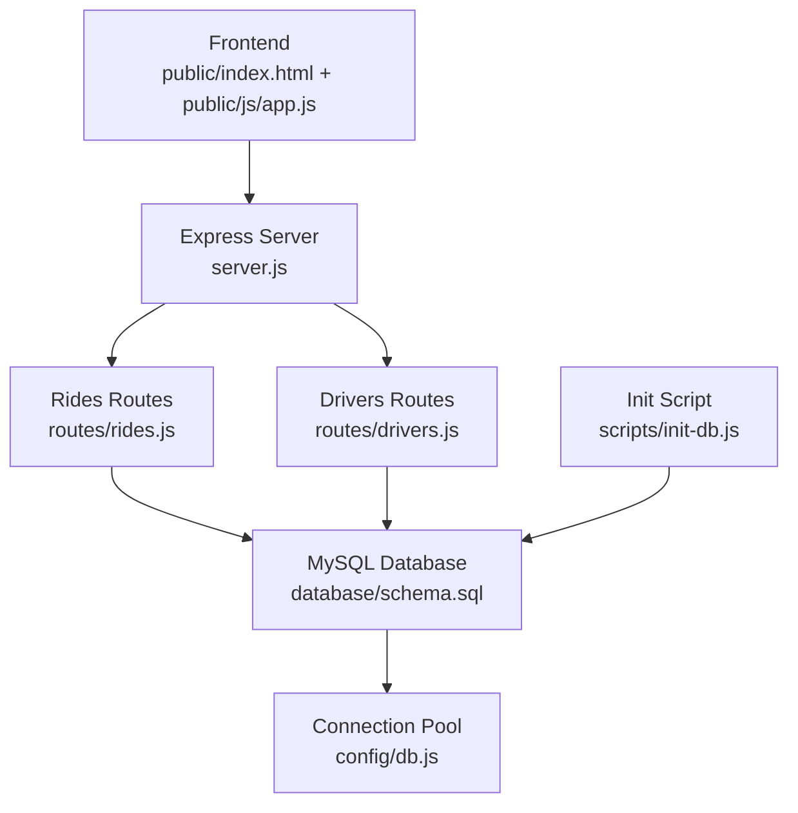
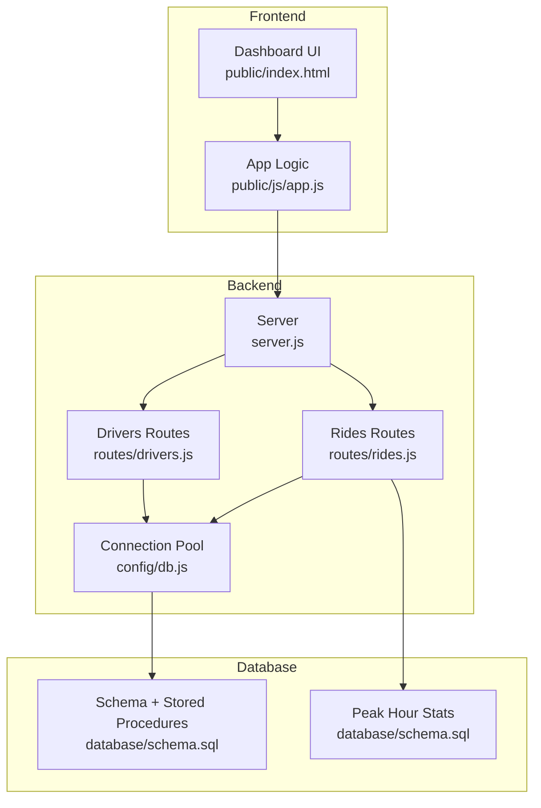
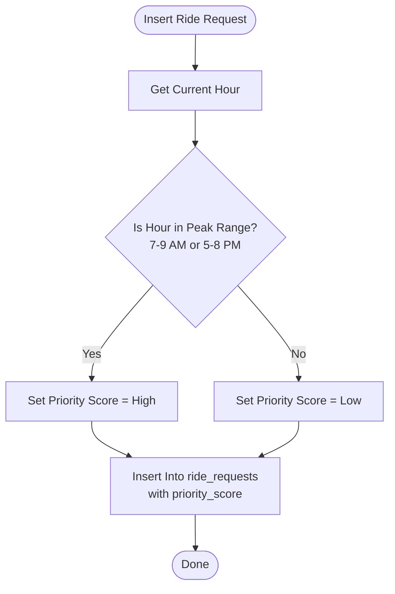
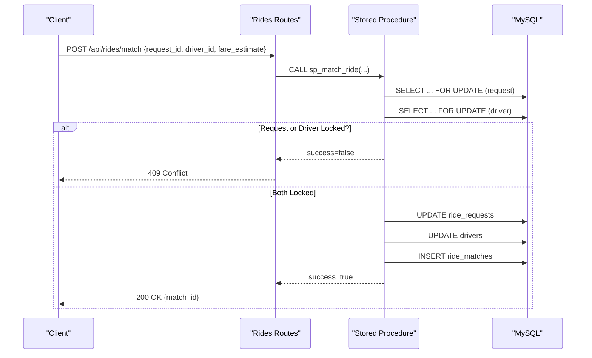
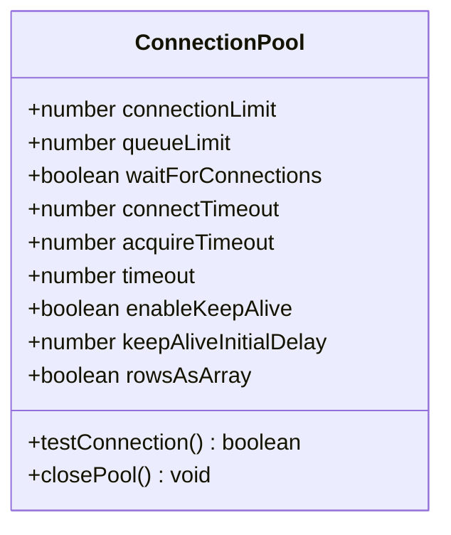
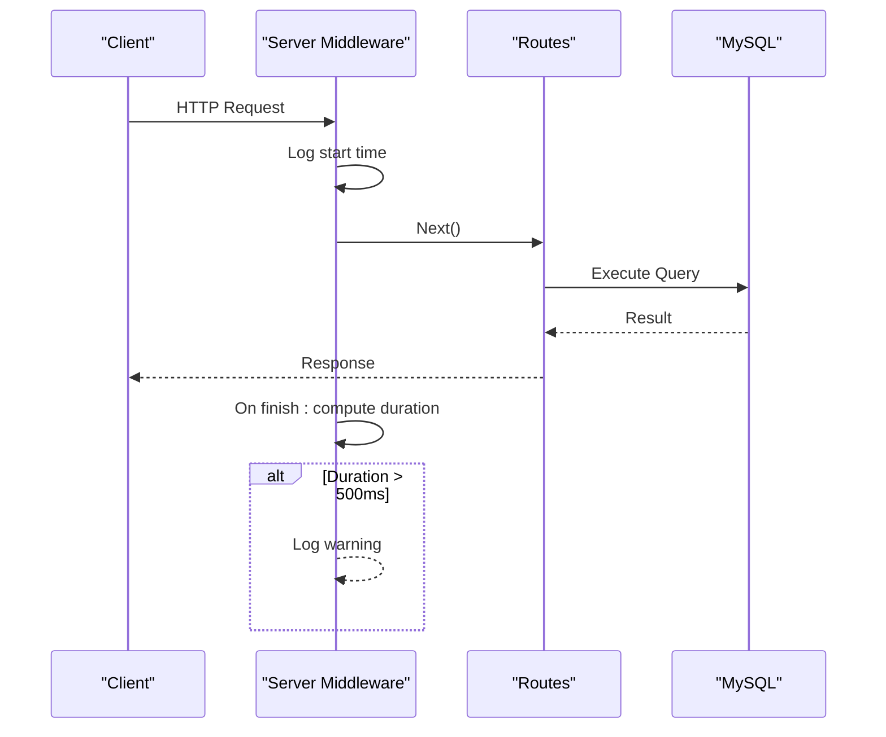
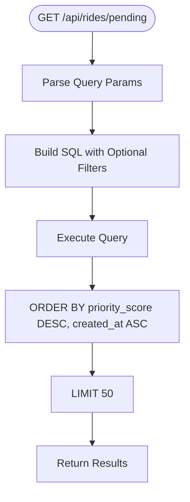
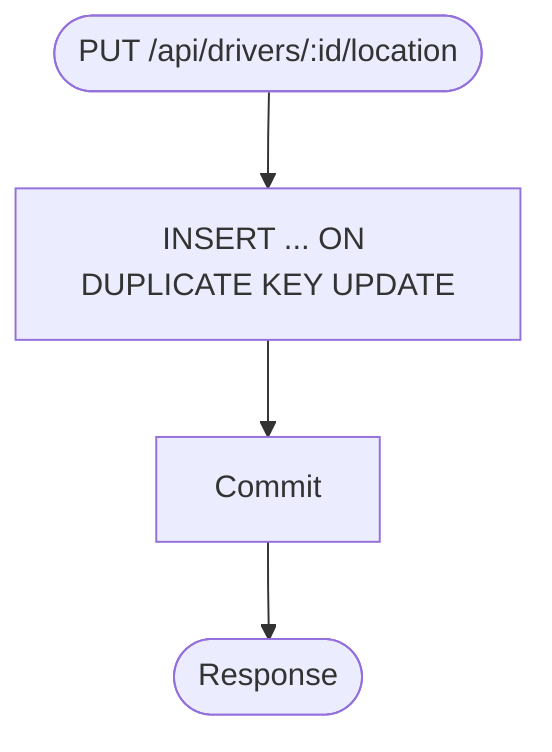
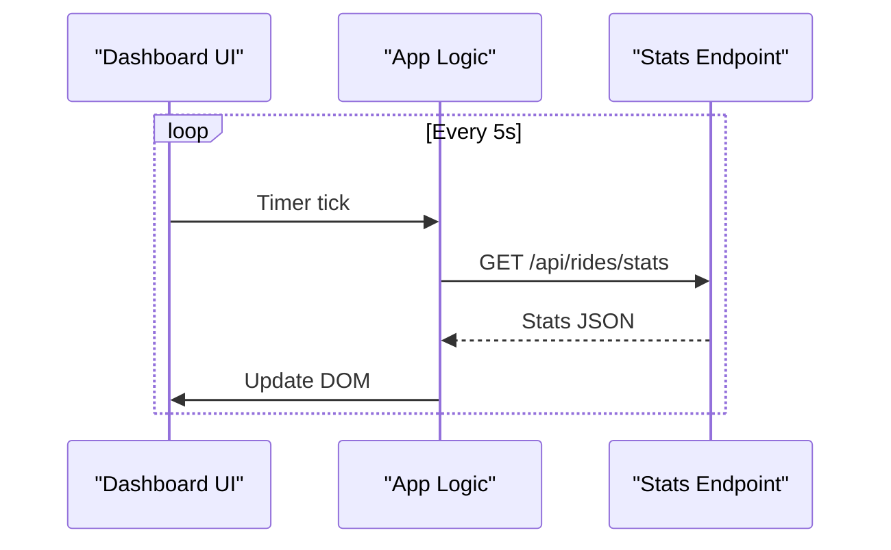
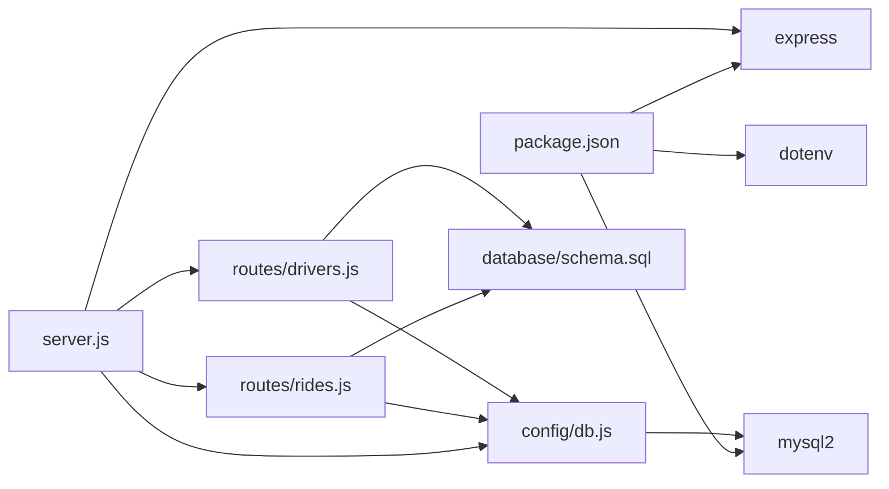

# Peak-Hour Optimization and Performance Monitoring

<cite>
**Referenced Files in This Document**
- [server.js](file://server.js)
- [routes/rides.js](file://routes/rides.js)
- [routes/drivers.js](file://routes/drivers.js)
- [config/db.js](file://config/db.js)
- [database/schema.sql](file://database/schema.sql)
- [public/js/app.js](file://public/js/app.js)
- [public/index.html](file://public/index.html)
- [scripts/init-db.js](file://scripts/init-db.js)
- [package.json](file://package.json)
- [README.md](file://README.md)
</cite>

## Table of Contents
1. [Introduction](#introduction)
2. [Project Structure](#project-structure)
3. [Core Components](#core-components)
4. [Architecture Overview](#architecture-overview)
5. [Detailed Component Analysis](#detailed-component-analysis)
6. [Dependency Analysis](#dependency-analysis)
7. [Performance Considerations](#performance-considerations)
8. [Troubleshooting Guide](#troubleshooting-guide)
9. [Conclusion](#conclusion)
10. [Appendices](#appendices)

## Introduction
This document provides comprehensive guidance for peak-hour optimization and performance monitoring in a ride-sharing matching system. It focuses on:
- Automatic priority scoring during peak hours to improve matching efficiency
- Dynamic resource allocation strategies including adaptive connection pool sizing and request queuing prioritization
- Performance monitoring with connection pool utilization tracking, query latency measurement, and bottleneck identification
- Alerting mechanisms for performance degradation, capacity planning guidelines, and load testing procedures
- Automated scaling strategies and manual intervention procedures for extreme peak conditions
- Capacity planning methodologies, historical traffic pattern analysis, and predictive scaling based on time-of-day and day-of-week patterns

The system is built with Node.js, Express, MySQL, and a small vanilla JavaScript frontend. It includes strategic indexes, atomic stored procedures, optimistic/pessimistic locking, and a connection pool tuned for high read and frequent update workloads.

## Project Structure
The repository follows a layered structure:
- Backend server and middleware in server.js
- Route modules for rides and drivers
- Database configuration and connection pooling
- Database schema and stored procedures
- Frontend dashboard with auto-refreshing stats and match console
- Initialization script for database setup

**Diagram sources**
- [server.js:1-84](file://server.js#L1-L84)
- [routes/rides.js:1-272](file://routes/rides.js#L1-L272)
- [routes/drivers.js:1-182](file://routes/drivers.js#L1-L182)
- [config/db.js:1-50](file://config/db.js#L1-L50)
- [database/schema.sql:1-297](file://database/schema.sql#L1-L297)
- [public/index.html:1-239](file://public/index.html#L1-L239)
- [public/js/app.js:1-373](file://public/js/app.js#L1-L373)
- [scripts/init-db.js:1-46](file://scripts/init-db.js#L1-L46)

**Section sources**
- [server.js:1-84](file://server.js#L1-L84)
- [routes/rides.js:1-272](file://routes/rides.js#L1-L272)
- [routes/drivers.js:1-182](file://routes/drivers.js#L1-L182)
- [config/db.js:1-50](file://config/db.js#L1-L50)
- [database/schema.sql:1-297](file://database/schema.sql#L1-L297)
- [public/index.html:1-239](file://public/index.html#L1-L239)
- [public/js/app.js:1-373](file://public/js/app.js#L1-L373)
- [scripts/init-db.js:1-46](file://scripts/init-db.js#L1-L46)
- [package.json:1-24](file://package.json#L1-L24)
- [README.md:1-290](file://README.md#L1-L290)

## Core Components
- Express server with CORS, JSON parsing, static serving, health checks, and global error handling
- Rides route module with:
  - Priority scoring for peak hours (7–9 AM and 5–8 PM)
  - Atomic matching via stored procedure to prevent double-booking
  - Stats endpoint for monitoring pending/matched/active counts
  - Pending requests listing with spatial filtering and priority ordering
- Drivers route module with:
  - Available drivers listing with spatial filtering
  - Frequent location upsert using ON DUPLICATE KEY UPDATE
  - Status toggling and driver history
- Database configuration with a connection pool sized for peak-hour concurrency
- Database schema with indexes, stored procedures, and analytics tables for peak-hour monitoring

Key implementation references:
- Priority scoring helper and peak-hour logic
- Atomic matching stored procedure and call
- Connection pool configuration and health check
- Stats endpoint aggregations
- Spatial filters and priority ordering in pending requests
- Upsert for driver locations

**Section sources**
- [routes/rides.js:261-269](file://routes/rides.js#L261-L269)
- [routes/rides.js:135-167](file://routes/rides.js#L135-L167)
- [routes/rides.js:226-259](file://routes/rides.js#L226-L259)
- [routes/rides.js:43-86](file://routes/rides.js#L43-L86)
- [routes/drivers.js:101-126](file://routes/drivers.js#L101-L126)
- [config/db.js:7-30](file://config/db.js#L7-L30)
- [config/db.js:32-41](file://config/db.js#L32-L41)
- [database/schema.sql:164-272](file://database/schema.sql#L164-L272)

## Architecture Overview
The system architecture emphasizes high-concurrency reads and frequent updates during peak hours, with explicit measures to prevent contention and ensure fairness.

**Diagram sources**
- [server.js:1-84](file://server.js#L1-L84)
- [routes/rides.js:1-272](file://routes/rides.js#L1-L272)
- [routes/drivers.js:1-182](file://routes/drivers.js#L1-L182)
- [config/db.js:1-50](file://config/db.js#L1-L50)
- [database/schema.sql:1-297](file://database/schema.sql#L1-L297)
- [public/index.html:1-239](file://public/index.html#L1-L239)
- [public/js/app.js:1-373](file://public/js/app.js#L1-L373)

## Detailed Component Analysis

### Priority Scoring System for Peak Hours
The system automatically increases ride priority during peak hours (7–9 AM and 5–8 PM) to ensure optimal matching efficiency. This is implemented by:
- A helper function that computes a priority score based on the current hour
- Storing the priority score in the ride_requests table
- Ordering pending requests by priority_score descending and created_at ascending to ensure fairness and timeliness

**Diagram sources**
- [routes/rides.js:261-269](file://routes/rides.js#L261-L269)
- [database/schema.sql:74-98](file://database/schema.sql#L74-L98)

**Section sources**
- [routes/rides.js:261-269](file://routes/rides.js#L261-L269)
- [database/schema.sql:74-98](file://database/schema.sql#L74-L98)

### Atomic Matching to Prevent Double-Booking
During peak hours, preventing race conditions is critical. The system uses a stored procedure that:
- Locks the ride request and driver rows with FOR UPDATE
- Updates statuses atomically
- Inserts a match record and returns success/failure

**Diagram sources**
- [routes/rides.js:135-167](file://routes/rides.js#L135-L167)
- [database/schema.sql:164-234](file://database/schema.sql#L164-L234)

**Section sources**
- [routes/rides.js:135-167](file://routes/rides.js#L135-L167)
- [database/schema.sql:164-234](file://database/schema.sql#L164-L234)

### Connection Pooling and Request Queuing
The connection pool is configured to handle burst traffic during peak hours:
- Pool size: 50 connections
- Queue limit: 100 requests
- Timeouts to prevent hanging connections
- Keep-alive to keep connections fresh
- Health check endpoint to monitor database connectivity

**Diagram sources**
- [config/db.js:7-30](file://config/db.js#L7-L30)
- [config/db.js:32-47](file://config/db.js#L32-L47)

**Section sources**
- [config/db.js:7-30](file://config/db.js#L7-L30)
- [config/db.js:32-47](file://config/db.js#L32-L47)

### Performance Monitoring Implementation
The system includes several monitoring capabilities:
- Request logging middleware that flags slow requests (>500 ms)
- Health check endpoint for database connectivity
- Stats endpoint aggregating pending/matched/active counts and available drivers
- Frontend auto-refresh intervals simulating peak-hour monitoring

**Diagram sources**
- [server.js:20-30](file://server.js#L20-L30)
- [routes/rides.js:226-259](file://routes/rides.js#L226-L259)
- [server.js:43-51](file://server.js#L43-L51)
- [public/js/app.js:25-28](file://public/js/app.js#L25-L28)

**Section sources**
- [server.js:20-30](file://server.js#L20-L30)
- [routes/rides.js:226-259](file://routes/rides.js#L226-L259)
- [server.js:43-51](file://server.js#L43-L51)
- [public/js/app.js:25-28](file://public/js/app.js#L25-L28)

### Spatial Filtering and Priority Ordering
Pending requests are filtered by proximity and ordered by priority score to optimize matching efficiency:
- Optional lat/lng/radius parameters to constrain search
- ORDER BY priority_score DESC, created_at ASC to prioritize urgent and recent requests

**Diagram sources**
- [routes/rides.js:43-86](file://routes/rides.js#L43-L86)
- [database/schema.sql:94-97](file://database/schema.sql#L94-L97)

**Section sources**
- [routes/rides.js:43-86](file://routes/rides.js#L43-L86)
- [database/schema.sql:94-97](file://database/schema.sql#L94-L97)

### Driver Location Upserts for Frequent Updates
To minimize contention and eliminate race conditions, driver location updates use a single atomic upsert:
- INSERT ... ON DUPLICATE KEY UPDATE
- Updates coordinates and timestamps atomically

**Diagram sources**
- [routes/drivers.js:101-126](file://routes/drivers.js#L101-L126)
- [database/schema.sql:54-69](file://database/schema.sql#L54-L69)

**Section sources**
- [routes/drivers.js:101-126](file://routes/drivers.js#L101-L126)
- [database/schema.sql:54-69](file://database/schema.sql#L54-L69)

### Dashboard and Auto-Refresh
The frontend dashboard auto-refreshes stats and lists to simulate peak-hour monitoring:
- Stats refresh every 5 seconds
- Rides refresh every 15 seconds
- Drivers refresh every 30 seconds

**Diagram sources**
- [public/js/app.js:25-28](file://public/js/app.js#L25-L28)
- [routes/rides.js:226-259](file://routes/rides.js#L226-L259)
- [public/index.html:21-43](file://public/index.html#L21-L43)

**Section sources**
- [public/js/app.js:25-28](file://public/js/app.js#L25-L28)
- [routes/rides.js:226-259](file://routes/rides.js#L226-L259)
- [public/index.html:21-43](file://public/index.html#L21-L43)

## Dependency Analysis
The backend depends on Express, MySQL2 promise pool, and dotenv for environment configuration. The routes depend on the shared pool, and the database schema defines the data model and stored procedures.

**Diagram sources**
- [package.json:14-18](file://package.json#L14-L18)
- [server.js:1-8](file://server.js#L1-L8)
- [routes/rides.js:1-3](file://routes/rides.js#L1-L3)
- [routes/drivers.js:1-3](file://routes/drivers.js#L1-L3)
- [config/db.js:1](file://config/db.js#L1)
- [database/schema.sql:1-297](file://database/schema.sql#L1-L297)

**Section sources**
- [package.json:14-18](file://package.json#L14-L18)
- [server.js:1-8](file://server.js#L1-L8)
- [routes/rides.js:1-3](file://routes/rides.js#L1-L3)
- [routes/drivers.js:1-3](file://routes/drivers.js#L1-L3)
- [config/db.js:1](file://config/db.js#L1)
- [database/schema.sql:1-297](file://database/schema.sql#L1-L297)

## Performance Considerations
- Connection pool sizing: 50 connections with queue limit 100 to absorb bursts during peak hours
- Timeouts: connectTimeout, acquireTimeout, and timeout to prevent stalled connections
- Keep-alive: enableKeepAlive with initial delay to maintain healthy connections
- Indexing: strategic indexes on status, created_at, pickup coordinates, and priority_score to accelerate queries
- Stored procedures: atomic operations reduce contention and ensure consistency
- Upsert for locations: eliminates race conditions and reduces round-trips
- Priority scoring: ensures urgent and peak-hour requests are prioritized fairly

[No sources needed since this section provides general guidance]

## Troubleshooting Guide
Common issues and resolutions:
- Database connectivity failures: verify DB_HOST, DB_PORT, DB_USER, DB_PASSWORD in environment
- Table not found errors: run the initialization script to create schema and stored procedures
- Slow queries during peak hours: monitor stats and consider increasing pool size or adding indexes
- Port conflicts: change PORT in environment if 3000 is in use

Operational checks:
- Health endpoint: GET /api/health to verify database connectivity
- Stats endpoint: GET /api/rides/stats to monitor pending/matched/active counts
- Slow request logs: middleware logs warnings for requests exceeding 500 ms

**Section sources**
- [server.js:43-51](file://server.js#L43-L51)
- [routes/rides.js:226-259](file://routes/rides.js#L226-L259)
- [server.js:20-30](file://server.js#L20-L30)
- [README.md:265-274](file://README.md#L265-L274)

## Conclusion
The system incorporates targeted optimizations for peak-hour scenarios:
- Automatic priority scoring during high-demand periods
- Atomic matching to prevent race conditions
- A connection pool sized for bursty loads
- Monitoring via middleware, health checks, and stats endpoints
- Spatial filtering and priority ordering for efficient matching
- Atomic upserts for frequent driver location updates

These measures collectively improve matching efficiency, reduce contention, and provide observability to support capacity planning and scaling decisions.

[No sources needed since this section summarizes without analyzing specific files]

## Appendices

### Capacity Planning Methodologies
- Historical traffic pattern analysis: use peak_hour_stats to track hourly request and match volumes
- Predictive scaling: correlate metrics with time-of-day and day-of-week to forecast demand
- Threshold-based alerts: trigger scaling actions when stats exceed predefined thresholds
- Load testing procedures: simulate peak-hour traffic with tools like Apache Bench or k6 to validate capacity

[No sources needed since this section provides general guidance]

### Alerting Mechanisms
- Slow request threshold: middleware logs warnings for requests exceeding 500 ms
- Database health: /api/health endpoint for connectivity checks
- Stats-based alerts: monitor /api/rides/stats for abnormal spikes in pending requests or drops in available drivers

**Section sources**
- [server.js:20-30](file://server.js#L20-L30)
- [server.js:43-51](file://server.js#L43-L51)
- [routes/rides.js:226-259](file://routes/rides.js#L226-L259)

### Automated Scaling Strategies
- Horizontal scaling: deploy multiple Node.js instances behind a load balancer
- Vertical scaling: increase pool size and timeouts based on observed latency and queue depth
- Database scaling: add read replicas and optimize indexes for peak-hour queries

[No sources needed since this section provides general guidance]

### Manual Intervention Procedures
- Immediate steps: review slow request logs, inspect stats trends, and temporarily adjust pool settings
- Emergency mitigation: pause non-critical writes, enforce stricter queue limits, and scale up instances
- Post-event analysis: capture metrics, update capacity plans, and refine alert thresholds

[No sources needed since this section provides general guidance]