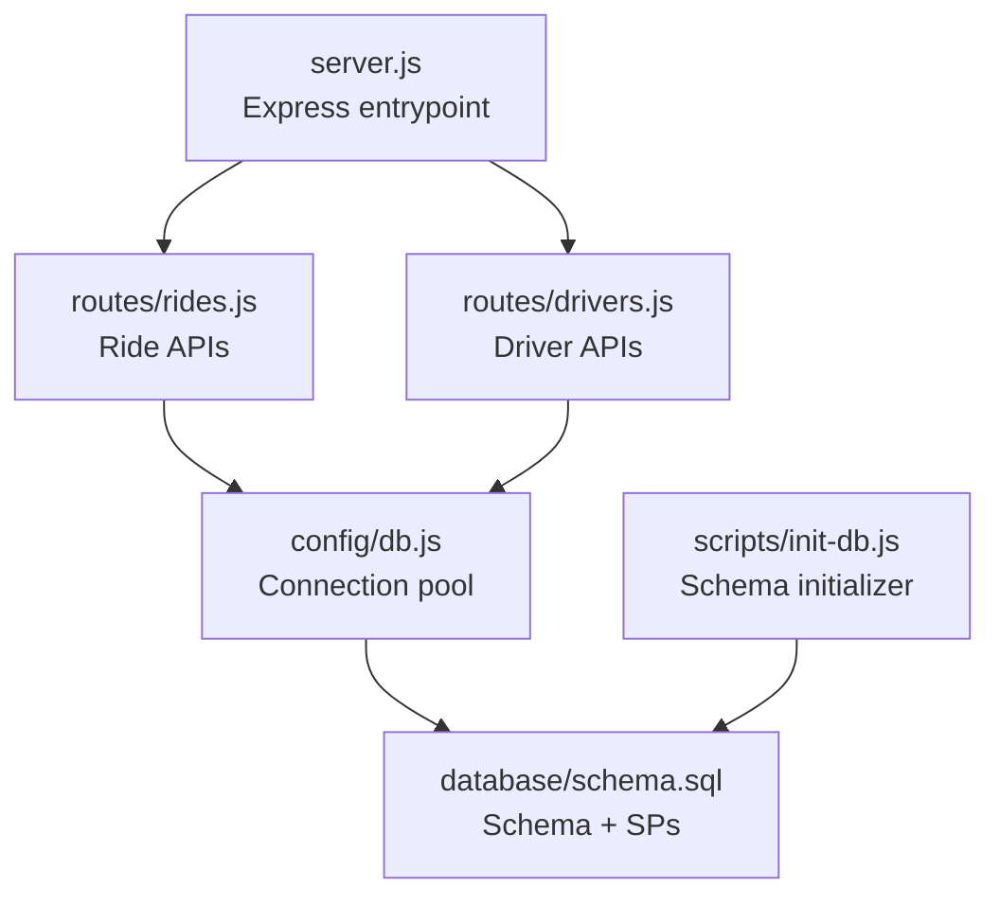
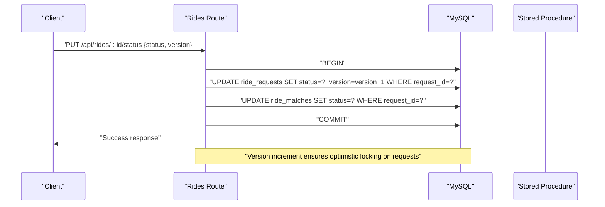
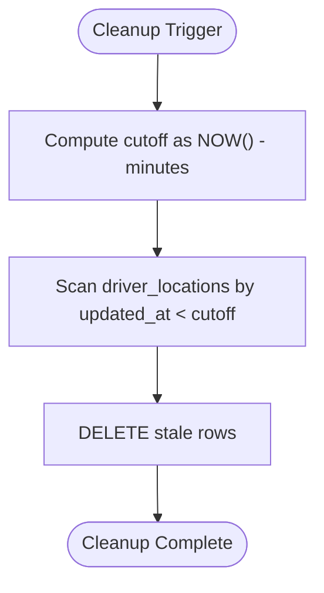
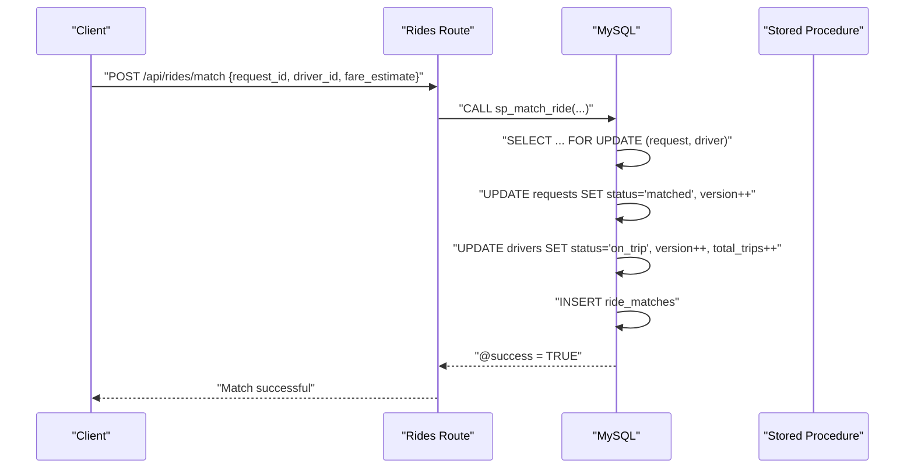
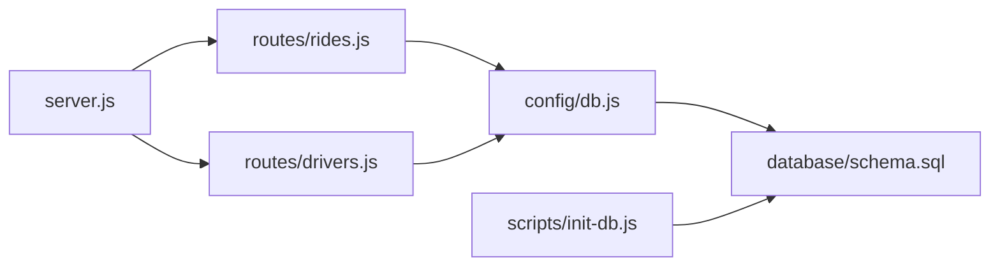

# Data Integrity and Constraints

<cite>
**Referenced Files in This Document**
- [schema.sql](file://database/schema.sql)
- [db.js](file://config/db.js)
- [init-db.js](file://scripts/init-db.js)
- [rides.js](file://routes/rides.js)
- [drivers.js](file://routes/drivers.js)
- [server.js](file://server.js)
- [README.md](file://README.md)
</cite>

## Table of Contents
1. [Introduction](#introduction)
2. [Project Structure](#project-structure)
3. [Core Components](#core-components)
4. [Architecture Overview](#architecture-overview)
5. [Detailed Component Analysis](#detailed-component-analysis)
6. [Dependency Analysis](#dependency-analysis)
7. [Performance Considerations](#performance-considerations)
8. [Troubleshooting Guide](#troubleshooting-guide)
9. [Conclusion](#conclusion)

## Introduction
This document focuses on the data integrity mechanisms and business rule enforcement embedded in the database schema. It explains optimistic locking using version columns, ENUM constraints for status fields, unique constraints and indexes, foreign key constraints with cascade actions, temporal constraints with automatic timestamps, and validation rules such as DECIMAL precision and geographic coordinate ranges. It also covers data lifecycle management patterns, including cleanup procedures and audit trail capabilities.

## Project Structure
The schema and related runtime logic are organized as follows:
- Database schema and stored procedures are defined in a single SQL script.
- Connection pooling and health checks are configured in a dedicated module.
- Initialization scripts create and populate the schema.
- Routes implement application-level logic that relies on schema constraints for safety and consistency.



**Diagram sources**
- [server.js:1-84](file://server.js#L1-L84)
- [rides.js:1-272](file://routes/rides.js#L1-L272)
- [drivers.js:1-182](file://routes/drivers.js#L1-L182)
- [db.js:1-50](file://config/db.js#L1-L50)
- [schema.sql:1-297](file://database/schema.sql#L1-L297)
- [init-db.js:1-46](file://scripts/init-db.js#L1-L46)

**Section sources**
- [README.md:29-48](file://README.md#L29-L48)
- [server.js:1-84](file://server.js#L1-L84)
- [db.js:1-50](file://config/db.js#L1-L50)
- [schema.sql:1-297](file://database/schema.sql#L1-L297)
- [init-db.js:1-46](file://scripts/init-db.js#L1-L46)

## Core Components
- Users: Rider records with unique email and audit timestamps.
- Drivers: Driver records with unique email, unique license plate, ENUM status, rating, total trips, optimistic locking via version, and audit timestamps.
- Driver Locations: Live GPS positions with a unique constraint per driver and frequent updates.
- Ride Requests: Ride booking records with ENUM status, monetary estimates, priority scoring, optimistic locking via version, and audit timestamps.
- Ride Matches: Core matching table with ENUM status, monetary and distance fields, timestamps, optimistic locking via version, and audit timestamps.
- Peak Hour Stats: Aggregated analytics keyed by hourly window.
- Driver Queue: Fair FIFO queue per zone with uniqueness and time-based ordering.

Key integrity mechanisms:
- ENUM constraints enforce status values across tables.
- Unique constraints and indexes ensure uniqueness and efficient lookups.
- Foreign keys with CASCADE actions maintain referential integrity.
- TIMESTAMP fields with defaults and automatic updates support audit trails.
- DECIMAL precision constraints enforce monetary and geographic validations.
- Stored procedures implement atomic operations and optimistic locking checks.

**Section sources**
- [schema.sql:12-158](file://database/schema.sql#L12-L158)
- [schema.sql:160-272](file://database/schema.sql#L160-L272)
- [README.md:179-225](file://README.md#L179-L225)

## Architecture Overview
The system enforces data integrity at the database level while exposing safe, atomic operations through stored procedures and application routes.

```mermaid
erDiagram
USERS {
int user_id PK
varchar email UK
timestamp created_at
timestamp updated_at
}
DRIVERS {
int driver_id PK
varchar email UK
varchar vehicle_plate UK
enum status
decimal rating
int total_trips
int version
timestamp created_at
timestamp updated_at
}
DRIVER_LOCATIONS {
int location_id PK
int driver_id FK
decimal latitude
decimal longitude
decimal accuracy
timestamp updated_at
}
RIDE_REQUESTS {
int request_id PK
int user_id FK
decimal pickup_lat
decimal pickup_lng
decimal dropoff_lat
decimal dropoff_lng
enum status
decimal fare_estimate
decimal priority_score
int version
timestamp created_at
timestamp updated_at
}
RIDE_MATCHES {
int match_id PK
int request_id FK UK
int driver_id FK
enum status
decimal fare_final
decimal distance_km
timestamp started_at
timestamp completed_at
int version
timestamp created_at
timestamp updated_at
}
PEAK_HOUR_STATS {
int stat_id PK
datetime hour_block UK
}
DRIVER_QUEUE {
int queue_id PK
int driver_id FK
varchar zone_id
timestamp queued_at
}
USERS ||--o{ RIDE_REQUESTS : "has"
DRIVERS ||--o{ DRIVER_LOCATIONS : "has"
DRIVERS ||--o{ RIDE_MATCHES : "drives"
RIDE_REQUESTS ||--|| RIDE_MATCHES : "matches"
```

**Diagram sources**
- [schema.sql:12-158](file://database/schema.sql#L12-L158)
- [schema.sql:160-272](file://database/schema.sql#L160-L272)

## Detailed Component Analysis

### Optimistic Locking with Version Columns
Optimistic locking is implemented using an integer version column present in drivers, ride_requests, and ride_matches. The stored procedures and application routes coordinate updates to detect and prevent stale-data conflicts.

- Drivers table includes a version column used for optimistic locking.
- Ride requests table includes a version column used for optimistic locking.
- Ride matches table includes a version column used for optimistic locking.
- Stored procedure sp_update_match_status performs an update with a condition on version to ensure atomicity and detect conflicts.
- Application route for updating ride status increments the version column on the request and synchronizes match status accordingly.



**Diagram sources**
- [rides.js:169-224](file://routes/rides.js#L169-L224)
- [schema.sql:160-272](file://database/schema.sql#L160-L272)

**Section sources**
- [schema.sql:32-49](file://database/schema.sql#L32-L49)
- [schema.sql:74-98](file://database/schema.sql#L74-L98)
- [schema.sql:103-126](file://database/schema.sql#L103-L126)
- [schema.sql:236-263](file://database/schema.sql#L236-L263)
- [rides.js:169-224](file://routes/rides.js#L169-L224)

### ENUM Constraints for Status Fields
ENUM constraints ensure data consistency for status fields across the application:
- Drivers: status accepts offline, available, busy, on_trip.
- Ride requests: status accepts pending, matched, picked_up, completed, cancelled.
- Ride matches: status accepts assigned, picked_up, in_progress, completed, cancelled.

These constraints guarantee that only predefined values are stored, preventing invalid states.

**Section sources**
- [schema.sql:39](file://database/schema.sql#L39)
- [schema.sql:84](file://database/schema.sql#L84)
- [schema.sql:108](file://database/schema.sql#L108)

### Unique Constraints and Indexes
Unique constraints and indexes are designed for uniqueness, performance, and lifecycle management:
- Unique constraints:
  - UK_DRIVER for driver_locations (one row per driver).
  - UK_REQUEST for ride_matches (one match per request).
  - Unique emails for users and drivers.
  - Unique vehicle_plate for drivers.
  - Unique hour_block for peak_hour_stats.
  - Unique driver-zone pair for driver_queue.
- Indexes:
  - Drivers: idx_status, idx_rating, idx_updated_at.
  - Driver locations: idx_location, idx_updated.
  - Ride requests: idx_status_created, idx_user_status, idx_pickup, idx_priority.
  - Ride matches: idx_driver_status, idx_status, idx_created.
  - Driver queue: idx_zone_time.

These indexes support high-read and frequent-update scenarios, including peak-hour concurrency.

**Section sources**
- [schema.sql:66](file://database/schema.sql#L66)
- [schema.sql:122](file://database/schema.sql#L122)
- [schema.sql:19](file://database/schema.sql#L19)
- [schema.sql:35](file://database/schema.sql#L35)
- [schema.sql:38](file://database/schema.sql#L38)
- [schema.sql:140](file://database/schema.sql#L140)
- [schema.sql:156](file://database/schema.sql#L156)
- [schema.sql:46-49](file://database/schema.sql#L46-L49)
- [schema.sql:67-69](file://database/schema.sql#L67-L69)
- [schema.sql:94-98](file://database/schema.sql#L94-L98)
- [schema.sql:123-126](file://database/schema.sql#L123-L126)
- [schema.sql:157](file://database/schema.sql#L157)

### Foreign Key Constraints with CASCADE Actions
Foreign keys ensure referential integrity with CASCADE actions:
- Driver locations references drivers on delete cascade.
- Ride requests references users on delete cascade.
- Ride matches references ride_requests and drivers on delete cascade.

This design guarantees that deleting a parent record cascades to child records, maintaining consistency and simplifying cleanup.

**Section sources**
- [schema.sql:63-64](file://database/schema.sql#L63-L64)
- [schema.sql:91](file://database/schema.sql#L91)
- [schema.sql:117-120](file://database/schema.sql#L117-L120)

### Temporal Constraints and Audit Trail
TIMESTAMP fields with defaults and automatic updates provide audit trail capabilities:
- created_at defaults to current timestamp.
- updated_at defaults to current timestamp and auto-updates on modification.
- started_at and completed_at are explicitly managed for ride lifecycle events.

These fields enable tracking of creation and last-modified times, and explicit timestamps for lifecycle milestones.

**Section sources**
- [schema.sql:21-22](file://database/schema.sql#L21-L22)
- [schema.sql:43-44](file://database/schema.sql#L43-L44)
- [schema.sql:61](file://database/schema.sql#L61)
- [schema.sql:88-89](file://database/schema.sql#L88-L89)
- [schema.sql:114-115](file://database/schema.sql#L114-L115)
- [schema.sql:111-112](file://database/schema.sql#L111-L112)

### Validation Rules Embedded in the Schema
Precision and range constraints ensure data validity:
- Monetary values:
  - fare_estimate and fare_final use DECIMAL(10,2) to represent amounts up to thousands of currency units with two decimal places.
- Geographic coordinates:
  - Latitude and longitude use DECIMAL(10,8) and DECIMAL(11,8) respectively to support precise positioning.
- Ratings:
  - Rating uses DECIMAL(2,1) to represent values up to 99.9.
- Distance and priority:
  - distance_km uses DECIMAL(6,2); priority_score uses DECIMAL(5,2).

These definitions constrain input ranges and precision to align with business expectations.

**Section sources**
- [schema.sql:85](file://database/schema.sql#L85)
- [schema.sql:109](file://database/schema.sql#L109)
- [schema.sql:58-59](file://database/schema.sql#L58-L59)
- [schema.sql:78-81](file://database/schema.sql#L78-L81)
- [schema.sql:40](file://database/schema.sql#L40)
- [schema.sql:110](file://database/schema.sql#L110)
- [schema.sql:86](file://database/schema.sql#L86)

### Data Lifecycle Management and Cleanup
Lifecycle management patterns supported by the schema:
- Stale driver location cleanup:
  - Stored procedure sp_cleanup_stale_locations deletes old location rows based on updated_at threshold.
- Automatic cascading deletes:
  - Deleting a user deletes associated ride requests and driver locations.
  - Deleting a driver deletes associated driver locations and ride matches.
- Audit trail:
  - created_at and updated_at timestamps capture lifecycle events.



**Diagram sources**
- [schema.sql:265-270](file://database/schema.sql#L265-L270)

**Section sources**
- [schema.sql:265-270](file://database/schema.sql#L265-L270)
- [schema.sql:63-64](file://database/schema.sql#L63-L64)
- [schema.sql:91](file://database/schema.sql#L91)
- [schema.sql:117-120](file://database/schema.sql#L117-L120)

### Atomic Operations and Concurrency Safety
Atomic operations are implemented via stored procedures and application-level transactions:
- Atomic matching:
  - Stored procedure sp_match_ride locks the request and driver rows, updates statuses, increments versions, and inserts a match atomically.
- Upsert for driver locations:
  - Application route uses INSERT ... ON DUPLICATE KEY UPDATE to avoid race conditions during frequent GPS updates.
- Transactional status updates:
  - Application route wraps status updates in a transaction and increments the request version.



**Diagram sources**
- [rides.js:135-167](file://routes/rides.js#L135-L167)
- [schema.sql:167-234](file://database/schema.sql#L167-L234)

**Section sources**
- [schema.sql:167-234](file://database/schema.sql#L167-L234)
- [rides.js:101-126](file://routes/rides.js#L101-L126)
- [rides.js:135-167](file://routes/rides.js#L135-L167)
- [rides.js:169-224](file://routes/rides.js#L169-L224)

## Dependency Analysis
The runtime depends on the schema for enforcing integrity and consistency. The application routes rely on:
- Stored procedures for atomic operations.
- Unique constraints and indexes for performance and uniqueness guarantees.
- Foreign keys with cascade actions for referential integrity.
- Timestamp defaults and updates for audit trails.



**Diagram sources**
- [server.js:1-84](file://server.js#L1-L84)
- [rides.js:1-272](file://routes/rides.js#L1-L272)
- [drivers.js:1-182](file://routes/drivers.js#L1-L182)
- [db.js:1-50](file://config/db.js#L1-L50)
- [schema.sql:1-297](file://database/schema.sql#L1-L297)
- [init-db.js:1-46](file://scripts/init-db.js#L1-L46)

**Section sources**
- [server.js:1-84](file://server.js#L1-L84)
- [rides.js:1-272](file://routes/rides.js#L1-L272)
- [drivers.js:1-182](file://routes/drivers.js#L1-L182)
- [db.js:1-50](file://config/db.js#L1-L50)
- [schema.sql:1-297](file://database/schema.sql#L1-L297)
- [init-db.js:1-46](file://scripts/init-db.js#L1-L46)

## Performance Considerations
- Connection pooling: The pool is configured for high concurrency with a large connection limit and queue limits suitable for peak-hour bursts.
- Strategic indexing: Indexes target high-read and frequent-update patterns, including status filters, location searches, and priority ordering.
- Upsert pattern: Using INSERT ... ON DUPLICATE KEY UPDATE reduces race conditions and minimizes round-trips for frequent location updates.
- Stored procedures: Encapsulate atomic operations to reduce application-side complexity and improve consistency under contention.

[No sources needed since this section provides general guidance]

## Troubleshooting Guide
Common issues and resolutions grounded in schema and runtime behavior:
- Connection failures: Verify database credentials and service availability; the health endpoint reports connectivity status.
- Missing tables: Ensure the schema is initialized before starting the server.
- Duplicate key errors: Unique constraints on emails, plates, driver locations, and matches will cause conflicts if violated.
- Stale data during updates: Use optimistic locking via version increments and stored procedures to avoid conflicts.
- Slow queries during peak hours: Monitor analytics and consider adjusting pool size or adding spatial indexing.

**Section sources**
- [server.js:44-51](file://server.js#L44-L51)
- [README.md:265-274](file://README.md#L265-L274)
- [schema.sql:19](file://database/schema.sql#L19)
- [schema.sql:35](file://database/schema.sql#L35)
- [schema.sql:38](file://database/schema.sql#L38)
- [schema.sql:66](file://database/schema.sql#L66)
- [schema.sql:122](file://database/schema.sql#L122)

## Conclusion
The schema enforces robust data integrity through ENUM constraints, unique constraints, foreign keys with cascade actions, and temporal fields with automatic updates. Optimistic locking via version columns and stored procedures ensures concurrency safety. Precision and range constraints on monetary and geographic fields maintain data validity. Lifecycle management is supported by cleanup procedures and cascading deletes, while audit trails are captured through timestamp fields. Together, these mechanisms provide a solid foundation for a high-concurrency ride-sharing matching system.