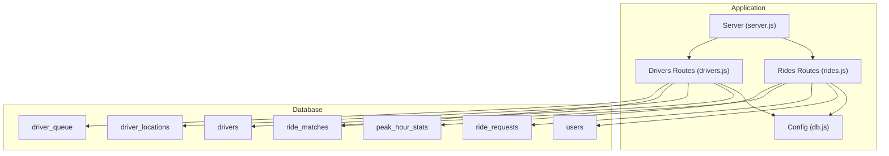
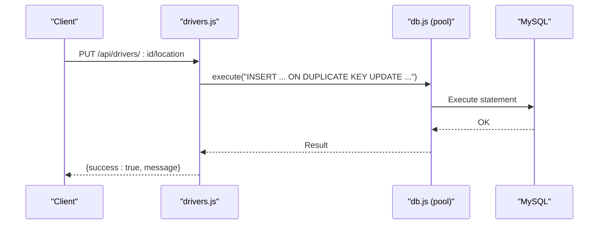
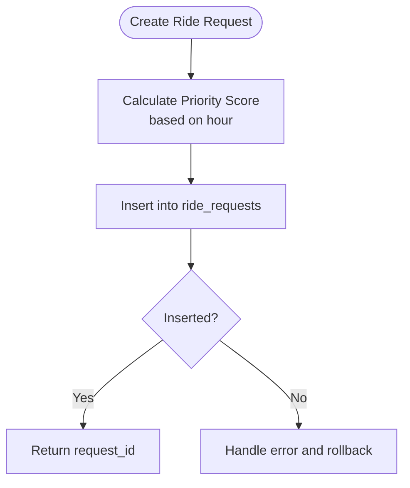
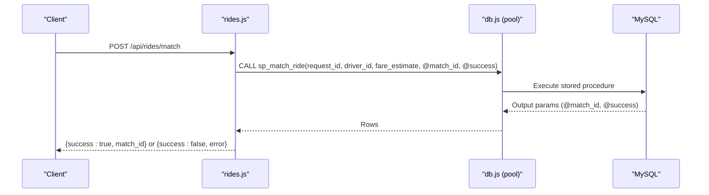
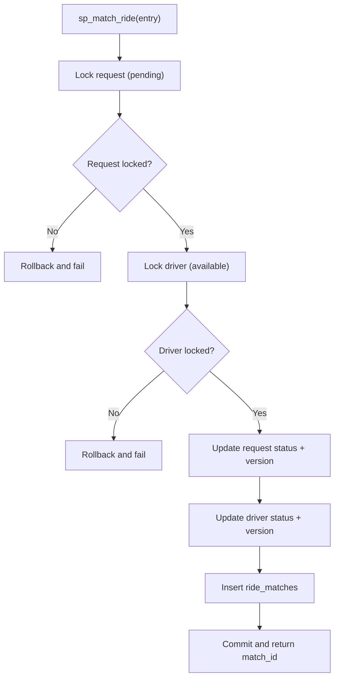
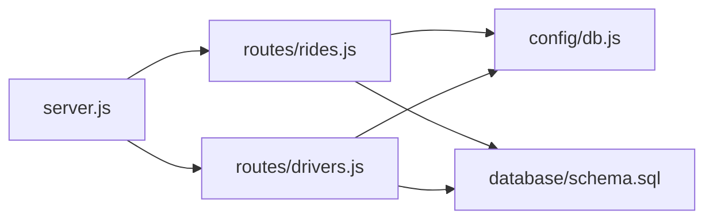

# Database Schema Design

<cite>
**Referenced Files in This Document**
- [schema.sql](file://database/schema.sql)
- [db.js](file://config/db.js)
- [init-db.js](file://scripts/init-db.js)
- [rides.js](file://routes/rides.js)
- [drivers.js](file://routes/drivers.js)
- [server.js](file://server.js)
- [README.md](file://README.md)
- [package.json](file://package.json)
</cite>

## Table of Contents
1. [Introduction](#introduction)
2. [Project Structure](#project-structure)
3. [Core Components](#core-components)
4. [Architecture Overview](#architecture-overview)
5. [Detailed Component Analysis](#detailed-component-analysis)
6. [Dependency Analysis](#dependency-analysis)
7. [Performance Considerations](#performance-considerations)
8. [Troubleshooting Guide](#troubleshooting-guide)
9. [Conclusion](#conclusion)
10. [Appendices](#appendices)

## Introduction
This document provides comprehensive data model documentation for a ride-sharing matching database schema. It covers entity relationships among users, drivers, driver_locations, ride_requests, ride_matches, peak_hour_stats, and driver_queue. It documents field definitions, data types, primary/foreign keys, indexes, and constraints for each table, explains embedded validation and business rules, and outlines data access patterns, strategic indexing, connection pooling configuration, performance considerations, data security, optimistic locking, atomic operations via stored procedures, and migration/version management considerations.

## Project Structure
The project is a Node.js/Express application backed by a MySQL 8.0+ database. The schema and stored procedures are defined in a single SQL script, with runtime configuration and initialization scripts supporting connection pooling and database bootstrap.



**Diagram sources**
- [server.js:1-84](file://server.js#L1-L84)
- [rides.js:1-272](file://routes/rides.js#L1-L272)
- [drivers.js:1-182](file://routes/drivers.js#L1-L182)
- [db.js:1-50](file://config/db.js#L1-L50)
- [schema.sql:1-297](file://database/schema.sql#L1-L297)

**Section sources**
- [README.md:29-48](file://README.md#L29-L48)
- [package.json:1-24](file://package.json#L1-L24)

## Core Components
This section documents each table’s schema, constraints, and indexes, and highlights business rules embedded in the schema and application logic.

- users
  - Purpose: Stores rider profiles.
  - Primary key: user_id (auto-increment).
  - Fields: name, email (unique), phone, created_at, updated_at.
  - Indexes: idx_email, idx_created_at.
  - Notes: Email uniqueness enforces single account per email; created_at/updated_at timestamps track lifecycle.

- drivers
  - Purpose: Stores driver profiles and availability.
  - Primary key: driver_id (auto-increment).
  - Fields: name, email (unique), phone, vehicle_model, vehicle_plate (unique), status (enum), rating, total_trips, version (optimistic locking), created_at, updated_at.
  - Indexes: idx_status, idx_rating, idx_updated_at.
  - Constraints: status enum restricts values; version increments on updates for optimistic locking.

- driver_locations
  - Purpose: Stores live GPS coordinates per driver with frequent updates.
  - Primary key: location_id (auto-increment).
  - Fields: driver_id (FK), latitude, longitude, accuracy, updated_at.
  - Constraints: UNIQUE driver_id ensures one row per driver; FK cascade deletes on driver removal.
  - Indexes: idx_location (lat/lng), idx_updated (cleanup stale locations).

- ride_requests
  - Purpose: Stores ride booking requests with priority scoring and lifecycle.
  - Primary key: request_id (auto-increment).
  - Fields: user_id (FK), pickup_lat, pickup_lng, dropoff_lat, dropoff_lng, pickup_address, dropoff_address, status (enum), fare_estimate, priority_score, version (optimistic locking), created_at, updated_at.
  - Constraints: FK to users; status enum restricts values; version increments on updates.
  - Indexes: idx_status_created (pending queue), idx_user_status (active ride lookup), idx_pickup (geo search), idx_priority (peak-hour ordering).

- ride_matches
  - Purpose: Core matching table linking requests to drivers and tracking trip lifecycle.
  - Primary key: match_id (auto-increment).
  - Fields: request_id (FK, unique), driver_id (FK), status (enum), fare_final, distance_km, started_at, completed_at, version (optimistic locking), created_at, updated_at.
  - Constraints: UNIQUE request_id; FKs to ride_requests and drivers; status enum restricts values; version increments on updates.
  - Indexes: idx_driver_status (driver activity), idx_status (analytics), idx_created (recent matches).

- peak_hour_stats
  - Purpose: Aggregated analytics for peak-hour monitoring.
  - Primary key: stat_id (auto-increment).
  - Fields: hour_block (UNIQUE), requests_count, matches_count, avg_wait_sec, cancelled_count.
  - Notes: UNIQUE hour_block ensures one row per hour block.

- driver_queue
  - Purpose: Fair FIFO queue for drivers by zone during peak hours.
  - Primary key: queue_id (auto-increment).
  - Fields: driver_id (FK), zone_id, queued_at.
  - Constraints: UNIQUE driver_id, zone_id; FK cascade deletes on driver removal.
  - Indexes: idx_zone_time (FIFO per zone).

**Section sources**
- [schema.sql:15-26](file://database/schema.sql#L15-L26)
- [schema.sql:31-49](file://database/schema.sql#L31-L49)
- [schema.sql:54-69](file://database/schema.sql#L54-L69)
- [schema.sql:74-98](file://database/schema.sql#L74-L98)
- [schema.sql:103-126](file://database/schema.sql#L103-L126)
- [schema.sql:131-141](file://database/schema.sql#L131-L141)
- [schema.sql:146-158](file://database/schema.sql#L146-L158)

## Architecture Overview
The system is designed for high read throughput, frequent updates, and peak-hour concurrency. The backend uses a connection pool to handle bursts, while the database schema and stored procedures enforce atomicity and consistency.

```mermaid
erDiagram
users {
int user_id PK
varchar email UK
varchar phone
timestamp created_at
timestamp updated_at
}
drivers {
int driver_id PK
varchar email UK
varchar phone
varchar vehicle_model
varchar vehicle_plate UK
enum status
decimal rating
int total_trips
int version
timestamp created_at
timestamp updated_at
}
driver_locations {
int location_id PK
int driver_id FK
decimal latitude
decimal longitude
decimal accuracy
timestamp updated_at
}
ride_requests {
int request_id PK
int user_id FK
decimal pickup_lat
decimal pickup_lng
decimal dropoff_lat
decimal dropoff_lng
varchar pickup_address
varchar dropoff_address
enum status
decimal fare_estimate
decimal priority_score
int version
timestamp created_at
timestamp updated_at
}
ride_matches {
int match_id PK
int request_id FK UK
int driver_id FK
enum status
decimal fare_final
decimal distance_km
timestamp started_at
timestamp completed_at
int version
timestamp created_at
timestamp updated_at
}
peak_hour_stats {
int stat_id PK
datetime hour_block UK
int requests_count
int matches_count
int avg_wait_sec
int cancelled_count
}
driver_queue {
int queue_id PK
int driver_id FK
varchar zone_id
timestamp queued_at
}
users ||--o{ ride_requests : "creates"
drivers ||--o{ driver_locations : "has"
drivers ||--o{ ride_matches : "drives"
ride_requests ||--|| ride_matches : "matches"
```

**Diagram sources**
- [schema.sql:15-26](file://database/schema.sql#L15-L26)
- [schema.sql:31-49](file://database/schema.sql#L31-L49)
- [schema.sql:54-69](file://database/schema.sql#L54-L69)
- [schema.sql:74-98](file://database/schema.sql#L74-L98)
- [schema.sql:103-126](file://database/schema.sql#L103-L126)
- [schema.sql:131-141](file://database/schema.sql#L131-L141)
- [schema.sql:146-158](file://database/schema.sql#L146-L158)

## Detailed Component Analysis

### Users and Drivers Entities
- users
  - Unique constraints: email.
  - Indexes: idx_email, idx_created_at.
  - Business rules: enforced uniqueness of email; created_at/updated_at timestamps.
- drivers
  - Unique constraints: email, vehicle_plate.
  - Enum constraints: status restricted to offline, available, busy, on_trip.
  - Version column enables optimistic locking.
  - Indexes: idx_status (fast available-driver queries), idx_rating, idx_updated_at.

**Section sources**
- [schema.sql:15-26](file://database/schema.sql#L15-L26)
- [schema.sql:31-49](file://database/schema.sql#L31-L49)

### Driver Locations Entity
- driver_locations
  - Unique constraint: driver_id ensures one row per driver.
  - FK: driver_id references drivers(driver_id) with ON DELETE CASCADE.
  - Indexes: idx_location (lat/lng), idx_updated (stale cleanup).
  - Upsert pattern: application uses INSERT ... ON DUPLICATE KEY UPDATE to avoid race conditions.



**Diagram sources**
- [drivers.js:101-126](file://routes/drivers.js#L101-L126)
- [db.js:7-30](file://config/db.js#L7-L30)

**Section sources**
- [schema.sql:54-69](file://database/schema.sql#L54-L69)
- [drivers.js:101-126](file://routes/drivers.js#L101-L126)

### Ride Requests Entity
- ride_requests
  - FK: user_id references users(user_id) with ON DELETE CASCADE.
  - Enum constraints: status restricted to pending, matched, picked_up, completed, cancelled.
  - Version column enables optimistic locking.
  - Indexes: idx_status_created (pending queue ordering), idx_user_status (active ride lookup), idx_pickup (geo search), idx_priority (peak-hour ordering).
  - Priority scoring: application calculates priority_score based on time-of-day to influence matching order.



**Diagram sources**
- [rides.js:88-133](file://routes/rides.js#L88-L133)
- [schema.sql:74-98](file://database/schema.sql#L74-L98)

**Section sources**
- [schema.sql:74-98](file://database/schema.sql#L74-L98)
- [rides.js:88-133](file://routes/rides.js#L88-L133)

### Ride Matches Entity
- ride_matches
  - Unique constraint: request_id ensures one match per request.
  - FKs: request_id references ride_requests(request_id), driver_id references drivers(driver_id) with ON DELETE CASCADE.
  - Enum constraints: status restricted to assigned, picked_up, in_progress, completed, cancelled.
  - Version column enables optimistic locking.
  - Indexes: idx_driver_status (driver activity), idx_status (analytics), idx_created (recent matches).
  - Atomic operations: stored procedure sp_match_ride performs pessimistic locking to prevent double-booking.



**Diagram sources**
- [rides.js:135-167](file://routes/rides.js#L135-L167)
- [schema.sql:167-234](file://database/schema.sql#L167-L234)

**Section sources**
- [schema.sql:103-126](file://database/schema.sql#L103-L126)
- [schema.sql:167-234](file://database/schema.sql#L167-L234)
- [rides.js:135-167](file://routes/rides.js#L135-L167)

### Peak Hour Stats and Driver Queue Entities
- peak_hour_stats
  - UNIQUE constraint: hour_block aggregates metrics per hour.
  - Used for monitoring and dashboard analytics.
- driver_queue
  - UNIQUE constraint: driver_id, zone_id; FIFO ordering via idx_zone_time.
  - Supports fair, zone-aware matching during peak hours.

**Section sources**
- [schema.sql:131-141](file://database/schema.sql#L131-L141)
- [schema.sql:146-158](file://database/schema.sql#L146-L158)

### Stored Procedures for Atomic Operations
- sp_match_ride
  - Purpose: Atomic match preventing double-booking.
  - Mechanism: SELECT ... FOR UPDATE on ride_requests and drivers; updates status and inserts ride_matches; increments version.
- sp_update_match_status
  - Purpose: Optimistic locking-safe status update.
  - Mechanism: UPDATE with WHERE version = expected_version; increments version on success.
- sp_cleanup_stale_locations
  - Purpose: Periodic cleanup of stale driver_locations.



**Diagram sources**
- [schema.sql:167-234](file://database/schema.sql#L167-L234)

**Section sources**
- [schema.sql:167-270](file://database/schema.sql#L167-L270)

## Dependency Analysis
- Application-layer dependencies:
  - server.js registers routes and middleware, and exposes health checks.
  - routes/rides.js and routes/drivers.js depend on config/db.js for database operations.
  - Both route modules execute SQL statements and stored procedures against the schema.
- Database-layer dependencies:
  - ride_requests depends on users.
  - ride_matches depends on ride_requests and drivers.
  - driver_locations and driver_queue depend on drivers.
  - Stored procedures coordinate updates across multiple tables.



**Diagram sources**
- [server.js:1-84](file://server.js#L1-L84)
- [rides.js:1-272](file://routes/rides.js#L1-L272)
- [drivers.js:1-182](file://routes/drivers.js#L1-L182)
- [db.js:1-50](file://config/db.js#L1-L50)
- [schema.sql:1-297](file://database/schema.sql#L1-L297)

**Section sources**
- [server.js:1-84](file://server.js#L1-L84)
- [rides.js:1-272](file://routes/rides.js#L1-L272)
- [drivers.js:1-182](file://routes/drivers.js#L1-L182)
- [db.js:1-50](file://config/db.js#L1-L50)
- [schema.sql:1-297](file://database/schema.sql#L1-L297)

## Performance Considerations
- Connection Pooling
  - Pool size: 50 connections with queue limit of 100 to handle peak-hour bursts.
  - Timeouts: connectTimeout, acquireTimeout, and timeout set to 10 seconds to prevent hanging connections.
  - Keep-alive enabled to keep connections fresh.
  - Health check helper validates connectivity.
- Strategic Indexing
  - idx_status on drivers for fast available-driver queries.
  - idx_status_created on ride_requests for pending-queue ordering.
  - idx_pickup on ride_requests for geo-radius searches.
  - idx_driver_status on ride_matches for driver activity tracking.
  - idx_updated on driver_locations for stale cleanup.
  - idx_priority on ride_requests for peak-hour queue ordering.
- Upsert Pattern
  - INSERT ... ON DUPLICATE KEY UPDATE minimizes race conditions for frequent location updates.
- Priority Scoring
  - Higher priority_score during peak hours (7–9 AM, 5–8 PM) to influence matching order.
- Transactional Updates
  - Route handlers wrap critical operations in transactions to ensure consistency.

**Section sources**
- [db.js:7-30](file://config/db.js#L7-L30)
- [schema.sql:46-48](file://database/schema.sql#L46-L48)
- [schema.sql:94-97](file://database/schema.sql#L94-L97)
- [schema.sql:123-125](file://database/schema.sql#L123-L125)
- [schema.sql:67-68](file://database/schema.sql#L67-L68)
- [rides.js:261-269](file://routes/rides.js#L261-L269)
- [drivers.js:108-119](file://routes/drivers.js#L108-L119)

## Troubleshooting Guide
- Connection Issues
  - ECONNREFUSED: Ensure MySQL is running on the configured host/port.
  - Access denied: Verify DB_USER and DB_PASSWORD in .env.
- Schema Initialization
  - Table doesn't exist: Run database/schema.sql to initialize tables and stored procedures.
- Runtime Errors
  - Slow queries during peak: Monitor peak_hour_stats; consider increasing pool size if needed.
- Health Checks
  - Use GET /api/health to verify database connectivity.

**Section sources**
- [README.md:265-274](file://README.md#L265-L274)
- [server.js:44-51](file://server.js#L44-L51)

## Conclusion
The schema and application design emphasize high read throughput, frequent updates, and peak-hour concurrency. Strategic indexes, connection pooling, optimistic and pessimistic locking, and atomic stored procedures collectively ensure correctness and performance. The modular design allows for straightforward extension and maintenance.

## Appendices

### Data Validation and Business Rules Embedded in Schema
- Enum constraints on status fields ensure valid lifecycle transitions.
- Unique constraints on emails and plates prevent duplicates.
- Version columns enable optimistic locking to detect and prevent stale updates.
- Foreign keys with ON DELETE CASCADE maintain referential integrity.

**Section sources**
- [schema.sql:39](file://database/schema.sql#L39)
- [schema.sql:84](file://database/schema.sql#L84)
- [schema.sql:108](file://database/schema.sql#L108)
- [schema.sql:19](file://database/schema.sql#L19)
- [schema.sql:38](file://database/schema.sql#L38)
- [schema.sql:63](file://database/schema.sql#L63)
- [schema.sql:117](file://database/schema.sql#L117)
- [schema.sql:119](file://database/schema.sql#L119)

### Data Lifecycle
- Creation: Users register; drivers register; ride requests are inserted with priority_score.
- Matching: Stored procedure atomically assigns a driver to a pending request.
- Execution: Status updates propagate to both ride_requests and ride_matches; driver status updated upon completion/cancellation.
- Cleanup: Stored procedure removes stale driver_locations.

**Section sources**
- [rides.js:88-133](file://routes/rides.js#L88-L133)
- [rides.js:135-167](file://routes/rides.js#L135-L167)
- [rides.js:169-224](file://routes/rides.js#L169-L224)
- [schema.sql:266-270](file://database/schema.sql#L266-L270)

### Data Security
- Environment variables for credentials via dotenv.
- Health checks and error logging for operational visibility.
- No sensitive data observed in schema; ensure production hardening with TLS and least privilege accounts.

**Section sources**
- [db.js:2](file://config/db.js#L2)
- [server.js:44-51](file://server.js#L44-L51)

### Atomic Operation Support
- Pessimistic locking via SELECT ... FOR UPDATE in sp_match_ride.
- Optimistic locking via version increments and WHERE version = expected_version checks in sp_update_match_status.

**Section sources**
- [schema.sql:188-233](file://database/schema.sql#L188-L233)
- [schema.sql:250-262](file://database/schema.sql#L250-L262)

### Data Migration Paths and Version Management
- Initial schema bootstrap via scripts/init-db.js executes statements from schema.sql.
- Stored procedures encapsulate atomic operations; version increments in stored procedures indicate schema evolution points.
- Consider adding migration scripts for future schema changes, preserving backward compatibility and using stored procedure versioning where applicable.

**Section sources**
- [init-db.js:6-45](file://scripts/init-db.js#L6-L45)
- [schema.sql:164-272](file://database/schema.sql#L164-L272)
- [package.json:6-9](file://package.json#L6-L9)