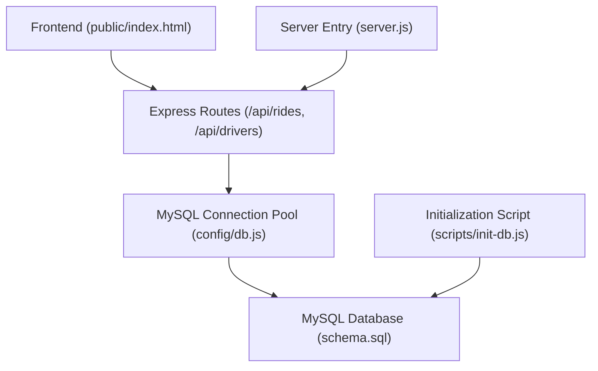
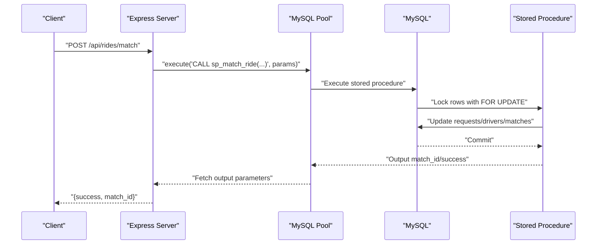
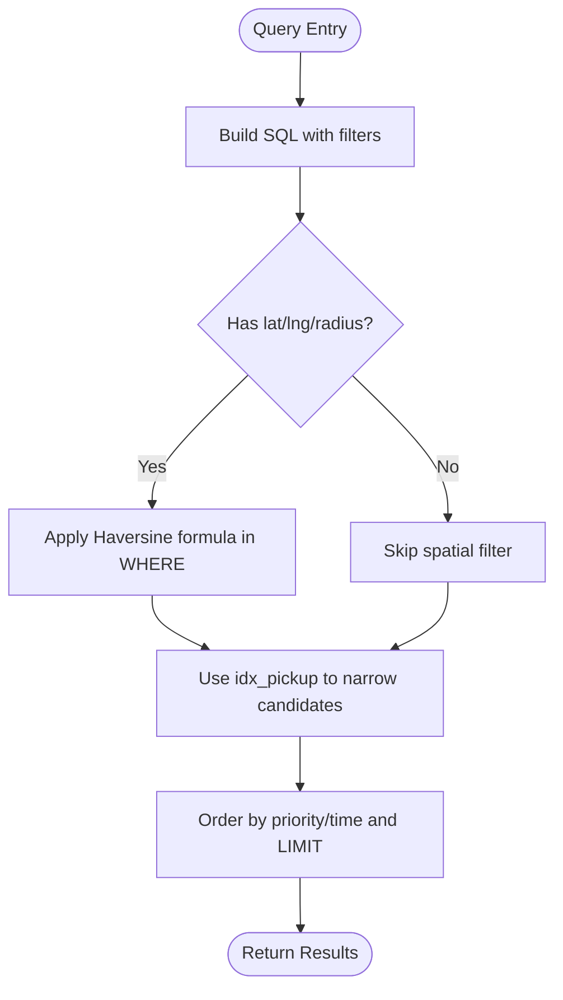
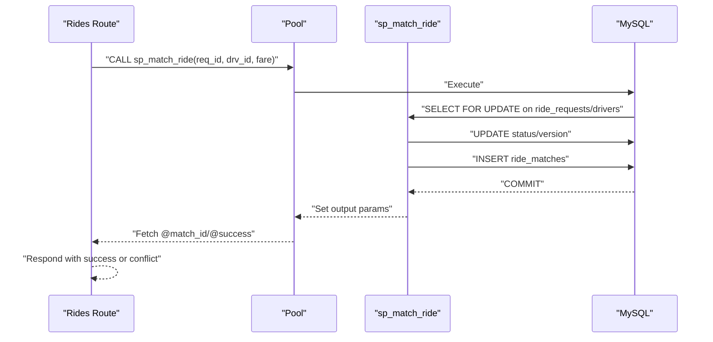
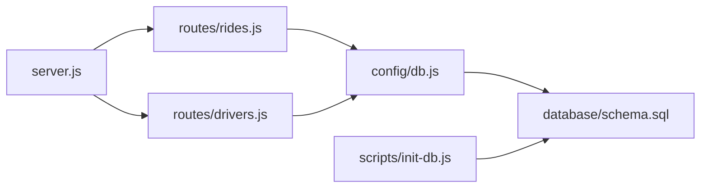

# Indexing Strategy and Performance

<cite>
**Referenced Files in This Document**
- [config/db.js](file://config/db.js)
- [database/schema.sql](file://database/schema.sql)
- [routes/rides.js](file://routes/rides.js)
- [routes/drivers.js](file://routes/drivers.js)
- [scripts/init-db.js](file://scripts/init-db.js)
- [server.js](file://server.js)
- [README.md](file://README.md)
</cite>

## Table of Contents
1. [Introduction](#introduction)
2. [Project Structure](#project-structure)
3. [Core Components](#core-components)
4. [Architecture Overview](#architecture-overview)
5. [Detailed Component Analysis](#detailed-component-analysis)
6. [Dependency Analysis](#dependency-analysis)
7. [Performance Considerations](#performance-considerations)
8. [Troubleshooting Guide](#troubleshooting-guide)
9. [Conclusion](#conclusion)
10. [Appendices](#appendices)

## Introduction
This document focuses on the database indexing strategy and performance optimization for a high-concurrency ride-sharing matching system. It explains the purpose and rationale of each index, how composite indexes improve query performance, and how connection pooling interacts with index usage patterns. It also covers spatial indexing concepts, the Haversine formula for location-based queries, and operational strategies for maintaining index health and monitoring peak-hour performance.

## Project Structure
The project is a Node.js/Express application backed by MySQL. The database schema defines tables for users, drivers, driver locations, ride requests, ride matches, peak-hour analytics, and a driver queue. Routes implement high-throughput endpoints for ride creation, matching, driver availability, and status updates. Connection pooling is configured centrally to handle bursty traffic during peak hours.

**Diagram sources**
- [server.js:1-84](file://server.js#L1-L84)
- [config/db.js:1-50](file://config/db.js#L1-L50)
- [database/schema.sql:1-297](file://database/schema.sql#L1-L297)
- [scripts/init-db.js:1-46](file://scripts/init-db.js#L1-L46)

**Section sources**
- [README.md:29-48](file://README.md#L29-L48)
- [server.js:1-84](file://server.js#L1-L84)
- [config/db.js:1-50](file://config/db.js#L1-L50)
- [database/schema.sql:1-297](file://database/schema.sql#L1-L297)
- [scripts/init-db.js:1-46](file://scripts/init-db.js#L1-L46)

## Core Components
- Connection Pool: Centralized MySQL pool configured for high concurrency with timeouts and keep-alive to prevent resource exhaustion.
- Schema and Indexes: Tables designed for frequent reads and writes, with strategic indexes to support:
  - Finding available drivers
  - Ordering pending rides by time
  - Near-you geospatial queries
  - Peak-hour queue management
  - Driver match tracking
  - Cleanup operations
- Spatial Queries: Haversine formula used in queries to filter nearby drivers and rides by radius.
- Stored Procedures: Atomic operations to prevent race conditions during matching and status updates.

**Section sources**
- [config/db.js:7-30](file://config/db.js#L7-L30)
- [database/schema.sql:28-98](file://database/schema.sql#L28-L98)
- [routes/drivers.js:38-77](file://routes/drivers.js#L38-L77)
- [routes/rides.js:43-86](file://routes/rides.js#L43-L86)
- [database/schema.sql:167-272](file://database/schema.sql#L167-L272)

## Architecture Overview
The backend uses a connection pool to serve concurrent requests efficiently. Queries leverage indexes to minimize scans and reduce lock contention. Spatial filtering uses the Haversine formula to compute distances in SQL. Atomic stored procedures enforce consistency under high concurrency.

**Diagram sources**
- [routes/rides.js:135-167](file://routes/rides.js#L135-L167)
- [database/schema.sql:167-234](file://database/schema.sql#L167-L234)
- [config/db.js:33-47](file://config/db.js#L33-L47)

## Detailed Component Analysis

### Index Purpose and Rationale
- idx_status on drivers: Supports fast retrieval of available drivers for matching and dashboards.
- idx_status_created on ride_requests: Enables efficient ordering of pending rides by creation time.
- idx_pickup on ride_requests: Accelerates geospatial queries by proximity to pickup coordinates.
- idx_priority on ride_requests: Orders pending rides by priority score for peak-hour queue management.
- idx_driver_status on ride_matches: Tracks a driver’s active matches and supports driver-centric queries.
- idx_updated on driver_locations: Facilitates cleanup of stale locations.

These indexes are strategically placed to align with:
- High-read endpoints (available drivers, active rides)
- Frequent updates (driver locations, statuses)
- Spatial filtering (nearby drivers and rides)
- Queue ordering (priority-based selection)
- Cleanup operations (stale location removal)

**Section sources**
- [database/schema.sql:46](file://database/schema.sql#L46)
- [database/schema.sql:94](file://database/schema.sql#L94)
- [database/schema.sql:96](file://database/schema.sql#L96)
- [database/schema.sql:97](file://database/schema.sql#L97)
- [database/schema.sql:123](file://database/schema.sql#L123)
- [database/schema.sql:68](file://database/schema.sql#L68)

### Composite Indexes and Query Performance Impact
- idx_status_created (status, created_at): Allows filtering by status and sorting by creation time in a single index seek, reducing I/O and CPU.
- idx_pickup (pickup_lat, pickup_lng): Supports range scans and equality filters for proximity queries, minimizing table scans.
- idx_driver_status (driver_id, status): Enables quick lookups of a driver’s active matches and reduces join overhead for driver-centric views.
- idx_updated (updated_at): Supports time-based cleanup without scanning entire tables.

Composite indexes reduce:
- Full table scans
- Sort operations
- Lock contention by narrowing result sets quickly

**Section sources**
- [database/schema.sql:94](file://database/schema.sql#L94)
- [database/schema.sql:96](file://database/schema.sql#L96)
- [database/schema.sql:123](file://database/schema.sql#L123)
- [database/schema.sql:68](file://database/schema.sql#L68)

### Connection Pooling Configuration and Interaction with Indexes
- Pool sizing: 50 connections to handle peak-hour bursts.
- Queue limit: 100 to buffer overload without dropping requests.
- Timeouts: Connect, acquire, and query timeouts to prevent stalled connections.
- Keep-alive: Prevents idle connection churn and maintains freshness.
- Streaming: Configured for row handling in large result sets.

How it interacts with indexes:
- High pool concurrency benefits from selective indexes that reduce query latency.
- Proper index coverage minimizes long-running queries, lowering queue wait times.
- Timeouts protect against queries that scan without index hits.

**Section sources**
- [config/db.js:7-30](file://config/db.js#L7-L30)
- [config/db.js:33-47](file://config/db.js#L33-L47)

### Spatial Indexing Concepts and Haversine Formula Implementation
- Spatial concept: Use geographic coordinates to filter nearby drivers and rides.
- Haversine formula: Implemented in SQL to compute great-circle distances between two points on Earth.
- Usage patterns:
  - Available drivers near a location: Filter by status and apply Haversine within a radius.
  - Pending rides near a location: Filter by status and apply Haversine within a radius.
- Index alignment: While a dedicated spatial index could further optimize, the existing composite pickup index and Haversine filtering provide practical performance for this workload.

**Diagram sources**
- [routes/drivers.js:38-77](file://routes/drivers.js#L38-L77)
- [routes/rides.js:43-86](file://routes/rides.js#L43-L86)
- [database/schema.sql:96](file://database/schema.sql#L96)

**Section sources**
- [routes/drivers.js:38-77](file://routes/drivers.js#L38-L77)
- [routes/rides.js:43-86](file://routes/rides.js#L43-L86)
- [database/schema.sql:96](file://database/schema.sql#L96)

### Atomic Operations and Index Alignment
- Stored procedure sp_match_ride uses row-level locks to prevent race conditions.
- Indexes on status and primary keys accelerate lock acquisition and updates.
- Optimistic locking (version columns) reduces contention by detecting conflicts early.

**Diagram sources**
- [routes/rides.js:135-167](file://routes/rides.js#L135-L167)
- [database/schema.sql:167-234](file://database/schema.sql#L167-L234)

**Section sources**
- [database/schema.sql:167-234](file://database/schema.sql#L167-L234)
- [routes/rides.js:135-167](file://routes/rides.js#L135-L167)

### Cleanup Operations and Maintenance
- Stored procedure sp_cleanup_stale_locations deletes outdated driver locations based on updated_at.
- Index idx_updated accelerates cleanup scans.
- Regular maintenance tasks:
  - Analyze table statistics periodically to keep query planner informed.
  - Rebuild or optimize tables if fragmentation becomes apparent.
  - Monitor slow queries and adjust indexes as usage patterns evolve.

**Section sources**
- [database/schema.sql:266-270](file://database/schema.sql#L266-L270)
- [database/schema.sql:68](file://database/schema.sql#L68)

## Dependency Analysis
- Routes depend on the connection pool for database operations.
- Queries rely on indexes to remain responsive under load.
- Stored procedures encapsulate atomicity and reduce application-level complexity.
- Initialization script ensures schema and indexes are present.

**Diagram sources**
- [routes/rides.js:1-272](file://routes/rides.js#L1-L272)
- [routes/drivers.js:1-182](file://routes/drivers.js#L1-L182)
- [config/db.js:1-50](file://config/db.js#L1-L50)
- [database/schema.sql:1-297](file://database/schema.sql#L1-L297)
- [scripts/init-db.js:1-46](file://scripts/init-db.js#L1-L46)
- [server.js:1-84](file://server.js#L1-L84)

**Section sources**
- [routes/rides.js:1-272](file://routes/rides.js#L1-L272)
- [routes/drivers.js:1-182](file://routes/drivers.js#L1-L182)
- [config/db.js:1-50](file://config/db.js#L1-L50)
- [database/schema.sql:1-297](file://database/schema.sql#L1-L297)
- [scripts/init-db.js:1-46](file://scripts/init-db.js#L1-L46)
- [server.js:1-84](file://server.js#L1-L84)

## Performance Considerations
- Benchmarking and Execution Plans
  - Use EXPLAIN to analyze query plans for:
    - Available drivers near a location
    - Pending rides near a location
    - Atomic match operations
  - Compare plans before and after adding/removing indexes to quantify improvements.
- High-Concurrency Techniques
  - Keep pool sizes aligned with CPU cores and workload patterns.
  - Use timeouts to avoid connection starvation.
  - Prefer composite indexes to reduce sort and filter costs.
  - Minimize row-level contention with stored procedures and optimistic locking.
- Spatial Efficiency
  - Consider geohash-based indexing for finer-grained spatial locality.
  - Limit result sets with radius and LIMIT to reduce network overhead.
- Monitoring
  - Track slow queries and index hit rates.
  - Observe peak-hour metrics and adjust pool size accordingly.
  - Use analytics tables to monitor queue lengths and wait times.

[No sources needed since this section provides general guidance]

## Troubleshooting Guide
- ECONNREFUSED: Verify MySQL is running and reachable; confirm host/port in environment variables.
- Access Denied: Confirm DB_USER and DB_PASSWORD in .env.
- Table Not Found: Run the initialization script to create tables and indexes.
- Slow Queries During Peak: Increase pool size cautiously; review EXPLAIN plans; add missing indexes if needed.
- Stale Locations: Ensure cleanup job runs regularly using the stored procedure.

**Section sources**
- [README.md:265-274](file://README.md#L265-L274)
- [scripts/init-db.js:6-46](file://scripts/init-db.js#L6-L46)
- [config/db.js:33-47](file://config/db.js#L33-L47)

## Conclusion
The indexing strategy and connection pooling configuration are designed to sustain high read and write throughput while maintaining responsiveness during peak hours. Composite indexes, spatial filtering with the Haversine formula, atomic stored procedures, and a tuned connection pool collectively address concurrency, correctness, and performance. Regular monitoring and maintenance ensure sustained performance as usage grows.

[No sources needed since this section summarizes without analyzing specific files]

## Appendices

### Appendix A: Index Reference Map
- drivers.idx_status: Available driver lookup
- ride_requests.idx_status_created: Pending rides ordered by time
- ride_requests.idx_pickup: Proximity filtering
- ride_requests.idx_priority: Peak-hour queue ordering
- ride_matches.idx_driver_status: Driver activity tracking
- driver_locations.idx_updated: Cleanup of stale locations

**Section sources**
- [database/schema.sql:46](file://database/schema.sql#L46)
- [database/schema.sql:94](file://database/schema.sql#L94)
- [database/schema.sql:96](file://database/schema.sql#L96)
- [database/schema.sql:97](file://database/schema.sql#L97)
- [database/schema.sql:123](file://database/schema.sql#L123)
- [database/schema.sql:68](file://database/schema.sql#L68)

### Appendix B: Initialization and Health Checks
- Initialization script executes schema statements to create tables and indexes.
- Health check endpoint validates database connectivity.

**Section sources**
- [scripts/init-db.js:6-46](file://scripts/init-db.js#L6-L46)
- [server.js:44-51](file://server.js#L44-L51)
- [config/db.js:33-47](file://config/db.js#L33-L47)