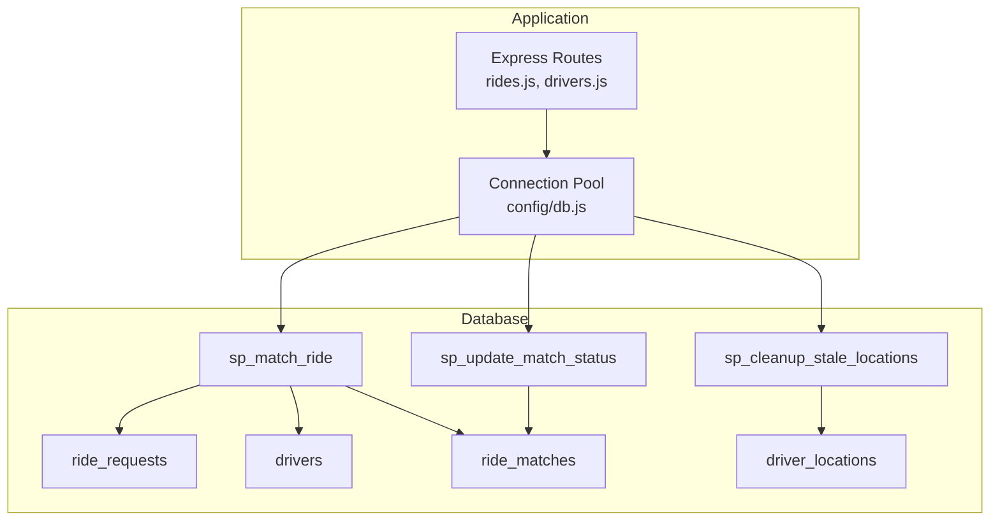
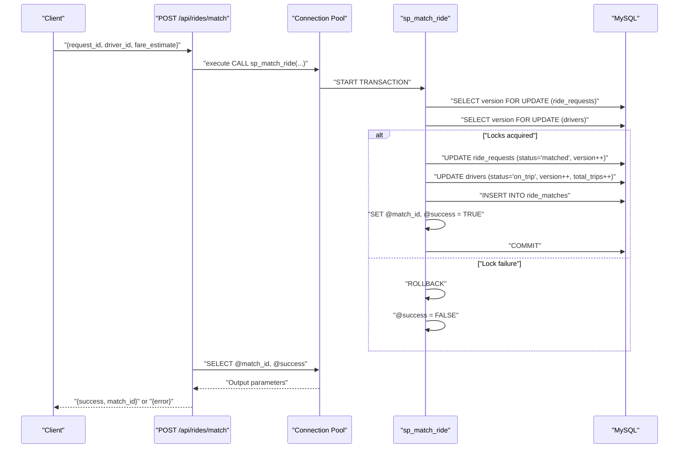
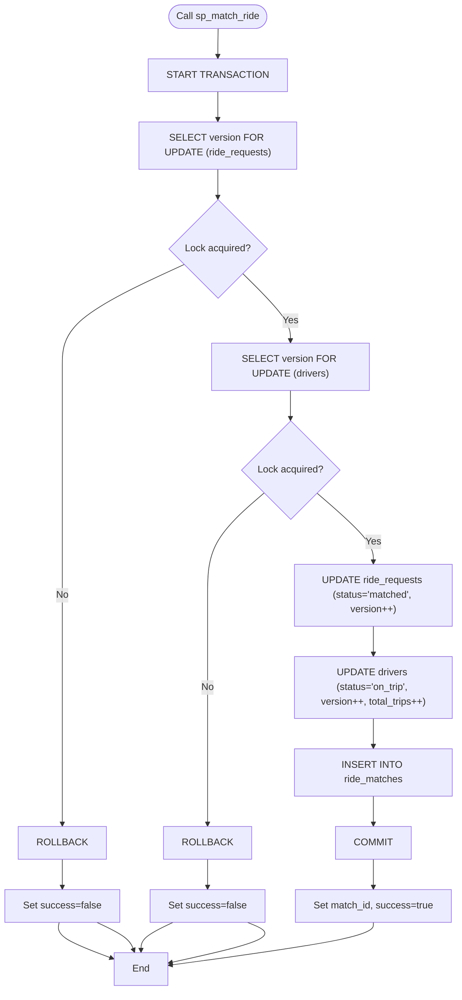
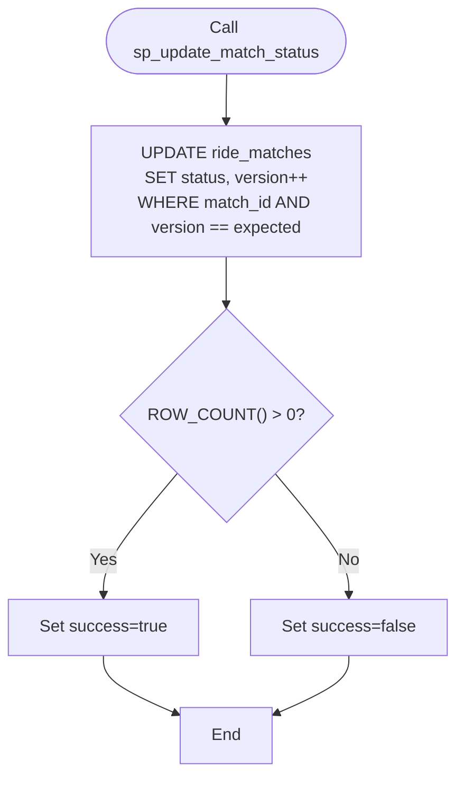
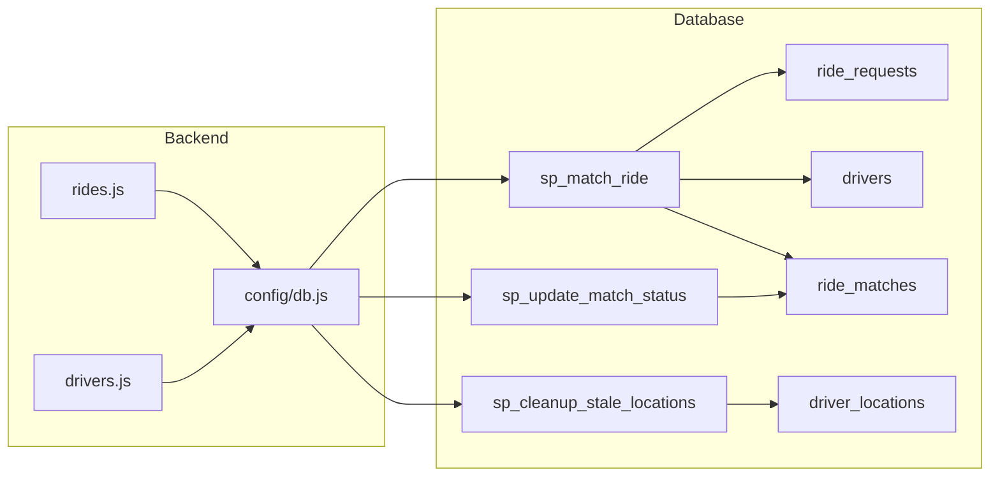

# Stored Procedures and Atomic Operations

<cite>
**Referenced Files in This Document**
- [schema.sql](file://database/schema.sql)
- [rides.js](file://routes/rides.js)
- [drivers.js](file://routes/drivers.js)
- [db.js](file://config/db.js)
- [README.md](file://README.md)
</cite>

## Table of Contents
1. [Introduction](#introduction)
2. [Project Structure](#project-structure)
3. [Core Components](#core-components)
4. [Architecture Overview](#architecture-overview)
5. [Detailed Component Analysis](#detailed-component-analysis)
6. [Dependency Analysis](#dependency-analysis)
7. [Performance Considerations](#performance-considerations)
8. [Troubleshooting Guide](#troubleshooting-guide)
9. [Conclusion](#conclusion)

## Introduction
This document explains the stored procedures that enforce atomic operations and prevent race conditions in the ride-sharing matching system. It focuses on:
- sp_match_ride: atomic ride-driver matching using pessimistic locking with FOR UPDATE statements, version checking, and transaction rollback handling
- sp_update_match_status: optimistic locking with version columns and conditional updates
- sp_cleanup_stale_locations: periodic maintenance to remove outdated driver location records

It documents parameter specifications, return value handling, error management, transaction isolation levels, deadlock prevention, coordination of multiple table updates, and usage examples from the ride matching workflow during peak hours.

## Project Structure
The stored procedures are defined in the database schema and invoked by the backend routes. The backend uses a connection pool optimized for high read and frequent update loads.

**Diagram sources**
- [schema.sql:167-270](file://database/schema.sql#L167-L270)
- [rides.js:135-167](file://routes/rides.js#L135-L167)
- [drivers.js:101-126](file://routes/drivers.js#L101-L126)
- [db.js:7-30](file://config/db.js#L7-L30)

**Section sources**
- [schema.sql:167-270](file://database/schema.sql#L167-L270)
- [rides.js:135-167](file://routes/rides.js#L135-L167)
- [drivers.js:101-126](file://routes/drivers.js#L101-L126)
- [db.js:7-30](file://config/db.js#L7-L30)

## Core Components
- sp_match_ride: Performs atomic matching of a ride request to a driver using pessimistic locking and version increments. It updates the request, driver, and match records within a single transaction and returns match_id and success status.
- sp_update_match_status: Updates the status of a match with optimistic locking by checking the expected version before applying changes.
- sp_cleanup_stale_locations: Periodic cleanup of driver location rows older than a specified threshold.

Key characteristics:
- Transaction boundaries and rollback on exceptions
- Isolation level defaults (REPEATABLE READ) with explicit row-level locks
- Deadlock prevention via consistent lock ordering and short transactions
- Version columns for optimistic locking on drivers, ride_requests, and ride_matches

**Section sources**
- [schema.sql:167-270](file://database/schema.sql#L167-L270)
- [rides.js:135-167](file://routes/rides.js#L135-L167)
- [README.md:142-171](file://README.md#L142-L171)

## Architecture Overview
The ride matching workflow integrates stored procedures with route handlers to ensure atomicity and consistency under high concurrency.

**Diagram sources**
- [rides.js:135-167](file://routes/rides.js#L135-L167)
- [schema.sql:167-234](file://database/schema.sql#L167-L234)

## Detailed Component Analysis

### sp_match_ride: Atomic Pessimistic Locking Ride-Driver Matching
Purpose:
- Prevent double-booking by locking the ride request and driver rows before any updates
- Atomically update request, driver, and match records within a single transaction
- Return match_id and success flag to the caller

Parameters:
- IN p_request_id: identifies the ride request to match
- IN p_driver_id: identifies the driver candidate
- IN p_fare_estimate: estimated fare to set on the request
- OUT p_match_id: auto-generated identifier of the newly created match
- OUT p_success: boolean indicating whether the match succeeded

Processing logic:
- Starts a transaction
- Acquires exclusive locks on the ride request row (FOR UPDATE) and driver row (FOR UPDATE)
- Validates preconditions (request status pending, driver status available)
- Updates the request to matched and increments its version
- Updates the driver to on_trip, increments its version, and increments total_trips
- Inserts a new match record
- Commits the transaction and sets success flag
- On any exception, rolls back and rethrows

Error handling:
- Uses an EXIT HANDLER to catch SQL exceptions, roll back, set success=false, and rethrow

Deadlock prevention:
- Consistent lock order: request row then driver row
- Short transaction duration reduces lock contention
- FOR UPDATE ensures only one session can modify the rows until commit

Concurrency behavior during peak hours:
- Ensures mutual exclusion for the specific request and driver pair
- Other sessions attempting to match the same request or driver wait for locks
- Maintains data consistency under high insert/update rates

**Diagram sources**
- [schema.sql:167-234](file://database/schema.sql#L167-L234)

**Section sources**
- [schema.sql:167-234](file://database/schema.sql#L167-L234)
- [rides.js:135-167](file://routes/rides.js#L135-L167)
- [README.md:148-154](file://README.md#L148-L154)

### sp_update_match_status: Optimistic Locking Conditional Update
Purpose:
- Update the status of a match while detecting concurrent modifications via version comparison
- Increment the version column atomically with the status change

Parameters:
- IN p_match_id: identifies the match to update
- IN p_new_status: target status value
- IN p_expected_version: caller’s expected version for optimistic lock verification
- OUT p_success: boolean indicating whether the update was applied

Processing logic:
- Updates the match status and increments version
- Applies a condition to only update if the current version equals the expected version
- Sets success based on whether any rows were affected

Error handling:
- Uses an EXIT HANDLER to capture SQL exceptions, set success=false, and rethrow

Concurrency behavior:
- If another session modified the row concurrently, the version mismatch prevents the update
- Caller retries with the latest version to apply changes safely

**Diagram sources**
- [schema.sql:237-263](file://database/schema.sql#L237-L263)

**Section sources**
- [schema.sql:237-263](file://database/schema.sql#L237-L263)
- [README.md:156-158](file://README.md#L156-L158)

### sp_cleanup_stale_locations: Periodic Maintenance
Purpose:
- Remove driver location rows that have not been updated for more than a specified number of minutes

Parameters:
- IN p_minutes: time threshold for stale records

Processing logic:
- Deletes driver_locations rows older than the given threshold

Operational notes:
- Should be scheduled as a cron job or background task
- Helps maintain table size and improves query performance on driver_locations

**Section sources**
- [schema.sql:265-270](file://database/schema.sql#L265-L270)

## Dependency Analysis
The stored procedures depend on specific tables and are invoked by route handlers. The backend uses a connection pool to manage database connections efficiently.

**Diagram sources**
- [rides.js:135-167](file://routes/rides.js#L135-L167)
- [drivers.js:101-126](file://routes/drivers.js#L101-L126)
- [db.js:7-30](file://config/db.js#L7-L30)
- [schema.sql:167-270](file://database/schema.sql#L167-L270)

**Section sources**
- [rides.js:135-167](file://routes/rides.js#L135-L167)
- [drivers.js:101-126](file://routes/drivers.js#L101-L126)
- [db.js:7-30](file://config/db.js#L7-L30)
- [schema.sql:167-270](file://database/schema.sql#L167-L270)

## Performance Considerations
- Connection pool sizing: The pool is configured for up to 50 connections with a queue limit of 100 to handle bursty traffic during peak hours.
- Transaction scope: Stored procedures minimize lock duration by performing only necessary operations within a single transaction.
- Indexes: Strategic indexes on status and location fields support fast lookups and reduce contention.
- Upsert pattern: The driver location update uses an atomic upsert to avoid race conditions and reduce round trips.

[No sources needed since this section provides general guidance]

## Troubleshooting Guide
Common issues and resolutions:
- ECONNREFUSED: Verify MySQL service is running and reachable with the configured host/port.
- Access denied: Confirm DB_USER and DB_PASSWORD in the environment configuration.
- Table doesn't exist: Initialize the database by running the schema file.
- Port 3000 in use: Change the PORT environment variable to an available port.
- Slow queries during peak: Monitor peak-hour statistics and adjust pool size if needed.

**Section sources**
- [README.md:265-273](file://README.md#L265-L273)

## Conclusion
The stored procedures provide robust atomicity guarantees essential for a high-concurrency ride-sharing platform:
- sp_match_ride uses pessimistic locking to prevent double-booking and coordinate updates across multiple tables
- sp_update_match_status employs optimistic locking to safely detect and handle concurrent modifications
- sp_cleanup_stale_locations maintains database hygiene and performance

Together with strategic indexing, connection pooling, and consistent lock ordering, these procedures ensure correctness and reliability during peak-hour usage.