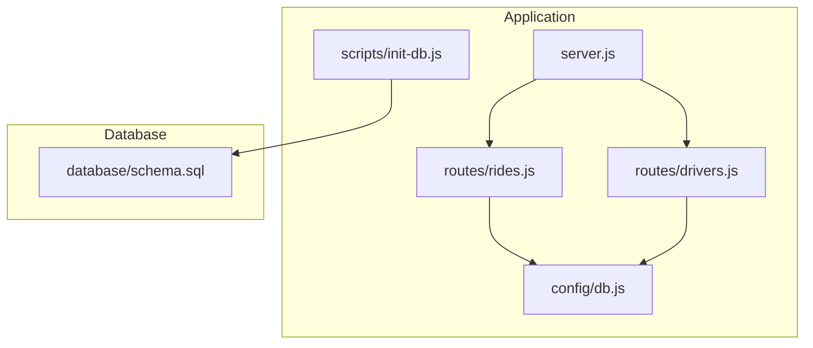
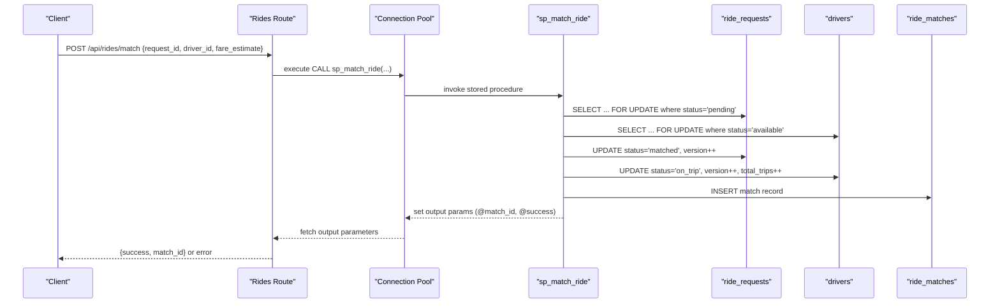
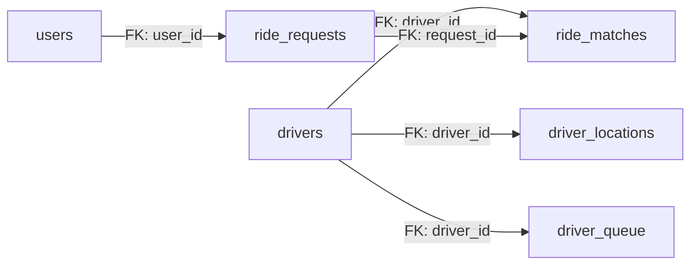

# Table Structure and Relationships

<cite>
**Referenced Files in This Document**
- [schema.sql](file://database/schema.sql)
- [db.js](file://config/db.js)
- [rides.js](file://routes/rides.js)
- [drivers.js](file://routes/drivers.js)
- [init-db.js](file://scripts/init-db.js)
- [server.js](file://server.js)
- [README.md](file://README.md)
</cite>

## Table of Contents
1. [Introduction](#introduction)
2. [Project Structure](#project-structure)
3. [Core Components](#core-components)
4. [Architecture Overview](#architecture-overview)
5. [Detailed Component Analysis](#detailed-component-analysis)
6. [Dependency Analysis](#dependency-analysis)
7. [Performance Considerations](#performance-considerations)
8. [Troubleshooting Guide](#troubleshooting-guide)
9. [Conclusion](#conclusion)

## Introduction
This document provides comprehensive data model documentation for the ride-sharing matching database. It details each table’s purpose, field definitions, data types, constraints, and foreign key relationships. It explains how primary keys and indexes support high-read and frequent-update requirements, documents business logic embedded in the schema (ENUM constraints, unique constraints, temporal fields), and outlines how stored procedures enable atomic operations for the matching algorithm. It also covers operational aspects such as connection pooling and initialization scripts.

## Project Structure
The database schema and application code are organized as follows:
- Database schema and stored procedures are defined in a single SQL script.
- Node.js backend uses a MySQL connection pool and exposes REST endpoints for rides and drivers.
- Initialization scripts create the schema and seed sample data.
- The README describes the system’s concurrency optimizations and API endpoints.



**Diagram sources**
- [server.js:1-84](file://server.js#L1-L84)
- [rides.js:1-272](file://routes/rides.js#L1-L272)
- [drivers.js:1-182](file://routes/drivers.js#L1-L182)
- [db.js:1-50](file://config/db.js#L1-L50)
- [init-db.js:1-46](file://scripts/init-db.js#L1-L46)
- [schema.sql:1-297](file://database/schema.sql#L1-L297)

**Section sources**
- [README.md:29-48](file://README.md#L29-L48)
- [server.js:1-84](file://server.js#L1-L84)
- [rides.js:1-272](file://routes/rides.js#L1-L272)
- [drivers.js:1-182](file://routes/drivers.js#L1-L182)
- [db.js:1-50](file://config/db.js#L1-L50)
- [init-db.js:1-46](file://scripts/init-db.js#L1-L46)
- [schema.sql:1-297](file://database/schema.sql#L1-L297)

## Core Components
This section summarizes each table’s role and key attributes derived from the schema.

- Users
  - Purpose: Stores rider identities.
  - Primary key: user_id (auto-increment).
  - Notable constraints: unique email.
  - Audit fields: created_at, updated_at.
  - Supporting indexes: idx_email, idx_created_at.

- Drivers
  - Purpose: Stores driver profiles and availability.
  - Primary key: driver_id (auto-increment).
  - Notable constraints: unique email, unique vehicle_plate.
  - Business logic: ENUM status with offline, available, busy, on_trip.
  - Concurrency safety: version column for optimistic locking.
  - Audit fields: created_at, updated_at.
  - Supporting indexes: idx_status, idx_rating, idx_updated_at.

- Driver Locations
  - Purpose: Tracks live GPS coordinates for drivers.
  - Primary key: location_id (auto-increment).
  - Foreign key: driver_id -> drivers(driver_id) with cascade delete.
  - Uniqueness: uk_driver ensures one location row per driver.
  - Supporting indexes: idx_location (lat/lng), idx_updated (cleanup).
  - Audit fields: updated_at.

- Ride Requests
  - Purpose: Captures ride booking details and lifecycle.
  - Primary key: request_id (auto-increment).
  - Foreign key: user_id -> users(user_id) with cascade delete.
  - Business logic: ENUM status with pending, matched, picked_up, completed, cancelled.
  - Concurrency safety: version column for optimistic locking.
  - Priority: priority_score influences peak-hour queue ordering.
  - Audit fields: created_at, updated_at.
  - Supporting indexes: idx_status_created, idx_user_status, idx_pickup, idx_priority.

- Ride Matches
  - Purpose: Core matching table linking requests to drivers.
  - Primary key: match_id (auto-increment).
  - Foreign keys: request_id -> ride_requests(request_id), driver_id -> drivers(driver_id), both cascade delete.
  - Business logic: ENUM status with assigned, picked_up, in_progress, completed, cancelled.
  - Uniqueness: uk_request enforces one match per request.
  - Concurrency safety: version column for optimistic locking.
  - Audit fields: created_at, updated_at.
  - Supporting indexes: idx_driver_status, idx_status, idx_created.

- Peak Hour Stats
  - Purpose: Aggregated analytics for monitoring load.
  - Primary key: stat_id (auto-increment).
  - Uniqueness: uk_hour blocks hourly aggregation collisions.
  - Fields: hour_block, counts, averages, and counters.

- Driver Queue
  - Purpose: Fair FIFO queue for matching during peak hours.
  - Primary key: queue_id (auto-increment).
  - Foreign key: driver_id -> drivers(driver_id) with cascade delete.
  - Uniqueness: uk_driver_zone ensures one queue entry per driver-zone combination.
  - Supporting index: idx_zone_time for FIFO ordering.

**Section sources**
- [schema.sql:16-26](file://database/schema.sql#L16-L26)
- [schema.sql:32-49](file://database/schema.sql#L32-L49)
- [schema.sql:55-69](file://database/schema.sql#L55-L69)
- [schema.sql:75-98](file://database/schema.sql#L75-L98)
- [schema.sql:104-126](file://database/schema.sql#L104-L126)
- [schema.sql:132-141](file://database/schema.sql#L132-L141)
- [schema.sql:147-158](file://database/schema.sql#L147-L158)

## Architecture Overview
The system is designed for high read volume, frequent updates, and peak-hour concurrency. The backend uses a MySQL connection pool and stored procedures to enforce atomicity for critical operations like ride-to-driver matching. The schema embeds business rules directly (ENUMs, unique constraints) and supports efficient lookups via strategic indexes.

```mermaid
erDiagram
USERS {
int user_id PK
varchar email UK
varchar name
varchar phone
timestamp created_at
timestamp updated_at
}
DRIVERS {
int driver_id PK
varchar email UK
varchar name
varchar phone
varchar vehicle_model
varchar vehicle_plate UK
enum status
decimal rating
int total_trips
int version
timestamp created_at
timestamp updated_at
}
DRIVER_LOCATIONS {
int location_id PK
int driver_id FK
decimal latitude
decimal longitude
decimal accuracy
timestamp updated_at
}
RIDE_REQUESTS {
int request_id PK
int user_id FK
decimal pickup_lat
decimal pickup_lng
decimal dropoff_lat
decimal dropoff_lng
varchar pickup_address
varchar dropoff_address
enum status
decimal fare_estimate
decimal priority_score
int version
timestamp created_at
timestamp updated_at
}
RIDE_MATCHES {
int match_id PK
int request_id FK UK
int driver_id FK
enum status
decimal fare_final
decimal distance_km
timestamp started_at
timestamp completed_at
int version
timestamp created_at
timestamp updated_at
}
PEAK_HOUR_STATS {
int stat_id PK
datetime hour_block UK
int requests_count
int matches_count
int avg_wait_sec
int cancelled_count
}
DRIVER_QUEUE {
int queue_id PK
int driver_id FK
varchar zone_id
timestamp queued_at
}
USERS ||--o{ RIDE_REQUESTS : "creates"
DRIVERS ||--o{ DRIVER_LOCATIONS : "has"
DRIVERS ||--o{ RIDE_MATCHES : "drives"
RIDE_REQUESTS ||--|| RIDE_MATCHES : "matches"
DRIVERS ||--o{ DRIVER_QUEUE : "queued"
```

**Diagram sources**
- [schema.sql:16-26](file://database/schema.sql#L16-L26)
- [schema.sql:32-49](file://database/schema.sql#L32-L49)
- [schema.sql:55-69](file://database/schema.sql#L55-L69)
- [schema.sql:75-98](file://database/schema.sql#L75-L98)
- [schema.sql:104-126](file://database/schema.sql#L104-L126)
- [schema.sql:132-141](file://database/schema.sql#L132-L141)
- [schema.sql:147-158](file://database/schema.sql#L147-L158)

## Detailed Component Analysis

### Users
- Purpose: Store rider identity and contact info.
- Constraints: unique email.
- Audit: created_at, updated_at.
- Indexes: idx_email, idx_created_at.

**Section sources**
- [schema.sql:16-26](file://database/schema.sql#L16-L26)

### Drivers
- Purpose: Store driver profile, availability, and metrics.
- Constraints: unique email, unique vehicle_plate.
- Business logic: ENUM status; optimistic locking via version.
- Audit: created_at, updated_at.
- Indexes: idx_status (fast availability queries), idx_rating, idx_updated_at.

**Section sources**
- [schema.sql:32-49](file://database/schema.sql#L32-L49)

### Driver Locations
- Purpose: Track live GPS coordinates for drivers.
- FK: driver_id -> drivers(driver_id) with cascade delete.
- Uniqueness: uk_driver ensures one row per driver.
- Indexes: idx_location (lat/lng), idx_updated (cleanup).
- Audit: updated_at.

**Section sources**
- [schema.sql:55-69](file://database/schema.sql#L55-L69)

### Ride Requests
- Purpose: Capture ride booking details and lifecycle.
- FK: user_id -> users(user_id) with cascade delete.
- Business logic: ENUM status; optimistic locking via version; priority_score for peak-hour queue.
- Audit: created_at, updated_at.
- Indexes: idx_status_created, idx_user_status, idx_pickup, idx_priority.

**Section sources**
- [schema.sql:75-98](file://database/schema.sql#L75-L98)

### Ride Matches
- Purpose: Core matching table linking requests to drivers.
- FKs: request_id -> ride_requests(request_id), driver_id -> drivers(driver_id), both cascade delete.
- Uniqueness: uk_request enforces one match per request.
- Business logic: ENUM status; optimistic locking via version.
- Audit: created_at, updated_at.
- Indexes: idx_driver_status, idx_status, idx_created.

**Section sources**
- [schema.sql:104-126](file://database/schema.sql#L104-L126)

### Peak Hour Stats
- Purpose: Aggregated analytics for monitoring load.
- Uniqueness: uk_hour blocks collisions on hourly buckets.
- Fields: counts, averages, and counters.

**Section sources**
- [schema.sql:132-141](file://database/schema.sql#L132-L141)

### Driver Queue
- Purpose: Fair FIFO queue for matching during peak hours.
- FK: driver_id -> drivers(driver_id) with cascade delete.
- Uniqueness: uk_driver_zone ensures one queue entry per driver-zone combination.
- Index: idx_zone_time for FIFO ordering.

**Section sources**
- [schema.sql:147-158](file://database/schema.sql#L147-L158)

### Stored Procedures and Atomic Operations
The schema defines stored procedures to ensure atomicity and prevent race conditions during high-concurrency scenarios.

- sp_match_ride
  - Purpose: Atomically match a ride to a driver.
  - Mechanism: Uses SELECT ... FOR UPDATE to lock the request and driver rows, then updates statuses and inserts a match record.
  - Output: match_id and success flag via output parameters.
  - Cascading effects: updates request and driver statuses; creates a match record.

- sp_update_match_status
  - Purpose: Safely update match status with optimistic locking.
  - Mechanism: Updates status and increments version only if the expected version matches.

- sp_cleanup_stale_locations
  - Purpose: Periodic cleanup of stale driver location records.



**Diagram sources**
- [rides.js:137-167](file://routes/rides.js#L137-L167)
- [schema.sql:167-234](file://database/schema.sql#L167-L234)

**Section sources**
- [rides.js:137-167](file://routes/rides.js#L137-L167)
- [schema.sql:167-234](file://database/schema.sql#L167-L234)

### Business Logic Embedded in Table Designs
- ENUM constraints for status fields:
  - Drivers: offline, available, busy, on_trip.
  - Ride Requests: pending, matched, picked_up, completed, cancelled.
  - Ride Matches: assigned, picked_up, in_progress, completed, cancelled.
- Unique constraints for critical business rules:
  - Users: unique email.
  - Drivers: unique email, unique vehicle_plate.
  - Driver Locations: unique driver_id.
  - Ride Matches: unique request_id.
  - Peak Hour Stats: unique hour_block.
- Temporal fields for audit trails:
  - created_at and updated_at on most tables.
  - started_at and completed_at on matches for lifecycle tracking.
- Optimistic locking:
  - version columns on drivers and ride_requests to detect concurrent updates.

**Section sources**
- [schema.sql:39](file://database/schema.sql#L39)
- [schema.sql:84](file://database/schema.sql#L84)
- [schema.sql:108](file://database/schema.sql#L108)
- [schema.sql:19](file://database/schema.sql#L19)
- [schema.sql:38](file://database/schema.sql#L38)
- [schema.sql:66](file://database/schema.sql#L66)
- [schema.sql:122](file://database/schema.sql#L122)
- [schema.sql:140](file://database/schema.sql#L140)
- [schema.sql:42](file://database/schema.sql#L42)
- [schema.sql:87](file://database/schema.sql#L87)
- [schema.sql:113](file://database/schema.sql#L113)

### Operational Details and Integration Points
- Connection pooling:
  - Pool size 50 with queue limit 100; timeouts configured; keep-alive enabled.
- Initialization:
  - scripts/init-db.js executes schema.sql statements to create tables and procedures.
- Backend usage:
  - Routes call stored procedures and perform transactions for atomic updates.
  - Upsert pattern for driver_locations reduces race conditions.

**Section sources**
- [db.js:7-30](file://config/db.js#L7-L30)
- [init-db.js:14-42](file://scripts/init-db.js#L14-L42)
- [drivers.js:108-119](file://routes/drivers.js#L108-L119)
- [rides.js:103-133](file://routes/rides.js#L103-L133)
- [rides.js:176-224](file://routes/rides.js#L176-L224)

## Dependency Analysis
Foreign key relationships and cascading actions are defined in the schema. The following diagram maps dependencies among tables and highlights cascading deletes.



**Diagram sources**
- [schema.sql:63](file://database/schema.sql#L63)
- [schema.sql:91](file://database/schema.sql#L91)
- [schema.sql:117-120](file://database/schema.sql#L117-L120)
- [schema.sql:153](file://database/schema.sql#L153)

**Section sources**
- [schema.sql:63](file://database/schema.sql#L63)
- [schema.sql:91](file://database/schema.sql#L91)
- [schema.sql:117-120](file://database/schema.sql#L117-L120)
- [schema.sql:153](file://database/schema.sql#L153)

## Performance Considerations
- High-read and frequent-update design:
  - Strategic indexes on status, timestamps, and location pairs optimize common queries.
  - ENUMs reduce storage and improve query performance for status filtering.
- Concurrency controls:
  - SELECT ... FOR UPDATE in sp_match_ride prevents double-booking.
  - Optimistic locking via version columns detects conflicts without global locks.
- Upsert pattern:
  - INSERT ... ON DUPLICATE KEY UPDATE for driver_locations eliminates race conditions and reduces round-trips.
- Connection pooling:
  - Pool size 50 with queue limits and timeouts helps handle peak-hour bursts.
- Partitioning considerations:
  - No explicit table partitioning is present in the schema. Given the high-frequency updates and peak-hour load, consider:
    - Partitioning ride_requests by created_at to isolate recent data and simplify cleanup.
    - Partitioning ride_matches by created_at for time-bound analytics and maintenance.
    - Partitioning peak_hour_stats by hour_block to support rolling-window analytics.
    - Using local secondary indexes or covering indexes for frequently executed dashboard queries.

[No sources needed since this section provides general guidance]

## Troubleshooting Guide
- Connection failures:
  - Verify DB_HOST, DB_PORT, DB_USER, DB_PASSWORD, and DB_NAME in the environment configuration.
  - Use the health endpoint to confirm connectivity.
- Schema initialization:
  - Ensure database/schema.sql has been executed to create tables and stored procedures.
- Slow queries during peak:
  - Monitor dashboard stats and consider increasing pool size or adding partitioning.
- Double-booking attempts:
  - The atomic stored procedure prevents concurrent matches; ensure the API endpoint is used consistently.

**Section sources**
- [README.md:68-106](file://README.md#L68-L106)
- [README.md:142-176](file://README.md#L142-L176)
- [server.js:44-51](file://server.js#L44-L51)
- [init-db.js:14-42](file://scripts/init-db.js#L14-L42)

## Conclusion
The ride-sharing database schema is designed to support high-read, frequent-update, and peak-hour concurrency. Primary keys and indexes are strategically placed to optimize common queries, while ENUM constraints and unique constraints encode business rules directly into the schema. Stored procedures enforce atomic operations for critical workflows, and connection pooling enables scalable throughput. For future growth, consider partitioning strategies aligned with time-series data patterns to further enhance performance and maintainability.