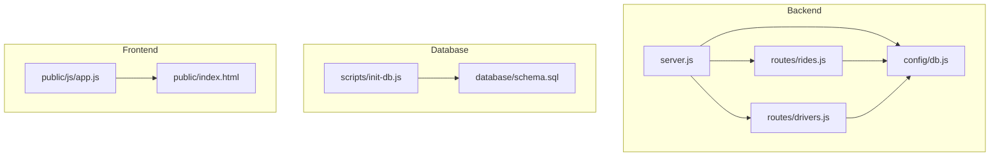
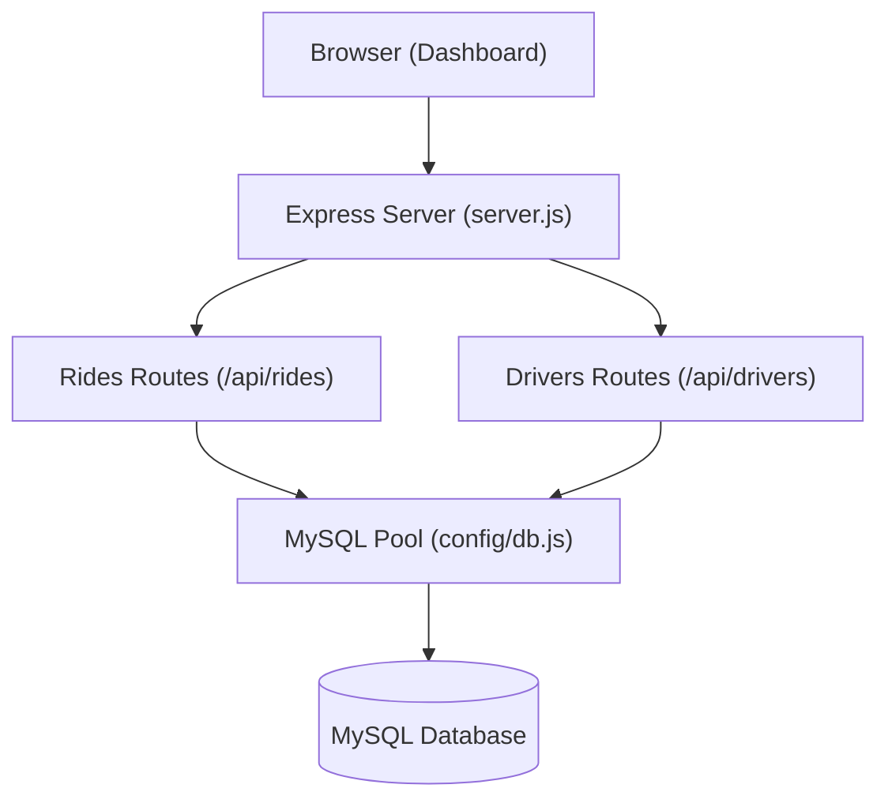
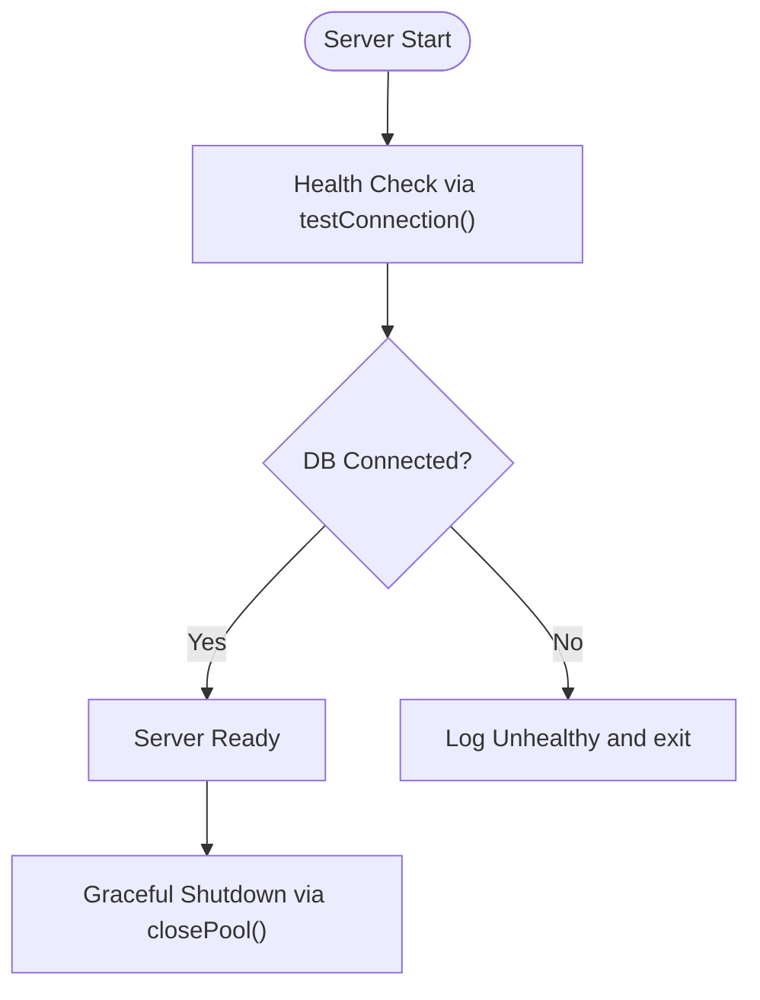
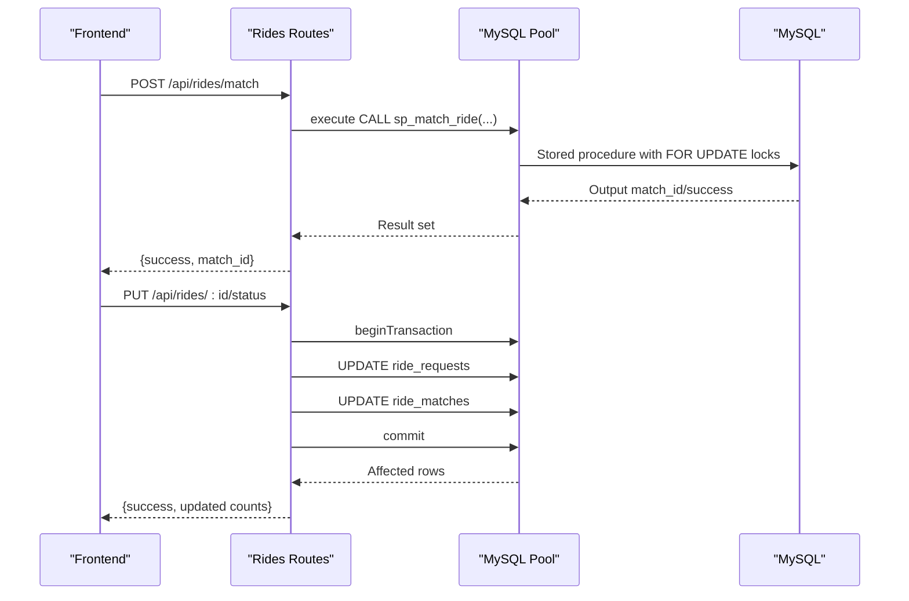
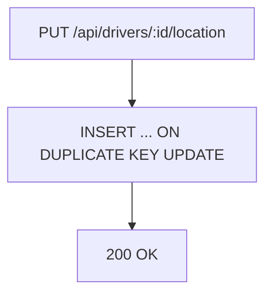
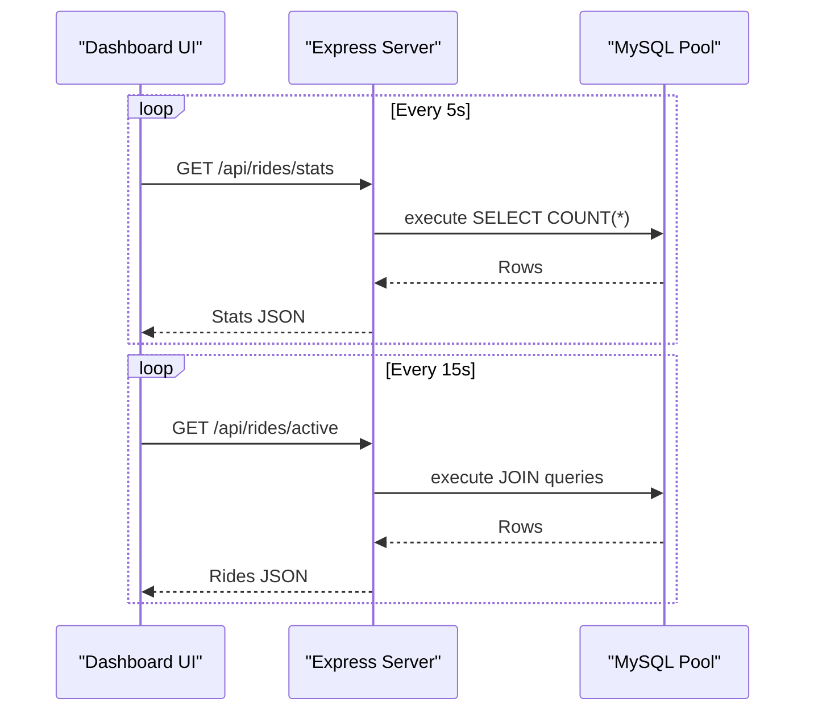
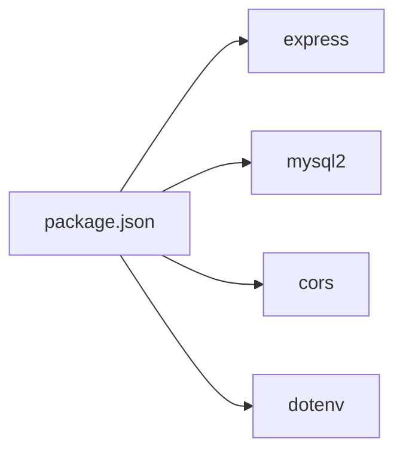
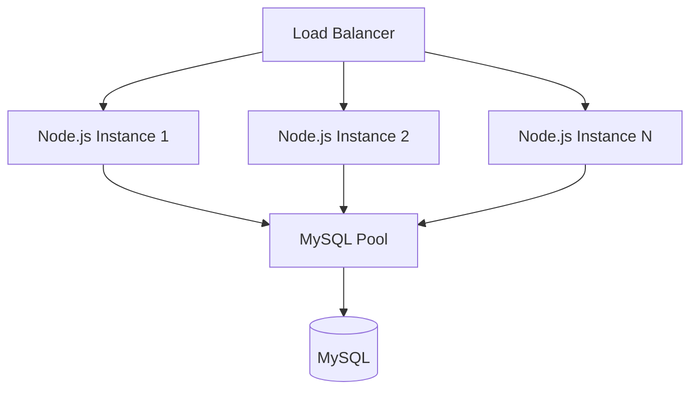

# Deployment and Production

<cite>
**Referenced Files in This Document**
- [README.md](file://README.md)
- [package.json](file://package.json)
- [server.js](file://server.js)
- [config/db.js](file://config/db.js)
- [routes/rides.js](file://routes/rides.js)
- [routes/drivers.js](file://routes/drivers.js)
- [scripts/init-db.js](file://scripts/init-db.js)
- [database/schema.sql](file://database/schema.sql)
- [public/index.html](file://public/index.html)
- [public/js/app.js](file://public/js/app.js)
</cite>

## Table of Contents
1. [Introduction](#introduction)
2. [Project Structure](#project-structure)
3. [Core Components](#core-components)
4. [Architecture Overview](#architecture-overview)
5. [Detailed Component Analysis](#detailed-component-analysis)
6. [Dependency Analysis](#dependency-analysis)
7. [Performance Considerations](#performance-considerations)
8. [Security Hardening](#security-hardening)
9. [Scaling and Load Balancing](#scaling-and-load-balancing)
10. [Monitoring and Maintenance](#monitoring-and-maintenance)
11. [Deployment Automation and Containerization](#deployment-automation-and-containerization)
12. [Backup and Disaster Recovery](#backup-and-disaster-recovery)
13. [Operational Runbooks](#operational-runbooks)
14. [Troubleshooting Guide](#troubleshooting-guide)
15. [Conclusion](#conclusion)

## Introduction
This document provides comprehensive deployment and production guidance for the ride-sharing DBMS. It covers environment setup, runtime requirements, security hardening, scaling strategies, monitoring, maintenance, automation, containerization, cloud deployment, backup, and operational runbooks. The system is designed for high read throughput, frequent updates, and peak-hour concurrency, with explicit optimizations for MySQL and Node.js.

## Project Structure
The repository follows a clear separation of concerns:
- Backend: Express server, route handlers, and database configuration
- Database: Schema, stored procedures, and sample data
- Frontend: Static assets and a single-page dashboard
- Scripts: Initialization utilities

**Diagram sources**
- [server.js:1-84](file://server.js#L1-L84)
- [routes/rides.js:1-272](file://routes/rides.js#L1-L272)
- [routes/drivers.js:1-182](file://routes/drivers.js#L1-L182)
- [config/db.js:1-50](file://config/db.js#L1-L50)
- [scripts/init-db.js:1-46](file://scripts/init-db.js#L1-L46)
- [database/schema.sql:1-297](file://database/schema.sql#L1-L297)
- [public/index.html:1-239](file://public/index.html#L1-L239)
- [public/js/app.js:1-373](file://public/js/app.js#L1-L373)

**Section sources**
- [README.md:29-48](file://README.md#L29-L48)
- [package.json:1-24](file://package.json#L1-L24)

## Core Components
- Express server with middleware, static serving, and health checks
- Route handlers for rides and drivers with transactional and atomic operations
- MySQL connection pool with timeouts and keep-alive
- Frontend dashboard with auto-refresh and manual refresh controls
- Database schema with strategic indexes and stored procedures for concurrency safety

Key production-relevant elements:
- Connection pool sizing and timeouts
- Health endpoint leveraging database connectivity checks
- Transactional endpoints for ride lifecycle and driver status
- Atomic stored procedures for matching and optimistic locking support

**Section sources**
- [server.js:10-84](file://server.js#L10-L84)
- [config/db.js:7-50](file://config/db.js#L7-L50)
- [routes/rides.js:10-272](file://routes/rides.js#L10-L272)
- [routes/drivers.js:10-182](file://routes/drivers.js#L10-L182)
- [database/schema.sql:12-158](file://database/schema.sql#L12-L158)

## Architecture Overview
The system is a single-page application served by an Express backend. The backend connects to MySQL via a connection pool and exposes RESTful endpoints. The frontend polls stats and lists at intervals, while critical operations (matching, status updates) are initiated by user actions.

**Diagram sources**
- [server.js:10-84](file://server.js#L10-L84)
- [routes/rides.js:1-272](file://routes/rides.js#L1-L272)
- [routes/drivers.js:1-182](file://routes/drivers.js#L1-L182)
- [config/db.js:1-50](file://config/db.js#L1-L50)

## Detailed Component Analysis

### Database Connectivity and Pooling
- Pool configuration includes connection limits, queue limits, and timeouts to manage peak-hour bursts
- Health check executes a simple query to validate connectivity
- Graceful shutdown closes the pool

**Diagram sources**
- [server.js:43-51](file://server.js#L43-L51)
- [config/db.js:32-47](file://config/db.js#L32-L47)

**Section sources**
- [config/db.js:7-30](file://config/db.js#L7-L30)
- [config/db.js:32-47](file://config/db.js#L32-L47)
- [server.js:72-81](file://server.js#L72-L81)

### Rides API: Atomic Matching and Status Updates
- Matching uses a stored procedure with pessimistic locking to prevent race conditions
- Status updates are transactional and include optimistic locking semantics
- Stats endpoint aggregates counts for monitoring

**Diagram sources**
- [routes/rides.js:135-167](file://routes/rides.js#L135-L167)
- [routes/rides.js:169-224](file://routes/rides.js#L169-L224)
- [database/schema.sql:164-234](file://database/schema.sql#L164-L234)

**Section sources**
- [routes/rides.js:135-167](file://routes/rides.js#L135-L167)
- [routes/rides.js:169-224](file://routes/rides.js#L169-L224)
- [database/schema.sql:164-234](file://database/schema.sql#L164-L234)

### Drivers API: Frequent Location Upserts
- Location updates use upsert to avoid race conditions and reduce round-trips
- Availability queries support geospatial filtering

**Diagram sources**
- [routes/drivers.js:101-126](file://routes/drivers.js#L101-L126)

**Section sources**
- [routes/drivers.js:101-126](file://routes/drivers.js#L101-L126)

### Frontend Dashboard and Refresh Patterns
- Auto-refresh intervals for stats, rides, and drivers
- Manual refresh buttons for immediate updates
- Health-aware UI indicating connection status

**Diagram sources**
- [public/js/app.js:25-29](file://public/js/app.js#L25-L29)
- [routes/rides.js:10-41](file://routes/rides.js#L10-L41)
- [server.js:43-51](file://server.js#L43-L51)

**Section sources**
- [public/js/app.js:14-29](file://public/js/app.js#L14-L29)
- [public/js/app.js:155-169](file://public/js/app.js#L155-L169)
- [routes/rides.js:10-41](file://routes/rides.js#L10-L41)

## Dependency Analysis
Runtime dependencies include Express, mysql2, CORS, and dotenv. Scripts rely on mysql2 for initialization.

**Diagram sources**
- [package.json:14-18](file://package.json#L14-L18)

**Section sources**
- [package.json:14-22](file://package.json#L14-L22)

## Performance Considerations
- Connection pool sizing: 50 connections with queue limits to absorb spikes
- Timeouts: connect, acquire, and general timeouts to prevent resource leaks
- Keep-alive: fresh connections to reduce handshake overhead
- Indexes: strategic indexes on status, timestamps, and location fields
- Stored procedures: atomic operations to minimize contention
- Upsert pattern: reduces race conditions and round-trips for frequent updates
- Priority scoring: peak-hour weighting for fair queue ordering

**Section sources**
- [config/db.js:14-27](file://config/db.js#L14-L27)
- [database/schema.sql:46-98](file://database/schema.sql#L46-L98)
- [routes/rides.js:261-269](file://routes/rides.js#L261-L269)
- [routes/drivers.js:108-119](file://routes/drivers.js#L108-L119)

## Security Hardening
- Environment variables: DB credentials and port are loaded from environment; ensure secrets management in production
- CORS: enabled globally; restrict origins in production deployments
- Input sanitization: basic escaping in frontend; validate and sanitize inputs on the server
- Authentication/Authorization: not implemented; add middleware for protected endpoints
- Transport security: enforce HTTPS/TLS termination at the edge (load balancer or reverse proxy)
- Least privilege: create dedicated database users with minimal required privileges
- Network isolation: place database behind private subnets; restrict inbound rules

**Section sources**
- [config/db.js:8-12](file://config/db.js#L8-L12)
- [server.js:16](file://server.js#L16)
- [public/js/app.js:361-366](file://public/js/app.js#L361-L366)

## Scaling and Load Balancing
- Horizontal scaling: run multiple Node.js instances behind a load balancer
- Sticky sessions: not required for current stateless endpoints; ensure idempotent operations
- Health checks: use /api/health for readiness/liveness probes
- Database scaling: consider read replicas for reporting-heavy queries; optimize writes with stored procedures and indexes
- CDN/static assets: serve public assets via CDN for reduced origin load

**Diagram sources**
- [server.js:43-51](file://server.js#L43-L51)
- [config/db.js:7-30](file://config/db.js#L7-L30)

## Monitoring and Maintenance
- Database health: /api/health endpoint validates connectivity
- Connection pool monitoring: track pool utilization and queue length
- Metrics collection: instrument endpoints for latency, error rates, and throughput
- Slow request logging: middleware logs requests exceeding thresholds
- Database maintenance: periodic cleanup of stale locations via stored procedure

**Section sources**
- [server.js:20-30](file://server.js#L20-L30)
- [server.js:43-51](file://server.js#L43-L51)
- [database/schema.sql:265-270](file://database/schema.sql#L265-L270)

## Deployment Automation and Containerization
- Build artifacts: package.json defines start script and dev dependency for nodemon
- Initialization: scripts/init-db.js automates schema creation
- Containerization: define a Dockerfile to build the image, expose port, and run the server
- Orchestration: deploy behind a reverse proxy/load balancer; configure health checks and autoscaling policies
- Secrets management: inject DB credentials via environment variables or secret managers

**Section sources**
- [package.json:6-9](file://package.json#L6-L9)
- [scripts/init-db.js:6-43](file://scripts/init-db.js#L6-L43)

## Backup and Disaster Recovery
- Backups: schedule logical backups of MySQL databases; retain multiple retention cycles
- Point-in-time recovery: enable binary logs and test restore procedures
- Drills: perform regular failover tests to validate recovery timelines
- Data integrity: verify checksums post-restore; reinitialize schema if needed

[No sources needed since this section provides general guidance]

## Operational Runbooks
- Startup sequence: initialize database schema, start Node.js server, confirm health
- Capacity planning: monitor pool queue length and response times; scale horizontally as needed
- Incident response: investigate slow endpoints, check pool exhaustion, and review stored procedure contention
- Patching: apply OS and MySQL patches during maintenance windows; test upgrades on staging

[No sources needed since this section provides general guidance]

## Troubleshooting Guide
Common issues and resolutions:
- Connection refused: verify MySQL service and configured host/port
- Access denied: confirm DB_USER and DB_PASSWORD
- Table not found: run schema initialization
- Port conflict: change PORT in environment
- Slow queries during peak: monitor analytics and adjust pool size

**Section sources**
- [README.md:265-274](file://README.md#L265-L274)

## Conclusion
This guide consolidates production-grade deployment practices for the ride-sharing DBMS. By applying the outlined configurations, security hardening, scaling strategies, monitoring, and runbooks, operators can achieve reliable, secure, and scalable operations under high load and peak-hour conditions.