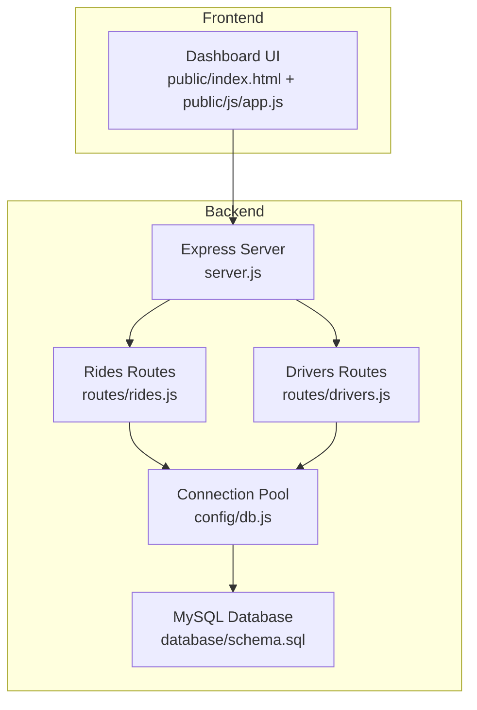
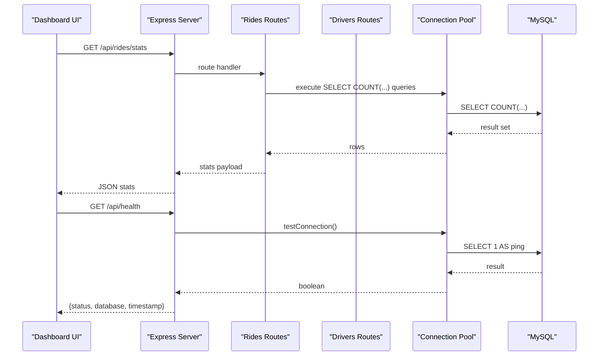
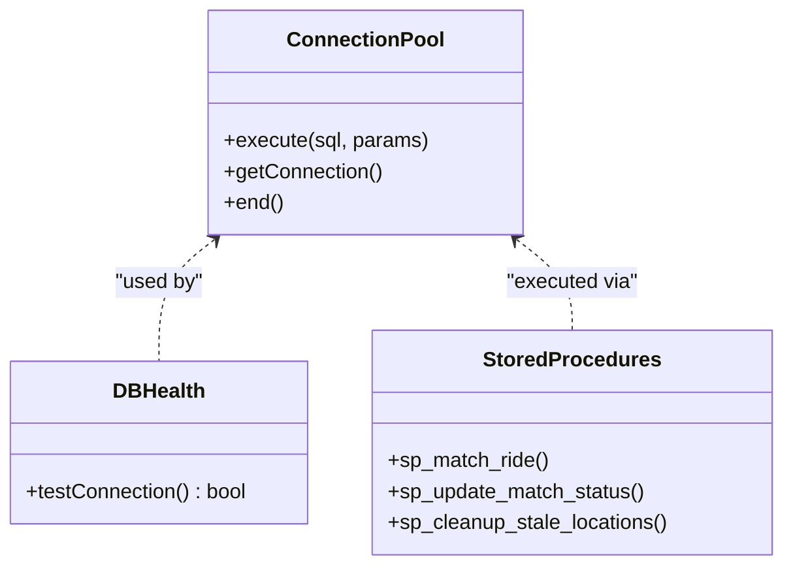
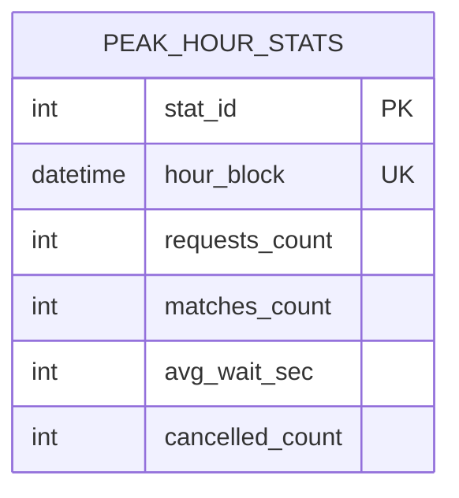
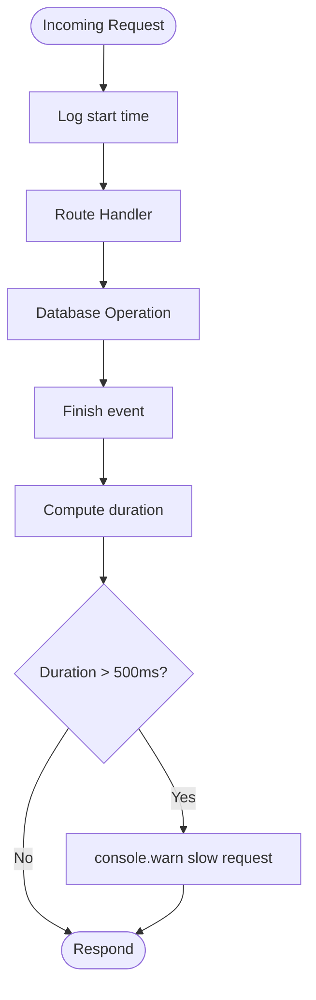
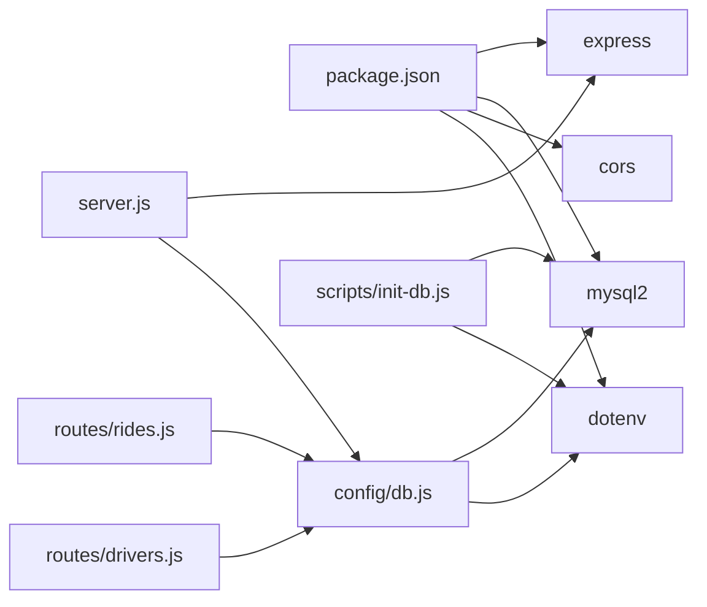

# Monitoring and Maintenance

<cite>
**Referenced Files in This Document**
- [server.js](file://server.js)
- [config/db.js](file://config/db.js)
- [database/schema.sql](file://database/schema.sql)
- [scripts/init-db.js](file://scripts/init-db.js)
- [routes/rides.js](file://routes/rides.js)
- [routes/drivers.js](file://routes/drivers.js)
- [public/js/app.js](file://public/js/app.js)
- [public/index.html](file://public/index.html)
- [package.json](file://package.json)
- [README.md](file://README.md)
</cite>

## Table of Contents
1. [Introduction](#introduction)
2. [Project Structure](#project-structure)
3. [Core Components](#core-components)
4. [Architecture Overview](#architecture-overview)
5. [Detailed Component Analysis](#detailed-component-analysis)
6. [Dependency Analysis](#dependency-analysis)
7. [Performance Considerations](#performance-considerations)
8. [Troubleshooting Guide](#troubleshooting-guide)
9. [Conclusion](#conclusion)
10. [Appendices](#appendices)

## Introduction
This document provides comprehensive guidance for monitoring and maintaining a production-grade ride-sharing matching system built with Node.js, Express, MySQL, and a front-end dashboard. It focuses on:
- Database health monitoring, including connection pool utilization and peak-hour analytics via the peak_hour_stats table
- Application monitoring strategies for server health, error tracking, and performance profiling
- Maintenance procedures such as backups, log rotation, and cleanup tasks
- Alerting and notification systems for critical issues like connection pool exhaustion, slow query detection, and resource thresholds
- Operational runbooks for common incidents, maintenance windows, and performance tuning
- Automated monitoring setup, dashboard creation, and integration with monitoring platforms

## Project Structure
The system follows a layered architecture:
- Frontend: Static assets served by Express, with a dashboard that auto-refreshes metrics
- Backend: Express server exposing REST APIs for rides and drivers
- Database: MySQL schema with stored procedures for atomic operations and peak-hour analytics

**Diagram sources**
- [server.js:1-84](file://server.js#L1-L84)
- [routes/rides.js:1-272](file://routes/rides.js#L1-L272)
- [routes/drivers.js:1-182](file://routes/drivers.js#L1-L182)
- [config/db.js:1-50](file://config/db.js#L1-L50)
- [database/schema.sql:1-297](file://database/schema.sql#L1-L297)
- [public/index.html:1-239](file://public/index.html#L1-L239)
- [public/js/app.js:1-373](file://public/js/app.js#L1-L373)

**Section sources**
- [server.js:1-84](file://server.js#L1-L84)
- [package.json:1-24](file://package.json#L1-L24)
- [README.md:29-48](file://README.md#L29-L48)

## Core Components
- Express server with middleware for request timing and global error handling
- Connection pool configured for high concurrency and peak-hour bursts
- Stored procedures for atomic matching and cleanup
- Peak-hour analytics table for monitoring load
- Frontend dashboard with auto-refresh intervals simulating live monitoring

Key monitoring-relevant elements:
- Health endpoint for database connectivity checks
- Request timing middleware to surface slow requests
- Stats endpoint aggregating ride and driver metrics
- Auto-refresh intervals in the dashboard for continuous monitoring

**Section sources**
- [server.js:20-30](file://server.js#L20-L30)
- [server.js:43-51](file://server.js#L43-L51)
- [routes/rides.js:226-259](file://routes/rides.js#L226-L259)
- [config/db.js:7-30](file://config/db.js#L7-L30)
- [database/schema.sql:129-141](file://database/schema.sql#L129-L141)
- [public/js/app.js:25-29](file://public/js/app.js#L25-L29)

## Architecture Overview
The monitoring and maintenance architecture integrates:
- Database-level metrics via peak_hour_stats and stored procedures
- Application-level metrics via health checks and request timing
- Frontend dashboards for live visibility and manual intervention
- Operational scripts for database initialization and maintenance

**Diagram sources**
- [routes/rides.js:226-259](file://routes/rides.js#L226-L259)
- [server.js:43-51](file://server.js#L43-L51)
- [config/db.js:33-41](file://config/db.js#L33-L41)

## Detailed Component Analysis

### Database Health Monitoring
- Connection pool configuration optimizes for peak-hour concurrency with a fixed pool size and queue limits
- Health check endpoint validates database connectivity and reports status
- Stored procedures encapsulate atomic operations to reduce contention and improve reliability

**Diagram sources**
- [config/db.js:7-47](file://config/db.js#L7-L47)
- [database/schema.sql:164-272](file://database/schema.sql#L164-L272)

Operational notes:
- Pool sizing and timeouts are tuned for bursty traffic; monitor queue length and acquisition latency
- Use the health endpoint to detect connectivity issues early
- Stored procedures centralize atomicity and reduce race conditions

**Section sources**
- [config/db.js:7-30](file://config/db.js#L7-L30)
- [config/db.js:33-41](file://config/db.js#L33-L41)
- [database/schema.sql:164-272](file://database/schema.sql#L164-L272)

### Peak-Hour Analytics via peak_hour_stats
The peak_hour_stats table aggregates hourly metrics for monitoring load and capacity planning.

**Diagram sources**
- [database/schema.sql:129-141](file://database/schema.sql#L129-L141)

Recommended monitoring:
- Periodically compute and store hourly aggregates to track trends
- Alert on unusual spikes in requests_count or cancellations
- Correlate with driver availability and match rates

**Section sources**
- [database/schema.sql:129-141](file://database/schema.sql#L129-L141)

### Application Monitoring Strategies
- Server health checks: Use the /api/health endpoint to verify database connectivity
- Error tracking: Centralized error handler logs unhandled exceptions
- Performance profiling: Request timing middleware surfaces slow requests (>500ms)

**Diagram sources**
- [server.js:20-30](file://server.js#L20-L30)

**Section sources**
- [server.js:43-51](file://server.js#L43-L51)
- [server.js:63-67](file://server.js#L63-L67)
- [server.js:20-30](file://server.js#L20-L30)

### Maintenance Procedures
- Database backup strategies:
  - Use logical backups (mysqldump) for point-in-time recovery
  - Schedule periodic backups during low-traffic windows
  - Validate backups regularly and test restore procedures
- Log rotation:
  - Rotate application logs by size/time and retain N recent archives
  - Archive logs offsite for compliance and auditing
- Cleanup tasks:
  - Use stored procedure sp_cleanup_stale_locations to remove outdated driver locations
  - Implement retention policies for historical analytics data (e.g., peak_hour_stats older than 90 days)

**Section sources**
- [database/schema.sql:265-270](file://database/schema.sql#L265-L270)

### Operational Runbooks

#### Incident: Connection Pool Exhaustion
- Symptoms: Requests queue up, acquireTimeout exceeded, increased response times
- Actions:
  - Inspect pool utilization and queue length
  - Scale pool size temporarily and investigate root cause
  - Review slow queries and optimize indexes
  - Restart service if necessary to drain queues

#### Incident: Slow Query Detection
- Symptoms: High percentage of slow requests, degraded dashboard performance
- Actions:
  - Enable slow query log and analyze top offenders
  - Add missing indexes or rewrite queries
  - Consider read replicas for reporting-heavy queries

#### Incident: System Resource Thresholds
- Symptoms: Elevated CPU/memory, disk I/O bottlenecks
- Actions:
  - Monitor OS-level metrics and container resources
  - Scale vertically or horizontally as needed
  - Tune MySQL and Node.js memory settings

#### Database Maintenance Window
- Tasks:
  - Back up databases
  - Optimize tables and update statistics
  - Apply schema changes behind a feature flag
  - Validate peak_hour_stats retention policy

#### Performance Tuning
- Database:
  - Adjust pool size and timeouts based on observed concurrency
  - Add strategic indexes for hot queries
  - Use prepared statements and connection pooling efficiently
- Application:
  - Reduce unnecessary polling intervals in the dashboard
  - Implement pagination for large result sets
  - Cache frequently accessed metadata

[No sources needed since this section provides general guidance]

### Automated Monitoring Setup and Dashboards
- Health endpoint integration:
  - Expose /api/health for uptime checks and synthetic transactions
- Metrics collection:
  - Track pool utilization, queue length, and acquisition latency
  - Capture request durations and error rates
- Dashboard creation:
  - Use the existing stats endpoint to power live cards
  - Add separate panels for peak-hour trends and driver availability
- Integration with monitoring platforms:
  - Export metrics to Prometheus or push to platforms like DataDog/New Relic
  - Set up alerts for pool exhaustion, slow queries, and resource thresholds

**Section sources**
- [server.js:43-51](file://server.js#L43-L51)
- [routes/rides.js:226-259](file://routes/rides.js#L226-L259)
- [public/js/app.js:25-29](file://public/js/app.js#L25-L29)

## Dependency Analysis
The backend depends on Express, MySQL2, CORS, and dotenv. The database schema defines tables, indexes, and stored procedures that underpin monitoring and operations.

**Diagram sources**
- [package.json:14-22](file://package.json#L14-L22)
- [server.js:1-8](file://server.js#L1-L8)
- [config/db.js:1-2](file://config/db.js#L1-L2)
- [routes/rides.js:1-3](file://routes/rides.js#L1-L3)
- [routes/drivers.js:1-3](file://routes/drivers.js#L1-L3)
- [scripts/init-db.js:1-4](file://scripts/init-db.js#L1-L4)

**Section sources**
- [package.json:14-22](file://package.json#L14-L22)
- [server.js:1-8](file://server.js#L1-L8)
- [config/db.js:1-2](file://config/db.js#L1-L2)

## Performance Considerations
- Connection pool sizing: Tune based on observed concurrency and queue metrics
- Query optimization: Leverage indexes and avoid N+1 patterns
- Frontend refresh cadence: Balance responsiveness with load; adjust intervals based on traffic
- Stored procedures: Encapsulate atomic operations to minimize contention
- Peak-hour logic: Use priority scoring and queueing to manage load

[No sources needed since this section provides general guidance]

## Troubleshooting Guide
Common issues and resolutions:
- Database connectivity failures: Verify credentials and network; use the health endpoint to confirm status
- Slow queries: Inspect request timing logs and slow query logs; add indexes or refactor queries
- Pool exhaustion: Increase pool size cautiously and address root causes
- Dashboard disconnects: Check network connectivity and server logs

**Section sources**
- [server.js:43-51](file://server.js#L43-L51)
- [server.js:63-67](file://server.js#L63-L67)
- [README.md:265-274](file://README.md#L265-L274)

## Conclusion
This system is designed for high read and frequent update workloads with explicit peak-hour considerations. Effective monitoring and maintenance hinge on:
- Robust database health checks and connection pool management
- Strategic use of stored procedures and indexes
- Continuous visibility via the dashboard and peak_hour_stats
- Proactive maintenance windows and alerting for critical thresholds

[No sources needed since this section summarizes without analyzing specific files]

## Appendices

### Alerting and Notification Systems
- Pool exhaustion: Alert when queueLength exceeds threshold or acquireTimeout occurs
- Slow queries: Alert on sustained increases in request durations
- Resource thresholds: Alert on CPU, memory, and disk usage breaches
- Database connectivity: Alert on repeated health check failures

[No sources needed since this section provides general guidance]

### Database Initialization Script
Use the initialization script to bootstrap the schema and stored procedures.

**Section sources**
- [scripts/init-db.js:1-46](file://scripts/init-db.js#L1-L46)
- [database/schema.sql:1-297](file://database/schema.sql#L1-L297)