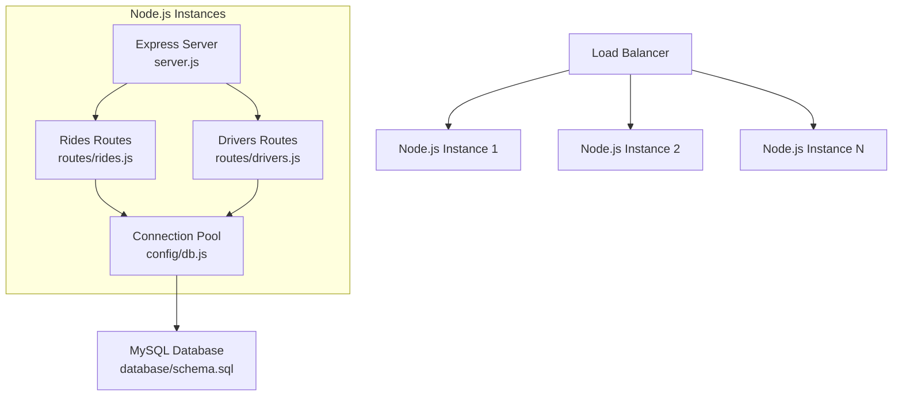
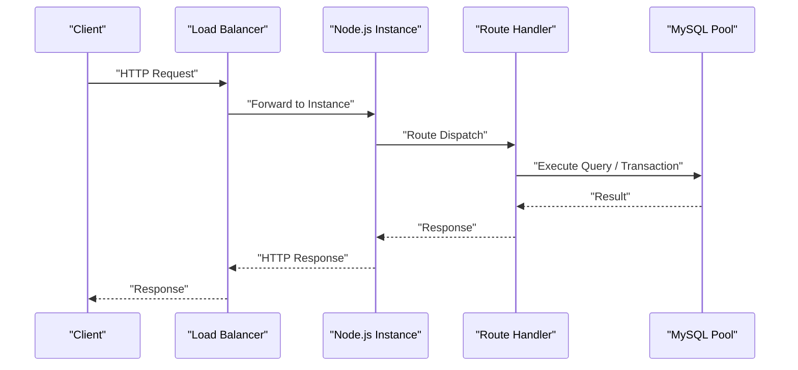
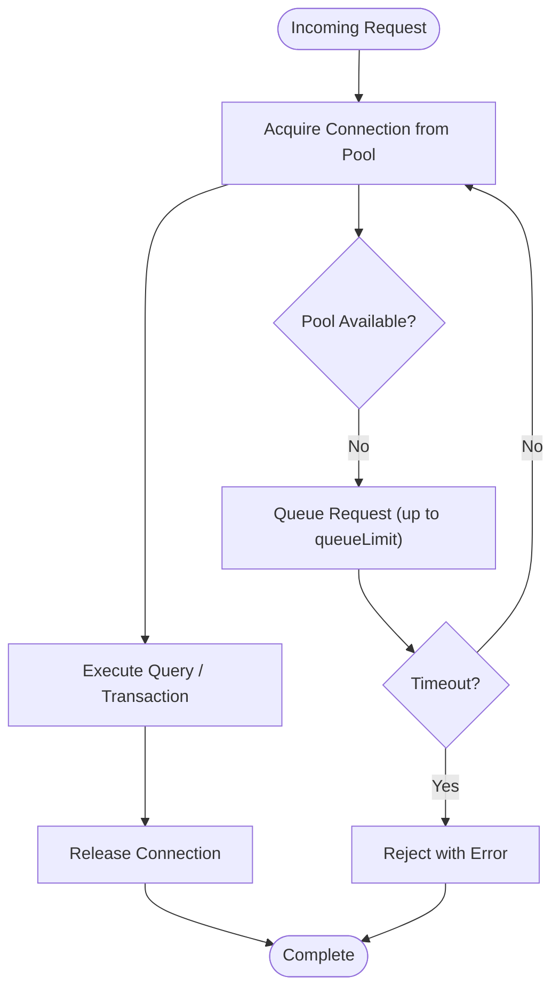
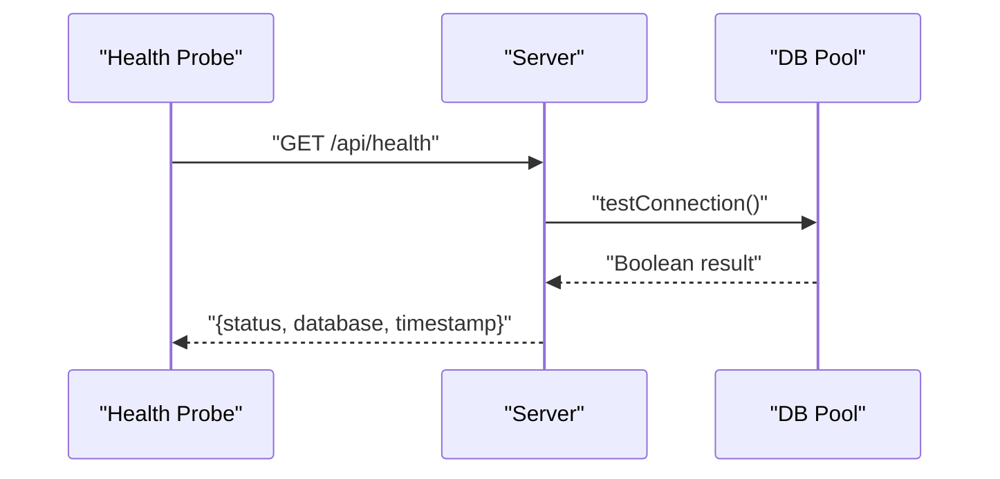
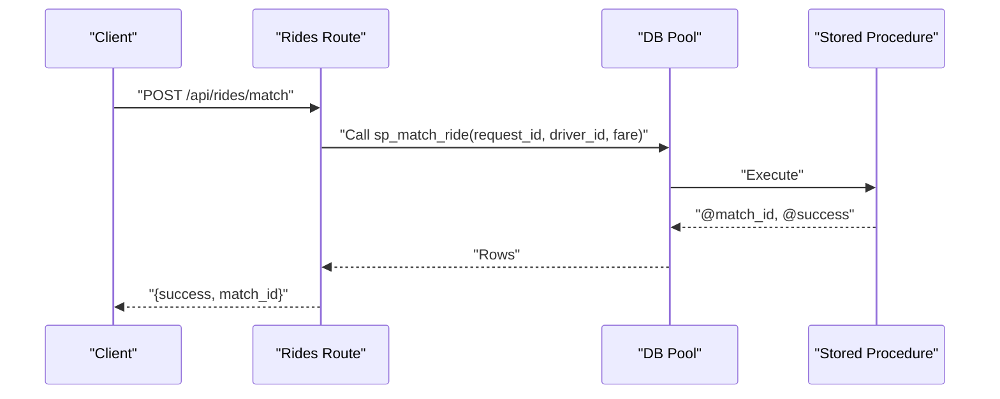
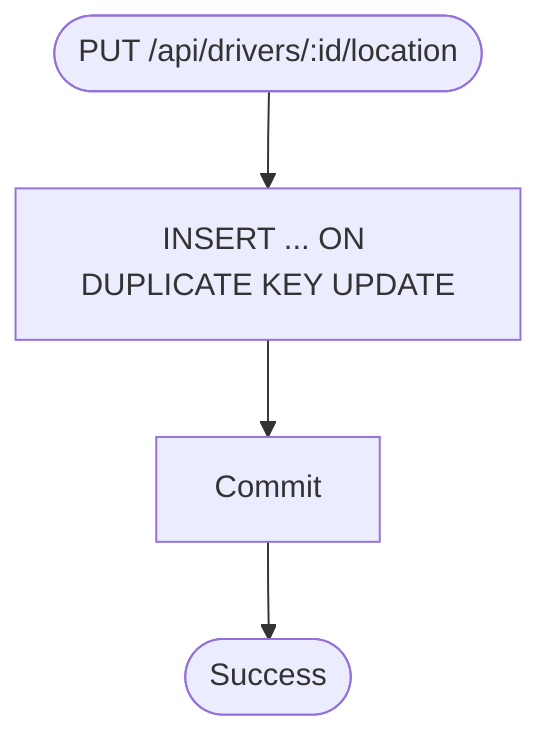
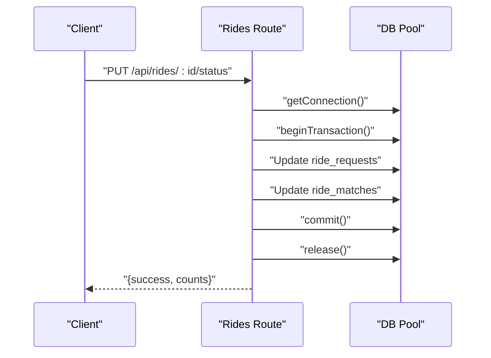
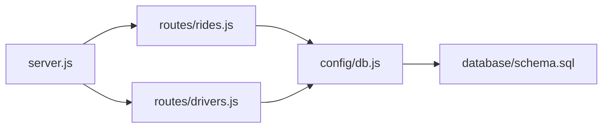

# Scaling and Load Balancing

<cite>
**Referenced Files in This Document**
- [server.js](file://server.js)
- [config/db.js](file://config/db.js)
- [routes/rides.js](file://routes/rides.js)
- [routes/drivers.js](file://routes/drivers.js)
- [database/schema.sql](file://database/schema.sql)
- [scripts/init-db.js](file://scripts/init-db.js)
- [package.json](file://package.json)
- [README.md](file://README.md)
</cite>

## Table of Contents
1. [Introduction](#introduction)
2. [Project Structure](#project-structure)
3. [Core Components](#core-components)
4. [Architecture Overview](#architecture-overview)
5. [Detailed Component Analysis](#detailed-component-analysis)
6. [Dependency Analysis](#dependency-analysis)
7. [Performance Considerations](#performance-considerations)
8. [Troubleshooting Guide](#troubleshooting-guide)
9. [Conclusion](#conclusion)
10. [Appendices](#appendices)

## Introduction
This document provides a comprehensive guide to scaling and load balancing strategies for the ride-sharing DBMS. It focuses on deploying multiple Node.js instances behind a load balancer, configuring connection pools sized for peak-hour concurrency, and managing queues to handle traffic spikes. It also covers health checks, auto-scaling, monitoring, capacity planning, and cost optimization for cloud deployments.

## Project Structure
The application follows a layered architecture:
- Express server entry point
- Route handlers for rides and drivers
- Centralized MySQL connection pool with timeouts and queue limits
- Database schema with stored procedures for atomic operations and indexes for high-concurrency reads



**Diagram sources**
- [server.js:1-84](file://server.js#L1-L84)
- [routes/rides.js:1-272](file://routes/rides.js#L1-L272)
- [routes/drivers.js:1-182](file://routes/drivers.js#L1-L182)
- [config/db.js:1-50](file://config/db.js#L1-L50)
- [database/schema.sql:1-297](file://database/schema.sql#L1-L297)

**Section sources**
- [server.js:1-84](file://server.js#L1-L84)
- [package.json:1-24](file://package.json#L1-L24)
- [README.md:29-48](file://README.md#L29-L48)

## Core Components
- Express server with middleware, static serving, route registration, health check, and global error handling.
- MySQL connection pool configured with a fixed pool size and queue limit suitable for peak-hour concurrency.
- Rides and drivers route handlers that perform frequent reads and writes, including atomic matching via stored procedures and upserts for location updates.
- Database schema with strategic indexes and stored procedures to prevent race conditions and support high-throughput operations.

Key scaling-relevant elements:
- Health check endpoint for readiness/liveness probes.
- Connection pool sizing and queue management to absorb bursts.
- Atomic stored procedures to prevent double-booking and reduce contention.
- Upserts for frequent location updates to minimize race conditions.

**Section sources**
- [server.js:43-51](file://server.js#L43-L51)
- [config/db.js:7-30](file://config/db.js#L7-L30)
- [routes/rides.js:135-167](file://routes/rides.js#L135-L167)
- [routes/drivers.js:101-126](file://routes/drivers.js#L101-L126)
- [database/schema.sql:164-272](file://database/schema.sql#L164-L272)

## Architecture Overview
The system is designed for horizontal scaling across multiple Node.js instances behind a load balancer. Each instance shares the same MySQL backend and relies on atomic operations and indexes to maintain consistency under load.



**Diagram sources**
- [server.js:40-41](file://server.js#L40-L41)
- [routes/rides.js:88-133](file://routes/rides.js#L88-L133)
- [routes/drivers.js:101-126](file://routes/drivers.js#L101-L126)
- [config/db.js:7-30](file://config/db.js#L7-L30)

## Detailed Component Analysis

### Connection Pool and Queue Management
- Pool size: 50 connections to handle concurrent requests during peak hours.
- Queue limit: 100 additional requests queued when pool is saturated.
- Timeouts: Connection, acquisition, and query timeouts to prevent hanging connections.
- Keep-alive: Fresh connections to reduce overhead.
- Streaming: Rows returned as objects for readability.



**Diagram sources**
- [config/db.js:7-30](file://config/db.js#L7-L30)

**Section sources**
- [config/db.js:7-30](file://config/db.js#L7-L30)
- [README.md:144-146](file://README.md#L144-L146)

### Health Check Endpoint
- Endpoint: GET /api/health
- Validates database connectivity via a simple query.
- Returns status, database connectivity, and timestamp.



**Diagram sources**
- [server.js:43-51](file://server.js#L43-L51)
- [config/db.js:32-41](file://config/db.js#L32-L41)

**Section sources**
- [server.js:43-51](file://server.js#L43-L51)
- [config/db.js:32-41](file://config/db.js#L32-L41)

### Atomic Ride Matching
- Uses a stored procedure to atomically update request and driver rows and insert a match record.
- Implements pessimistic locking to prevent race conditions.
- Returns match ID and success flag.



**Diagram sources**
- [routes/rides.js:135-167](file://routes/rides.js#L135-L167)
- [database/schema.sql:167-234](file://database/schema.sql#L167-L234)

**Section sources**
- [routes/rides.js:135-167](file://routes/rides.js#L135-L167)
- [database/schema.sql:167-234](file://database/schema.sql#L167-L234)

### Frequent Driver Location Updates
- Uses an upsert pattern to update driver location atomically.
- Prevents race conditions during frequent GPS updates.



**Diagram sources**
- [routes/drivers.js:101-126](file://routes/drivers.js#L101-L126)
- [database/schema.sql:104-126](file://database/schema.sql#L104-L126)

**Section sources**
- [routes/drivers.js:101-126](file://routes/drivers.js#L101-L126)

### Status Updates with Transactions
- Wraps status updates in transactions to ensure consistency across related tables.
- Releases connection back to the pool after completion.



**Diagram sources**
- [routes/rides.js:169-224](file://routes/rides.js#L169-L224)

**Section sources**
- [routes/rides.js:169-224](file://routes/rides.js#L169-L224)

### Database Schema and Indexes
- Strategic indexes on status, timestamps, and coordinates to accelerate high-frequency queries.
- Stored procedures encapsulate atomic operations to prevent contention.

```mermaid
erDiagram
USERS {
int user_id PK
varchar email UK
varchar phone
timestamp created_at
timestamp updated_at
}
DRIVERS {
int driver_id PK
varchar email UK
varchar phone
varchar vehicle_model
varchar vehicle_plate UK
enum status
decimal rating
int total_trips
int version
timestamp created_at
timestamp updated_at
}
DRIVER_LOCATIONS {
int location_id PK
int driver_id FK
decimal latitude
decimal longitude
decimal accuracy
timestamp updated_at
}
RIDE_REQUESTS {
int request_id PK
int user_id FK
decimal pickup_lat
decimal pickup_lng
decimal dropoff_lat
decimal dropoff_lng
enum status
decimal fare_estimate
decimal priority_score
int version
timestamp created_at
timestamp updated_at
}
RIDE_MATCHES {
int match_id PK
int request_id FK UK
int driver_id FK
enum status
decimal fare_final
decimal distance_km
timestamp started_at
timestamp completed_at
int version
timestamp created_at
timestamp updated_at
}
USERS ||--o{ RIDE_REQUESTS : "has"
DRIVERS ||--o{ DRIVER_LOCATIONS : "has"
DRIVERS ||--o{ RIDE_MATCHES : "drives"
RIDE_REQUESTS ||--|| RIDE_MATCHES : "matches"
```

**Diagram sources**
- [database/schema.sql:14-126](file://database/schema.sql#L14-L126)

**Section sources**
- [database/schema.sql:14-126](file://database/schema.sql#L14-L126)

## Dependency Analysis
- Express server depends on route handlers and the database pool.
- Route handlers depend on the database pool for all operations.
- Database pool depends on MySQL configuration and environment variables.
- Stored procedures encapsulate atomic logic to reduce coupling between application and database-level concurrency control.



**Diagram sources**
- [server.js:6-8](file://server.js#L6-L8)
- [routes/rides.js:1-4](file://routes/rides.js#L1-L4)
- [routes/drivers.js:1-4](file://routes/drivers.js#L1-L4)
- [config/db.js:1-2](file://config/db.js#L1-L2)
- [database/schema.sql:1-10](file://database/schema.sql#L1-L10)

**Section sources**
- [server.js:6-8](file://server.js#L6-L8)
- [routes/rides.js:1-4](file://routes/rides.js#L1-L4)
- [routes/drivers.js:1-4](file://routes/drivers.js#L1-L4)
- [config/db.js:1-2](file://config/db.js#L1-L2)

## Performance Considerations
- Connection pool sizing: 50 connections with a queue limit of 100 to absorb bursts without rejecting requests.
- Timeouts: Configured to prevent long-hanging operations from blocking the pool.
- Atomic operations: Stored procedures and upserts reduce contention and race conditions.
- Indexes: Strategic indexes on frequently queried columns improve read performance.
- Upserts: Single atomic write for location updates reduces read/write cycles.
- Priority scoring: Higher priority during peak hours ensures fair queue ordering.

[No sources needed since this section provides general guidance]

## Troubleshooting Guide
Common issues and resolutions:
- ECONNREFUSED: Verify MySQL is running and reachable on the configured host/port.
- Access denied: Confirm DB_USER and DB_PASSWORD in environment configuration.
- Table doesn't exist: Initialize the database using the schema file.
- Port 3000 in use: Change PORT in environment configuration.
- Slow queries during peak: Monitor analytics and consider increasing pool size if needed.

**Section sources**
- [README.md:265-274](file://README.md#L265-L274)

## Conclusion
The ride-sharing DBMS is architected to scale horizontally with multiple Node.js instances behind a load balancer. Its connection pool, atomic stored procedures, and strategic indexes provide robust concurrency control. The health check endpoint enables reliable auto-scaling and monitoring. With careful capacity planning and cloud cost optimization, the system can handle traffic spikes while maintaining performance and consistency.

[No sources needed since this section summarizes without analyzing specific files]

## Appendices

### Scaling Strategies for Horizontal Deployment
- Multiple Node.js instances behind a load balancer.
- Shared MySQL backend; each instance uses the centralized pool.
- No shared session storage or distributed cache in the current codebase; consider adding Redis or a similar solution for session and caching needs.

**Section sources**
- [README.md:280-283](file://README.md#L280-L283)

### Load Balancing Strategies
- Round-robin: Distributes requests evenly across instances.
- Least-connections: Sends new requests to the instance with fewer active connections.
- Sticky sessions: Keeps client requests bound to the same instance for session consistency. Not required here since the backend is stateless and uses a shared database.

[No sources needed since this section provides general guidance]

### Auto-Scaling Configuration
- Scale-out triggers: CPU utilization, memory usage, response latency, or queue depth metrics.
- Scale-in triggers: Low utilization thresholds to reduce costs.
- Health checks: Use the /api/health endpoint for readiness probes.

**Section sources**
- [server.js:43-51](file://server.js#L43-L51)

### Capacity Planning Guidelines
- Estimate peak concurrent requests and set pool size accordingly.
- Monitor queue depth; if requests frequently exceed queueLimit, increase pool size or optimize queries.
- Track slow queries and add indexes as needed.
- Plan for growth in driver and rider base to maintain low-latency responses.

[No sources needed since this section provides general guidance]

### Traffic Spike Handling
- Increase pool size and queue limit temporarily during known peak periods.
- Use priority scoring to ensure critical requests are processed first.
- Implement circuit breakers and retries at the client level to avoid cascading failures.

[No sources needed since this section provides general guidance]

### Cost Optimization Strategies for Cloud Deployments
- Right-size VMs and containers to match observed CPU and memory profiles.
- Use managed MySQL (e.g., RDS) with read replicas for read-heavy workloads.
- Enable auto-scaling groups with spot instances for background tasks.
- Monitor and remove unused resources regularly.

[No sources needed since this section provides general guidance]