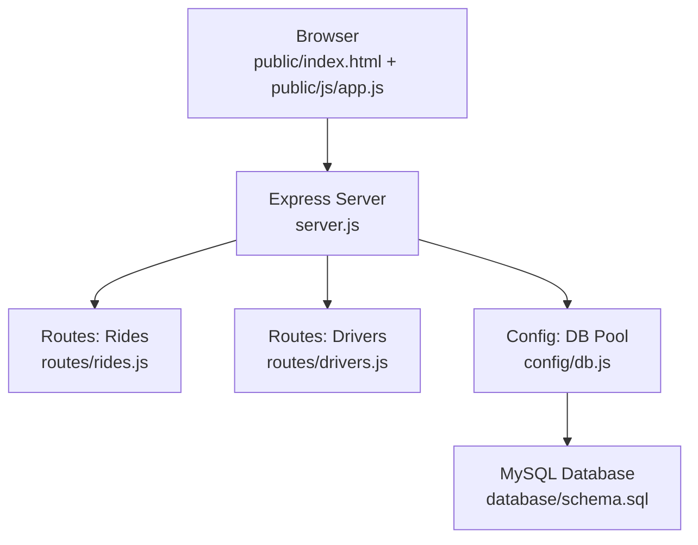
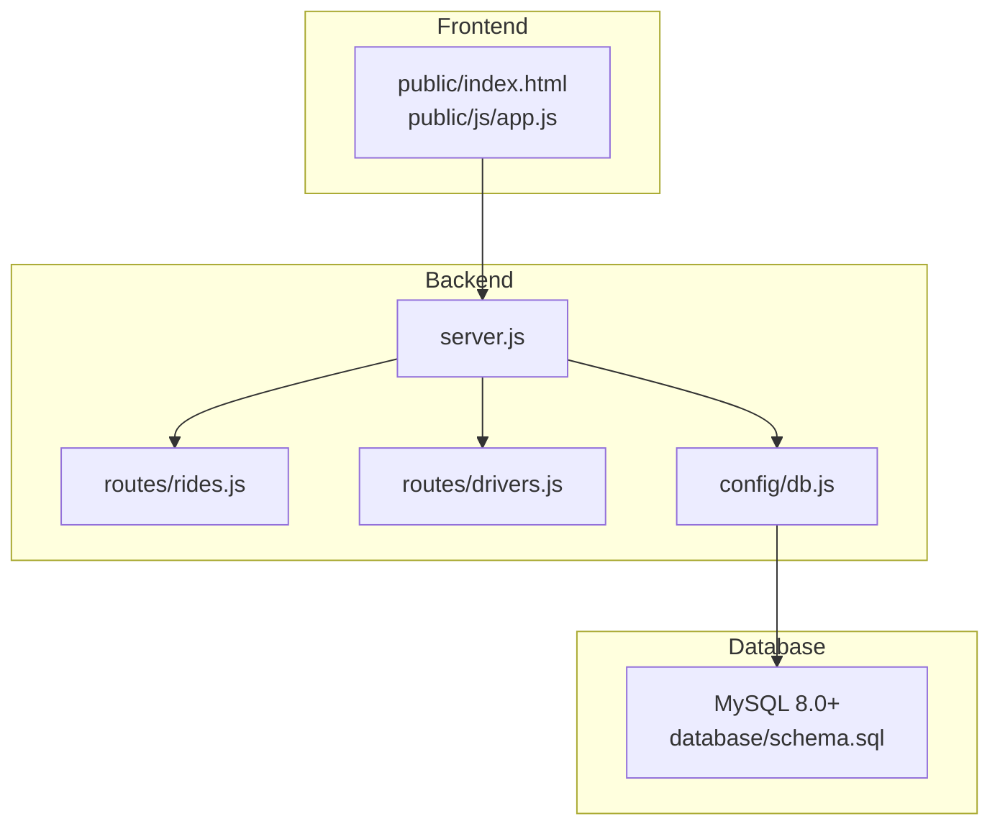
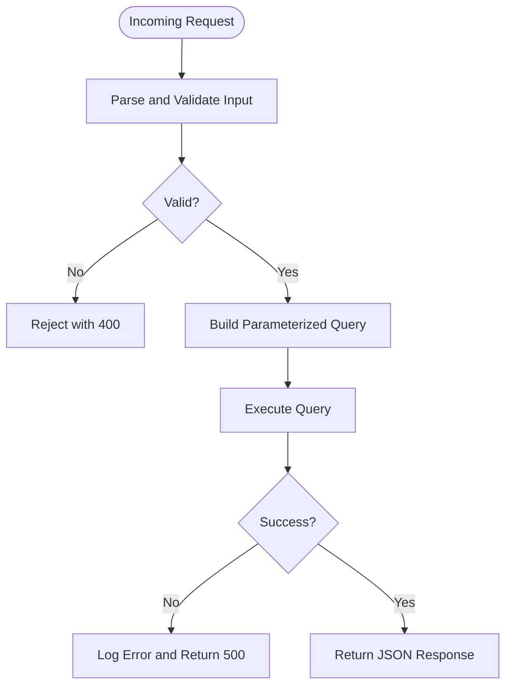
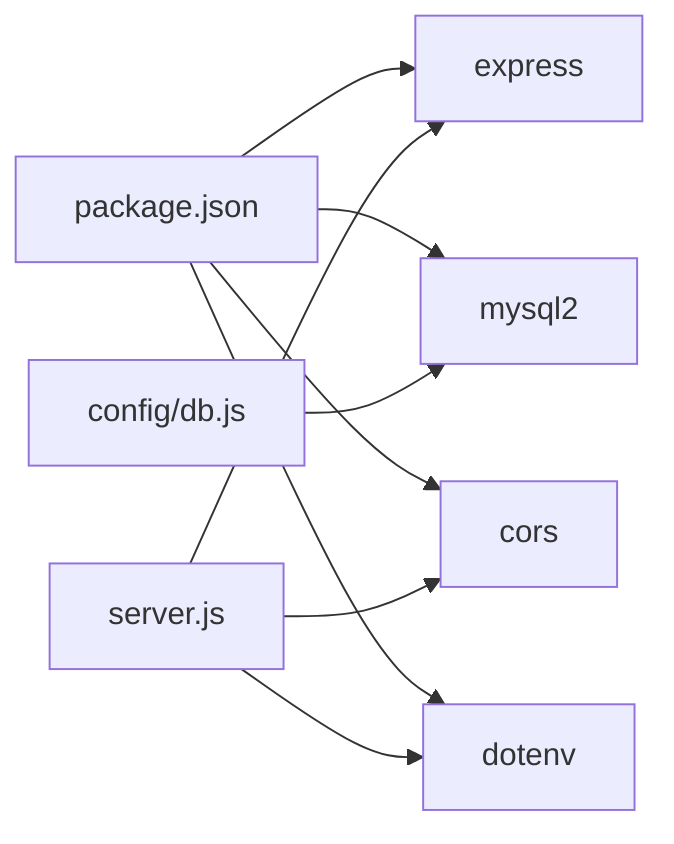

# Security Hardening and Operations

<cite>
**Referenced Files in This Document**
- [README.md](file://README.md)
- [package.json](file://package.json)
- [server.js](file://server.js)
- [config/db.js](file://config/db.js)
- [routes/rides.js](file://routes/rides.js)
- [routes/drivers.js](file://routes/drivers.js)
- [database/schema.sql](file://database/schema.sql)
- [scripts/init-db.js](file://scripts/init-db.js)
- [public/js/app.js](file://public/js/app.js)
- [public/index.html](file://public/index.html)
</cite>

## Table of Contents
1. [Introduction](#introduction)
2. [Project Structure](#project-structure)
3. [Core Components](#core-components)
4. [Architecture Overview](#architecture-overview)
5. [Detailed Component Analysis](#detailed-component-analysis)
6. [Dependency Analysis](#dependency-analysis)
7. [Performance Considerations](#performance-considerations)
8. [Troubleshooting Guide](#troubleshooting-guide)
9. [Conclusion](#conclusion)
10. [Appendices](#appendices)

## Introduction
This document provides a comprehensive guide to security hardening and operational procedures for the ride-sharing matching DBMS. It focuses on production-grade practices for environment variable management, secure credential storage, encryption at rest and in transit, database access controls, application security, operational security, compliance considerations, deployment and containerization, and disaster recovery. The guidance is grounded in the repository’s code and configuration to identify risks and recommend mitigations.

## Project Structure
The application follows a layered architecture:
- Frontend: Static HTML/CSS/JavaScript served by Express
- Backend: Express server exposing REST endpoints
- Database: MySQL 8.0+ with connection pooling and stored procedures
- Configuration: Environment variables loaded via dotenv
- Initialization: Script to apply schema and stored procedures

**Diagram sources**
- [server.js:1-84](file://server.js#L1-L84)
- [routes/rides.js:1-272](file://routes/rides.js#L1-L272)
- [routes/drivers.js:1-182](file://routes/drivers.js#L1-L182)
- [config/db.js:1-50](file://config/db.js#L1-L50)
- [database/schema.sql:1-297](file://database/schema.sql#L1-L297)

**Section sources**
- [README.md:29-48](file://README.md#L29-L48)
- [package.json:1-24](file://package.json#L1-L24)

## Core Components
- Express server with middleware, static serving, health checks, and global error handling
- Database connection pool with timeouts and keep-alives
- Route handlers for rides and drivers with transactional and atomic operations
- Stored procedures for atomic matching and optimistic locking
- Frontend that communicates with backend APIs

Key security-relevant observations:
- Environment variables are loaded via dotenv and consumed for DB configuration
- CORS is enabled globally without restrictions
- No explicit HTTPS/TLS termination or transport encryption
- No input validation or sanitization in route handlers
- No explicit audit logging or intrusion detection
- No secrets management or encrypted backups

**Section sources**
- [server.js:1-84](file://server.js#L1-L84)
- [config/db.js:1-50](file://config/db.js#L1-L50)
- [routes/rides.js:1-272](file://routes/rides.js#L1-L272)
- [routes/drivers.js:1-182](file://routes/drivers.js#L1-L182)
- [database/schema.sql:160-272](file://database/schema.sql#L160-L272)

## Architecture Overview
The runtime architecture integrates frontend, backend, and database with a focus on high read rates, frequent updates, and peak-hour concurrency. Security controls must be layered across all components.

**Diagram sources**
- [server.js:1-84](file://server.js#L1-L84)
- [routes/rides.js:1-272](file://routes/rides.js#L1-L272)
- [routes/drivers.js:1-182](file://routes/drivers.js#L1-L182)
- [config/db.js:1-50](file://config/db.js#L1-L50)
- [database/schema.sql:1-297](file://database/schema.sql#L1-L297)

## Detailed Component Analysis

### Environment Variable Management and Secure Credential Storage
- Current state: Credentials are loaded from environment variables via dotenv and used to configure the database pool. There is no evidence of secret rotation, encryption at rest for secrets, or centralized secret management.
- Production recommendations:
  - Store secrets in a secrets manager (e.g., HashiCorp Vault, AWS Secrets Manager, Azure Key Vault)
  - Rotate secrets regularly and enforce short-lived tokens
  - Encrypt secrets at rest and in transit
  - Restrict access to secret stores and enforce least privilege
  - Use separate credentials for development, staging, and production

Operational practices:
- Maintain separate .env files per environment behind access-controlled version control
- Never commit secrets to repositories
- Use CI/CD secret injection and avoid echoing secrets in logs

**Section sources**
- [config/db.js:1-30](file://config/db.js#L1-L30)
- [server.js:4](file://server.js#L4)
- [package.json:14-18](file://package.json#L14-L18)

### Encryption at Rest and in Transit
- At-rest: Database credentials and potentially sensitive data in MySQL tables are not encrypted at rest in the current configuration.
- In-transit: No TLS termination or HTTPS enforcement is present in the server configuration.
- Recommendations:
  - Enable MySQL native encryption for sensitive columns and transport encryption (TLS) for connections
  - Enforce HTTPS/TLS termination at the reverse proxy or application level
  - Use strong cipher suites and modern protocols (TLS 1.2+)
  - Implement certificate management and rotation policies

**Section sources**
- [config/db.js:7-30](file://config/db.js#L7-L30)
- [database/schema.sql:14-158](file://database/schema.sql#L14-L158)

### Database Access Controls
- Current state: The application connects using a single user account configured via environment variables. Stored procedures encapsulate atomic operations and optimistic locking.
- Recommendations:
  - Create dedicated database users for application roles (read-only for analytics, limited DML for write endpoints)
  - Apply principle of least privilege and disable unnecessary privileges
  - Configure MySQL firewall rules to restrict inbound connections to trusted networks
  - Segment database network from application servers using VPC/subnet isolation
  - Enable audit logging in MySQL for sensitive operations

**Section sources**
- [config/db.js:7-12](file://config/db.js#L7-L12)
- [database/schema.sql:160-272](file://database/schema.sql#L160-L272)

### Application Security Measures
- Input validation and sanitization: No explicit validation or sanitization is performed in route handlers. This increases risk of malformed data and potential abuse.
- SQL injection prevention: While prepared statements are used in several places, the application does not consistently validate or sanitize inputs before binding. Stored procedures mitigate some risks but do not replace input validation.
- CORS configuration: CORS is enabled globally without origin restrictions, increasing exposure to cross-origin attacks.
- Recommendations:
  - Implement strict input validation and sanitization libraries (e.g., Joi, express-validator)
  - Enforce CORS with allow-listed origins and secure headers
  - Add rate limiting and request size limits
  - Integrate Content Security Policy (CSP) headers
  - Sanitize and escape frontend-rendered content

**Diagram sources**
- [routes/rides.js:88-133](file://routes/rides.js#L88-L133)
- [routes/drivers.js:101-126](file://routes/drivers.js#L101-L126)

**Section sources**
- [routes/rides.js:1-272](file://routes/rides.js#L1-L272)
- [routes/drivers.js:1-182](file://routes/drivers.js#L1-L182)
- [server.js:16](file://server.js#L16)

### Operational Security: Audit Logging, Intrusion Detection, Incident Response
- Current state: Basic request duration logging is present; no structured audit logs or IDS integration.
- Recommendations:
  - Implement structured audit logs for all sensitive operations (rides/matches, driver updates)
  - Centralize logs and integrate with SIEM/IDS
  - Define incident response playbooks and escalation paths
  - Monitor slow requests and anomalies; alert on repeated failures
  - Establish change management and rollback procedures

**Section sources**
- [server.js:20-30](file://server.js#L20-L30)

### Compliance Considerations and Data Privacy
- Current state: No explicit privacy controls or data retention policies.
- Recommendations:
  - Identify personal data (names, emails, phones, locations) and apply data minimization
  - Implement data retention and deletion policies aligned with privacy regulations
  - Add consent mechanisms and transparency notices
  - Ensure secure data deletion and anonymization where applicable

**Section sources**
- [database/schema.sql:14-158](file://database/schema.sql#L14-L158)

### Deployment Security Practices
- Current state: No containerization or cloud-specific configuration is present.
- Recommendations:
  - Containerize with minimal base images and non-root users
  - Scan containers for vulnerabilities and manage base image updates
  - Use immutable deployments and blue/green or rolling updates
  - Enforce runtime security (seccomp, AppArmor/SELinux) and resource quotas
  - Deploy behind a WAF and reverse proxy with TLS termination

**Section sources**
- [package.json:14-22](file://package.json#L14-L22)

### Backup Encryption and Disaster Recovery Security
- Current state: No backup or DR procedures are documented.
- Recommendations:
  - Encrypt backups at rest and in transit
  - Test restoration procedures regularly
  - Isolate backups from primary systems and store offsite
  - Implement secure decommissioning (secure wipe of disks, revocation of certificates, removal of secrets)

**Section sources**
- [database/schema.sql:1-297](file://database/schema.sql#L1-L297)

## Dependency Analysis
The application depends on Express, mysql2, cors, and dotenv. These dependencies introduce security considerations around patching, supply chain, and configuration.

**Diagram sources**
- [package.json:14-18](file://package.json#L14-L18)
- [server.js:1-8](file://server.js#L1-L8)
- [config/db.js:1](file://config/db.js#L1)

**Section sources**
- [package.json:14-18](file://package.json#L14-L18)

## Performance Considerations
- Connection pooling and timeouts are configured to handle peak-hour load. Ensure these align with production capacity and monitor for connection exhaustion.
- Stored procedures and optimistic locking reduce contention; validate performance under realistic loads and tune indexes accordingly.

[No sources needed since this section provides general guidance]

## Troubleshooting Guide
Common production issues and mitigations:
- Database connectivity failures: Verify environment variables and network access; confirm health endpoint responds
- Slow queries: Monitor slow log and optimize queries; adjust pool sizes and timeouts
- CORS-related errors: Configure allow-listed origins and preflight handling
- Unhandled errors: Ensure structured error logging and health checks

**Section sources**
- [server.js:44-51](file://server.js#L44-L51)
- [config/db.js:33-41](file://config/db.js#L33-L41)

## Conclusion
The application demonstrates strong backend concurrency controls and database design but lacks production-grade security controls. Immediate priorities include enabling HTTPS/TLS, restricting CORS, adding input validation, enforcing database access controls, implementing audit logging, and establishing secure deployment and backup procedures. These changes will significantly improve resilience against common threats and support compliance requirements.

[No sources needed since this section summarizes without analyzing specific files]

## Appendices

### Appendix A: Environment Variables and Secrets Management
- Store DB_HOST, DB_PORT, DB_USER, DB_PASSWORD, DB_NAME, and PORT in a secrets manager
- Use separate credentials per environment
- Encrypt at rest and in transit
- Rotate regularly and revoke compromised keys

**Section sources**
- [config/db.js:7-12](file://config/db.js#L7-L12)
- [README.md:70-79](file://README.md#L70-L79)

### Appendix B: CORS and Transport Security
- Configure CORS with allow-listed origins and secure headers
- Enforce HTTPS/TLS termination at reverse proxy or application
- Use strong TLS ciphers and modern protocols

**Section sources**
- [server.js:16](file://server.js#L16)
- [config/db.js:7-30](file://config/db.js#L7-L30)

### Appendix C: Database Security Controls
- Create role-based users with least privilege
- Restrict inbound database access to application subnets
- Enable MySQL audit logging and network segmentation

**Section sources**
- [database/schema.sql:160-272](file://database/schema.sql#L160-L272)

### Appendix D: Operational Procedures
- Implement structured audit logs and SIEM integration
- Define incident response playbooks and testing schedules
- Establish secure backup and disaster recovery procedures

**Section sources**
- [server.js:20-30](file://server.js#L20-L30)