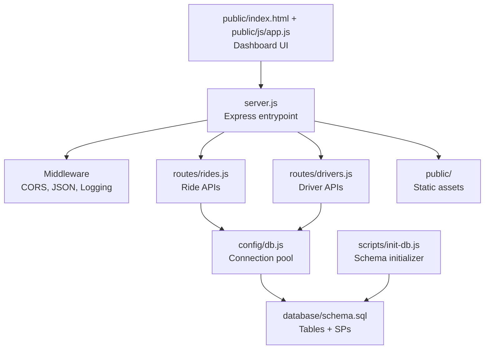
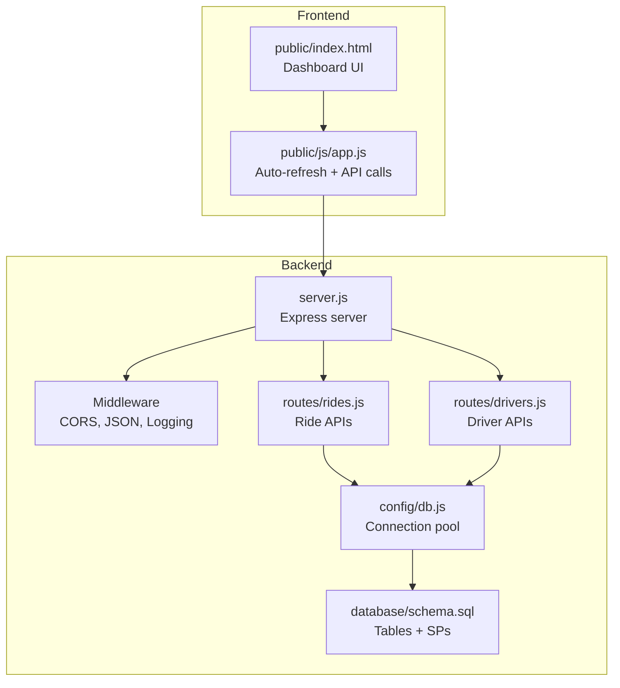
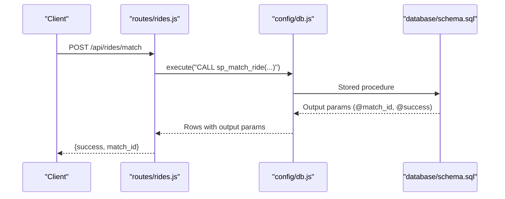
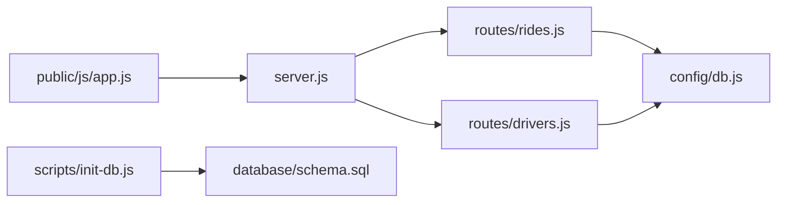

# Development Guidelines

<cite>
**Referenced Files in This Document**
- [server.js](file://server.js)
- [config/db.js](file://config/db.js)
- [routes/rides.js](file://routes/rides.js)
- [routes/drivers.js](file://routes/drivers.js)
- [scripts/init-db.js](file://scripts/init-db.js)
- [database/schema.sql](file://database/schema.sql)
- [package.json](file://package.json)
- [public/js/app.js](file://public/js/app.js)
- [public/index.html](file://public/index.html)
- [README.md](file://README.md)
</cite>

## Table of Contents
1. [Introduction](#introduction)
2. [Project Structure](#project-structure)
3. [Core Components](#core-components)
4. [Architecture Overview](#architecture-overview)
5. [Detailed Component Analysis](#detailed-component-analysis)
6. [Dependency Analysis](#dependency-analysis)
7. [Performance Considerations](#performance-considerations)
8. [Testing Strategies](#testing-strategies)
9. [Debugging and Troubleshooting](#debugging-and-troubleshooting)
10. [Code Quality Standards](#code-quality-standards)
11. [Development Workflow Recommendations](#development-workflow-recommendations)
12. [Extensibility and Backward Compatibility](#extensibility-and-backward-compatibility)
13. [Conclusion](#conclusion)

## Introduction
This document provides comprehensive development guidelines and best practices for the ride-sharing DBMS project. It focuses on:
- Code organization principles using layered architecture and repository-like patterns in route handlers
- Separation of concerns between controllers, services, and data layers
- Best practices for database operations including connection pooling, transactions, and stored procedures
- Testing strategies for concurrent operations, race condition prevention, and performance validation
- Debugging and troubleshooting approaches for connection pools, query performance, and error handling
- Code quality standards, logging strategies, and development workflow recommendations
- Extending the system with new features while maintaining backward compatibility

## Project Structure
The project follows a clear layered architecture:
- Entry point initializes middleware, static assets, and routes
- Routes encapsulate controller logic and delegate database operations to the connection pool
- Database configuration centralizes connection pooling and health checks
- Scripts initialize the database schema and stored procedures
- Frontend provides a dashboard for monitoring and manual operations

**Diagram sources**
- [server.js:1-84](file://server.js#L1-L84)
- [routes/rides.js:1-272](file://routes/rides.js#L1-L272)
- [routes/drivers.js:1-182](file://routes/drivers.js#L1-L182)
- [config/db.js:1-50](file://config/db.js#L1-L50)
- [database/schema.sql:1-297](file://database/schema.sql#L1-L297)
- [scripts/init-db.js:1-46](file://scripts/init-db.js#L1-L46)
- [public/index.html:1-239](file://public/index.html#L1-L239)
- [public/js/app.js:1-373](file://public/js/app.js#L1-L373)

**Section sources**
- [server.js:1-84](file://server.js#L1-L84)
- [config/db.js:1-50](file://config/db.js#L1-L50)
- [routes/rides.js:1-272](file://routes/rides.js#L1-L272)
- [routes/drivers.js:1-182](file://routes/drivers.js#L1-L182)
- [scripts/init-db.js:1-46](file://scripts/init-db.js#L1-L46)
- [database/schema.sql:1-297](file://database/schema.sql#L1-L297)
- [public/index.html:1-239](file://public/index.html#L1-L239)
- [public/js/app.js:1-373](file://public/js/app.js#L1-L373)

## Core Components
- Express server: Initializes middleware, routes, health checks, and global error handling
- Connection pool: Centralized MySQL pool with timeouts, queue limits, and keep-alive
- Route handlers: Controllers that validate inputs, build SQL queries, and manage transactions
- Database schema: Tables with strategic indexes and stored procedures for atomic operations
- Frontend dashboard: Real-time monitoring and manual controls for ride and driver operations

Key architectural patterns:
- Layered architecture: Server -> Routes -> Data layer (pool)
- Repository-like pattern in routes: Each route module encapsulates CRUD operations against the pool
- Separation of concerns: Controllers handle HTTP concerns; data access is centralized in the pool

**Section sources**
- [server.js:1-84](file://server.js#L1-L84)
- [config/db.js:1-50](file://config/db.js#L1-L50)
- [routes/rides.js:1-272](file://routes/rides.js#L1-L272)
- [routes/drivers.js:1-182](file://routes/drivers.js#L1-L182)
- [database/schema.sql:1-297](file://database/schema.sql#L1-L297)

## Architecture Overview
The system is designed for high read throughput, frequent updates, and peak-hour concurrency. The backend uses Express with a MySQL connection pool, while the frontend provides a live dashboard.

**Diagram sources**
- [server.js:1-84](file://server.js#L1-L84)
- [routes/rides.js:1-272](file://routes/rides.js#L1-L272)
- [routes/drivers.js:1-182](file://routes/drivers.js#L1-L182)
- [config/db.js:1-50](file://config/db.js#L1-L50)
- [database/schema.sql:1-297](file://database/schema.sql#L1-L297)
- [public/index.html:1-239](file://public/index.html#L1-L239)
- [public/js/app.js:1-373](file://public/js/app.js#L1-L373)

## Detailed Component Analysis

### Express Server and Middleware
- Middleware stack: CORS, JSON parsing, URL-encoded parsing, request timing, static files
- Global error handling and 404 handling
- Health check endpoint validates database connectivity
- Graceful startup logs with environment and database status

Best practices:
- Keep middleware minimal and focused
- Use request timing middleware for performance monitoring
- Centralize error handling to avoid duplicated logic

**Section sources**
- [server.js:1-84](file://server.js#L1-L84)

### Connection Pool Configuration
- Pool size tuned for peak-hour concurrency (50 connections)
- Queue limits and timeouts to prevent overload
- Keep-alive to maintain healthy connections
- Health check helper and graceful shutdown

Best practices:
- Tune pool size based on database capacity and workload
- Use timeouts to fail fast under pressure
- Implement graceful shutdown to drain connections

**Section sources**
- [config/db.js:1-50](file://config/db.js#L1-L50)

### Route Handlers: Repository Pattern and Transactions
- Routes act as repositories for drivers and rides
- Transaction handling for write-heavy operations
- Stored procedure usage for atomic matching and status updates
- Upsert pattern for frequent location updates

Key patterns:
- Transaction boundaries around multi-statement writes
- Stored procedures for atomicity and consistency
- Upsert with ON DUPLICATE KEY UPDATE to avoid race conditions

**Diagram sources**
- [routes/rides.js:135-167](file://routes/rides.js#L135-L167)
- [config/db.js:1-50](file://config/db.js#L1-L50)
- [database/schema.sql:160-272](file://database/schema.sql#L160-L272)

**Section sources**
- [routes/rides.js:1-272](file://routes/rides.js#L1-L272)
- [routes/drivers.js:1-182](file://routes/drivers.js#L1-L182)
- [database/schema.sql:160-272](file://database/schema.sql#L160-L272)

### Database Schema and Stored Procedures
- Tables with strategic indexes for high-read and frequent-update scenarios
- Stored procedures for atomic operations preventing race conditions
- Version columns for optimistic locking
- Sample data and cleanup procedures

Best practices:
- Use indexes aligned with query patterns
- Prefer stored procedures for complex atomic operations
- Use optimistic locking to detect conflicts

**Section sources**
- [database/schema.sql:1-297](file://database/schema.sql#L1-L297)

### Frontend Dashboard
- Auto-refresh intervals simulate peak-hour monitoring
- Manual controls for ride requests, driver registration, and status updates
- Toast notifications and selection UI for match console

Best practices:
- Keep frontend logic minimal; rely on backend APIs
- Use consistent auto-refresh cadence across tabs
- Validate inputs before API calls

**Section sources**
- [public/index.html:1-239](file://public/index.html#L1-L239)
- [public/js/app.js:1-373](file://public/js/app.js#L1-L373)

## Dependency Analysis
The system exhibits clean dependency relationships:
- Routes depend on the connection pool module
- Server depends on routes and database health
- Scripts depend on the schema file
- Frontend depends on server endpoints

**Diagram sources**
- [server.js:1-84](file://server.js#L1-L84)
- [routes/rides.js:1-272](file://routes/rides.js#L1-L272)
- [routes/drivers.js:1-182](file://routes/drivers.js#L1-L182)
- [config/db.js:1-50](file://config/db.js#L1-L50)
- [scripts/init-db.js:1-46](file://scripts/init-db.js#L1-L46)
- [database/schema.sql:1-297](file://database/schema.sql#L1-L297)
- [public/js/app.js:1-373](file://public/js/app.js#L1-L373)

**Section sources**
- [server.js:1-84](file://server.js#L1-L84)
- [routes/rides.js:1-272](file://routes/rides.js#L1-L272)
- [routes/drivers.js:1-182](file://routes/drivers.js#L1-L182)
- [config/db.js:1-50](file://config/db.js#L1-L50)
- [scripts/init-db.js:1-46](file://scripts/init-db.js#L1-L46)
- [database/schema.sql:1-297](file://database/schema.sql#L1-L297)
- [public/js/app.js:1-373](file://public/js/app.js#L1-L373)

## Performance Considerations
- Connection pooling: 50 connections with queue limits and timeouts
- Indexes: Strategic indexes on status, timestamps, and location fields
- Upsert pattern: Single atomic operation for frequent location updates
- Priority scoring: Higher priority during peak hours to improve queue fairness
- Auto-refresh cadence: Different intervals per tab to balance load

Recommendations:
- Monitor slow queries and adjust pool size based on metrics
- Add query profiling during peak hours
- Consider read replicas for heavy read workloads
- Use connection reuse and minimize round trips

**Section sources**
- [config/db.js:1-50](file://config/db.js#L1-L50)
- [routes/drivers.js:101-126](file://routes/drivers.js#L101-L126)
- [routes/rides.js:261-269](file://routes/rides.js#L261-L269)
- [database/schema.sql:46-98](file://database/schema.sql#L46-L98)

## Testing Strategies
Recommended testing approaches:
- Unit tests for route handlers focusing on:
  - Input validation and error responses
  - Transaction rollback scenarios
  - Stored procedure call outcomes
- Integration tests for:
  - Atomic matching under concurrent load
  - Race condition prevention with upsert and stored procedures
  - Connection pool saturation and queue behavior
- Performance tests:
  - Load test with simulated peak-hour traffic
  - Measure response times and pool utilization
  - Validate index effectiveness with EXPLAIN plans
- Concurrency tests:
  - Simultaneous match requests to validate stored procedure atomicity
  - Location update bursts to verify upsert correctness
  - Status update conflicts with optimistic locking

Validation checklist:
- Verify 409 conflict responses for double-booking attempts
- Confirm transaction rollback on errors
- Ensure connection pool does not exceed queue limits under stress
- Validate that indexes are used for pending and available queries

**Section sources**
- [routes/rides.js:135-167](file://routes/rides.js#L135-L167)
- [routes/drivers.js:101-126](file://routes/drivers.js#L101-L126)
- [database/schema.sql:160-272](file://database/schema.sql#L160-L272)

## Debugging and Troubleshooting
Common issues and resolutions:
- Database connectivity failures:
  - Verify .env configuration and MySQL service status
  - Use health check endpoint to confirm connectivity
- Slow queries during peak hours:
  - Review auto-refresh intervals and reduce frequency if needed
  - Analyze query plans and add missing indexes
- Connection pool exhaustion:
  - Increase pool size cautiously and monitor resource usage
  - Investigate long-running transactions blocking the pool
- Race conditions:
  - Validate stored procedure atomicity and upsert behavior
  - Confirm optimistic locking is enforced on status updates

Monitoring tips:
- Use request timing middleware to identify slow endpoints
- Track pool utilization and queue length
- Log slow query warnings and investigate problematic statements

**Section sources**
- [server.js:20-30](file://server.js#L20-L30)
- [server.js:43-51](file://server.js#L43-L51)
- [config/db.js:32-47](file://config/db.js#L32-L47)
- [routes/rides.js:169-224](file://routes/rides.js#L169-L224)

## Code Quality Standards
Standards to enforce:
- Consistent error handling patterns across route handlers
- Centralized logging with meaningful context
- Clear separation between HTTP concerns and data access
- Idiomatic use of transactions and stored procedures
- Defensive programming: validate inputs, handle errors gracefully

Review checklist:
- All routes return structured JSON responses with success/error fields
- Transactions wrap multi-statement writes consistently
- Stored procedures encapsulate complex atomic operations
- Queries leverage indexes and avoid N+1 patterns

**Section sources**
- [routes/rides.js:1-272](file://routes/rides.js#L1-L272)
- [routes/drivers.js:1-182](file://routes/drivers.js#L1-L182)
- [server.js:63-67](file://server.js#L63-L67)

## Development Workflow Recommendations
Recommended workflow:
- Feature branches for new endpoints or enhancements
- Run schema initialization script before starting the server
- Use dev mode with automatic restarts for rapid iteration
- Validate changes with manual testing via the dashboard
- Monitor performance and adjust pool settings as needed

Environment setup:
- Configure .env with database credentials and port
- Initialize database using the schema script
- Start server in development mode for local testing

**Section sources**
- [scripts/init-db.js:1-46](file://scripts/init-db.js#L1-L46)
- [package.json:6-9](file://package.json#L6-L9)
- [README.md:60-106](file://README.md#L60-L106)

## Extensibility and Backward Compatibility
Guidelines for extending the system:
- Follow the existing layered architecture pattern
- Encapsulate new features in dedicated route modules
- Use stored procedures for complex atomic operations
- Maintain backward compatibility by adding new endpoints rather than changing existing ones
- Preserve existing response schemas when adding fields

Backward compatibility practices:
- Avoid breaking changes to existing endpoints
- Add new optional parameters with sensible defaults
- Keep existing status values and enums unchanged
- Document new features in the README

**Section sources**
- [routes/rides.js:1-272](file://routes/rides.js#L1-L272)
- [routes/drivers.js:1-182](file://routes/drivers.js#L1-L182)
- [database/schema.sql:160-272](file://database/schema.sql#L160-L272)
- [README.md:177-284](file://README.md#L177-L284)

## Conclusion
This project demonstrates a pragmatic approach to building a high-concurrency ride-sharing DBMS with clear architectural boundaries and robust database operations. By adhering to the guidelines outlined here—layered architecture, repository-like route handlers, connection pooling best practices, transaction and stored procedure usage, comprehensive testing, and strong debugging practices—you can extend the system reliably while maintaining performance and reliability under peak-hour loads.