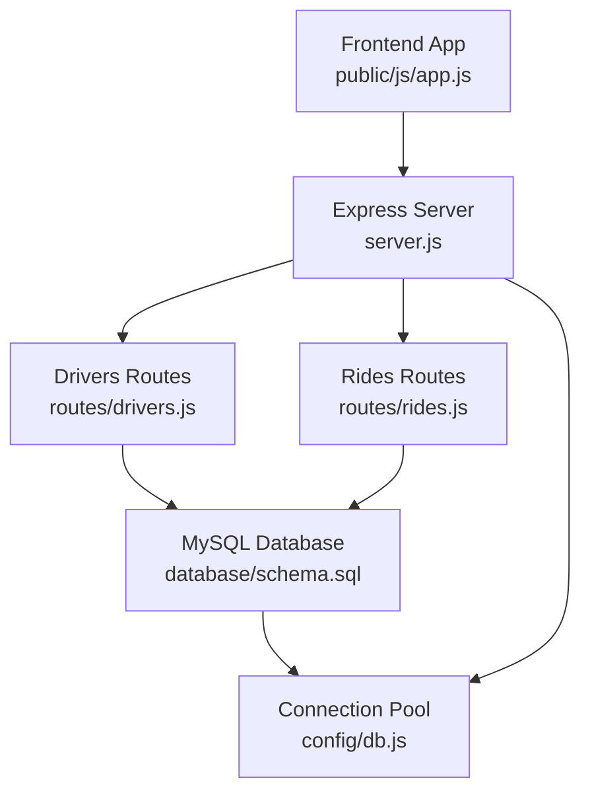
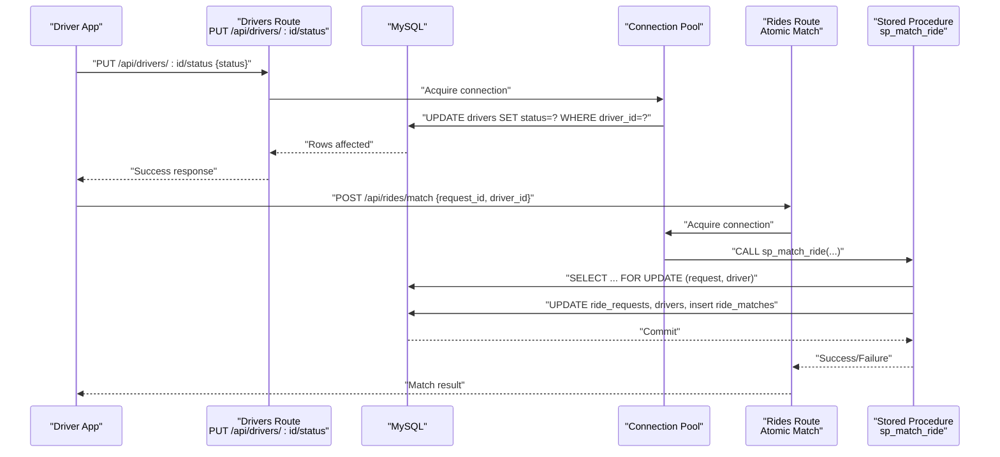
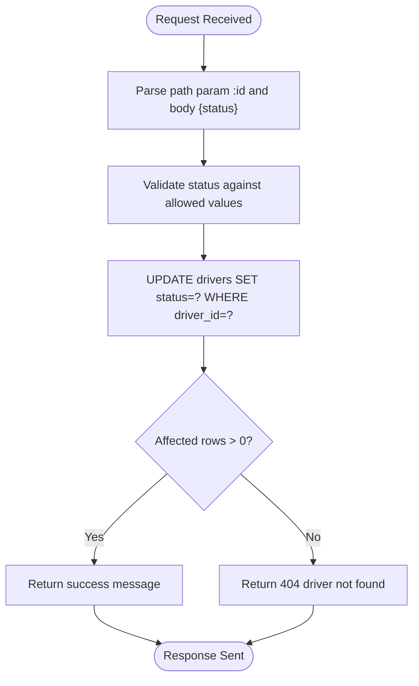
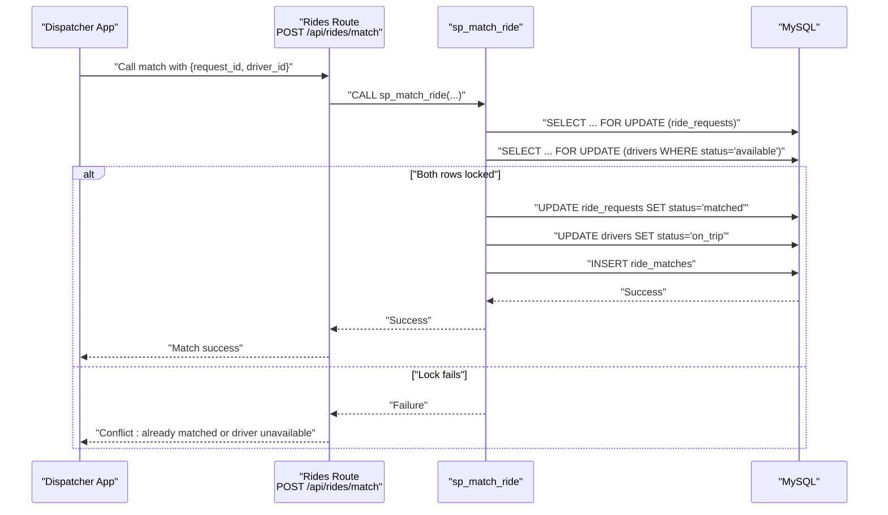
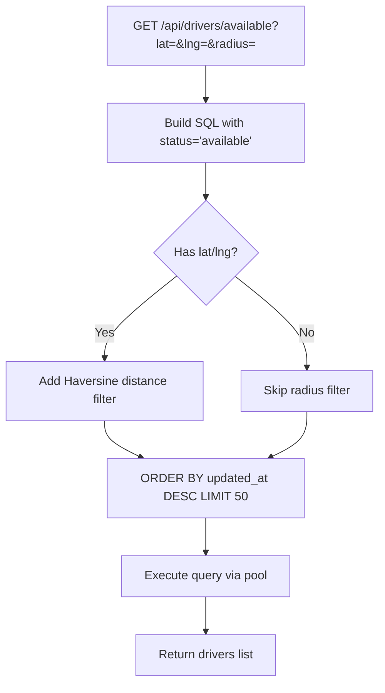
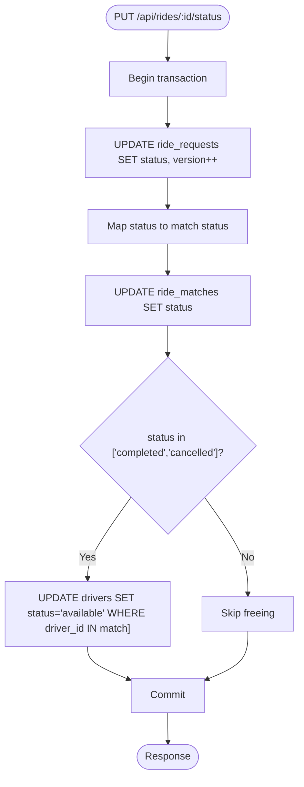
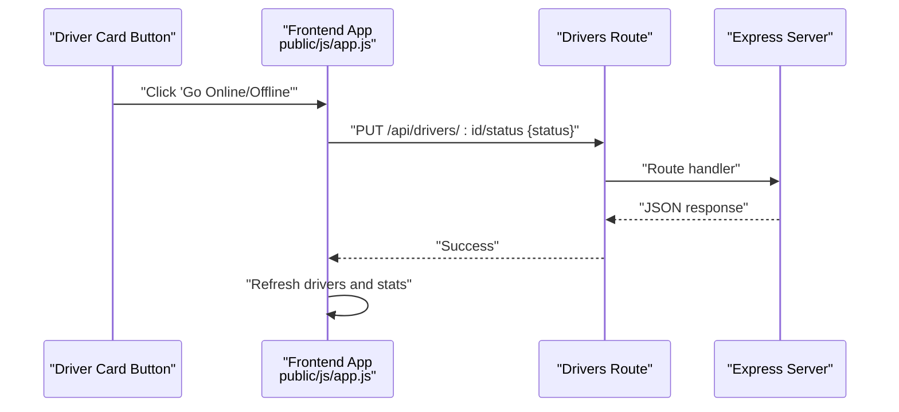
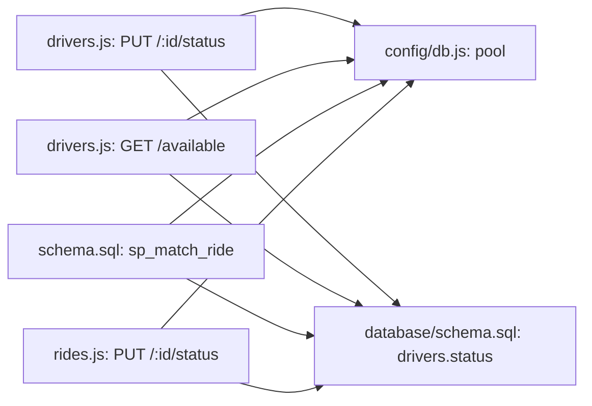

# Availability Status Management

<cite>
**Referenced Files in This Document**
- [server.js](file://server.js)
- [config/db.js](file://config/db.js)
- [routes/drivers.js](file://routes/drivers.js)
- [routes/rides.js](file://routes/rides.js)
- [database/schema.sql](file://database/schema.sql)
- [public/js/app.js](file://public/js/app.js)
- [README.md](file://README.md)
</cite>

## Table of Contents
1. [Introduction](#introduction)
2. [Project Structure](#project-structure)
3. [Core Components](#core-components)
4. [Architecture Overview](#architecture-overview)
5. [Detailed Component Analysis](#detailed-component-analysis)
6. [Dependency Analysis](#dependency-analysis)
7. [Performance Considerations](#performance-considerations)
8. [Troubleshooting Guide](#troubleshooting-guide)
9. [Conclusion](#conclusion)
10. [Appendices](#appendices)

## Introduction
This document describes the driver availability status management system, focusing on the PUT /api/drivers/:id/status endpoint that toggles driver availability between offline, available, busy, and on_trip. It explains the status update workflow, its impact on ride matching, constraints and allowed values in the database schema, and how status changes influence availability filtering during peak hours. It also covers integration patterns for driver applications, common issues such as delayed updates and race conditions, and best practices for robust status management.

## Project Structure
The system is organized around a Node.js/Express backend with a MySQL database. The relevant components for driver status management include:
- HTTP server and middleware
- Database connection pool configuration
- Driver API routes (including status updates)
- Ride API routes (including atomic matching that depends on driver status)
- Database schema defining driver status constraints and indexes
- Frontend application that triggers status changes

**Diagram sources**
- [server.js:1-84](file://server.js#L1-L84)
- [routes/drivers.js:1-182](file://routes/drivers.js#L1-L182)
- [routes/rides.js:1-272](file://routes/rides.js#L1-L272)
- [database/schema.sql:1-297](file://database/schema.sql#L1-L297)
- [config/db.js:1-50](file://config/db.js#L1-L50)

**Section sources**
- [server.js:1-84](file://server.js#L1-L84)
- [README.md:29-48](file://README.md#L29-L48)

## Core Components
- Driver status endpoint: PUT /api/drivers/:id/status updates the driver’s status field.
- Driver availability endpoint: GET /api/drivers/available filters drivers by status = 'available' and optionally by proximity.
- Atomic matching stored procedure: sp_match_ride enforces driver availability and ride uniqueness via row-level locks.
- Ride status synchronization: PUT /api/rides/:id/status updates both ride request and match statuses and frees drivers upon completion/cancellation.
- Database schema: Defines allowed status values, indexes, and optimistic locking columns.

Key implementation references:
- Status update route: [routes/drivers.js:128-148](file://routes/drivers.js#L128-L148)
- Availability query: [routes/drivers.js:38-77](file://routes/drivers.js#L38-L77)
- Atomic matching: [database/schema.sql:167-234](file://database/schema.sql#L167-L234)
- Ride status sync: [routes/rides.js:169-224](file://routes/rides.js#L169-L224)
- Schema constraints: [database/schema.sql:39](file://database/schema.sql#L39)

**Section sources**
- [routes/drivers.js:128-148](file://routes/drivers.js#L128-L148)
- [routes/drivers.js:38-77](file://routes/drivers.js#L38-L77)
- [routes/rides.js:169-224](file://routes/rides.js#L169-L224)
- [database/schema.sql:39](file://database/schema.sql#L39)

## Architecture Overview
Driver availability status is central to the matching pipeline. The frontend toggles driver status, which immediately affects who appears in the availability query. The matching process validates driver availability atomically and updates both the driver and match records.

**Diagram sources**
- [routes/drivers.js:128-148](file://routes/drivers.js#L128-L148)
- [routes/rides.js:135-167](file://routes/rides.js#L135-L167)
- [database/schema.sql:167-234](file://database/schema.sql#L167-L234)

## Detailed Component Analysis

### Driver Status Update Workflow
The PUT /api/drivers/:id/status endpoint performs a simple update to the drivers.status column. It returns a success message upon successful update or a 404 if the driver does not exist.

**Diagram sources**
- [routes/drivers.js:128-148](file://routes/drivers.js#L128-L148)
- [database/schema.sql:39](file://database/schema.sql#L39)

**Section sources**
- [routes/drivers.js:128-148](file://routes/drivers.js#L128-L148)
- [database/schema.sql:39](file://database/schema.sql#L39)

### Allowed Status Values and Constraints
The drivers.status column is defined as an ENUM with allowed values: offline, available, busy, on_trip. The schema also includes:
- An index on status for efficient availability queries.
- A version column enabling optimistic locking for concurrent updates.
- Default value offline for new drivers.

References:
- ENUM definition: [database/schema.sql:39](file://database/schema.sql#L39)
- Index on status: [database/schema.sql:46](file://database/schema.sql#L46)
- Version column: [database/schema.sql:42](file://database/schema.sql#L42)

**Section sources**
- [database/schema.sql:39](file://database/schema.sql#L39)
- [database/schema.sql:42](file://database/schema.sql#L42)
- [database/schema.sql:46](file://database/schema.sql#L46)

### Impact on Ride Matching
The atomic matching stored procedure enforces driver availability and ride uniqueness:
- It locks the pending ride request row for update.
- It checks the driver’s status equals 'available' while acquiring a lock on the driver row.
- If both checks pass, it updates the request status, driver status, and inserts a match record.

**Diagram sources**
- [routes/rides.js:135-167](file://routes/rides.js#L135-L167)
- [database/schema.sql:167-234](file://database/schema.sql#L167-L234)

**Section sources**
- [routes/rides.js:135-167](file://routes/rides.js#L135-L167)
- [database/schema.sql:167-234](file://database/schema.sql#L167-L234)

### Availability Filtering During Peak Hours
The GET /api/drivers/available endpoint filters drivers by status = 'available' and optionally applies a geographic radius around a given coordinate. This ensures only currently available drivers are considered for matching.

**Diagram sources**
- [routes/drivers.js:38-77](file://routes/drivers.js#L38-L77)

**Section sources**
- [routes/drivers.js:38-77](file://routes/drivers.js#L38-L77)

### Ride Status Synchronization and Driver Freeing
The PUT /api/rides/:id/status endpoint synchronizes ride and match statuses and frees drivers when a ride completes or is cancelled. This ensures driver availability is restored promptly.

**Diagram sources**
- [routes/rides.js:169-224](file://routes/rides.js#L169-L224)

**Section sources**
- [routes/rides.js:169-224](file://routes/rides.js#L169-L224)

### Frontend Integration Pattern
The frontend toggles driver status by calling PUT /api/drivers/:id/status with the computed new status. It then refreshes driver lists and stats to reflect the change.

**Diagram sources**
- [public/js/app.js:252-260](file://public/js/app.js#L252-L260)
- [routes/drivers.js:128-148](file://routes/drivers.js#L128-L148)

**Section sources**
- [public/js/app.js:252-260](file://public/js/app.js#L252-L260)
- [routes/drivers.js:128-148](file://routes/drivers.js#L128-L148)

## Dependency Analysis
Driver status management interacts with several components:
- Drivers route depends on the database pool for updates.
- Availability query relies on the status index for performance.
- Atomic matching depends on stored procedures and row-level locks.
- Ride status synchronization coordinates driver availability with match lifecycle.

**Diagram sources**
- [routes/drivers.js:128-148](file://routes/drivers.js#L128-L148)
- [routes/drivers.js:38-77](file://routes/drivers.js#L38-L77)
- [routes/rides.js:169-224](file://routes/rides.js#L169-L224)
- [database/schema.sql:39](file://database/schema.sql#L39)
- [database/schema.sql:167-234](file://database/schema.sql#L167-L234)
- [config/db.js:1-50](file://config/db.js#L1-50)

**Section sources**
- [routes/drivers.js:128-148](file://routes/drivers.js#L128-L148)
- [routes/drivers.js:38-77](file://routes/drivers.js#L38-L77)
- [routes/rides.js:169-224](file://routes/rides.js#L169-L224)
- [database/schema.sql:39](file://database/schema.sql#L39)
- [database/schema.sql:167-234](file://database/schema.sql#L167-L234)
- [config/db.js:1-50](file://config/db.js#L1-50)

## Performance Considerations
- Connection pooling: The pool is configured for peak-hour concurrency with a large connection limit and queue limits.
- Indexing: The status index accelerates availability queries; the location index supports frequent GPS updates.
- Upsert pattern: Location updates use a single atomic upsert to avoid race conditions.
- Transaction boundaries: Ride status synchronization wraps updates in transactions to maintain consistency.

Practical implications:
- Status updates are lightweight and rely on simple UPDATE statements.
- Availability queries benefit from the status index and can be combined with spatial filters.
- Atomic matching prevents contention and double-booking under high load.

**Section sources**
- [config/db.js:7-30](file://config/db.js#L7-L30)
- [database/schema.sql:46](file://database/schema.sql#L46)
- [database/schema.sql:67](file://database/schema.sql#L67)
- [routes/drivers.js:101-126](file://routes/drivers.js#L101-L126)
- [routes/rides.js:169-224](file://routes/rides.js#L169-L224)

## Troubleshooting Guide
Common issues and resolutions:
- Delayed status updates
  - Symptom: Driver appears offline despite being online.
  - Cause: Frontend may not refresh immediately after status change.
  - Resolution: Trigger a manual refresh of drivers and stats after status change.
  - Reference: [public/js/app.js:252-260](file://public/js/app.js#L252-L260)

- Status synchronization problems
  - Symptom: Driver remains busy after ride completion.
  - Cause: Ride status not updated to completed/cancelled.
  - Resolution: Ensure PUT /api/rides/:id/status is called with completed or cancelled; the backend frees drivers upon completion/cancellation.
  - Reference: [routes/rides.js:198-207](file://routes/rides.js#L198-L207)

- Race conditions during status transitions
  - Symptom: Double-booking or inconsistent availability.
  - Cause: Concurrent updates without atomicity.
  - Resolution: Use atomic matching via stored procedures and optimistic locking; avoid manual status changes during active trips.
  - References: [database/schema.sql:167-234](file://database/schema.sql#L167-L234), [database/schema.sql:42](file://database/schema.sql#L42)

- Driver not found errors
  - Symptom: 404 when updating status.
  - Cause: Invalid driver ID.
  - Resolution: Verify driver ID and existence before calling the endpoint.
  - Reference: [routes/drivers.js:139-141](file://routes/drivers.js#L139-L141)

**Section sources**
- [public/js/app.js:252-260](file://public/js/app.js#L252-L260)
- [routes/rides.js:198-207](file://routes/rides.js#L198-L207)
- [database/schema.sql:167-234](file://database/schema.sql#L167-L234)
- [database/schema.sql:42](file://database/schema.sql#L42)
- [routes/drivers.js:139-141](file://routes/drivers.js#L139-L141)

## Conclusion
Driver availability status is a critical factor in ride matching and system responsiveness. The PUT /api/drivers/:id/status endpoint provides a simple, reliable mechanism to manage driver availability, which is immediately reflected in availability queries and enforced by atomic matching procedures. Proper integration patterns, including timely status synchronization and transactional ride lifecycle updates, ensure correctness and performance under peak-hour loads.

## Appendices

### API Definitions
- PUT /api/drivers/:id/status
  - Path parameters: id (driver identifier)
  - Request body: { status: one of offline, available, busy, on_trip }
  - Responses:
    - 200 OK: { success: true, message: "Status updated to ..." }
    - 404 Not Found: { success: false, error: "Driver not found" }
    - 500 Internal Server Error: { success: false, error: "<message>" }
  - References: [routes/drivers.js:128-148](file://routes/drivers.js#L128-L148), [database/schema.sql:39](file://database/schema.sql#L39)

- GET /api/drivers/available
  - Query parameters: lat, lng, radius (km)
  - Responses: { success: true, count, drivers: [...] }
  - Notes: Filters by status = 'available'; optionally applies geographic radius.
  - Reference: [routes/drivers.js:38-77](file://routes/drivers.js#L38-L77)

- PUT /api/rides/:id/status
  - Path parameters: id (request identifier)
  - Request body: { status: one of pending, matched, picked_up, completed, cancelled }, optional version
  - Behavior: Updates request and match statuses; frees driver on completion/cancellation.
  - Reference: [routes/rides.js:169-224](file://routes/rides.js#L169-L224)

### Practical Examples
- Status update request
  - Endpoint: PUT /api/drivers/1/status
  - Body: { "status": "available" }
  - Expected response: { "success": true, "message": "Status updated to available" }

- Availability query request
  - Endpoint: GET /api/drivers/available?lat=40.7128&lng=-74.0060&radius=5
  - Response: { "success": true, "count": N, "drivers": [...] } filtered by status and proximity

- Ride status synchronization
  - Endpoint: PUT /api/rides/100/status
  - Body: { "status": "completed" }
  - Effect: Updates request and match statuses; driver status set to available

**Section sources**
- [routes/drivers.js:128-148](file://routes/drivers.js#L128-L148)
- [routes/drivers.js:38-77](file://routes/drivers.js#L38-L77)
- [routes/rides.js:169-224](file://routes/rides.js#L169-L224)