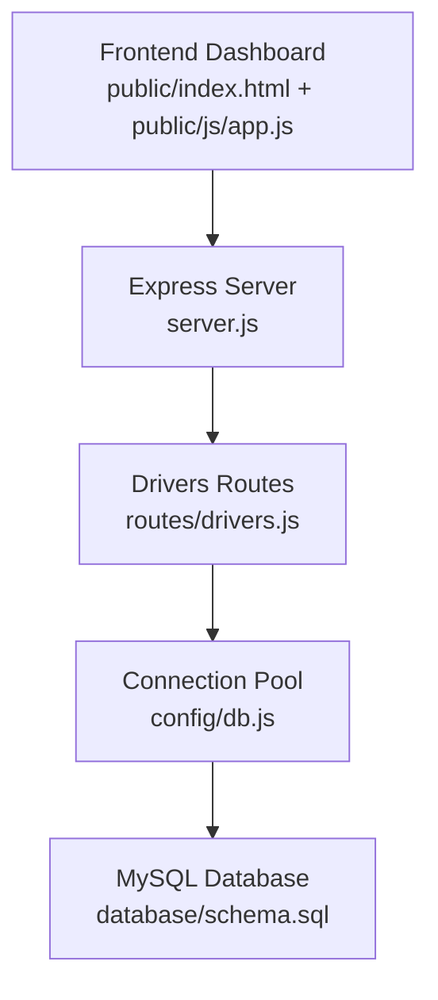
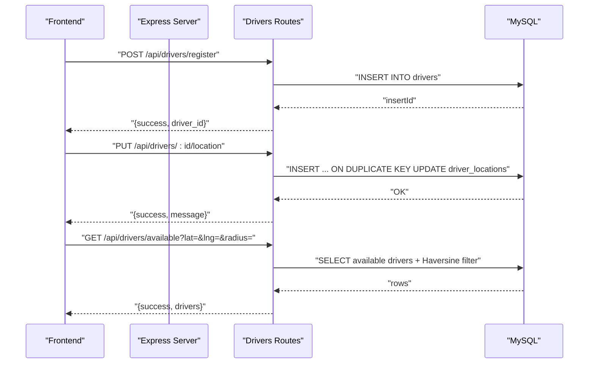
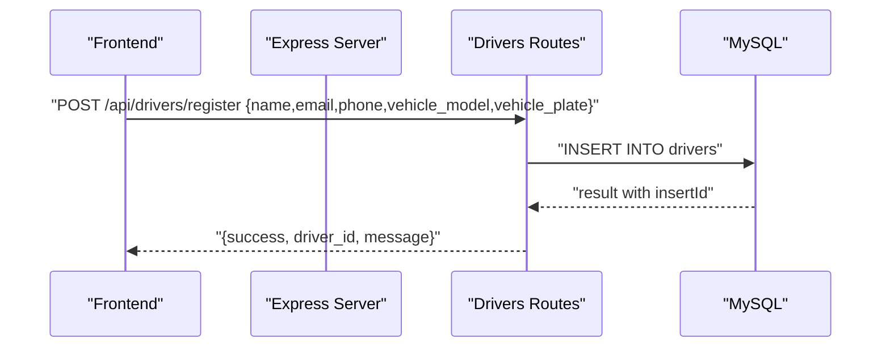
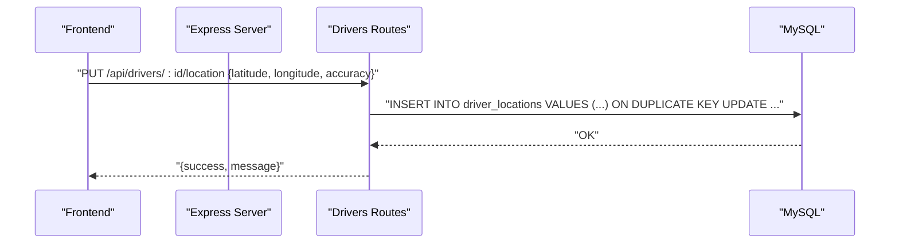
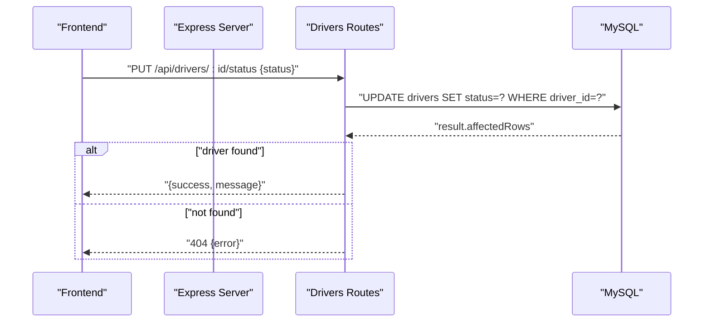
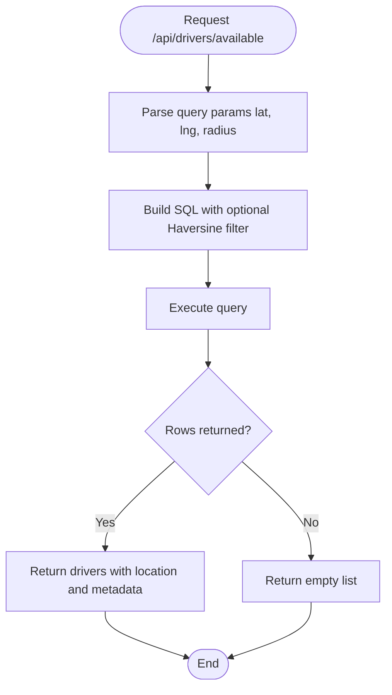
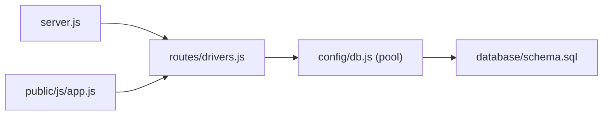

# Driver Management System

<cite>
**Referenced Files in This Document**
- [server.js](file://server.js)
- [routes/drivers.js](file://routes/drivers.js)
- [database/schema.sql](file://database/schema.sql)
- [config/db.js](file://config/db.js)
- [public/js/app.js](file://public/js/app.js)
- [README.md](file://README.md)
</cite>

## Table of Contents
1. [Introduction](#introduction)
2. [Project Structure](#project-structure)
3. [Core Components](#core-components)
4. [Architecture Overview](#architecture-overview)
5. [Detailed Component Analysis](#detailed-component-analysis)
6. [Dependency Analysis](#dependency-analysis)
7. [Performance Considerations](#performance-considerations)
8. [Troubleshooting Guide](#troubleshooting-guide)
9. [Conclusion](#conclusion)
10. [Appendices](#appendices)

## Introduction
This document explains the Driver Management System component of the ride-sharing platform. It focuses on:
- Driver registration and onboarding
- Real-time location tracking with frequent upsert operations using ON DUPLICATE KEY UPDATE
- Availability status management
- Performance metrics (ratings and total trips)
- Geospatial proximity filtering for finding nearby available drivers
- Integration with ride matching and dashboard monitoring
- Common issues and performance optimizations for high-frequency location updates

## Project Structure
The system is organized around a Node.js/Express backend, a MySQL database, and a vanilla JavaScript frontend dashboard. The driver management API is implemented in dedicated routes and backed by a relational schema designed for high read throughput and frequent updates.

**Diagram sources**
- [server.js:1-84](file://server.js#L1-L84)
- [routes/drivers.js:1-182](file://routes/drivers.js#L1-L182)
- [config/db.js:1-50](file://config/db.js#L1-L50)
- [database/schema.sql:1-297](file://database/schema.sql#L1-L297)

**Section sources**
- [server.js:1-84](file://server.js#L1-L84)
- [routes/drivers.js:1-182](file://routes/drivers.js#L1-L182)
- [config/db.js:1-50](file://config/db.js#L1-L50)
- [database/schema.sql:1-297](file://database/schema.sql#L1-L297)
- [README.md:29-48](file://README.md#L29-L48)

## Core Components
- Driver Registration: Creates a new driver profile with contact and vehicle details.
- Location Tracking: Frequent updates of GPS coordinates using atomic upserts to avoid race conditions.
- Availability Status: Toggles driver availability and integrates with ride matching.
- Proximity Filtering: Queries available drivers near a given coordinate within a radius.
- Metrics: Exposes driver ratings and total trips for monitoring and matching.
- Dashboard Integration: Frontend auto-refreshes driver lists and status for live monitoring.

**Section sources**
- [routes/drivers.js:79-148](file://routes/drivers.js#L79-L148)
- [database/schema.sql:29-69](file://database/schema.sql#L29-L69)
- [public/js/app.js:225-260](file://public/js/app.js#L225-L260)

## Architecture Overview
The driver management subsystem consists of:
- Express routes for drivers: registration, location updates, status toggling, and queries
- MySQL schema optimized for frequent writes and spatial queries
- Connection pooling for peak-hour concurrency
- Frontend dashboard that triggers driver-related operations and displays live data

**Diagram sources**
- [routes/drivers.js:79-148](file://routes/drivers.js#L79-L148)
- [database/schema.sql:52-69](file://database/schema.sql#L52-L69)

## Detailed Component Analysis

### Driver Registration Workflow
- Endpoint: POST /api/drivers/register
- Purpose: Onboard new drivers with name, email, phone, vehicle model, and plate.
- Implementation highlights:
  - Validates presence of required fields in request body.
  - Inserts a new driver row and returns the generated driver_id.
  - Returns standardized success/error response.

**Diagram sources**
- [routes/drivers.js:79-99](file://routes/drivers.js#L79-L99)

**Section sources**
- [routes/drivers.js:79-99](file://routes/drivers.js#L79-L99)

### Location Tracking and Atomic Upserts
- Endpoint: PUT /api/drivers/:id/location
- Purpose: Update driver GPS coordinates frequently during trips.
- Implementation highlights:
  - Uses INSERT ... ON DUPLICATE KEY UPDATE to atomically upsert driver_locations.
  - Updates latitude, longitude, accuracy, and updated_at in a single statement.
  - Prevents race conditions that could occur with separate SELECT/UPDATE.

**Diagram sources**
- [routes/drivers.js:101-126](file://routes/drivers.js#L101-L126)
- [database/schema.sql:52-69](file://database/schema.sql#L52-L69)

**Section sources**
- [routes/drivers.js:101-126](file://routes/drivers.js#L101-L126)
- [database/schema.sql:52-69](file://database/schema.sql#L52-L69)

### Availability Status Management
- Endpoint: PUT /api/drivers/:id/status
- Purpose: Toggle driver availability (online/offline) for matching.
- Implementation highlights:
  - Updates drivers.status for the given driver_id.
  - Returns 404 if the driver does not exist.
  - Integrates with ride matching logic that filters by status.

**Diagram sources**
- [routes/drivers.js:128-148](file://routes/drivers.js#L128-L148)

**Section sources**
- [routes/drivers.js:128-148](file://routes/drivers.js#L128-L148)

### Proximity Filtering for Available Drivers
- Endpoint: GET /api/drivers/available
- Purpose: Retrieve available drivers near a given coordinate within a radius.
- Implementation highlights:
  - Filters drivers by status = 'available'.
  - Applies optional Haversine-based distance filter using lat/lng/radius query parameters.
  - Limits results and orders by recency of location updates.

**Diagram sources**
- [routes/drivers.js:38-77](file://routes/drivers.js#L38-L77)
- [database/schema.sql:52-69](file://database/schema.sql#L52-L69)

**Section sources**
- [routes/drivers.js:38-77](file://routes/drivers.js#L38-L77)

### Driver Queries and Metrics
- Endpoint: GET /api/drivers
- Purpose: List all drivers with current location and performance metrics.
- Implementation highlights:
  - Joins drivers with driver_locations to include latest coordinates.
  - Returns driver_id, name, contact, vehicle, status, rating, total_trips, and location_updated.

Return values include:
- success: boolean
- count: number of drivers
- drivers: array of driver records with fields described above

**Section sources**
- [routes/drivers.js:10-36](file://routes/drivers.js#L10-L36)

### Relationship with Ride Matching and Dashboard Monitoring
- Dashboard auto-refreshes:
  - Stats, rides, and drivers are refreshed at intervals to reflect live state.
- Driver availability feeds matching:
  - The available drivers endpoint powers the match console’s driver selection.
- Ride history:
  - GET /api/drivers/:id/rides provides recent trip details for driver performance monitoring.

**Section sources**
- [public/js/app.js:20-29](file://public/js/app.js#L20-L29)
- [routes/drivers.js:150-179](file://routes/drivers.js#L150-L179)

## Dependency Analysis
- Express server initializes middleware, static assets, and routes.
- Drivers routes depend on a MySQL connection pool for database operations.
- Database schema defines tables and indexes optimized for driver location updates and spatial queries.
- Frontend interacts with drivers routes to manage drivers and monitor status.

**Diagram sources**
- [server.js:1-84](file://server.js#L1-L84)
- [routes/drivers.js:1-182](file://routes/drivers.js#L1-L182)
- [config/db.js:1-50](file://config/db.js#L1-L50)
- [database/schema.sql:1-297](file://database/schema.sql#L1-L297)
- [public/js/app.js:1-373](file://public/js/app.js#L1-L373)

**Section sources**
- [server.js:1-84](file://server.js#L1-L84)
- [routes/drivers.js:1-182](file://routes/drivers.js#L1-L182)
- [config/db.js:1-50](file://config/db.js#L1-L50)
- [database/schema.sql:1-297](file://database/schema.sql#L1-L297)
- [public/js/app.js:1-373](file://public/js/app.js#L1-L373)

## Performance Considerations
- Connection pooling:
  - Pool size tuned for peak-hour concurrency with queue limits and timeouts.
- Atomic upserts:
  - INSERT ... ON DUPLICATE KEY UPDATE eliminates race conditions and reduces round-trips for frequent location updates.
- Indexing:
  - Spatial-like index on driver_locations and status indexes on drivers support fast available-driver queries.
- Query limits:
  - Available driver queries are limited and ordered by recency to reduce load.
- Stale data cleanup:
  - Stored procedure to remove stale driver locations periodically.

**Section sources**
- [config/db.js:7-30](file://config/db.js#L7-L30)
- [database/schema.sql:52-69](file://database/schema.sql#L52-L69)
- [routes/drivers.js:38-77](file://routes/drivers.js#L38-L77)
- [database/schema.sql:265-270](file://database/schema.sql#L265-L270)

## Troubleshooting Guide
Common issues and resolutions:
- Location update conflicts:
  - Ensure the driver_locations table has a unique constraint on driver_id to enable atomic upserts.
- Stale driver data:
  - Use the stored procedure to clean stale locations periodically.
- Performance under high-frequency updates:
  - Verify connection pool settings and consider increasing pool size if needed.
- Driver not found on status update:
  - Confirm the driver_id exists; the route returns 404 when no rows are affected.

Operational checks:
- Health endpoint: GET /api/health validates database connectivity.
- Environment configuration: Ensure DB_HOST, DB_PORT, DB_USER, DB_PASSWORD, DB_NAME are set.

**Section sources**
- [routes/drivers.js:128-148](file://routes/drivers.js#L128-L148)
- [database/schema.sql:52-69](file://database/schema.sql#L52-L69)
- [database/schema.sql:265-270](file://database/schema.sql#L265-L270)
- [server.js:43-51](file://server.js#L43-L51)
- [README.md:68-89](file://README.md#L68-L89)

## Conclusion
The Driver Management System is built for high concurrency and frequent updates. It uses atomic upserts for location tracking, strategic indexing for proximity queries, and a connection pool optimized for peak-hour loads. Together with dashboard monitoring and ride matching integration, it provides a robust foundation for managing drivers in a real-time ride-sharing environment.

## Appendices

### API Definitions: Drivers
- GET /api/drivers
  - Returns: success, count, drivers[]
  - Fields include driver metadata, status, rating, total_trips, and latest location coordinates.

- GET /api/drivers/available
  - Query params: lat, lng, radius (km, default 5)
  - Returns: success, count, drivers[] filtered by availability and proximity.

- POST /api/drivers/register
  - Body: name, email, phone, vehicle_model, vehicle_plate
  - Returns: success, driver_id, message

- PUT /api/drivers/:id/location
  - Body: latitude, longitude, accuracy (optional)
  - Returns: success, message

- PUT /api/drivers/:id/status
  - Body: status (e.g., 'available', 'offline')
  - Returns: success, message or 404 error

- GET /api/drivers/:id/rides
  - Returns: success, count, rides[] with match details and rider info

**Section sources**
- [routes/drivers.js:10-179](file://routes/drivers.js#L10-L179)

### Database Schema Highlights
- drivers: status, rating, total_trips, version (optimistic locking), indexes for status and updated_at
- driver_locations: unique driver_id, indexes for spatial-ish queries and updated_at
- Stored procedures: atomic match and status updates, stale location cleanup

**Section sources**
- [database/schema.sql:29-69](file://database/schema.sql#L29-L69)
- [database/schema.sql:160-272](file://database/schema.sql#L160-L272)