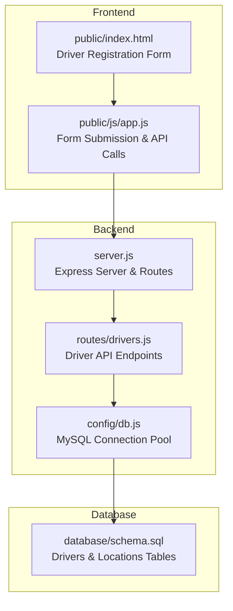
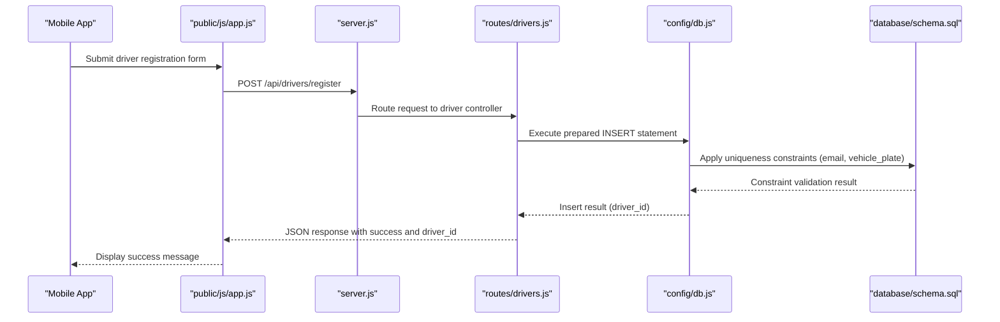
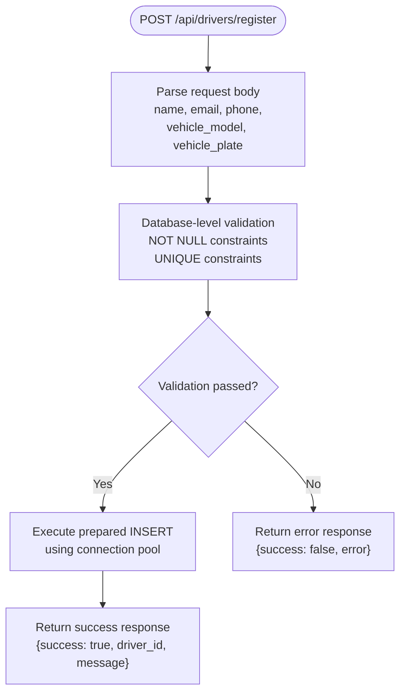
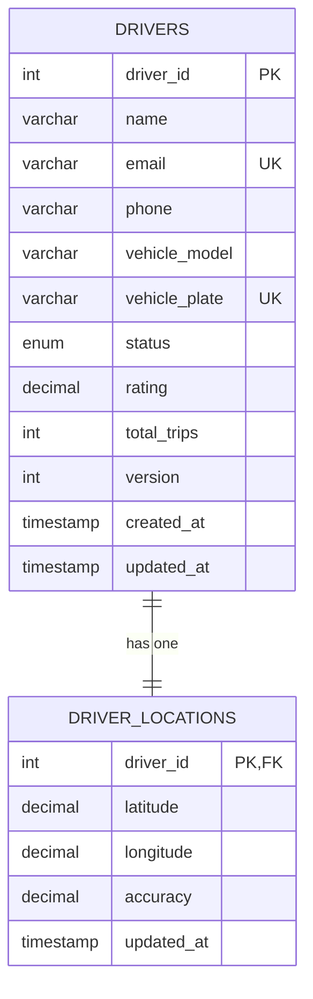
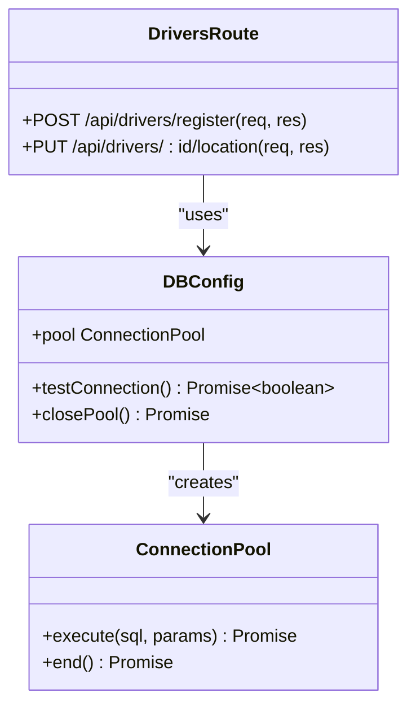
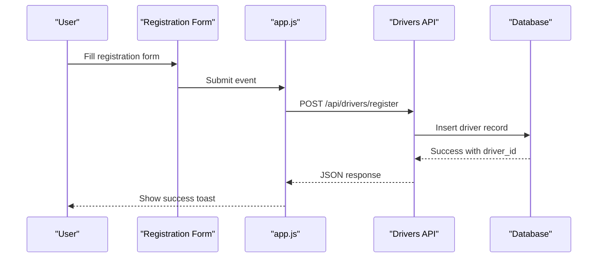
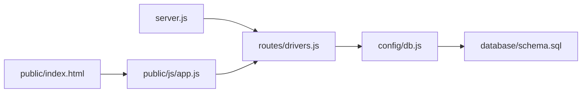

# Driver Registration and Onboarding

<cite>
**Referenced Files in This Document**
- [server.js](file://server.js)
- [drivers.js](file://routes/drivers.js)
- [db.js](file://config/db.js)
- [schema.sql](file://database/schema.sql)
- [index.html](file://public/index.html)
- [app.js](file://public/js/app.js)
- [README.md](file://README.md)
</cite>

## Table of Contents
1. [Introduction](#introduction)
2. [Project Structure](#project-structure)
3. [Core Components](#core-components)
4. [Architecture Overview](#architecture-overview)
5. [Detailed Component Analysis](#detailed-component-analysis)
6. [Dependency Analysis](#dependency-analysis)
7. [Performance Considerations](#performance-considerations)
8. [Troubleshooting Guide](#troubleshooting-guide)
9. [Conclusion](#conclusion)

## Introduction
This document provides comprehensive documentation for the driver registration and onboarding process in the ride-sharing matching system. It covers the POST /api/drivers/register endpoint, required field validation, database insertion using prepared statements, error handling scenarios, and the relationship between driver registration and subsequent location tracking setup. Practical examples and troubleshooting guidance are included for mobile application integration.

## Project Structure
The system follows a layered architecture with a Node.js/Express backend, MySQL database, and a vanilla JavaScript frontend. The driver registration workflow spans the frontend form submission, backend route handling, database schema constraints, and connection pooling.

**Diagram sources**
- [server.js:1-84](file://server.js#L1-L84)
- [drivers.js:1-182](file://routes/drivers.js#L1-L182)
- [db.js:1-50](file://config/db.js#L1-L50)
- [schema.sql:1-297](file://database/schema.sql#L1-L297)
- [index.html:139-187](file://public/index.html#L139-L187)
- [app.js:93-105](file://public/js/app.js#L93-L105)

**Section sources**
- [README.md:29-48](file://README.md#L29-L48)
- [server.js:1-84](file://server.js#L1-L84)
- [drivers.js:1-182](file://routes/drivers.js#L1-L182)
- [db.js:1-50](file://config/db.js#L1-L50)
- [schema.sql:1-297](file://database/schema.sql#L1-L297)
- [index.html:139-187](file://public/index.html#L139-L187)
- [app.js:93-105](file://public/js/app.js#L93-L105)

## Core Components
- Driver Registration Endpoint: POST /api/drivers/register
- Required Fields: name, email, phone, vehicle_model, vehicle_plate
- Validation Requirements: All fields are required; uniqueness enforced at database level for email and vehicle_plate
- Database Insertion: Prepared statement using connection pool for security and performance
- Error Handling: Centralized try/catch blocks with 500 responses on failure
- Relationship to Location Tracking: Registration enables subsequent location updates via PUT /api/drivers/:id/location

**Section sources**
- [drivers.js:79-99](file://routes/drivers.js#L79-L99)
- [schema.sql:32-49](file://database/schema.sql#L32-L49)
- [db.js:7-30](file://config/db.js#L7-L30)

## Architecture Overview
The driver registration process involves the frontend form, backend route handler, database schema constraints, and connection pooling. The flow ensures data integrity through database-level uniqueness constraints and prepared statements.

**Diagram sources**
- [app.js:93-105](file://public/js/app.js#L93-L105)
- [drivers.js:79-99](file://routes/drivers.js#L79-L99)
- [db.js:7-30](file://config/db.js#L7-L30)
- [schema.sql:32-49](file://database/schema.sql#L32-L49)

## Detailed Component Analysis

### Driver Registration Endpoint
The POST /api/drivers/register endpoint handles new driver onboarding with the following characteristics:
- Request Body Fields: name, email, phone, vehicle_model, vehicle_plate
- Validation: All fields are required; validation occurs at the database level via NOT NULL constraints and UNIQUE constraints
- Security: Uses prepared statements with parameter binding to prevent SQL injection
- Response: Returns success flag, driver_id, and success message

**Diagram sources**
- [drivers.js:79-99](file://routes/drivers.js#L79-L99)
- [schema.sql:32-49](file://database/schema.sql#L32-L49)

**Section sources**
- [drivers.js:79-99](file://routes/drivers.js#L79-L99)
- [schema.sql:32-49](file://database/schema.sql#L32-L49)

### Database Schema and Constraints
The drivers table enforces data integrity through:
- Primary key: driver_id (auto-increment)
- Required fields: name, email, phone, vehicle_model
- Unique constraints: email (unique), vehicle_plate (unique)
- Status enumeration: offline, available, busy, on_trip
- Timestamps: created_at, updated_at with automatic updates

**Diagram sources**
- [schema.sql:32-49](file://database/schema.sql#L32-L49)
- [schema.sql:54-69](file://database/schema.sql#L54-L69)

**Section sources**
- [schema.sql:32-49](file://database/schema.sql#L32-L49)
- [schema.sql:54-69](file://database/schema.sql#L54-L69)

### Connection Pooling and Prepared Statements
The backend uses a connection pool optimized for high concurrency:
- Pool size: 50 connections with queue limit of 100
- Timeouts: 10-second connect/acquire/timeout limits
- Prepared statements: Parameterized queries prevent SQL injection
- Atomic operations: UPSERT pattern for location updates

**Diagram sources**
- [db.js:7-30](file://config/db.js#L7-L30)
- [drivers.js:79-126](file://routes/drivers.js#L79-L126)

**Section sources**
- [db.js:7-30](file://config/db.js#L7-L30)
- [drivers.js:79-126](file://routes/drivers.js#L79-L126)

### Frontend Integration
The frontend provides a registration form with client-side validation and seamless API integration:
- Form fields: name, email, phone, vehicle_model, vehicle_plate
- Client-side validation: HTML required attributes
- API integration: Form submission triggers POST /api/drivers/register
- User feedback: Toast notifications for success/error states

**Diagram sources**
- [index.html:144-166](file://public/index.html#L144-L166)
- [app.js:93-105](file://public/js/app.js#L93-L105)
- [drivers.js:79-99](file://routes/drivers.js#L79-L99)

**Section sources**
- [index.html:144-166](file://public/index.html#L144-L166)
- [app.js:93-105](file://public/js/app.js#L93-L105)

## Dependency Analysis
The driver registration system exhibits clear separation of concerns with minimal coupling between components.

**Diagram sources**
- [server.js:40-41](file://server.js#L40-L41)
- [drivers.js:1-3](file://routes/drivers.js#L1-L3)
- [db.js:1-2](file://config/db.js#L1-L2)
- [schema.sql:1-10](file://database/schema.sql#L1-L10)
- [index.html:139-187](file://public/index.html#L139-L187)
- [app.js:93-105](file://public/js/app.js#L93-L105)

**Section sources**
- [server.js:40-41](file://server.js#L40-L41)
- [drivers.js:1-3](file://routes/drivers.js#L1-L3)
- [db.js:1-2](file://config/db.js#L1-L2)
- [schema.sql:1-10](file://database/schema.sql#L1-L10)
- [index.html:139-187](file://public/index.html#L139-L187)
- [app.js:93-105](file://public/js/app.js#L93-L105)

## Performance Considerations
- Connection Pooling: 50 concurrent connections handle peak-hour traffic
- Prepared Statements: Reduce parsing overhead and prevent SQL injection
- Indexes: Strategic indexes on status and timestamps optimize frequent queries
- UPSERT Pattern: Atomic location updates eliminate race conditions
- Timeout Configuration: Prevents hanging connections during high load

## Troubleshooting Guide

### Common Registration Issues
- Duplicate Email: Database constraint violation on email uniqueness
- Duplicate Vehicle Plate: Database constraint violation on vehicle_plate uniqueness  
- Invalid Data Types: Type mismatches cause constraint violations
- Database Connection Failures: Connection pool exhaustion or network issues

### Error Scenarios and Responses
- Duplicate Registration: Server returns 500 with error message from database
- Validation Failure: Database rejects NULL values for required fields
- Connection Issues: Health check endpoint indicates database connectivity problems

### Integration Patterns for Mobile Applications
- Form Validation: Validate required fields before submission
- Error Handling: Display user-friendly messages for constraint violations
- Retry Logic: Implement exponential backoff for transient failures
- Offline Support: Queue requests locally and sync when connectivity resumes

**Section sources**
- [drivers.js:95-98](file://routes/drivers.js#L95-L98)
- [schema.sql:35-38](file://database/schema.sql#L35-L38)
- [server.js:43-51](file://server.js#L43-L51)

## Conclusion
The driver registration system provides a secure, scalable foundation for onboarding new drivers in the ride-sharing platform. The implementation leverages database constraints for data integrity, prepared statements for security, and connection pooling for performance. The modular architecture enables easy extension for additional validation rules, enhanced error handling, and integration with mobile applications through standardized API patterns.