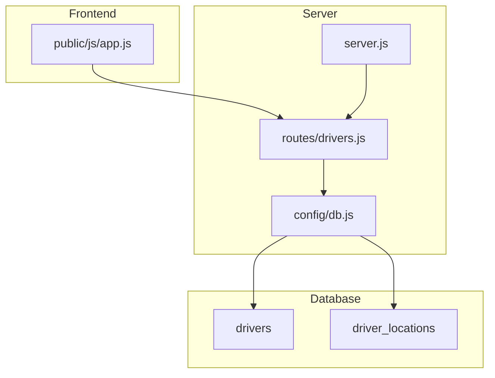
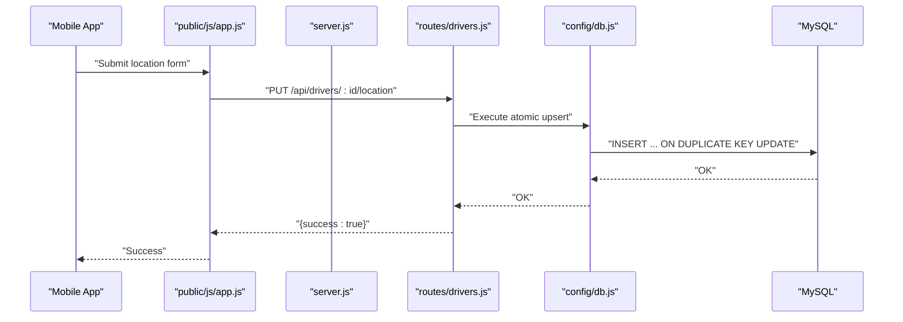
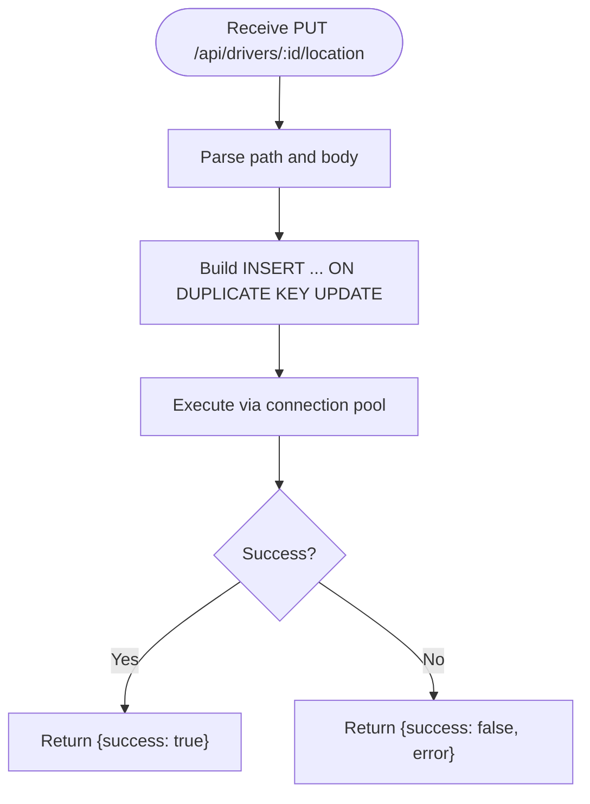
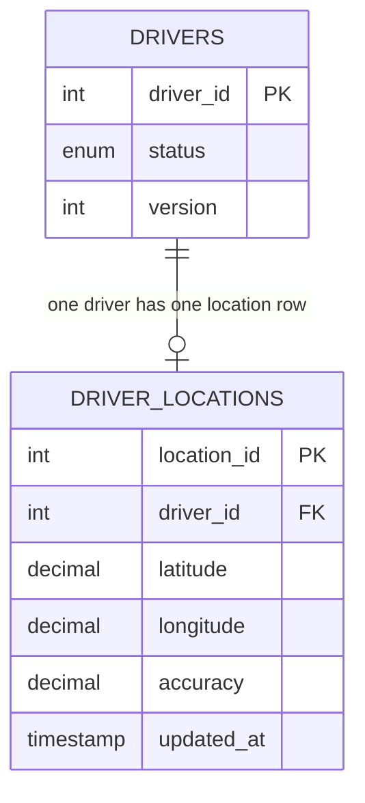

# Location Tracking and Updates

<cite>
**Referenced Files in This Document**
- [server.js](file://server.js)
- [config/db.js](file://config/db.js)
- [routes/drivers.js](file://routes/drivers.js)
- [database/schema.sql](file://database/schema.sql)
- [public/js/app.js](file://public/js/app.js)
- [README.md](file://README.md)
</cite>

## Table of Contents
1. [Introduction](#introduction)
2. [Project Structure](#project-structure)
3. [Core Components](#core-components)
4. [Architecture Overview](#architecture-overview)
5. [Detailed Component Analysis](#detailed-component-analysis)
6. [Dependency Analysis](#dependency-analysis)
7. [Performance Considerations](#performance-considerations)
8. [Troubleshooting Guide](#troubleshooting-guide)
9. [Conclusion](#conclusion)
10. [Appendices](#appendices)

## Introduction
This document explains the driver location tracking and frequent update system, focusing on the PUT /api/drivers/:id/location endpoint. It covers the atomic upsert mechanism using INSERT ... ON DUPLICATE KEY UPDATE to prevent race conditions during high-frequency updates, the database design of the driver_locations table and its relationship to the drivers table, and practical guidance for mobile app integration and update frequency best practices.

## Project Structure
The system is a Node.js/Express backend with a MySQL database and a simple HTML/JavaScript frontend. The location update endpoint is part of the drivers route module and uses a connection pool configured for high concurrency.

**Diagram sources**
- [server.js:1-84](file://server.js#L1-L84)
- [routes/drivers.js:1-182](file://routes/drivers.js#L1-L182)
- [config/db.js:1-50](file://config/db.js#L1-L50)
- [database/schema.sql:54-69](file://database/schema.sql#L54-L69)

**Section sources**
- [server.js:1-84](file://server.js#L1-L84)
- [routes/drivers.js:1-182](file://routes/drivers.js#L1-L182)
- [config/db.js:1-50](file://config/db.js#L1-L50)
- [README.md:29-48](file://README.md#L29-L48)

## Core Components
- PUT /api/drivers/:id/location: Handles frequent GPS updates with atomic upsert semantics.
- driver_locations table: Stores latest GPS coordinates and accuracy per driver with a unique constraint per driver.
- Connection pool: Optimized for peak-hour concurrency and frequent writes.
- Frontend form: Demonstrates how to send location updates to the endpoint.

Key implementation references:
- Endpoint definition and upsert logic: [routes/drivers.js:101-126](file://routes/drivers.js#L101-L126)
- Table schema and unique constraint: [database/schema.sql:54-69](file://database/schema.sql#L54-L69)
- Connection pool configuration: [config/db.js:7-30](file://config/db.js#L7-L30)
- Frontend update call: [public/js/app.js:107-122](file://public/js/app.js#L107-L122)

**Section sources**
- [routes/drivers.js:101-126](file://routes/drivers.js#L101-L126)
- [database/schema.sql:54-69](file://database/schema.sql#L54-L69)
- [config/db.js:7-30](file://config/db.js#L7-L30)
- [public/js/app.js:107-122](file://public/js/app.js#L107-L122)

## Architecture Overview
The location update workflow is a write-heavy, low-latency path designed for continuous updates during active trips.

**Diagram sources**
- [public/js/app.js:107-122](file://public/js/app.js#L107-L122)
- [routes/drivers.js:101-126](file://routes/drivers.js#L101-L126)
- [config/db.js:7-30](file://config/db.js#L7-L30)
- [database/schema.sql:54-69](file://database/schema.sql#L54-L69)

## Detailed Component Analysis

### PUT /api/drivers/:id/location
Purpose:
- Accepts latitude, longitude, and optional accuracy.
- Performs an atomic upsert to ensure thread-safe updates even when multiple updates arrive concurrently.

Behavior:
- Uses a single INSERT ... ON DUPLICATE KEY UPDATE statement.
- On conflict (unique key on driver_id), updates only the specified fields and refreshes updated_at.
- Returns a success response on completion.

Parameters:
- Path parameter: driver_id
- Body fields: latitude, longitude, accuracy (optional)

Response:
- On success: { success: true, message: "Location updated" }
- On error: { success: false, error: "<message>" }

Implementation references:
- Endpoint and upsert: [routes/drivers.js:101-126](file://routes/drivers.js#L101-L126)

**Section sources**
- [routes/drivers.js:101-126](file://routes/drivers.js#L101-L126)

### Atomic Upsert Mechanics
Mechanics:
- The driver_locations table has a unique key on driver_id, ensuring one row per driver.
- The upsert operation inserts a new row if the driver_id does not exist, or updates existing fields if it does.
- updated_at is refreshed on every update to support cleanup and staleness detection.

Database references:
- Unique key and indexes: [database/schema.sql:66-68](file://database/schema.sql#L66-L68)
- Upsert SQL: [routes/drivers.js:110-119](file://routes/drivers.js#L110-L119)

**Diagram sources**
- [routes/drivers.js:101-126](file://routes/drivers.js#L101-L126)
- [database/schema.sql:54-69](file://database/schema.sql#L54-L69)

**Section sources**
- [routes/drivers.js:101-126](file://routes/drivers.js#L101-L126)
- [database/schema.sql:54-69](file://database/schema.sql#L54-L69)

### Database Design: driver_locations and drivers
Schema highlights:
- driver_locations
  - driver_id: foreign key to drivers.driver_id
  - latitude, longitude: precise decimal fields
  - accuracy: optional decimal field
  - updated_at: auto-updated timestamp
  - Unique key on driver_id ensures one row per driver
  - Indexes on latitude/longitude and updated_at support queries and cleanup
- drivers
  - driver_id: primary key
  - status and version columns support availability checks and optimistic locking elsewhere in the system

Relationship:
- driver_locations.driver_id references drivers.driver_id with ON DELETE CASCADE.

References:
- driver_locations creation and indexes: [database/schema.sql:54-69](file://database/schema.sql#L54-L69)
- drivers creation and indexes: [database/schema.sql:31-49](file://database/schema.sql#L31-L49)

**Diagram sources**
- [database/schema.sql:31-49](file://database/schema.sql#L31-L49)
- [database/schema.sql:54-69](file://database/schema.sql#L54-L69)

**Section sources**
- [database/schema.sql:31-49](file://database/schema.sql#L31-L49)
- [database/schema.sql:54-69](file://database/schema.sql#L54-L69)

### Frontend Integration Example
The frontend demonstrates how to submit a location update:
- Collects driver_id, latitude, and longitude from a form.
- Sends a PUT request to /api/drivers/:id/location.
- Displays success or error feedback.

References:
- Form submission and API call: [public/js/app.js:107-122](file://public/js/app.js#L107-L122)

**Section sources**
- [public/js/app.js:107-122](file://public/js/app.js#L107-L122)

## Dependency Analysis
- server.js mounts the drivers routes and exposes the location endpoint.
- routes/drivers.js depends on the shared connection pool from config/db.js.
- The pool executes statements against MySQL, targeting driver_locations for upserts.

**Diagram sources**
- [server.js:40-41](file://server.js#L40-L41)
- [routes/drivers.js:3](file://routes/drivers.js#L3)
- [config/db.js:7-30](file://config/db.js#L7-L30)

**Section sources**
- [server.js:40-41](file://server.js#L40-L41)
- [routes/drivers.js:3](file://routes/drivers.js#L3)
- [config/db.js:7-30](file://config/db.js#L7-L30)

## Performance Considerations
- Connection pool sizing:
  - The pool is configured with a high connectionLimit suitable for peak-hour bursts and frequent updates.
  - Queue limits and timeouts help manage overload scenarios.
- Atomic upsert:
  - Single-statement upsert eliminates read-then-write races and reduces round-trips.
- Indexing:
  - driver_locations includes indexes on latitude/longitude and updated_at to support spatial queries and cleanup.
- Cleanup procedure:
  - A stored procedure is provided to remove stale location rows periodically.

References:
- Pool configuration: [config/db.js:7-30](file://config/db.js#L7-L30)
- Upsert statement: [routes/drivers.js:110-119](file://routes/drivers.js#L110-L119)
- Table indexes: [database/schema.sql:66-68](file://database/schema.sql#L66-L68)
- Cleanup procedure: [database/schema.sql:265-270](file://database/schema.sql#L265-L270)

**Section sources**
- [config/db.js:7-30](file://config/db.js#L7-L30)
- [routes/drivers.js:110-119](file://routes/drivers.js#L110-L119)
- [database/schema.sql:66-68](file://database/schema.sql#L66-L68)
- [database/schema.sql:265-270](file://database/schema.sql#L265-L270)

## Troubleshooting Guide
Common issues and resolutions:
- ECONNREFUSED or connection failures:
  - Verify MySQL is running and reachable with the configured host/port.
- Access denied:
  - Confirm DB_USER and DB_PASSWORD in the environment.
- Table not found:
  - Ensure the schema was initialized by running the schema file.
- Slow responses during peak hours:
  - Monitor system health and consider adjusting pool size or optimizing queries.
- Stale location data:
  - Use the cleanup procedure to remove old entries.
- Update conflicts:
  - The atomic upsert prevents race conditions; ensure the unique key remains intact.

References:
- Health check endpoint: [server.js:44-51](file://server.js#L44-L51)
- Troubleshooting table: [README.md:265-274](file://README.md#L265-L274)
- Cleanup procedure: [database/schema.sql:265-270](file://database/schema.sql#L265-L270)

**Section sources**
- [server.js:44-51](file://server.js#L44-L51)
- [README.md:265-274](file://README.md#L265-L274)
- [database/schema.sql:265-270](file://database/schema.sql#L265-L270)

## Conclusion
The location tracking system uses a single atomic upsert to safely handle high-frequency updates. The design balances concurrency safety, performance, and maintainability through strategic indexing, a robust connection pool, and a dedicated cleanup routine. The frontend demonstrates a straightforward integration pattern for mobile apps to send periodic location updates.

## Appendices

### API Definition: PUT /api/drivers/:id/location
- Method: PUT
- Path: /api/drivers/:id/location
- Path parameters:
  - id: driver identifier
- Request body:
  - latitude: numeric coordinate
  - longitude: numeric coordinate
  - accuracy: optional numeric accuracy value
- Responses:
  - Success: { success: true, message: "Location updated" }
  - Error: { success: false, error: "<message>" }

References:
- Endpoint and upsert: [routes/drivers.js:101-126](file://routes/drivers.js#L101-L126)

**Section sources**
- [routes/drivers.js:101-126](file://routes/drivers.js#L101-L126)

### Database Schema Highlights
- driver_locations
  - Unique key on driver_id
  - Indexes on latitude/longitude and updated_at
- drivers
  - Status and version columns for availability and optimistic locking

References:
- [database/schema.sql:54-69](file://database/schema.sql#L54-L69)
- [database/schema.sql:31-49](file://database/schema.sql#L31-L49)

**Section sources**
- [database/schema.sql:54-69](file://database/schema.sql#L54-L69)
- [database/schema.sql:31-49](file://database/schema.sql#L31-L49)

### Mobile App Integration Guidelines
- Frequency best practices:
  - Update every 3–10 seconds during active trips to balance battery life and freshness.
  - Throttle updates when speed is below a threshold to reduce noise.
- Network resilience:
  - Retry with exponential backoff on transient errors.
  - Cache last known good location locally and send updates when connectivity resumes.
- Payload construction:
  - Send latitude, longitude, and accuracy when available.
  - Include driver_id from the current session.
- Error handling:
  - Log failures and surface actionable messages to the user.
  - Consider fallback to manual location updates if automatic updates fail.

References:
- Frontend update call: [public/js/app.js:107-122](file://public/js/app.js#L107-L122)
- Troubleshooting guidance: [README.md:265-274](file://README.md#L265-L274)

**Section sources**
- [public/js/app.js:107-122](file://public/js/app.js#L107-L122)
- [README.md:265-274](file://README.md#L265-L274)