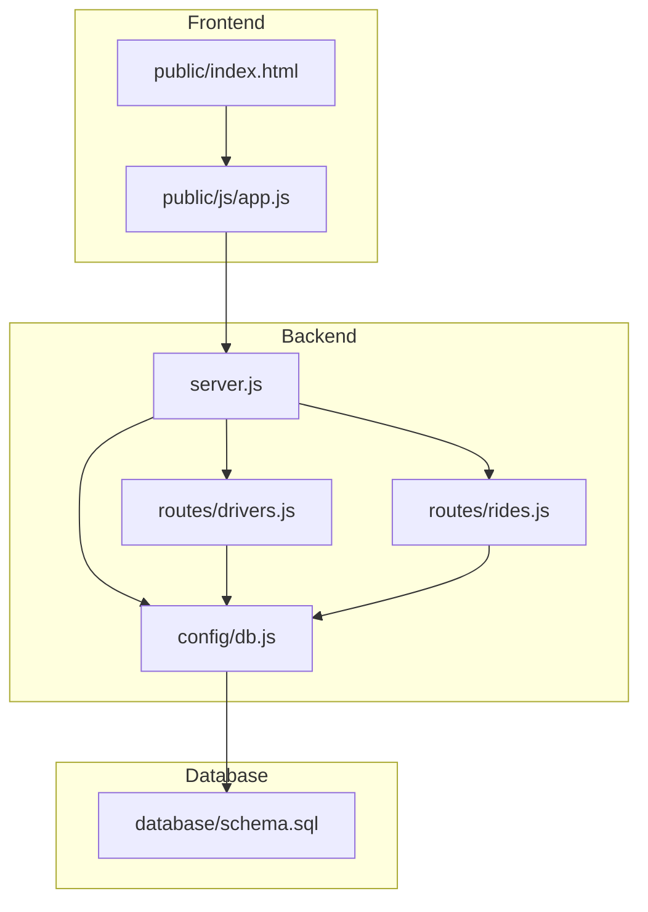
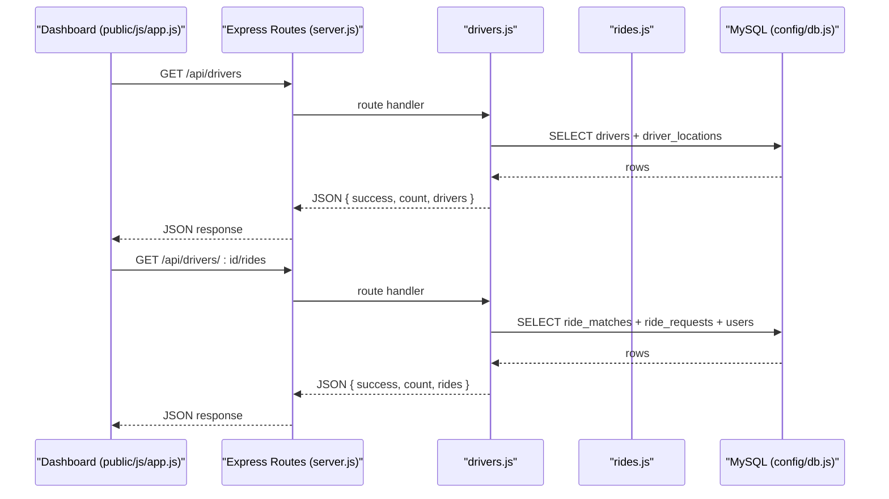
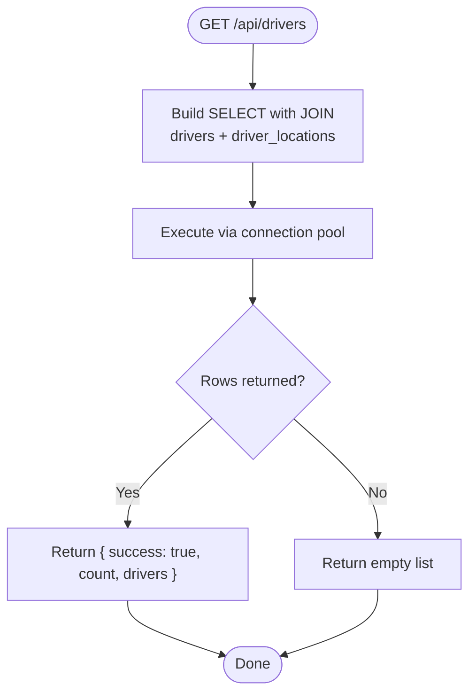
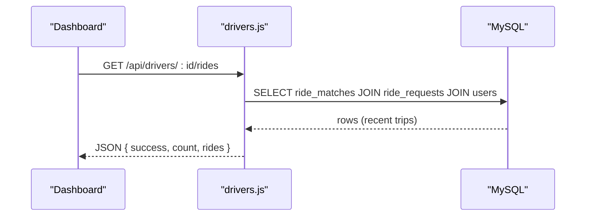
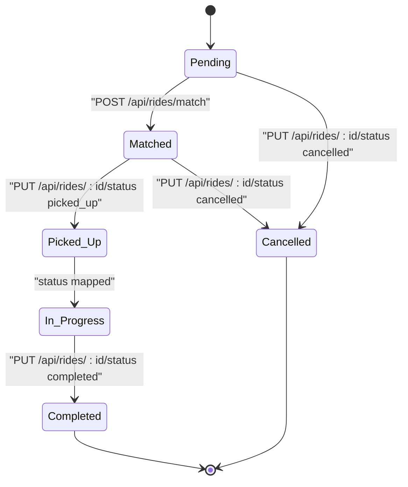
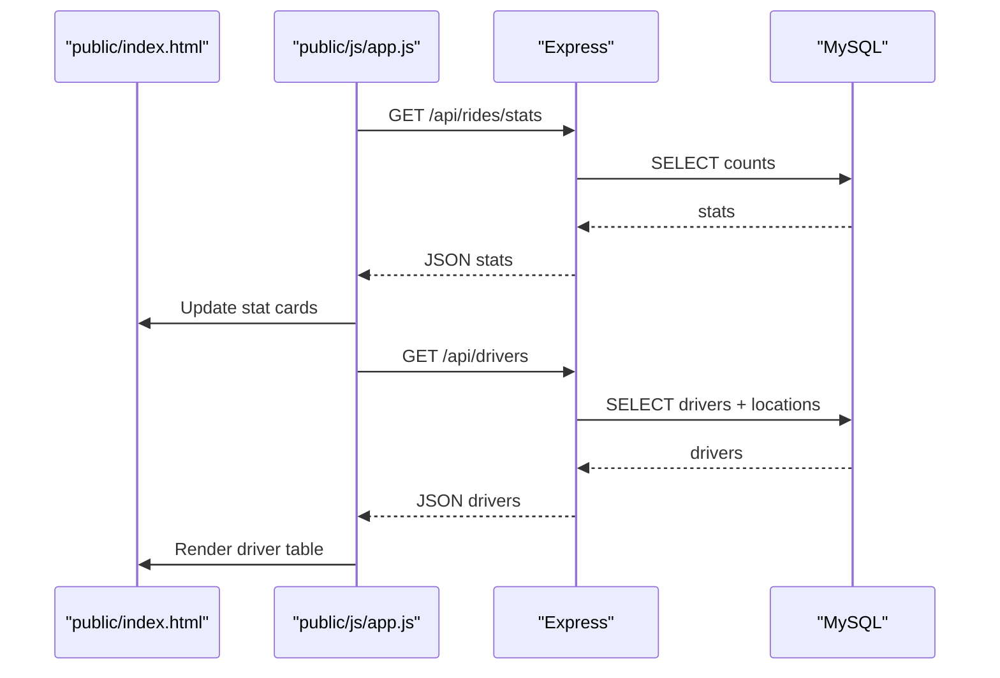
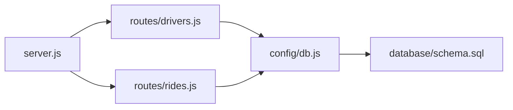

# Performance Metrics and Analytics

<cite>
**Referenced Files in This Document**
- [server.js](file://server.js)
- [config/db.js](file://config/db.js)
- [routes/drivers.js](file://routes/drivers.js)
- [routes/rides.js](file://routes/rides.js)
- [database/schema.sql](file://database/schema.sql)
- [public/index.html](file://public/index.html)
- [public/js/app.js](file://public/js/app.js)
- [README.md](file://README.md)
</cite>

## Table of Contents
1. [Introduction](#introduction)
2. [Project Structure](#project-structure)
3. [Core Components](#core-components)
4. [Architecture Overview](#architecture-overview)
5. [Detailed Component Analysis](#detailed-component-analysis)
6. [Dependency Analysis](#dependency-analysis)
7. [Performance Considerations](#performance-considerations)
8. [Troubleshooting Guide](#troubleshooting-guide)
9. [Conclusion](#conclusion)
10. [Appendices](#appendices)

## Introduction
This document focuses on driver performance metrics and analytics tracking in the ride-sharing DBMS. It explains how driver profile information (including rating and total_trips) is exposed via the main driver listing endpoint, how detailed ride history analytics are retrieved through the driver rides history endpoint, and how performance metrics are collected and maintained. It also covers analytics queries and reporting patterns, the relationship between ride completion rates, ratings, and performance evaluation, and how these metrics influence driver ranking and ride assignment priority. Finally, it outlines data aggregation patterns, historical performance tracking, dashboard integration, and practical recommendations for performance monitoring and driver improvement.

## Project Structure
The system is organized around a Node.js/Express backend, a MySQL database with strategic indexing and stored procedures, and a lightweight frontend dashboard for monitoring and manual operations.

**Diagram sources**
- [server.js:1-84](file://server.js#L1-L84)
- [config/db.js:1-50](file://config/db.js#L1-L50)
- [routes/drivers.js:1-182](file://routes/drivers.js#L1-L182)
- [routes/rides.js:1-272](file://routes/rides.js#L1-L272)
- [database/schema.sql:1-297](file://database/schema.sql#L1-L297)
- [public/index.html:1-239](file://public/index.html#L1-L239)
- [public/js/app.js:1-373](file://public/js/app.js#L1-L373)

**Section sources**
- [server.js:1-84](file://server.js#L1-L84)
- [config/db.js:1-50](file://config/db.js#L1-L50)
- [routes/drivers.js:1-182](file://routes/drivers.js#L1-L182)
- [routes/rides.js:1-272](file://routes/rides.js#L1-L272)
- [database/schema.sql:1-297](file://database/schema.sql#L1-L297)
- [public/index.html:1-239](file://public/index.html#L1-L239)
- [public/js/app.js:1-373](file://public/js/app.js#L1-L373)

## Core Components
- Driver listing endpoint: Returns driver profiles including rating and total_trips, plus recent location for operational visibility.
- Driver rides history endpoint: Retrieves detailed trip analytics for a driver, including fare amounts, distances, and timing.
- Ride lifecycle and status transitions: Drive performance depends on timely status updates and match lifecycle events.
- Analytics dashboard: Live stats and tables reflect current system state and driver performance signals.
- Database schema and stored procedures: Provide atomic operations and indexes to support high-concurrency performance.

**Section sources**
- [routes/drivers.js:10-36](file://routes/drivers.js#L10-L36)
- [routes/drivers.js:150-179](file://routes/drivers.js#L150-L179)
- [routes/rides.js:169-224](file://routes/rides.js#L169-L224)
- [database/schema.sql:29-49](file://database/schema.sql#L29-L49)
- [database/schema.sql:103-126](file://database/schema.sql#L103-L126)
- [database/schema.sql:167-234](file://database/schema.sql#L167-L234)
- [public/index.html:21-43](file://public/index.html#L21-L43)
- [public/js/app.js:155-169](file://public/js/app.js#L155-L169)

## Architecture Overview
The backend exposes REST endpoints for drivers and rides, backed by a MySQL connection pool. The database schema defines tables for users, drivers, driver locations, ride requests, and ride matches, with indexes and stored procedures optimized for peak-hour concurrency. The frontend dashboard consumes these endpoints to present live stats and driver lists.

**Diagram sources**
- [server.js:37-41](file://server.js#L37-L41)
- [routes/drivers.js:10-36](file://routes/drivers.js#L10-L36)
- [routes/drivers.js:150-179](file://routes/drivers.js#L150-L179)
- [config/db.js:7-30](file://config/db.js#L7-L30)

## Detailed Component Analysis

### Driver Profile Information and Listing
- Endpoint: GET /api/drivers
- Purpose: Retrieve all drivers with profile attributes and recent location for operational visibility.
- Included fields: driver_id, name, contact info, vehicle details, status, rating, total_trips, and latest location coordinates and timestamp.
- Ordering: Drivers are ordered by status and name to facilitate quick identification of available drivers.

**Diagram sources**
- [routes/drivers.js:10-36](file://routes/drivers.js#L10-L36)
- [config/db.js:7-30](file://config/db.js#L7-L30)

**Section sources**
- [routes/drivers.js:10-36](file://routes/drivers.js#L10-L36)
- [database/schema.sql:29-49](file://database/schema.sql#L29-L49)

### Driver Rides History Endpoint
- Endpoint: GET /api/drivers/:id/rides
- Purpose: Provide detailed analytics for a driver’s recent trips, enabling performance evaluation and reporting.
- Returned analytics fields: match_id, status, fare_final, distance_km, timestamps (created_at, started_at, completed_at), pickup/dropoff addresses, and rider name.
- Pagination: Limits results to a recent window to keep responses small and responsive.

**Diagram sources**
- [routes/drivers.js:150-179](file://routes/drivers.js#L150-L179)
- [database/schema.sql:103-126](file://database/schema.sql#L103-L126)

**Section sources**
- [routes/drivers.js:150-179](file://routes/drivers.js#L150-L179)
- [database/schema.sql:103-126](file://database/schema.sql#L103-L126)

### Ride Lifecycle and Status Transitions
- Status updates drive performance metrics and driver availability:
  - Pending -> Matched -> Picked Up -> In Progress -> Completed or Cancelled.
  - On completion or cancellation, driver status is freed back to available.
- Atomicity and consistency:
  - Stored procedure ensures atomic match creation and driver availability checks.
  - Version columns and optimistic locking protect against concurrent updates.

**Diagram sources**
- [routes/rides.js:135-167](file://routes/rides.js#L135-L167)
- [routes/rides.js:169-224](file://routes/rides.js#L169-L224)
- [database/schema.sql:167-234](file://database/schema.sql#L167-L234)

**Section sources**
- [routes/rides.js:135-167](file://routes/rides.js#L135-L167)
- [routes/rides.js:169-224](file://routes/rides.js#L169-L224)
- [database/schema.sql:167-234](file://database/schema.sql#L167-L234)

### Analytics Dashboard Integration
- Live stats: The dashboard auto-refreshes key metrics (pending requests, matched rides, active trips, available drivers, completed today).
- Driver list: Displays driver rating and total_trips alongside status and location.
- Real-time updates: Periodic polling keeps the UI current with backend state.

**Diagram sources**
- [public/index.html:21-43](file://public/index.html#L21-L43)
- [public/js/app.js:155-169](file://public/js/app.js#L155-L169)
- [public/js/app.js:225-250](file://public/js/app.js#L225-L250)
- [routes/rides.js:226-259](file://routes/rides.js#L226-L259)
- [routes/drivers.js:10-36](file://routes/drivers.js#L10-L36)

**Section sources**
- [public/index.html:21-43](file://public/index.html#L21-L43)
- [public/js/app.js:155-169](file://public/js/app.js#L155-L169)
- [public/js/app.js:225-250](file://public/js/app.js#L225-L250)
- [routes/rides.js:226-259](file://routes/rides.js#L226-L259)
- [routes/drivers.js:10-36](file://routes/drivers.js#L10-L36)

## Dependency Analysis
- Backend routing depends on the MySQL connection pool for database operations.
- Driver listing joins drivers with driver_locations to enrich profiles with recent location data.
- Driver rides history joins ride_matches with ride_requests and users to provide trip analytics.
- Ride status updates coordinate with driver availability and match lifecycle.

**Diagram sources**
- [routes/drivers.js:1-3](file://routes/drivers.js#L1-L3)
- [routes/rides.js:1-3](file://routes/rides.js#L1-L3)
- [config/db.js:1-2](file://config/db.js#L1-L2)
- [server.js:6-8](file://server.js#L6-L8)
- [database/schema.sql:1-10](file://database/schema.sql#L1-L10)

**Section sources**
- [routes/drivers.js:1-3](file://routes/drivers.js#L1-L3)
- [routes/rides.js:1-3](file://routes/rides.js#L1-L3)
- [config/db.js:1-2](file://config/db.js#L1-L2)
- [server.js:6-8](file://server.js#L6-L8)
- [database/schema.sql:1-10](file://database/schema.sql#L1-L10)

## Performance Considerations
- Connection pooling: The pool is sized for peak-hour concurrency with a generous queue limit to handle bursts without dropping requests.
- Atomic operations: Stored procedures with row-level locks prevent race conditions during ride matching and status updates.
- Indexing strategy: Strategic indexes accelerate frequent queries (available drivers, pending queues, spatial searches).
- Upsert pattern: Location updates use atomic upsert to avoid race conditions and reduce round-trips.
- Auto-refresh cadence: The frontend polls endpoints at intervals suited to real-time dashboards while avoiding excessive load.

Practical recommendations:
- Monitor slow requests and adjust pool sizes or indexes if needed.
- Consider adding geohash-based spatial indexing for improved nearby searches.
- Introduce caching for frequently accessed driver lists and stats.
- Add WebSocket integration for real-time push updates to reduce polling overhead.

**Section sources**
- [config/db.js:7-30](file://config/db.js#L7-L30)
- [database/schema.sql:167-234](file://database/schema.sql#L167-L234)
- [database/schema.sql:46-68](file://database/schema.sql#L46-L68)
- [database/schema.sql:94-98](file://database/schema.sql#L94-L98)
- [database/schema.sql:123-125](file://database/schema.sql#L123-L125)
- [public/js/app.js:25-28](file://public/js/app.js#L25-L28)
- [README.md:142-176](file://README.md#L142-L176)

## Troubleshooting Guide
Common issues and resolutions:
- Database connectivity failures: Verify host, port, user, and password in environment configuration.
- Access denied errors: Confirm credentials and permissions.
- Table not found errors: Initialize the database by running the schema script.
- Port conflicts: Change the server port in environment configuration.
- Slow queries during peak hours: Review indexes and consider increasing pool size or optimizing queries.

Operational tips:
- Use the health endpoint to confirm database connectivity.
- Monitor slow request warnings emitted by middleware.
- Inspect stored procedure outputs for match failures and status update conflicts.

**Section sources**
- [config/db.js:33-41](file://config/db.js#L33-L41)
- [server.js:20-30](file://server.js#L20-L30)
- [README.md:265-274](file://README.md#L265-L274)

## Conclusion
The system provides a robust foundation for driver performance metrics and analytics. Driver profiles expose key performance indicators (rating, total_trips) via the listing endpoint, while the driver rides history endpoint delivers detailed trip analytics for evaluation. Atomic operations and strategic indexing ensure reliable performance under peak-hour loads. The dashboard integrates these endpoints to present live insights, enabling informed decisions about driver ranking and ride assignment priority.

## Appendices

### Driver Analytics Queries and Reporting Patterns
- Driver profile overview: SELECT drivers joined with driver_locations to show recent location and performance indicators.
- Driver ride history: SELECT ride_matches joined with ride_requests and users to produce analytics for a given driver.
- Aggregation patterns:
  - Count completed trips and average fare per driver for revenue analysis.
  - Compute completion rate per driver as completed trips divided by total_trips.
  - Track average distance and timing metrics to assess efficiency.
- Historical tracking:
  - Use timestamps (created_at, started_at, completed_at) to segment analytics by day or hour blocks.
  - Maintain peak-hour stats for capacity planning and load monitoring.

**Section sources**
- [routes/drivers.js:10-36](file://routes/drivers.js#L10-L36)
- [routes/drivers.js:150-179](file://routes/drivers.js#L150-L179)
- [database/schema.sql:103-126](file://database/schema.sql#L103-L126)

### Relationship Between Completion Rates, Ratings, and Performance Evaluation
- Completion rate: A strong indicator of reliability and responsiveness; higher rates correlate with better service quality.
- Rating: Reflects customer feedback; sustained high ratings often accompany consistent performance and professionalism.
- Performance evaluation: Combine completion rate, rating, and historical metrics to rank drivers and influence assignment priority.

**Section sources**
- [database/schema.sql:32-49](file://database/schema.sql#L32-L49)

### Influence on Driver Ranking and Assignment Priority
- Ranking: Drivers with higher ratings and completion rates can be prioritized for assignments.
- Assignment priority: Use driver status and proximity to improve assignment likelihood; integrate with ride priority scoring for peak-hour fairness.

**Section sources**
- [routes/drivers.js:38-77](file://routes/drivers.js#L38-L77)
- [routes/rides.js:261-269](file://routes/rides.js#L261-L269)

### Guidelines for Performance Monitoring and Improvement Recommendations
- Monitor:
  - Driver availability and utilization rates.
  - Average wait times and completion times.
  - Geographic distribution of drivers and demand hotspots.
- Improve:
  - Encourage drivers to maintain high ratings and consistent completion rates.
  - Provide targeted training or incentives for drivers with lower performance metrics.
  - Optimize matching algorithms and queue fairness to improve driver satisfaction and retention.

**Section sources**
- [routes/rides.js:226-259](file://routes/rides.js#L226-L259)
- [README.md:277-284](file://README.md#L277-L284)