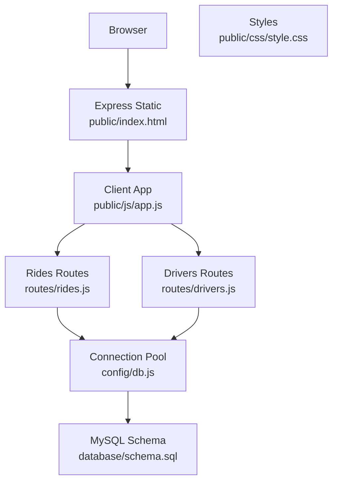
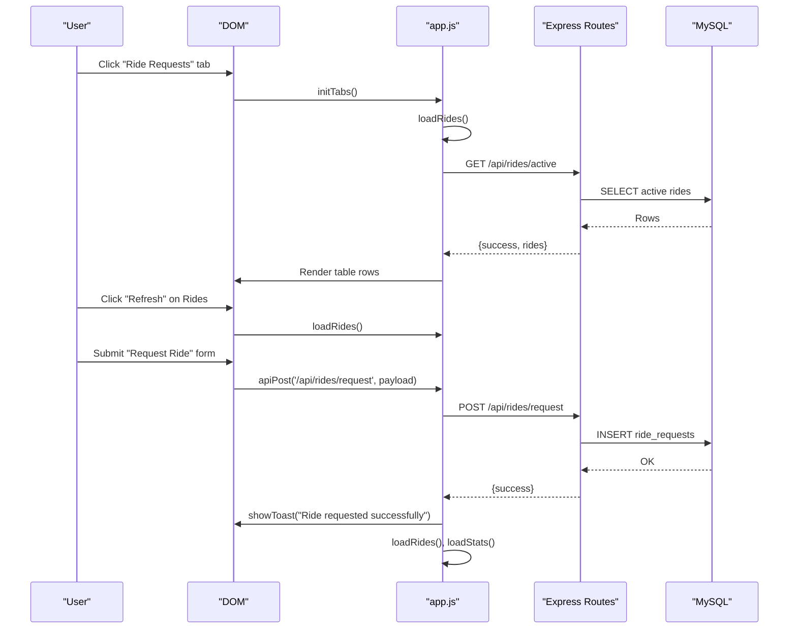
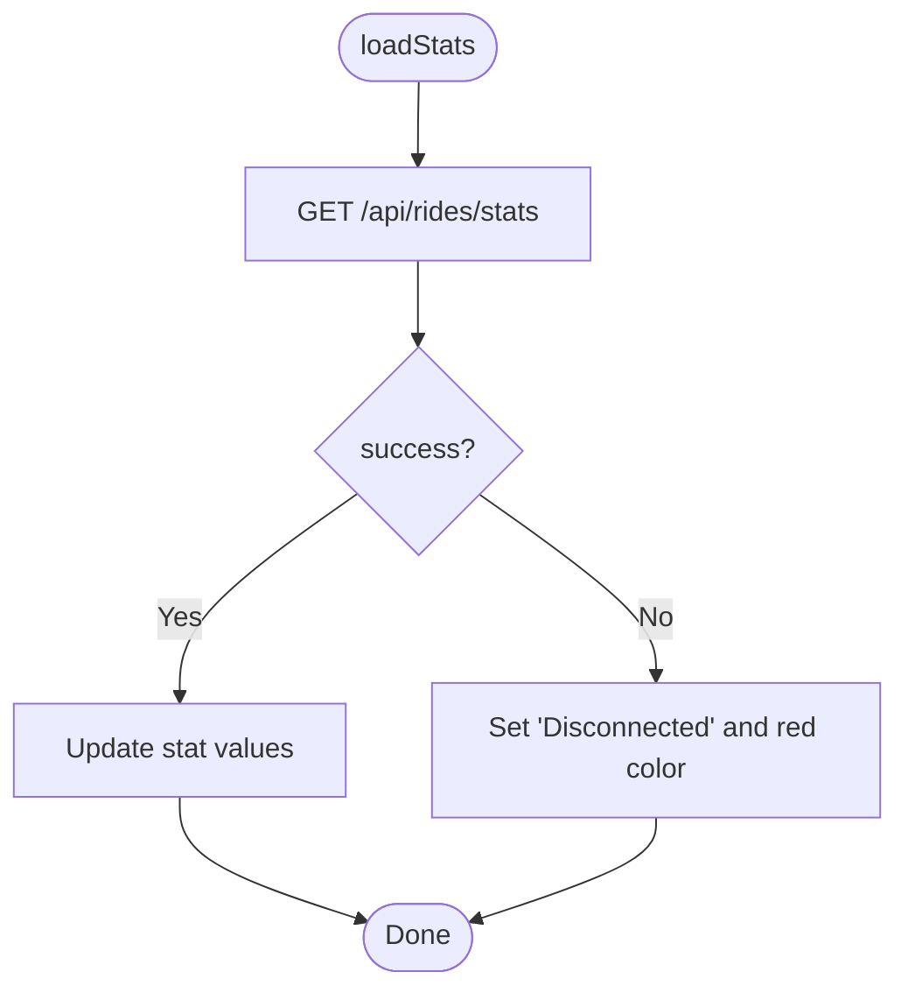
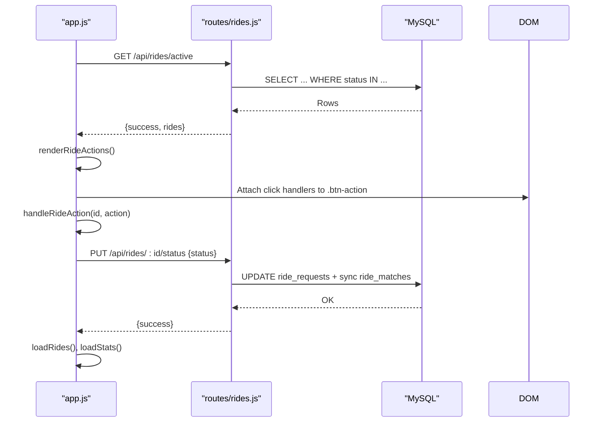
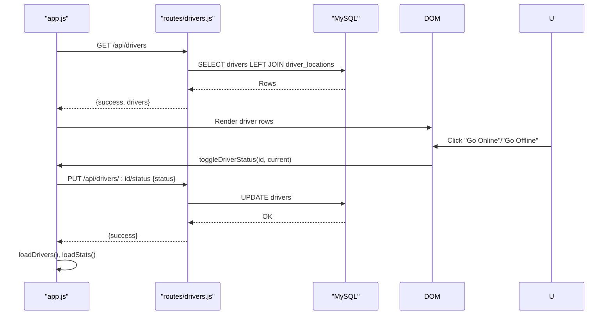
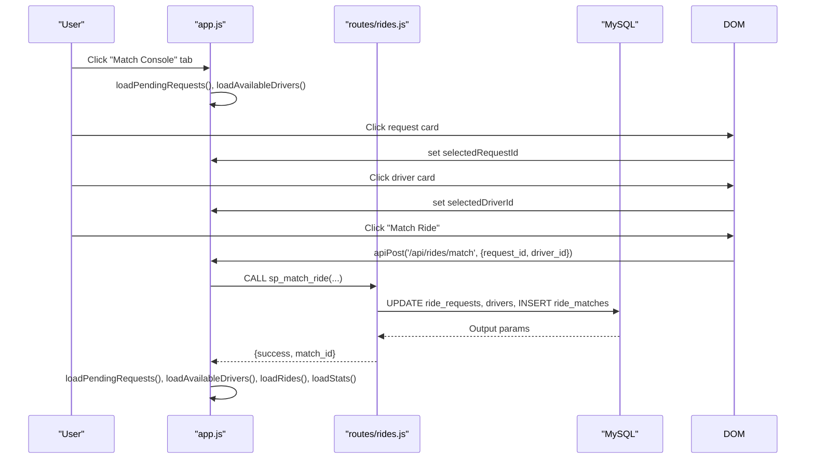
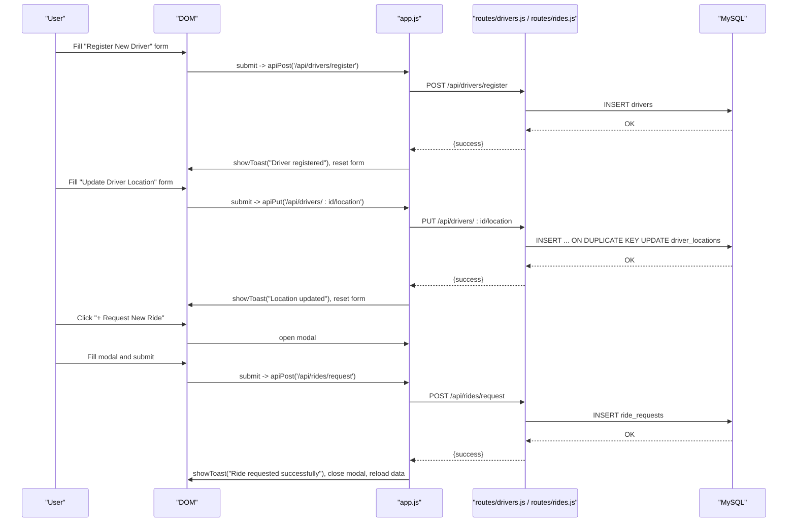
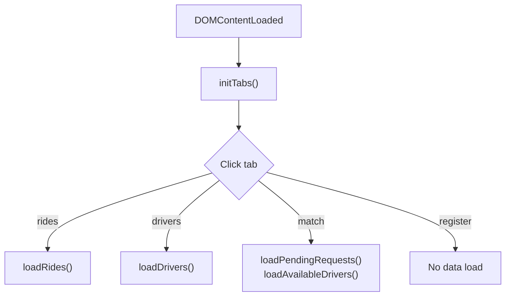
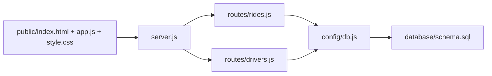

# Frontend Dashboard

<cite>
**Referenced Files in This Document**
- [index.html](file://public/index.html)
- [app.js](file://public/js/app.js)
- [style.css](file://public/css/style.css)
- [server.js](file://server.js)
- [rides.js](file://routes/rides.js)
- [drivers.js](file://routes/drivers.js)
- [db.js](file://config/db.js)
- [schema.sql](file://database/schema.sql)
- [package.json](file://package.json)
</cite>

## Table of Contents
1. [Introduction](#introduction)
2. [Project Structure](#project-structure)
3. [Core Components](#core-components)
4. [Architecture Overview](#architecture-overview)
5. [Detailed Component Analysis](#detailed-component-analysis)
6. [Dependency Analysis](#dependency-analysis)
7. [Performance Considerations](#performance-considerations)
8. [Troubleshooting Guide](#troubleshooting-guide)
9. [Conclusion](#conclusion)
10. [Appendices](#appendices)

## Introduction
This document describes the single-page dashboard frontend component for a ride sharing matching DBMS. It covers the visual layout, interactive elements, live data updates, navigation between functional areas, API integration patterns, styling and responsiveness, accessibility considerations, animations/transitions, and performance optimization for real-time updates. The dashboard displays live statistics, an active rides table, a driver roster, a match console for pairing requests with drivers, and registration/update forms for drivers and ride requests.

## Project Structure
The frontend is a static HTML page served by an Express server with a small client-side JavaScript application managing tabs, modals, forms, and periodic data refreshes. Backend routes expose REST endpoints for rides and drivers, backed by a MySQL schema designed for high read volume and frequent updates.

**Diagram sources**
- [server.js:35](file://server.js#L35)
- [app.js:5](file://public/js/app.js#L5)
- [rides.js:1](file://routes/rides.js#L1)
- [drivers.js:1](file://routes/drivers.js#L1)
- [db.js:7](file://config/db.js#L7)
- [schema.sql:1](file://database/schema.sql#L1)

**Section sources**
- [index.html:1-239](file://public/index.html#L1-L239)
- [app.js:14-29](file://public/js/app.js#L14-L29)
- [server.js:35](file://server.js#L35)

## Core Components
- Live stats cards: Pending requests, matched rides, active trips, available drivers, completed today.
- Navigation tabs: Ride Requests, Drivers, Match Console, Register.
- Active rides table: Lists active/pending/matched rides with status badges and action buttons.
- Driver roster: Lists drivers with availability toggles and location data.
- Match console: Cards for pending requests and available drivers with selection and match button.
- Registration forms: New driver registration and driver location update.
- Modal: Ride request form invoked from the dashboard.
- Toast notifications: Non-blocking feedback messages.

**Section sources**
- [index.html:22-43](file://public/index.html#L22-L43)
- [index.html:46-51](file://public/index.html#L46-L51)
- [index.html:54-80](file://public/index.html#L54-L80)
- [index.html:82-108](file://public/index.html#L82-L108)
- [index.html:110-137](file://public/index.html#L110-L137)
- [index.html:139-187](file://public/index.html#L139-L187)
- [index.html:190-231](file://public/index.html#L190-L231)
- [index.html:234](file://public/index.html#L234)

## Architecture Overview
The dashboard is a SPA with:
- Initialization hooks for tabs, modal, forms, and refresh buttons.
- Periodic auto-refresh for stats, rides, and drivers.
- API helpers for GET/POST/PUT requests.
- Utility functions for toast notifications, HTML escaping, and time formatting.

**Diagram sources**
- [app.js:34-49](file://public/js/app.js#L34-L49)
- [app.js:171-199](file://public/js/app.js#L171-L199)
- [app.js:71-91](file://public/js/app.js#L71-L91)
- [rides.js:10-41](file://routes/rides.js#L10-L41)

**Section sources**
- [app.js:14-29](file://public/js/app.js#L14-L29)
- [app.js:34-49](file://public/js/app.js#L34-L49)
- [app.js:71-91](file://public/js/app.js#L71-L91)
- [rides.js:10-41](file://routes/rides.js#L10-L41)

## Detailed Component Analysis

### Live Stats Cards
- Purpose: Provide a quick overview of system state.
- Data sources: GET /api/rides/stats.
- Auto-refresh: Every 5 seconds.
- Visual: Grid of cards with hover effects and animated live indicator.

**Diagram sources**
- [app.js:155-169](file://public/js/app.js#L155-L169)
- [rides.js:226-259](file://routes/rides.js#L226-L259)

**Section sources**
- [index.html:22-43](file://public/index.html#L22-L43)
- [app.js:25-26](file://public/js/app.js#L25-L26)
- [app.js:155-169](file://public/js/app.js#L155-L169)
- [style.css:69-80](file://public/css/style.css#L69-L80)

### Active Rides Table
- Purpose: Display active/pending/matched rides with actions.
- Data source: GET /api/rides/active.
- Actions: Cancel/Pickup/Complete depending on current status.
- Auto-refresh: Every 15 seconds.
- Rendering: Uses template strings and attaches event listeners for action buttons.

**Diagram sources**
- [app.js:171-223](file://public/js/app.js#L171-L223)
- [rides.js:10-41](file://routes/rides.js#L10-L41)
- [rides.js:169-224](file://routes/rides.js#L169-L224)

**Section sources**
- [index.html:60-79](file://public/index.html#L60-L79)
- [app.js:27-28](file://public/js/app.js#L27-L28)
- [app.js:171-223](file://public/js/app.js#L171-L223)
- [style.css:235-267](file://public/css/style.css#L235-L267)

### Driver Roster
- Purpose: View and manage driver availability and locations.
- Data source: GET /api/drivers.
- Actions: Toggle driver status between available/offline.
- Auto-refresh: Every 30 seconds.
- Rendering: Shows driver info and a button to toggle status.

**Diagram sources**
- [app.js:225-260](file://public/js/app.js#L225-L260)
- [drivers.js:10-36](file://routes/drivers.js#L10-L36)
- [drivers.js:128-148](file://routes/drivers.js#L128-L148)

**Section sources**
- [index.html:88-107](file://public/index.html#L88-L107)
- [app.js:28](file://public/js/app.js#L28)
- [app.js:225-260](file://public/js/app.js#L225-L260)

### Match Console
- Purpose: Pair pending ride requests with available drivers.
- Data sources: GET /api/rides/pending and GET /api/drivers/available.
- Selection: Click cards to select request/driver; enables "Match Ride".
- Action: POST /api/rides/match with atomic stored procedure.
- Auto-refresh: Triggered when Match Console tab is opened.

**Diagram sources**
- [app.js:43-46](file://public/js/app.js#L43-L46)
- [app.js:262-321](file://public/js/app.js#L262-L321)
- [rides.js:135-167](file://routes/rides.js#L135-L167)
- [schema.sql:164-234](file://database/schema.sql#L164-L234)

**Section sources**
- [index.html:110-137](file://public/index.html#L110-L137)
- [app.js:43-46](file://public/js/app.js#L43-L46)
- [app.js:262-321](file://public/js/app.js#L262-L321)
- [rides.js:135-167](file://routes/rides.js#L135-L167)

### Registration Forms
- New Driver Registration: POST /api/drivers/register.
- Update Driver Location: PUT /api/drivers/:id/location.
- Request Ride Modal: POST /api/rides/request.

**Diagram sources**
- [app.js:93-122](file://public/js/app.js#L93-L122)
- [app.js:71-91](file://public/js/app.js#L71-L91)
- [drivers.js:79-99](file://routes/drivers.js#L79-L99)
- [drivers.js:101-126](file://routes/drivers.js#L101-L126)
- [rides.js:88-133](file://routes/rides.js#L88-L133)

**Section sources**
- [index.html:139-187](file://public/index.html#L139-L187)
- [index.html:190-231](file://public/index.html#L190-L231)
- [app.js:93-122](file://public/js/app.js#L93-L122)
- [app.js:71-91](file://public/js/app.js#L71-L91)

### Navigation Between Functional Areas
- Tabs: Switch between Ride Requests, Drivers, Match Console, Register.
- On Match Console tab activation, pending requests and available drivers are loaded.
- Refresh buttons manually trigger data reloads.

**Diagram sources**
- [app.js:34-49](file://public/js/app.js#L34-L49)
- [app.js:262-315](file://public/js/app.js#L262-L315)

**Section sources**
- [index.html:46-51](file://public/index.html#L46-L51)
- [app.js:34-49](file://public/js/app.js#L34-L49)

### API Integration Patterns
- Base URL: Empty string resolves to same-origin.
- Methods: apiGet, apiPost, apiPut.
- Data binding: FormData collected into objects; numeric fields parsed; HTML escaped for safety.
- Error handling: Toast notifications show success/error messages; stats failure marks connection as disconnected.

**Section sources**
- [app.js:5](file://public/js/app.js#L5)
- [app.js:326-347](file://public/js/app.js#L326-L347)
- [app.js:361-366](file://public/js/app.js#L361-L366)
- [app.js:82-90](file://public/js/app.js#L82-L90)

### Animations and Transitions
- Live indicator: Pulsing dot animation.
- Stat cards: Hover lift effect.
- Toast notifications: Slide-in animation.
- Status badges: Color-coded per status.

**Section sources**
- [style.css:69-80](file://public/css/style.css#L69-L80)
- [style.css:99-101](file://public/css/style.css#L99-L101)
- [style.css:483-486](file://public/css/style.css#L483-L486)
- [style.css:269-288](file://public/css/style.css#L269-L288)

### Style Customization Options and CSS Classes
- Theme variables: Primary, secondary, success, danger, info, background, card, text, border, shadow, radius.
- Layout: Container max-width, grid-based stats, responsive tabs and match grid.
- Components: Buttons, tables, status badges, match cards, forms, modal, toast.
- Responsive breakpoints: Adjusts match grid to single column and reflows tab nav on smaller screens.

**Section sources**
- [style.css:5-20](file://public/css/style.css#L5-L20)
- [style.css:35-39](file://public/css/style.css#L35-L39)
- [style.css:83-115](file://public/css/style.css#L83-L115)
- [style.css:504-518](file://public/css/style.css#L504-L518)

## Dependency Analysis
- Frontend depends on Express static serving and CORS middleware.
- Routes depend on a MySQL connection pool configured for peak-hour concurrency.
- Stored procedures enforce atomicity for ride matching and status updates.

**Diagram sources**
- [server.js:35](file://server.js#L35)
- [rides.js:1](file://routes/rides.js#L1)
- [drivers.js:1](file://routes/drivers.js#L1)
- [db.js:7](file://config/db.js#L7)
- [schema.sql:164](file://database/schema.sql#L164)

**Section sources**
- [server.js:16-31](file://server.js#L16-L31)
- [db.js:7-30](file://config/db.js#L7-L30)
- [schema.sql:164-234](file://database/schema.sql#L164-L234)

## Performance Considerations
- Auto-refresh intervals:
  - Stats: 5 seconds
  - Rides: 15 seconds
  - Drivers: 30 seconds
- Connection pool sizing: 50 connections with queue limits and timeouts to handle peak-hour concurrency.
- Backend optimizations:
  - Indexes on frequently queried columns (status, created_at, pickup coordinates).
  - Stored procedures for atomic operations to prevent race conditions.
  - Upsert for driver locations to minimize write conflicts.
- Frontend optimizations:
  - Minimal DOM manipulation; batch updates when rendering lists.
  - Escape HTML to prevent XSS.
  - Toast notifications auto-remove after delay.

[No sources needed since this section provides general guidance]

## Troubleshooting Guide
- Connection status turns red and shows "Disconnected":
  - Indicates network/API errors during stats fetch.
  - Check backend health endpoint and database connectivity.
- Toast shows "Failed to request ride" or "Match failed":
  - Verify backend routes are reachable and database operations succeed.
  - Inspect stored procedure outcomes for matching conflicts.
- No data shown in tables/lists:
  - Confirm database seeding and that endpoints return success with data.
  - Ensure CORS is enabled and static files are served correctly.

**Section sources**
- [app.js:165-168](file://public/js/app.js#L165-L168)
- [server.js:16](file://server.js#L16)
- [rides.js:135-167](file://routes/rides.js#L135-L167)

## Conclusion
The dashboard provides a responsive, real-time interface for monitoring and managing ride sharing operations. Its modular design separates concerns between initialization, data loading, API communication, and UI updates. The backend is tuned for high read and frequent update loads, with atomic stored procedures ensuring consistency under peak-hour concurrency.

## Appendices

### Accessibility Compliance Guidelines
- Contrast: Ensure sufficient contrast between text and backgrounds for status badges and buttons.
- Keyboard navigation: Add tabindex and keyboard handlers for tabs and actionable cards.
- ARIA roles: Use role="tablist", role="tab", role="tabpanel" for tabbed interface.
- Focus management: Manage focus when opening/closing modal and navigating between sections.
- Screen reader labels: Provide meaningful labels for buttons and status indicators.

[No sources needed since this section provides general guidance]

### Cross-Browser Compatibility Notes
- CSS Grid and Flexbox are widely supported; verify fallbacks for older browsers if needed.
- CSS variables are supported in modern browsers; consider polyfills for legacy environments.
- Fetch API is standard; ensure polyfills if targeting very old browsers.

[No sources needed since this section provides general guidance]

### Component Composition Patterns
- Modular initialization functions for tabs, modal, forms, and refresh buttons.
- Centralized API helpers to reduce duplication and improve error handling.
- Event delegation for dynamically generated action buttons.
- Reusable toast notification system for consistent feedback.

**Section sources**
- [app.js:34-49](file://public/js/app.js#L34-L49)
- [app.js:54-64](file://public/js/app.js#L54-L64)
- [app.js:69-145](file://public/js/app.js#L69-L145)
- [app.js:352-359](file://public/js/app.js#L352-L359)