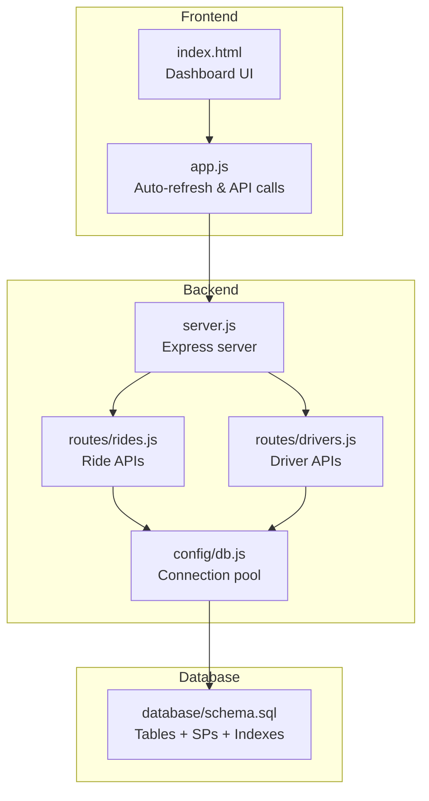
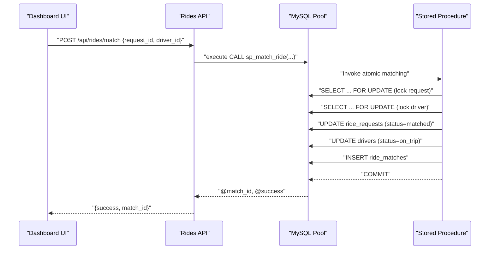
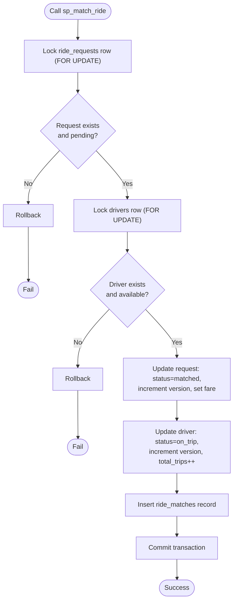
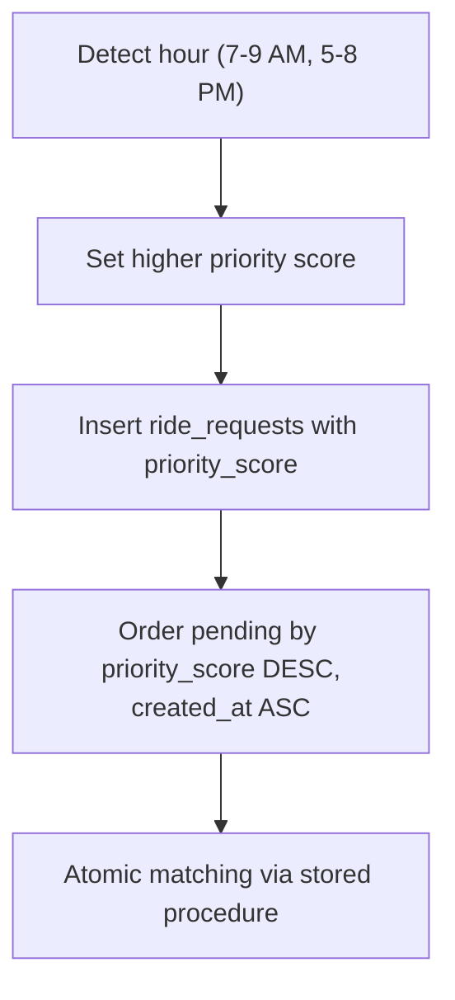
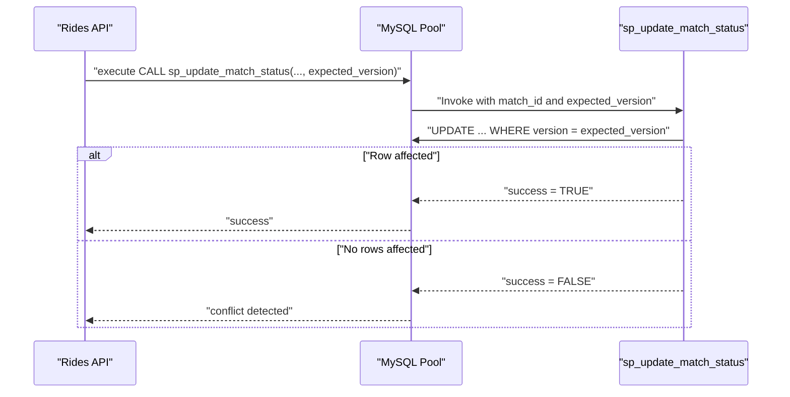
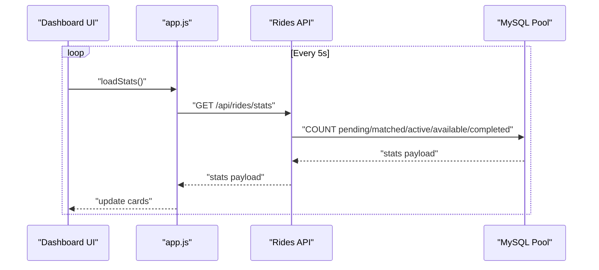
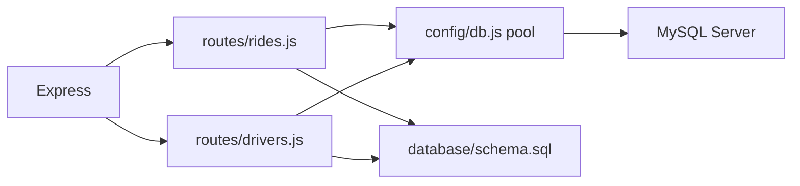

# Introduction and Purpose

<cite>
**Referenced Files in This Document**
- [README.md](file://README.md)
- [package.json](file://package.json)
- [server.js](file://server.js)
- [config/db.js](file://config/db.js)
- [database/schema.sql](file://database/schema.sql)
- [routes/rides.js](file://routes/rides.js)
- [routes/drivers.js](file://routes/drivers.js)
- [public/index.html](file://public/index.html)
- [public/js/app.js](file://public/js/app.js)
</cite>

## Table of Contents
1. [Introduction](#introduction)
2. [Project Structure](#project-structure)
3. [Core Components](#core-components)
4. [Architecture Overview](#architecture-overview)
5. [Detailed Component Analysis](#detailed-component-analysis)
6. [Dependency Analysis](#dependency-analysis)
7. [Performance Considerations](#performance-considerations)
8. [Troubleshooting Guide](#troubleshooting-guide)
9. [Conclusion](#conclusion)

## Introduction
This project is a ride-sharing matching Database Management System (DBMS) designed to handle high-throughput operations during peak hours. Its core mission is to support a real-time, concurrency-safe ride-sharing platform that:
- Performs atomic ride-to-driver matching to prevent double-booking and race conditions
- Provides live dashboards for operations monitoring and fleet management
- Optimizes performance for frequent updates (driver locations, ride statuses)

Target use cases include:
- Real-time ride-sharing operations (request creation, matching, trip lifecycle)
- Fleet management (driver registration, availability toggling, live location tracking)
- Real-time analytics (pending requests, active trips, completion metrics)

Key differentiators:
- Atomic matching via stored procedures with pessimistic locking
- Peak-hour optimizations (priority scoring, connection pooling, strategic indexing)
- Concurrency safety through optimistic locking and transactional updates
- Live dashboard with auto-refreshing stats and activity tables

## Project Structure
The system follows a layered architecture:
- Backend: Node.js + Express serving REST APIs
- Database: MySQL 8.0+ with connection pooling and stored procedures
- Frontend: Vanilla HTML/CSS/JS single-page application with auto-refreshing tabs

**Diagram sources**
- [server.js:1-84](file://server.js#L1-L84)
- [routes/rides.js:1-272](file://routes/rides.js#L1-L272)
- [routes/drivers.js:1-182](file://routes/drivers.js#L1-L182)
- [config/db.js:1-50](file://config/db.js#L1-L50)
- [database/schema.sql:1-297](file://database/schema.sql#L1-L297)
- [public/index.html:1-239](file://public/index.html#L1-L239)
- [public/js/app.js:1-373](file://public/js/app.js#L1-L373)

**Section sources**
- [README.md:29-48](file://README.md#L29-L48)
- [package.json:1-24](file://package.json#L1-L24)
- [server.js:10-61](file://server.js#L10-L61)

## Core Components
- Database schema and stored procedures for atomic matching and status updates
- Connection pool tuned for peak-hour concurrency
- REST API routes for ride requests, driver management, and live stats
- Frontend dashboard with auto-refresh intervals and interactive controls

Primary objectives:
- Atomic ride-driver matching to ensure correctness under high concurrency
- Real-time dashboard monitoring for operations visibility
- Performance optimization for frequent updates (driver locations, ride statuses)

Target use cases:
- Ride-sharing operations (request creation, matching, status updates)
- Fleet management (driver registration, availability, live location)
- Real-time analytics (pending requests, active trips, completion counts)

**Section sources**
- [README.md:7-16](file://README.md#L7-L16)
- [README.md:142-176](file://README.md#L142-L176)
- [database/schema.sql:160-272](file://database/schema.sql#L160-L272)
- [config/db.js:7-30](file://config/db.js#L7-L30)
- [routes/rides.js:10-86](file://routes/rides.js#L10-L86)
- [routes/drivers.js:10-77](file://routes/drivers.js#L10-L77)
- [public/index.html:21-137](file://public/index.html#L21-L137)

## Architecture Overview
The system emphasizes high read throughput, frequent updates, and peak-hour concurrency. It achieves this through:
- Connection pooling with queue limits to handle burst traffic
- Atomic stored procedures to prevent race conditions during matching
- Strategic indexing to accelerate pending queues and nearby searches
- Optimistic locking to detect stale updates during concurrent writes
- Upsert patterns for efficient driver location updates

**Diagram sources**
- [routes/rides.js:135-167](file://routes/rides.js#L135-L167)
- [database/schema.sql:166-234](file://database/schema.sql#L166-L234)

## Detailed Component Analysis

### Atomic Matching Engine
Atomic matching ensures that a ride cannot be matched twice and a driver cannot be assigned to multiple concurrent trips. The stored procedure performs:
- Pessimistic locking on the ride request and driver rows
- Conditional checks for pending status and availability
- Transactional updates to request, driver, and match tables
- Output parameters indicating success and match identifier

**Diagram sources**
- [database/schema.sql:166-234](file://database/schema.sql#L166-L234)

**Section sources**
- [README.md:11-14](file://README.md#L11-L14)
- [database/schema.sql:166-234](file://database/schema.sql#L166-L234)
- [routes/rides.js:135-167](file://routes/rides.js#L135-L167)

### Peak-Hour Optimizations
The system implements several peak-hour optimizations:
- Priority scoring: Higher priority during typical rush hours to improve queue fairness
- Connection pooling: 50 connections with queue limits to absorb bursts
- Strategic indexing: Composite indexes for pending queues and nearby searches
- Upsert for locations: Single atomic operation to avoid race conditions

**Diagram sources**
- [routes/rides.js:261-269](file://routes/rides.js#L261-L269)
- [database/schema.sql:94-97](file://database/schema.sql#L94-L97)

**Section sources**
- [README.md:12-13](file://README.md#L12-L13)
- [README.md:142-176](file://README.md#L142-L176)
- [routes/rides.js:261-269](file://routes/rides.js#L261-L269)
- [database/schema.sql:94-97](file://database/schema.sql#L94-L97)

### Concurrency Safety Mechanisms
Concurrency safety is achieved through:
- Optimistic locking: Version columns on drivers and ride_requests
- Stored procedures with explicit locking: FOR UPDATE to serialize critical sections
- Transactional status updates: Atomic updates to both requests and matches
- Upsert for driver locations: INSERT ... ON DUPLICATE KEY UPDATE

**Diagram sources**
- [database/schema.sql:236-263](file://database/schema.sql#L236-L263)
- [routes/rides.js:169-224](file://routes/rides.js#L169-L224)

**Section sources**
- [README.md:14](file://README.md#L14)
- [database/schema.sql:42](file://database/schema.sql#L42)
- [database/schema.sql:87](file://database/schema.sql#L87)
- [database/schema.sql:113](file://database/schema.sql#L113)
- [database/schema.sql:236-263](file://database/schema.sql#L236-L263)

### Real-Time Dashboard Monitoring
The dashboard provides live insights and operational controls:
- Stats cards: Pending requests, matched rides, active trips, available drivers, completed today
- Auto-refresh intervals: Stats every 5s, rides every 15s, drivers every 30s
- Interactive tabs: Ride requests, drivers, match console, register
- Action buttons: Update ride status, toggle driver availability

**Diagram sources**
- [public/js/app.js:25-28](file://public/js/app.js#L25-L28)
- [public/js/app.js:155-169](file://public/js/app.js#L155-L169)
- [routes/rides.js:226-259](file://routes/rides.js#L226-L259)

**Section sources**
- [README.md:13](file://README.md#L13)
- [public/index.html:21-43](file://public/index.html#L21-L43)
- [public/js/app.js:25-28](file://public/js/app.js#L25-L28)
- [routes/rides.js:226-259](file://routes/rides.js#L226-L259)

## Dependency Analysis
The system’s dependencies and their roles:
- Express: HTTP server and middleware pipeline
- mysql2: Promise-based MySQL driver with connection pooling
- dotenv: Environment configuration loading
- Routes depend on the shared connection pool
- Stored procedures encapsulate atomic logic and reduce client-side complexity

**Diagram sources**
- [server.js:6-41](file://server.js#L6-L41)
- [routes/rides.js:3](file://routes/rides.js#L3)
- [routes/drivers.js:3](file://routes/drivers.js#L3)
- [config/db.js:7-30](file://config/db.js#L7-L30)
- [database/schema.sql:1-10](file://database/schema.sql#L1-L10)

**Section sources**
- [package.json:14-18](file://package.json#L14-L18)
- [server.js:6-41](file://server.js#L6-L41)
- [config/db.js:7-30](file://config/db.js#L7-L30)

## Performance Considerations
- Connection pooling: 50 connections with queue limits to handle peak-hour bursts
- Strategic indexing: Composite indexes on status and timestamps for fast pending queues
- Upsert pattern: Single atomic operation for driver location updates
- Transaction boundaries: Minimize lock duration and commit early
- Auto-refresh cadence: Tune intervals to balance freshness and load

[No sources needed since this section provides general guidance]

## Troubleshooting Guide
Common issues and resolutions:
- Database connectivity failures: Verify host/port and credentials in environment
- Access denied errors: Confirm user permissions and password
- Missing tables: Run the schema initialization script
- Port conflicts: Change PORT in environment configuration
- Slow queries during peak hours: Monitor peak-hour stats and adjust pool size if needed

**Section sources**
- [README.md:265-274](file://README.md#L265-L274)

## Conclusion
This ride-sharing matching DBMS is purpose-built for high-throughput, peak-hour scenarios. Its atomic matching, peak-hour optimizations, and concurrency-safety mechanisms deliver a robust foundation for real-time operations. The live dashboard enables effective monitoring and control, while the modular design supports future enhancements such as WebSocket updates, caching layers, and advanced analytics.