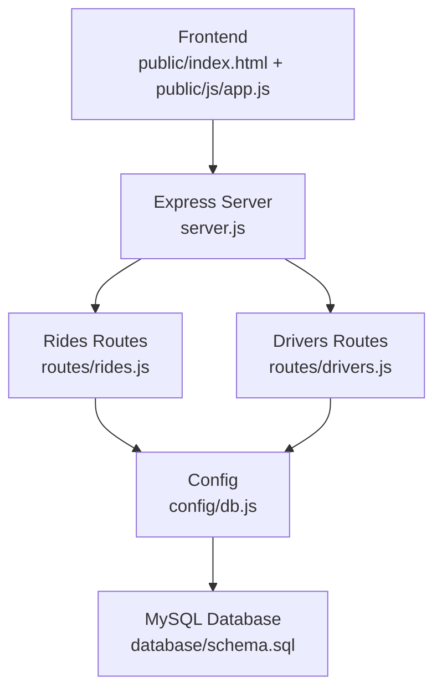
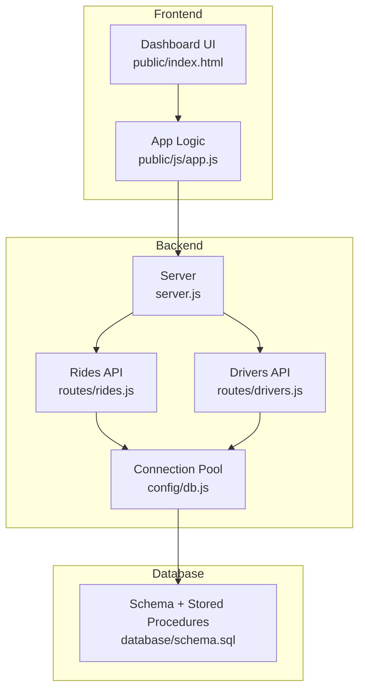
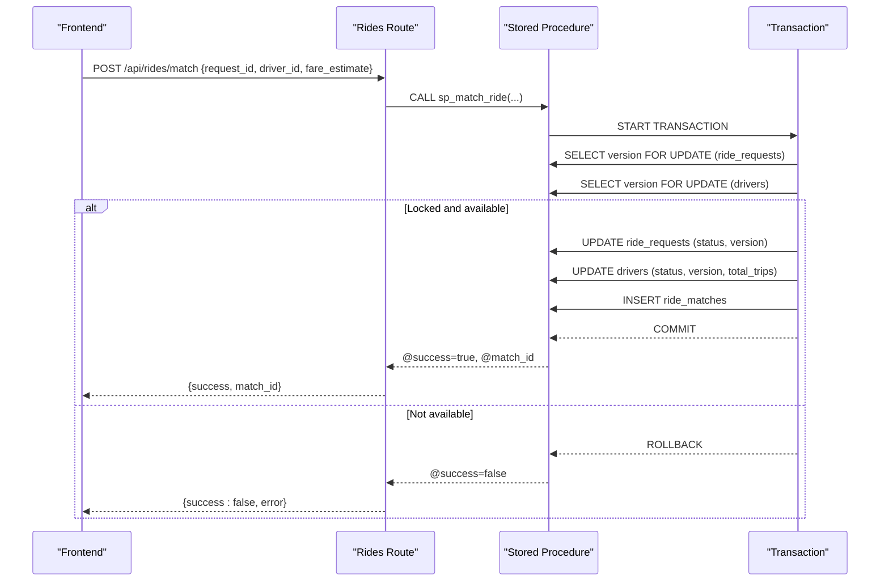
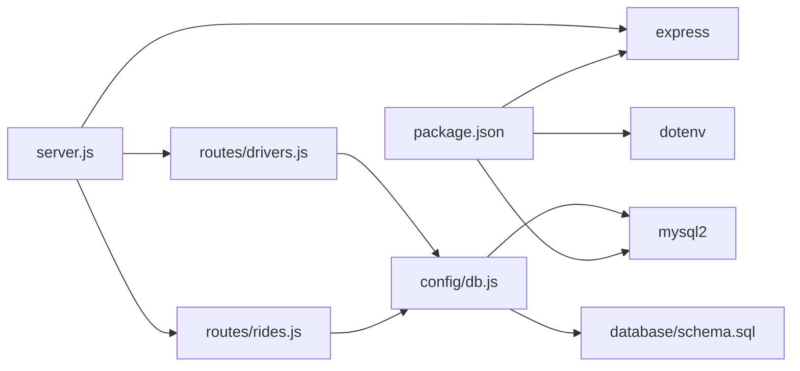

# Key Features and Capabilities

<cite>
**Referenced Files in This Document**
- [README.md](file://README.md)
- [server.js](file://server.js)
- [config/db.js](file://config/db.js)
- [database/schema.sql](file://database/schema.sql)
- [routes/rides.js](file://routes/rides.js)
- [routes/drivers.js](file://routes/drivers.js)
- [public/index.html](file://public/index.html)
- [public/js/app.js](file://public/js/app.js)
- [package.json](file://package.json)
- [scripts/init-db.js](file://scripts/init-db.js)
</cite>

## Table of Contents
1. [Introduction](#introduction)
2. [Project Structure](#project-structure)
3. [Core Components](#core-components)
4. [Architecture Overview](#architecture-overview)
5. [Detailed Component Analysis](#detailed-component-analysis)
6. [Dependency Analysis](#dependency-analysis)
7. [Performance Considerations](#performance-considerations)
8. [Troubleshooting Guide](#troubleshooting-guide)
9. [Conclusion](#conclusion)

## Introduction
This document explains the key features and capabilities of the ride-sharing matching DBMS with a focus on high read operations, frequent updates, and peak-hour concurrency. It covers rider request management, driver registration and location tracking, atomic ride-driver matching with pessimistic locking, peak-hour optimizations with priority scoring, live dashboard monitoring with auto-refresh, and concurrency safety through stored procedures. Each feature’s purpose, implementation approach, and business value are described, along with technical details such as atomic operations preventing race conditions, connection pooling for peak-hour handling, and strategic indexing for performance.

## Project Structure
The project is organized into backend routes, database schema and stored procedures, a lightweight Express server, and a vanilla JavaScript frontend dashboard. The structure emphasizes separation of concerns and scalability for high-concurrency scenarios.

**Diagram sources**
- [server.js:1-84](file://server.js#L1-L84)
- [config/db.js:1-50](file://config/db.js#L1-L50)
- [routes/rides.js:1-272](file://routes/rides.js#L1-L272)
- [routes/drivers.js:1-182](file://routes/drivers.js#L1-L182)
- [database/schema.sql:1-297](file://database/schema.sql#L1-L297)
- [public/index.html:1-239](file://public/index.html#L1-L239)
- [public/js/app.js:1-373](file://public/js/app.js#L1-L373)

**Section sources**
- [README.md:29-48](file://README.md#L29-L48)
- [package.json:1-24](file://package.json#L1-L24)

## Core Components
- Rider request management: creation, status updates, and live listing for dashboards.
- Driver registration and location tracking: frequent upserts and availability queries.
- Atomic ride-driver matching: stored procedure with pessimistic locking to prevent race conditions.
- Peak-hour optimizations: priority scoring, connection pooling, and strategic indexing.
- Live dashboard monitoring: auto-refreshed stats and tables.
- Concurrency safety: stored procedures and optimistic locking patterns.

**Section sources**
- [README.md:7-14](file://README.md#L7-L14)
- [routes/rides.js:10-272](file://routes/rides.js#L10-L272)
- [routes/drivers.js:1-182](file://routes/drivers.js#L1-L182)
- [database/schema.sql:160-272](file://database/schema.sql#L160-L272)
- [config/db.js:7-30](file://config/db.js#L7-L30)

## Architecture Overview
The system follows a layered architecture:
- Frontend: Single-page application with tabs for rides, drivers, match console, and registration. Auto-refresh intervals simulate peak-hour monitoring.
- Backend: Express server with CORS, JSON parsing, and health checks. Routes delegate to database via a connection pool.
- Database: MySQL 8.0+ with strategic indexes, stored procedures for atomic operations, and sample data initialization.

**Diagram sources**
- [server.js:1-84](file://server.js#L1-L84)
- [config/db.js:1-50](file://config/db.js#L1-L50)
- [routes/rides.js:1-272](file://routes/rides.js#L1-L272)
- [routes/drivers.js:1-182](file://routes/drivers.js#L1-L182)
- [database/schema.sql:1-297](file://database/schema.sql#L1-L297)
- [public/index.html:1-239](file://public/index.html#L1-L239)
- [public/js/app.js:1-373](file://public/js/app.js#L1-L373)

## Detailed Component Analysis

### Rider Request Management
Purpose:
- Allow riders to submit ride requests with pickup/dropoff coordinates and addresses.
- Provide live visibility of active and pending rides for operational dashboards.
- Enable status transitions (pending, matched, picked_up, completed, cancelled) with automatic driver release on completion/cancellation.

Implementation approach:
- Create requests with priority scoring based on peak hours.
- Fetch active rides for dashboard tables and pending rides for driver selection.
- Update statuses with transactional updates and driver status synchronization.

Business value:
- Reduces operational overhead by centralizing request lifecycle management.
- Improves rider experience with timely status updates and queue fairness.

Technical highlights:
- Priority scoring adjusts queue ordering during peak hours.
- Transactional status updates ensure consistency across requests and matches.
- Strategic indexes support fast pending-queue ordering and geo-radius searches.

**Section sources**
- [routes/rides.js:88-133](file://routes/rides.js#L88-L133)
- [routes/rides.js:10-41](file://routes/rides.js#L10-L41)
- [routes/rides.js:43-86](file://routes/rides.js#L43-L86)
- [routes/rides.js:169-224](file://routes/rides.js#L169-L224)
- [routes/rides.js:261-269](file://routes/rides.js#L261-L269)
- [database/schema.sql:74-98](file://database/schema.sql#L74-L98)

### Driver Registration and Location Tracking
Purpose:
- Onboard drivers with personal and vehicle details.
- Track driver locations frequently with minimal race conditions.
- Provide availability queries filtered by proximity and status.

Implementation approach:
- Register drivers via a simple insert endpoint.
- Update locations using an atomic upsert to avoid read-modify-write races.
- Query available drivers with optional geo-radius filtering and recent location sorting.

Business value:
- Ensures accurate driver availability for matching.
- Minimizes stale location data and reduces operational churn.

Technical highlights:
- Upsert pattern replaces separate select/update operations.
- Unique index on driver_locations ensures one row per driver.
- Indexes on status and location fields optimize availability and proximity queries.

**Section sources**
- [routes/drivers.js:79-99](file://routes/drivers.js#L79-L99)
- [routes/drivers.js:101-126](file://routes/drivers.js#L101-L126)
- [routes/drivers.js:38-77](file://routes/drivers.js#L38-L77)
- [database/schema.sql:31-69](file://database/schema.sql#L31-L69)

### Atomic Ride-Driver Matching with Pessimistic Locking
Purpose:
- Guarantee that a ride is not matched twice and a driver is not assigned multiple rides simultaneously.
- Prevent race conditions during peak-hour bursts.

Implementation approach:
- Stored procedure performs a transaction with pessimistic locks on the ride request and driver rows.
- Validates preconditions (request pending, driver available) before updating and inserting match records.
- Outputs match identifier and success flag for the caller.

Business value:
- Eliminates double-booking and improves system reliability under high concurrency.
- Provides deterministic outcomes for matching decisions.

Technical highlights:
- SELECT ... FOR UPDATE locks rows until commit/rollback.
- Version columns enable optimistic locking for other write paths.
- Output parameters communicate success and match identity.

**Diagram sources**
- [routes/rides.js:135-167](file://routes/rides.js#L135-L167)
- [database/schema.sql:167-234](file://database/schema.sql#L167-L234)

**Section sources**
- [routes/rides.js:135-167](file://routes/rides.js#L135-L167)
- [database/schema.sql:167-234](file://database/schema.sql#L167-L234)

### Peak-Hour Optimizations with Priority Scoring
Purpose:
- Improve fairness and responsiveness during high-demand periods.
- Order pending requests to prioritize peak-hour trips.

Implementation approach:
- Calculate priority score based on current hour; higher scores during morning/evening rush.
- Use priority_score in pending-ride queries to order results.
- Connection pool sized for bursty traffic.

Business value:
- Reduces perceived wait times for riders during busy periods.
- Balances load across the system.

Technical highlights:
- Helper function computes priority score server-side.
- Index on priority_score supports efficient ordering.
- Connection pool limits queue depth and timeouts to protect stability.

**Section sources**
- [routes/rides.js:261-269](file://routes/rides.js#L261-L269)
- [routes/rides.js:43-86](file://routes/rides.js#L43-L86)
- [config/db.js:14-22](file://config/db.js#L14-L22)
- [database/schema.sql:97](file://database/schema.sql#L97)

### Live Dashboard Monitoring with Auto-Refresh
Purpose:
- Provide real-time visibility into system metrics and operational status.
- Simulate peak-hour monitoring with periodic refresh intervals.

Implementation approach:
- Dashboard cards show pending, matched, active trips, available drivers, and completed rides for the day.
- Auto-refresh intervals: stats every 5s, rides every 15s, drivers every 30s.
- Health endpoint confirms database connectivity.

Business value:
- Enables operators to monitor system health and capacity.
- Supports quick intervention during incidents.

Technical highlights:
- Stats endpoint aggregates counts from ride_requests and ride_matches.
- Frontend uses timers to poll endpoints and update UI.

**Section sources**
- [routes/rides.js:226-259](file://routes/rides.js#L226-L259)
- [public/js/app.js:25-28](file://public/js/app.js#L25-L28)
- [public/js/app.js:155-169](file://public/js/app.js#L155-L169)
- [server.js:43-51](file://server.js#L43-L51)

### Concurrency Safety Through Stored Procedures and Optimistic Locking
Purpose:
- Prevent inconsistent state caused by concurrent updates.
- Provide predictable outcomes for critical operations.

Implementation approach:
- Atomic matching via stored procedure with pessimistic locks.
- Optimistic locking via version columns for status updates in matches and requests.
- Upserts for driver locations eliminate race conditions.

Business value:
- Increases correctness and trust in operational data.
- Reduces anomalies in ride and driver states.

Technical highlights:
- Stored procedures encapsulate transactional logic and error handling.
- Version checks ensure updates succeed only when data has not changed.
- Upsert pattern consolidates read-modify-write into a single atomic statement.

**Section sources**
- [database/schema.sql:167-234](file://database/schema.sql#L167-L234)
- [database/schema.sql:236-263](file://database/schema.sql#L236-L263)
- [routes/drivers.js:108-119](file://routes/drivers.js#L108-L119)
- [routes/rides.js:169-224](file://routes/rides.js#L169-L224)

### Strategic Indexing for Performance
Purpose:
- Accelerate high-frequency queries and reduce lock contention.
- Support geo-radius searches and queue ordering.

Implementation approach:
- Indexes on drivers (status), ride_requests (status, created_at, pickup), and ride_matches (driver_id, status) improve read performance.
- Additional indexes on driver_locations and peak_hour_stats support operational analytics.

Business value:
- Reduces query latency and improves throughput during peak hours.
- Enables scalable monitoring and matching workflows.

Technical highlights:
- Composite indexes optimize pending queues and driver availability.
- Unique indexes prevent duplicates and enforce integrity.

**Section sources**
- [database/schema.sql:46-49](file://database/schema.sql#L46-L49)
- [database/schema.sql:94-97](file://database/schema.sql#L94-L97)
- [database/schema.sql:123-125](file://database/schema.sql#L123-L125)
- [database/schema.sql:67-68](file://database/schema.sql#L67-L68)
- [database/schema.sql:157](file://database/schema.sql#L157)

### Practical Usage Examples
- Request a ride:
  - Open the “Ride Requests” tab, click “+ Request New Ride”, fill in details, and submit.
  - The system assigns a priority score based on the current hour and stores the request.
- Match a driver:
  - Switch to the “Match Console” tab, select a pending request and an available driver, then click “Match Ride”.
  - The stored procedure atomically updates both the request and driver, and inserts a match record.
- Manage rides:
  - From the “Ride Requests” table, use action buttons to mark pickup, completion, or cancellation.
  - Completing or cancelling a ride automatically frees the driver.
- Register/update drivers:
  - Use the “Register” tab to add new drivers.
  - Update driver locations manually (simulates GPS tracking).
  - Toggle driver online/offline status from the “Drivers” tab.

**Section sources**
- [README.md:229-251](file://README.md#L229-L251)
- [public/index.html:190-231](file://public/index.html#L190-L231)
- [public/js/app.js:71-91](file://public/js/app.js#L71-L91)
- [public/js/app.js:124-144](file://public/js/app.js#L124-L144)
- [routes/rides.js:169-224](file://routes/rides.js#L169-L224)
- [routes/drivers.js:79-99](file://routes/drivers.js#L79-L99)
- [routes/drivers.js:101-126](file://routes/drivers.js#L101-L126)

## Dependency Analysis
The system relies on a small set of core dependencies and a clear data flow between frontend, backend, and database.

**Diagram sources**
- [package.json:14-18](file://package.json#L14-L18)
- [server.js:1-8](file://server.js#L1-L8)
- [config/db.js:1-2](file://config/db.js#L1-L2)
- [routes/rides.js:1-3](file://routes/rides.js#L1-L3)
- [routes/drivers.js:1-3](file://routes/drivers.js#L1-L3)
- [database/schema.sql:1-10](file://database/schema.sql#L1-L10)

**Section sources**
- [package.json:14-18](file://package.json#L14-L18)
- [server.js:1-8](file://server.js#L1-L8)
- [config/db.js:1-2](file://config/db.js#L1-L2)

## Performance Considerations
- Connection pooling:
  - Pool size tuned to 50 connections with queue limit of 100 to absorb peak-hour bursts.
  - Timeouts and keep-alive settings prevent resource exhaustion and stale connections.
- Query optimization:
  - Strategic indexes on status, created_at, and pickup coordinates accelerate high-frequency reads.
  - Priority scoring index supports efficient queue ordering.
- Operational patterns:
  - Upsert for driver locations eliminates race conditions and reduces round-trips.
  - Stored procedures centralize atomic logic and reduce network overhead.
- Frontend refresh cadence:
  - Auto-refresh intervals balance visibility with network load.

[No sources needed since this section provides general guidance]

## Troubleshooting Guide
Common issues and resolutions:
- Database connectivity failures:
  - Verify MySQL is running and reachable; confirm host/port in environment variables.
- Authentication errors:
  - Check DB_USER and DB_PASSWORD in the environment configuration.
- Schema not initialized:
  - Run the schema initialization script to create tables, indexes, and stored procedures.
- Port conflicts:
  - Change PORT in the environment if port 3000 is in use.
- Slow queries during peak hours:
  - Monitor peak-hour statistics and adjust pool size if necessary.

**Section sources**
- [README.md:265-273](file://README.md#L265-L273)
- [scripts/init-db.js:6-45](file://scripts/init-db.js#L6-L45)

## Conclusion
The ride-sharing matching DBMS delivers a robust foundation for high-concurrency ride operations. Its atomic matching with pessimistic locking, peak-hour priority scoring, live monitoring, and strategic indexing collectively ensure reliability and performance. The modular backend and straightforward frontend enable both riders and drivers to interact efficiently while providing administrators with actionable insights and operational controls.