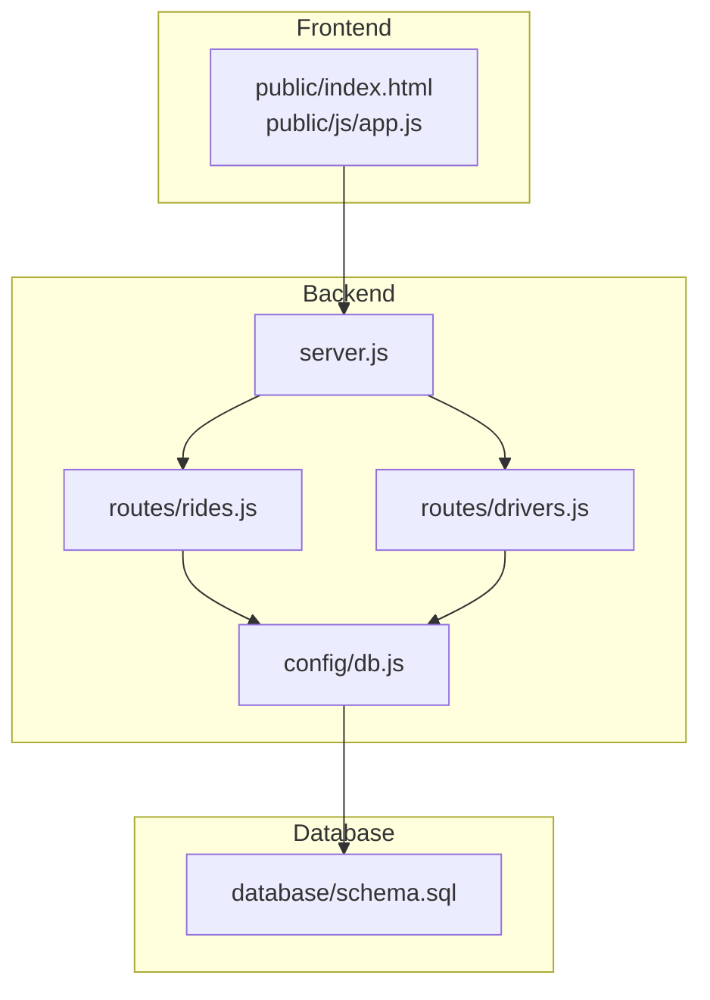
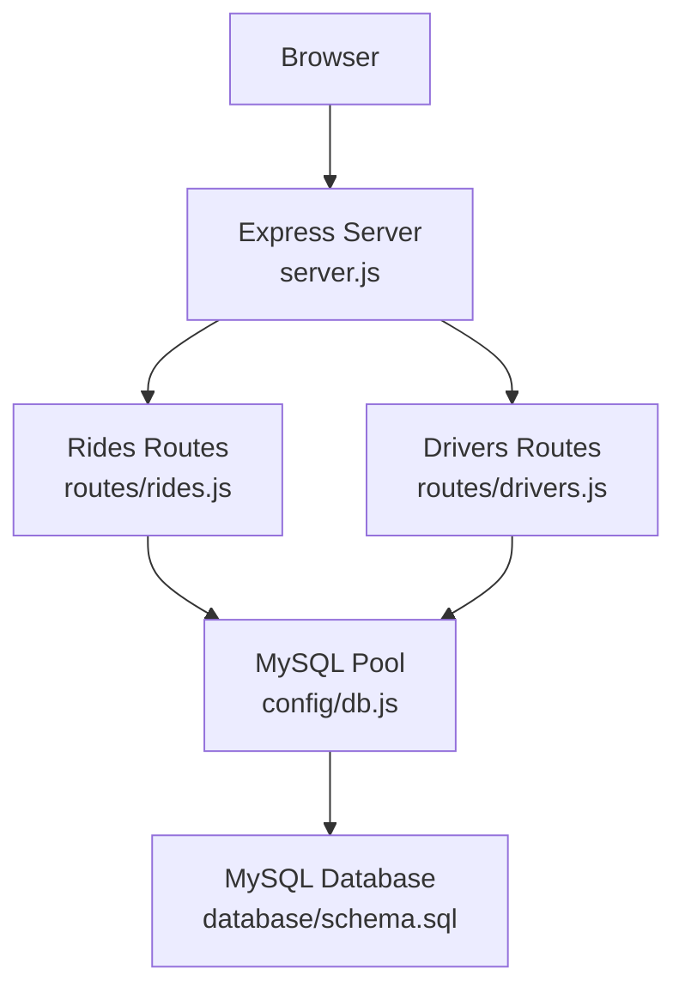
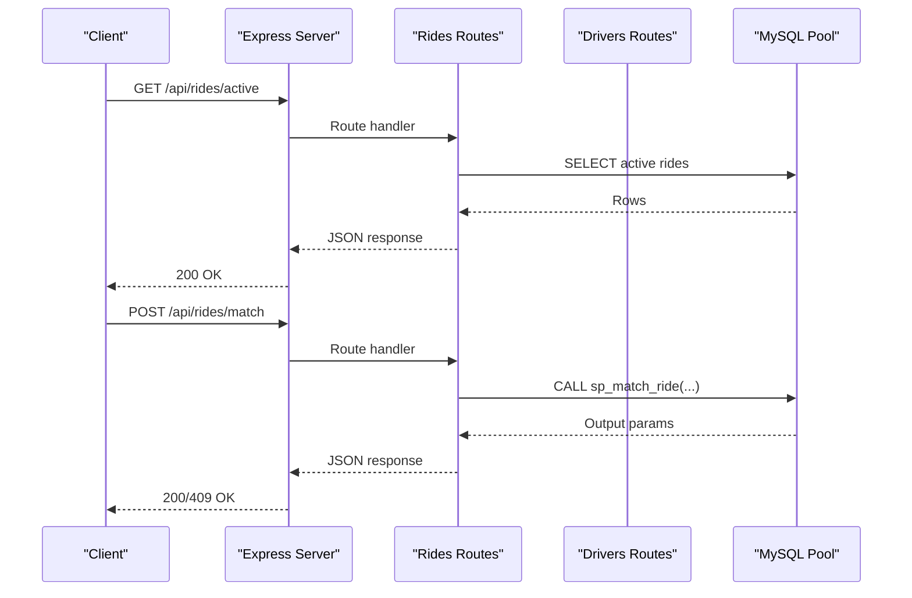
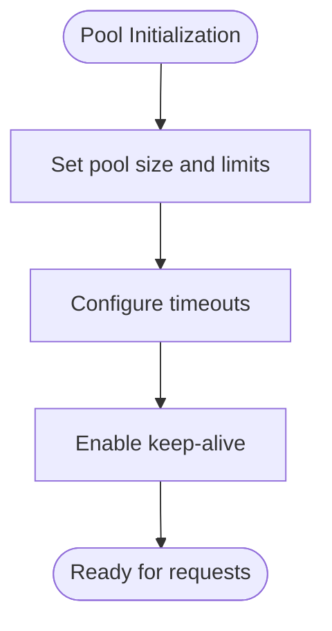
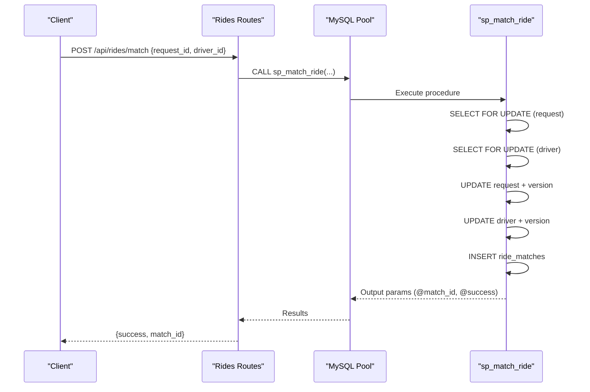
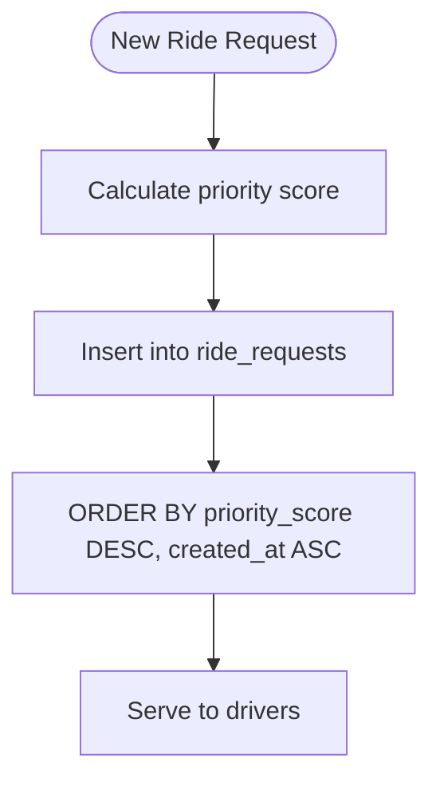
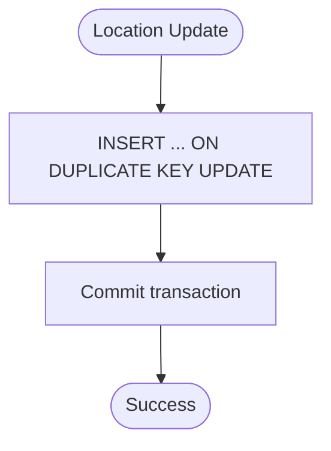
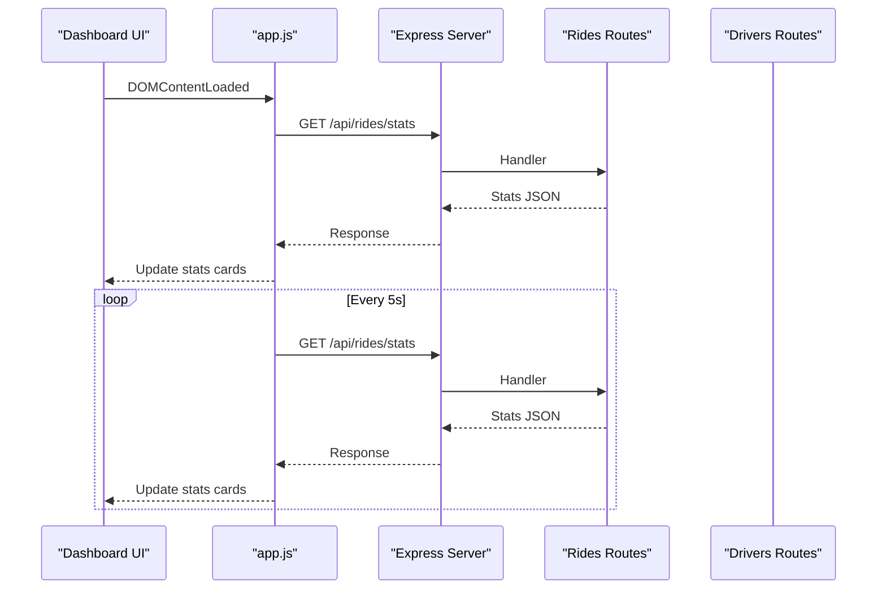
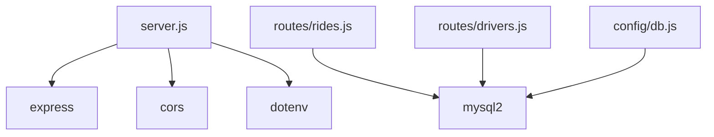

# Project Overview

<cite>
**Referenced Files in This Document**
- [README.md](file://README.md)
- [package.json](file://package.json)
- [server.js](file://server.js)
- [config/db.js](file://config/db.js)
- [database/schema.sql](file://database/schema.sql)
- [routes/rides.js](file://routes/rides.js)
- [routes/drivers.js](file://routes/drivers.js)
- [public/index.html](file://public/index.html)
- [public/js/app.js](file://public/js/app.js)
</cite>

## Table of Contents
1. [Introduction](#introduction)
2. [Project Structure](#project-structure)
3. [Core Components](#core-components)
4. [Architecture Overview](#architecture-overview)
5. [Detailed Component Analysis](#detailed-component-analysis)
6. [Dependency Analysis](#dependency-analysis)
7. [Performance Considerations](#performance-considerations)
8. [Troubleshooting Guide](#troubleshooting-guide)
9. [Conclusion](#conclusion)

## Introduction
This project is a high-throughput ride-sharing matching Database Management System designed to handle peak-hour concurrency with atomic matching guarantees and real-time monitoring. It combines a Node.js/Express backend with a MySQL database to deliver a production-ready system that emphasizes:
- Atomic matching via stored procedures with pessimistic locking
- Connection pooling for sustained throughput
- Real-time dashboard with auto-refreshing metrics
- Concurrency-safe operations using optimistic locking and strategic indexing

The system targets frequent updates (driver locations, ride statuses) and high read volumes (dashboard stats and active rides), with built-in optimizations for peak-hour scenarios such as priority scoring and upsert patterns.

## Project Structure
The project follows a layered architecture with clear separation of concerns:
- Backend: Express server with modular route handlers for rides and drivers
- Database: MySQL schema with stored procedures for atomic operations
- Frontend: Single-page dashboard with tabs for rides, drivers, match console, and registration
- Configuration: Centralized database connection pool and environment variables

**Diagram sources**
- [server.js:1-84](file://server.js#L1-L84)
- [routes/rides.js:1-272](file://routes/rides.js#L1-L272)
- [routes/drivers.js:1-182](file://routes/drivers.js#L1-L182)
- [config/db.js:1-50](file://config/db.js#L1-L50)
- [database/schema.sql:1-297](file://database/schema.sql#L1-L297)

**Section sources**
- [README.md:29-48](file://README.md#L29-L48)
- [package.json:1-24](file://package.json#L1-L24)

## Core Components
- Express server with middleware for CORS, JSON parsing, and request timing
- Connection pool configured for peak-hour concurrency with timeouts and keep-alive
- Modular route handlers for rides and drivers with transactional operations
- Stored procedures for atomic matching and status updates
- Frontend dashboard with auto-refresh intervals and interactive controls

Key implementation highlights:
- Connection pooling: 50 connections with queue limits and timeouts
- Atomic matching: stored procedure with FOR UPDATE locks
- Optimistic locking: version columns on drivers and ride_requests
- Priority scoring: peak-hour priority adjustments for pending requests
- Upsert pattern: INSERT ... ON DUPLICATE KEY UPDATE for driver locations

**Section sources**
- [server.js:10-84](file://server.js#L10-L84)
- [config/db.js:7-30](file://config/db.js#L7-L30)
- [routes/rides.js:135-167](file://routes/rides.js#L135-L167)
- [routes/drivers.js:101-126](file://routes/drivers.js#L101-L126)
- [database/schema.sql:164-272](file://database/schema.sql#L164-L272)

## Architecture Overview
The system architecture balances high read rates, frequent updates, and peak-hour concurrency through:
- Backend routing layer handling ride and driver operations
- Database layer with atomic stored procedures and strategic indexes
- Frontend dashboard polling endpoints for live stats and activity

**Diagram sources**
- [server.js:10-84](file://server.js#L10-L84)
- [routes/rides.js:1-272](file://routes/rides.js#L1-L272)
- [routes/drivers.js:1-182](file://routes/drivers.js#L1-L182)
- [config/db.js:1-50](file://config/db.js#L1-L50)
- [database/schema.sql:1-297](file://database/schema.sql#L1-L297)

## Detailed Component Analysis

### Backend Entry Point and Middleware
The Express server initializes middleware for CORS, JSON parsing, and request timing. It exposes health checks, static assets, and API routes for rides and drivers. The server logs slow requests and handles global errors and 404s.

**Diagram sources**
- [server.js:10-84](file://server.js#L10-L84)
- [routes/rides.js:10-41](file://routes/rides.js#L10-L41)
- [routes/rides.js:135-167](file://routes/rides.js#L135-L167)

**Section sources**
- [server.js:10-84](file://server.js#L10-L84)

### Database Connection Pool
The connection pool is configured for peak-hour throughput with:
- 50 connection limit and queue limit of 100
- Connection, acquire, and query timeouts
- Keep-alive enabled to prevent stale connections
- Streaming option for large result sets

**Diagram sources**
- [config/db.js:7-30](file://config/db.js#L7-L30)

**Section sources**
- [config/db.js:7-30](file://config/db.js#L7-L30)

### Atomic Matching via Stored Procedures
Atomic matching is implemented with a stored procedure that:
- Locks the ride request and driver rows using FOR UPDATE
- Validates availability and pending status
- Updates statuses, increments versions, and inserts a match record
- Returns match_id and success flag

**Diagram sources**
- [routes/rides.js:135-167](file://routes/rides.js#L135-L167)
- [database/schema.sql:164-234](file://database/schema.sql#L164-L234)

**Section sources**
- [routes/rides.js:135-167](file://routes/rides.js#L135-L167)
- [database/schema.sql:164-234](file://database/schema.sql#L164-L234)

### Priority Scoring and Pending Requests
Pending requests are ordered by priority score and creation time. Priority scoring increases during peak hours (7–9 AM and 5–8 PM), ensuring fair queue ordering under load.

**Diagram sources**
- [routes/rides.js:261-269](file://routes/rides.js#L261-L269)
- [database/schema.sql:74-98](file://database/schema.sql#L74-L98)

**Section sources**
- [routes/rides.js:261-269](file://routes/rides.js#L261-L269)
- [database/schema.sql:74-98](file://database/schema.sql#L74-L98)

### Driver Location Upserts
Driver location updates use an upsert pattern to avoid race conditions and reduce round-trips:
- Single INSERT ... ON DUPLICATE KEY UPDATE statement
- Atomic update of coordinates and timestamps

**Diagram sources**
- [routes/drivers.js:101-126](file://routes/drivers.js#L101-L126)
- [database/schema.sql:54-69](file://database/schema.sql#L54-L69)

**Section sources**
- [routes/drivers.js:101-126](file://routes/drivers.js#L101-L126)
- [database/schema.sql:54-69](file://database/schema.sql#L54-L69)

### Frontend Dashboard and Auto-Refresh
The frontend dashboard includes:
- Live stats cards (pending, matched, active, available drivers, completed today)
- Auto-refresh intervals for stats (every 5 seconds), rides (15 seconds), and drivers (30 seconds)
- Interactive tabs for ride requests, drivers, match console, and registration
- Modal forms for requesting rides and registering/updating drivers

**Diagram sources**
- [public/js/app.js:14-29](file://public/js/app.js#L14-L29)
- [public/js/app.js:155-169](file://public/js/app.js#L155-L169)
- [routes/rides.js:226-259](file://routes/rides.js#L226-L259)

**Section sources**
- [public/index.html:21-43](file://public/index.html#L21-L43)
- [public/js/app.js:14-29](file://public/js/app.js#L14-L29)
- [public/js/app.js:155-169](file://public/js/app.js#L155-L169)

## Dependency Analysis
The system’s dependencies are straightforward and purpose-built:
- Express for HTTP routing and middleware
- mysql2 for MySQL connectivity with Promise API and connection pooling
- dotenv for environment configuration
- cors for cross-origin support

**Diagram sources**
- [package.json:14-18](file://package.json#L14-L18)
- [server.js:1-8](file://server.js#L1-L8)
- [routes/rides.js:1-3](file://routes/rides.js#L1-L3)
- [routes/drivers.js:1-3](file://routes/drivers.js#L1-L3)
- [config/db.js:1](file://config/db.js#L1)

**Section sources**
- [package.json:14-18](file://package.json#L14-L18)

## Performance Considerations
- Connection pooling: 50 connections with queue limits and timeouts to handle bursty traffic
- Atomic operations: Stored procedures with FOR UPDATE prevent race conditions and double-booking
- Indexing: Strategic indexes on status, created_at, and location fields optimize read-heavy queries
- Upsert pattern: Reduces round-trips and eliminates race conditions for frequent location updates
- Priority scoring: Ensures fair queue ordering during peak hours
- Auto-refresh intervals: Balance responsiveness with server load

[No sources needed since this section provides general guidance]

## Troubleshooting Guide
Common issues and resolutions:
- Connection refused: Verify MySQL is running and host/port are correct
- Access denied: Confirm DB_USER and DB_PASSWORD in environment configuration
- Table not found: Run the schema initialization script to create tables and stored procedures
- Port 3000 in use: Change PORT in environment configuration
- Slow queries during peak: Monitor peak-hour statistics and adjust pool size if needed

**Section sources**
- [README.md:265-274](file://README.md#L265-L274)

## Conclusion
This ride-sharing matching DBMS demonstrates a pragmatic approach to high-throughput, concurrency-safe operations. By combining Express routing, MySQL stored procedures, and a responsive frontend, it delivers atomic matching, real-time monitoring, and peak-hour optimizations. The system’s design choices—connection pooling, pessimistic locking, optimistic locking, strategic indexing, and upsert patterns—provide a solid foundation for scaling and extending the platform.