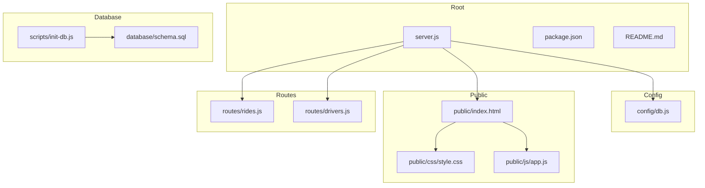
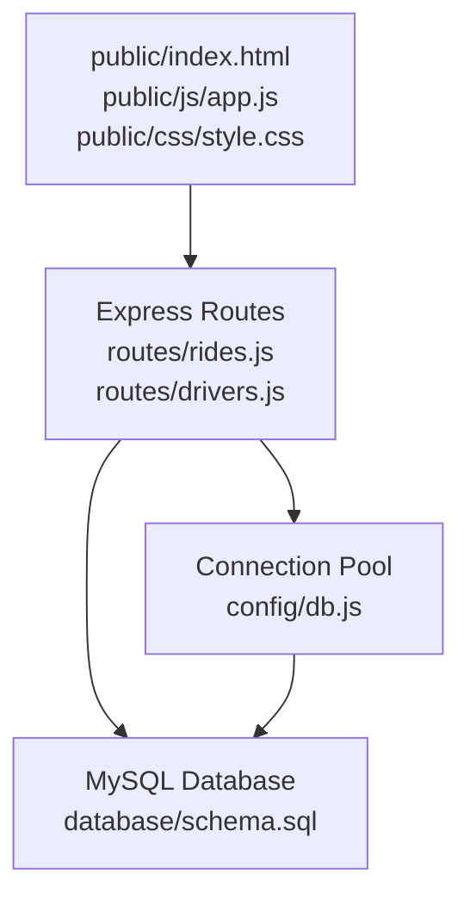
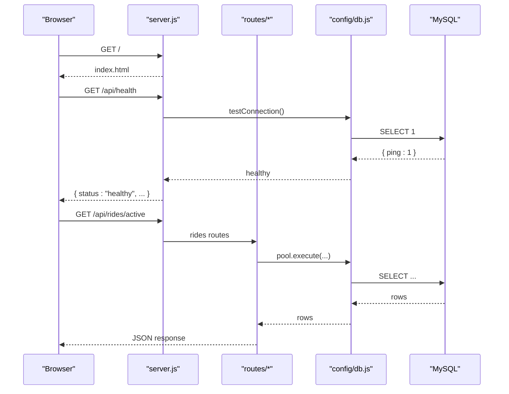
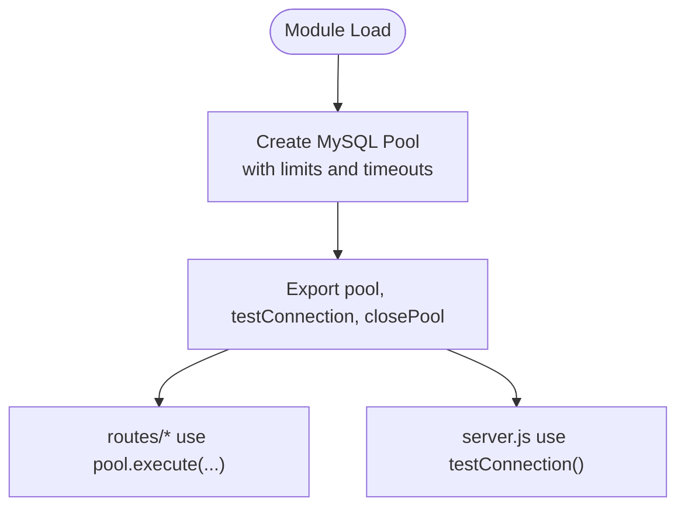
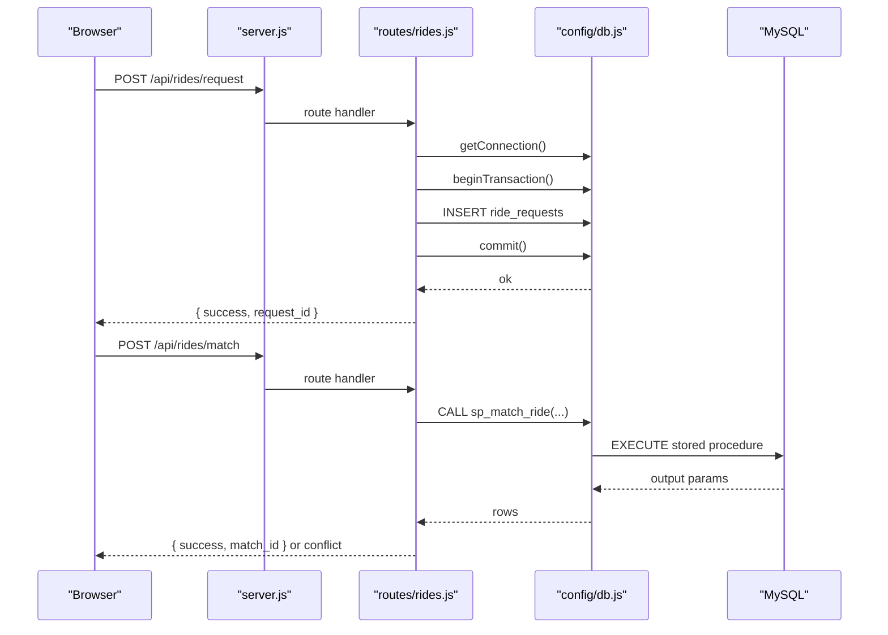
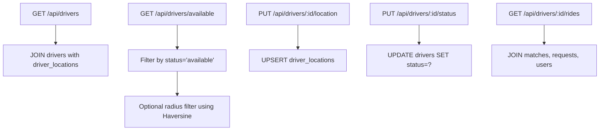
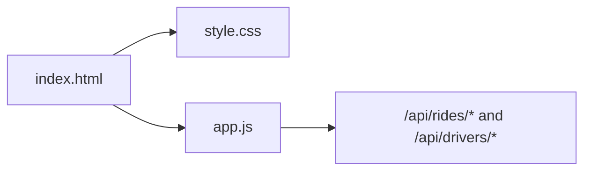
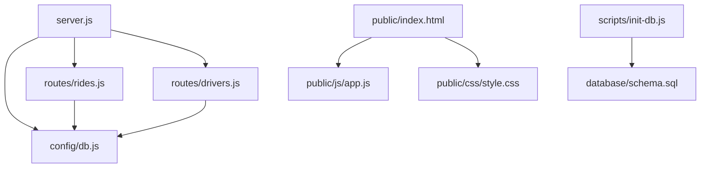

# Project Structure and Organization

<cite>
**Referenced Files in This Document**
- [server.js](file://server.js)
- [package.json](file://package.json)
- [config/db.js](file://config/db.js)
- [database/schema.sql](file://database/schema.sql)
- [routes/rides.js](file://routes/rides.js)
- [routes/drivers.js](file://routes/drivers.js)
- [public/index.html](file://public/index.html)
- [public/js/app.js](file://public/js/app.js)
- [public/css/style.css](file://public/css/style.css)
- [scripts/init-db.js](file://scripts/init-db.js)
- [README.md](file://README.md)
</cite>

## Table of Contents
1. [Introduction](#introduction)
2. [Project Structure](#project-structure)
3. [Core Components](#core-components)
4. [Architecture Overview](#architecture-overview)
5. [Detailed Component Analysis](#detailed-component-analysis)
6. [Dependency Analysis](#dependency-analysis)
7. [Performance Considerations](#performance-considerations)
8. [Troubleshooting Guide](#troubleshooting-guide)
9. [Conclusion](#conclusion)

## Introduction
This document explains the project structure and organizational layout of the ride-sharing matching DBMS. It covers how the backend server, routing, database schema, and frontend assets are organized, and how they work together to support high-read, frequent-update, and peak-hour concurrency scenarios. It also provides guidance on where to look for specific functionality and how to integrate new features following established patterns.

## Project Structure
The project follows a clear separation of concerns across directories:
- config/: Centralized database connection configuration and health checks
- database/: Database schema, stored procedures, and sample data
- public/: Static frontend assets (HTML, CSS, JS) and the SPA entry point
- routes/: Route handlers for API endpoints grouped by domain (rides, drivers)
- scripts/: Utility scripts for database initialization
- Root files: server entry point, dependency manifest, and documentation



**Diagram sources**
- [server.js:1-84](file://server.js#L1-L84)
- [config/db.js:1-50](file://config/db.js#L1-L50)
- [database/schema.sql:1-297](file://database/schema.sql#L1-L297)
- [routes/rides.js:1-272](file://routes/rides.js#L1-L272)
- [routes/drivers.js:1-182](file://routes/drivers.js#L1-L182)
- [public/index.html:1-239](file://public/index.html#L1-L239)
- [public/js/app.js:1-373](file://public/js/app.js#L1-L373)
- [public/css/style.css:1-519](file://public/css/style.css#L1-L519)
- [scripts/init-db.js:1-46](file://scripts/init-db.js#L1-L46)

**Section sources**
- [README.md:29-48](file://README.md#L29-L48)
- [server.js:1-84](file://server.js#L1-L84)
- [package.json:1-24](file://package.json#L1-L24)

## Core Components
- server.js: Express application entry point that configures middleware, serves static assets, mounts route handlers, exposes health checks, and logs startup diagnostics.
- config/db.js: Creates a MySQL connection pool tuned for high concurrency and peak-hour loads, plus helpers for connection testing and graceful shutdown.
- database/schema.sql: Defines the complete relational schema, indexes, stored procedures, and sample data for the system.
- routes/rides.js: Implements ride request lifecycle, matching, status updates, and analytics endpoints.
- routes/drivers.js: Implements driver listing, registration, location updates, status toggles, and ride history.
- public/index.html: Single-page application shell that hosts the dashboard UI.
- public/js/app.js: Frontend logic for tabs, forms, data loading, and API interactions.
- public/css/style.css: Responsive styling for the dashboard UI.
- scripts/init-db.js: Utility script to initialize the database by applying schema.sql.

**Section sources**
- [server.js:1-84](file://server.js#L1-L84)
- [config/db.js:1-50](file://config/db.js#L1-L50)
- [database/schema.sql:1-297](file://database/schema.sql#L1-L297)
- [routes/rides.js:1-272](file://routes/rides.js#L1-L272)
- [routes/drivers.js:1-182](file://routes/drivers.js#L1-L182)
- [public/index.html:1-239](file://public/index.html#L1-L239)
- [public/js/app.js:1-373](file://public/js/app.js#L1-L373)
- [public/css/style.css:1-519](file://public/css/style.css#L1-L519)
- [scripts/init-db.js:1-46](file://scripts/init-db.js#L1-L46)

## Architecture Overview
The system uses a layered architecture:
- Presentation layer: public/ serves a static SPA that communicates with the backend via REST APIs.
- Business logic layer: routes/ contains route handlers that orchestrate operations and call the database.
- Data access layer: config/db.js encapsulates database connectivity and connection pooling.



**Diagram sources**
- [server.js:1-84](file://server.js#L1-L84)
- [routes/rides.js:1-272](file://routes/rides.js#L1-L272)
- [routes/drivers.js:1-182](file://routes/drivers.js#L1-L182)
- [config/db.js:1-50](file://config/db.js#L1-L50)
- [database/schema.sql:1-297](file://database/schema.sql#L1-L297)

## Detailed Component Analysis

### server.js: Entry Point and Middleware
- Loads environment variables, initializes database connection health check, and mounts route handlers.
- Configures CORS, JSON parsing, and static asset serving.
- Provides a global slow request logger, a health endpoint, and a root redirect to the SPA.
- Registers centralized error and 404 handlers and starts the server with startup diagnostics.



**Diagram sources**
- [server.js:1-84](file://server.js#L1-L84)
- [routes/rides.js:1-272](file://routes/rides.js#L1-L272)
- [config/db.js:1-50](file://config/db.js#L1-L50)

**Section sources**
- [server.js:1-84](file://server.js#L1-L84)

### config/db.js: Connection Pooling and Helpers
- Creates a MySQL promise-based connection pool sized for peak-hour concurrency.
- Includes a health check helper and a graceful shutdown helper.
- Exposes pool, testConnection, and closePool for use across the application.



**Diagram sources**
- [config/db.js:1-50](file://config/db.js#L1-L50)

**Section sources**
- [config/db.js:1-50](file://config/db.js#L1-L50)

### database/schema.sql: Schema, Indexes, Stored Procedures, and Sample Data
- Defines core tables: users, drivers, driver_locations, ride_requests, ride_matches, peak_hour_stats, driver_queue.
- Adds strategic indexes to optimize frequent queries and peak-hour operations.
- Provides stored procedures for atomic operations (e.g., sp_match_ride, sp_update_match_status, sp_cleanup_stale_locations).
- Includes sample data inserts for quick setup and testing.

```mermaid
erDiagram
USERS {
int user_id PK
varchar name
varchar email UK
varchar phone
timestamp created_at
timestamp updated_at
}
DRIVERS {
int driver_id PK
varchar name
varchar email UK
varchar phone
varchar vehicle_model
varchar vehicle_plate UK
enum status
decimal rating
int total_trips
int version
timestamp created_at
timestamp updated_at
}
DRIVER_LOCATIONS {
int location_id PK
int driver_id FK
decimal latitude
decimal longitude
decimal accuracy
timestamp updated_at
}
RIDE_REQUESTS {
int request_id PK
int user_id FK
decimal pickup_lat
decimal pickup_lng
decimal dropoff_lat
decimal dropoff_lng
varchar pickup_address
varchar dropoff_address
enum status
decimal fare_estimate
decimal priority_score
int version
timestamp created_at
timestamp updated_at
}
RIDE_MATCHES {
int match_id PK
int request_id FK UK
int driver_id FK
enum status
decimal fare_final
decimal distance_km
timestamp started_at
timestamp completed_at
int version
timestamp created_at
timestamp updated_at
}
PEAK_HOUR_STATS {
int stat_id PK
datetime hour_block UK
int requests_count
int matches_count
int avg_wait_sec
int cancelled_count
}
DRIVER_QUEUE {
int queue_id PK
int driver_id FK
varchar zone_id
timestamp queued_at
}
DRIVERS ||--o{ DRIVER_LOCATIONS : "has one"
USERS ||--o{ RIDE_REQUESTS : "creates"
RIDE_REQUESTS ||--|| RIDE_MATCHES : "matches"
DRIVERS ||--o{ RIDE_MATCHES : "drives"
```

**Diagram sources**
- [database/schema.sql:1-297](file://database/schema.sql#L1-L297)

**Section sources**
- [database/schema.sql:1-297](file://database/schema.sql#L1-L297)

### routes/rides.js: Ride Lifecycle and Matching
- Provides endpoints for listing active/pending rides, creating requests, matching drivers atomically, updating statuses, and retrieving stats.
- Uses transactions for status updates and stored procedures for atomic matching to prevent race conditions.
- Implements priority scoring for peak-hour ordering.



**Diagram sources**
- [routes/rides.js:1-272](file://routes/rides.js#L1-L272)
- [config/db.js:1-50](file://config/db.js#L1-L50)

**Section sources**
- [routes/rides.js:1-272](file://routes/rides.js#L1-L272)

### routes/drivers.js: Driver Management
- Lists drivers, filters available drivers by proximity, registers new drivers, updates locations atomically, toggles status, and retrieves driver ride history.
- Uses UPSERT semantics for frequent location updates to avoid race conditions.



**Diagram sources**
- [routes/drivers.js:1-182](file://routes/drivers.js#L1-L182)

**Section sources**
- [routes/drivers.js:1-182](file://routes/drivers.js#L1-L182)

### public/: Static Frontend Assets
- index.html: SPA shell with tabs for rides, drivers, match console, and registration forms.
- js/app.js: Manages UI state, tabs, modals, forms, periodic refresh, and API calls to the backend.
- css/style.css: Responsive styling for cards, tables, forms, modals, and toast notifications.



**Diagram sources**
- [public/index.html:1-239](file://public/index.html#L1-L239)
- [public/js/app.js:1-373](file://public/js/app.js#L1-L373)
- [public/css/style.css:1-519](file://public/css/style.css#L1-L519)

**Section sources**
- [public/index.html:1-239](file://public/index.html#L1-L239)
- [public/js/app.js:1-373](file://public/js/app.js#L1-L373)
- [public/css/style.css:1-519](file://public/css/style.css#L1-L519)

### scripts/init-db.js: Database Initialization Script
- Reads schema.sql and executes statements against a MySQL connection configured from environment variables.
- Handles known warnings (e.g., DROP IF EXISTS) and reports initialization status.

**Section sources**
- [scripts/init-db.js:1-46](file://scripts/init-db.js#L1-L46)

## Dependency Analysis
- server.js depends on config/db.js for database connectivity and routes/rides.js and routes/drivers.js for API endpoints.
- routes/rides.js and routes/drivers.js depend on config/db.js for database operations.
- public/index.html depends on public/js/app.js and public/css/style.css.
- scripts/init-db.js depends on database/schema.sql.



**Diagram sources**
- [server.js:1-84](file://server.js#L1-L84)
- [config/db.js:1-50](file://config/db.js#L1-L50)
- [routes/rides.js:1-272](file://routes/rides.js#L1-L272)
- [routes/drivers.js:1-182](file://routes/drivers.js#L1-L182)
- [public/index.html:1-239](file://public/index.html#L1-L239)
- [public/js/app.js:1-373](file://public/js/app.js#L1-L373)
- [public/css/style.css:1-519](file://public/css/style.css#L1-L519)
- [scripts/init-db.js:1-46](file://scripts/init-db.js#L1-L46)

**Section sources**
- [server.js:1-84](file://server.js#L1-L84)
- [routes/rides.js:1-272](file://routes/rides.js#L1-L272)
- [routes/drivers.js:1-182](file://routes/drivers.js#L1-L182)
- [config/db.js:1-50](file://config/db.js#L1-L50)
- [public/index.html:1-239](file://public/index.html#L1-L239)
- [public/js/app.js:1-373](file://public/js/app.js#L1-L373)
- [public/css/style.css:1-519](file://public/css/style.css#L1-L519)
- [scripts/init-db.js:1-46](file://scripts/init-db.js#L1-L46)

## Performance Considerations
- Connection pooling: The pool is sized for peak-hour concurrency with queue limits and timeouts to prevent overload.
- Atomic operations: Stored procedures and explicit locking prevent race conditions during matching and status updates.
- Indexing: Strategic indexes accelerate high-frequency queries (status filtering, spatial searches, queue ordering).
- Upsert pattern: Single-statement upserts reduce contention for frequent location updates.
- Priority scoring: Peak-hour priority ensures fair queue ordering under load.
- Frontend refresh cadence: Auto-refresh intervals balance responsiveness with network overhead.

[No sources needed since this section provides general guidance]

## Troubleshooting Guide
Common issues and resolutions:
- Connection refused: Verify MySQL is running and reachable with the configured host/port.
- Access denied: Confirm DB_USER and DB_PASSWORD in environment configuration.
- Table not found: Initialize the database using the schema file or the initialization script.
- Port conflicts: Change the PORT environment variable to an available port.
- Slow queries during peak: Monitor analytics and adjust pool size or indexes as needed.

**Section sources**
- [README.md:265-274](file://README.md#L265-L274)

## Conclusion
The project is structured to cleanly separate presentation, business logic, and data access concerns. The backend relies on a robust connection pool and atomic operations to handle peak-hour concurrency, while the frontend provides a responsive dashboard for managing rides and drivers. Developers can extend functionality by adding new route handlers under routes/, integrating new database operations via stored procedures or direct queries in config/db.js, and enhancing the UI in public/.