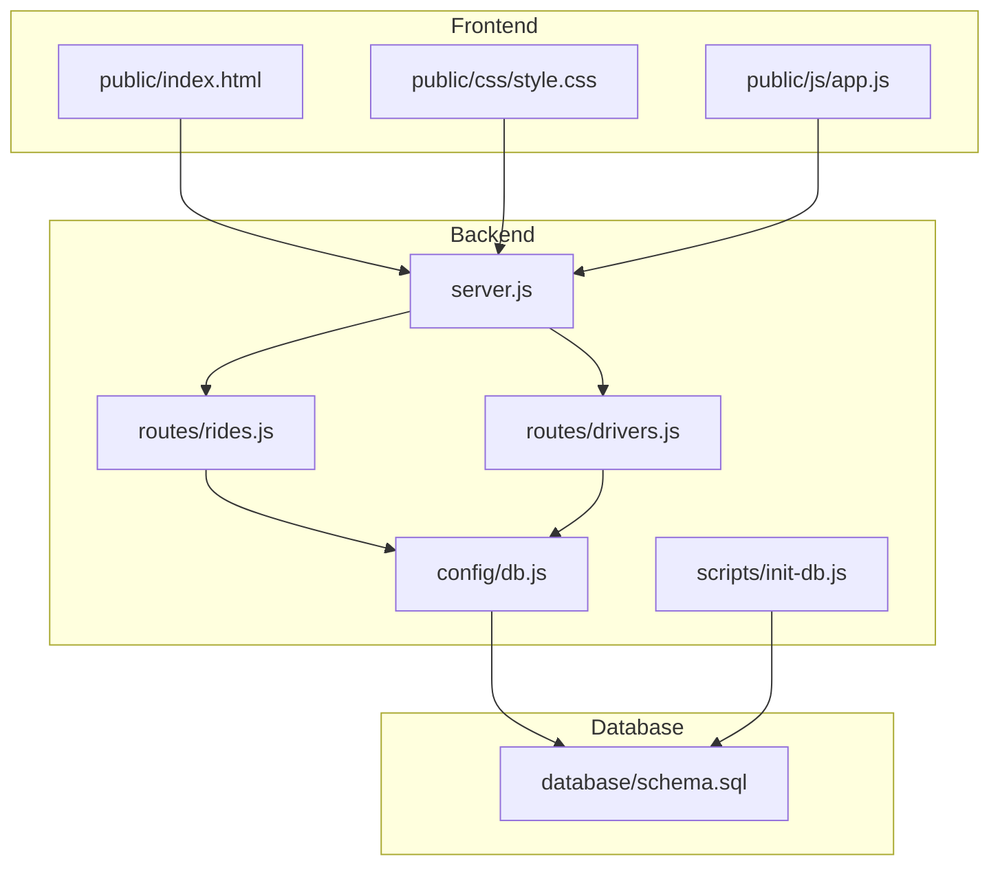
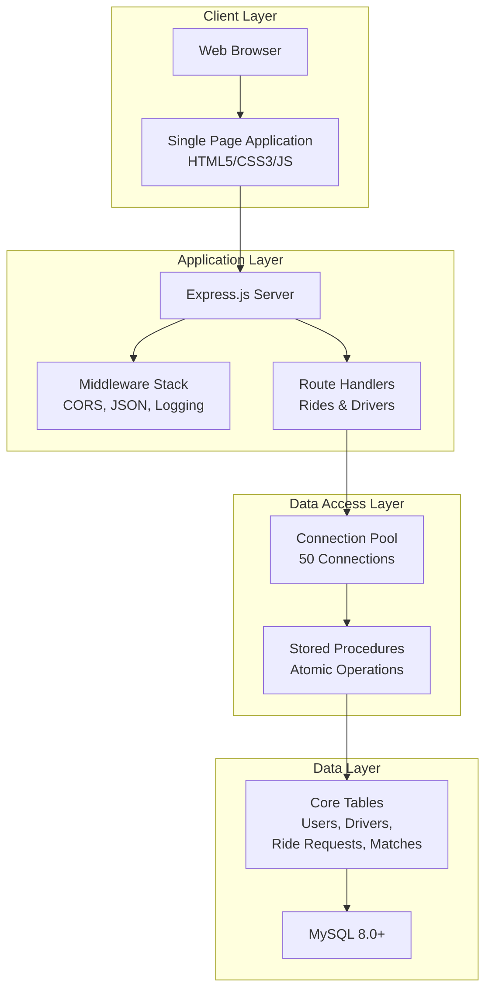
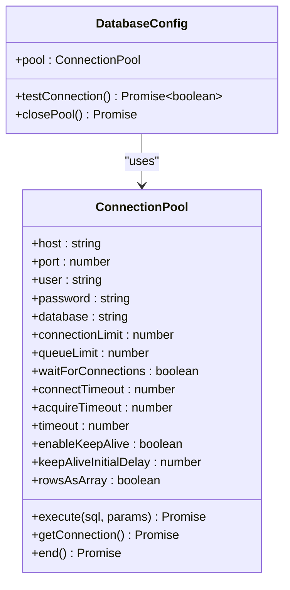
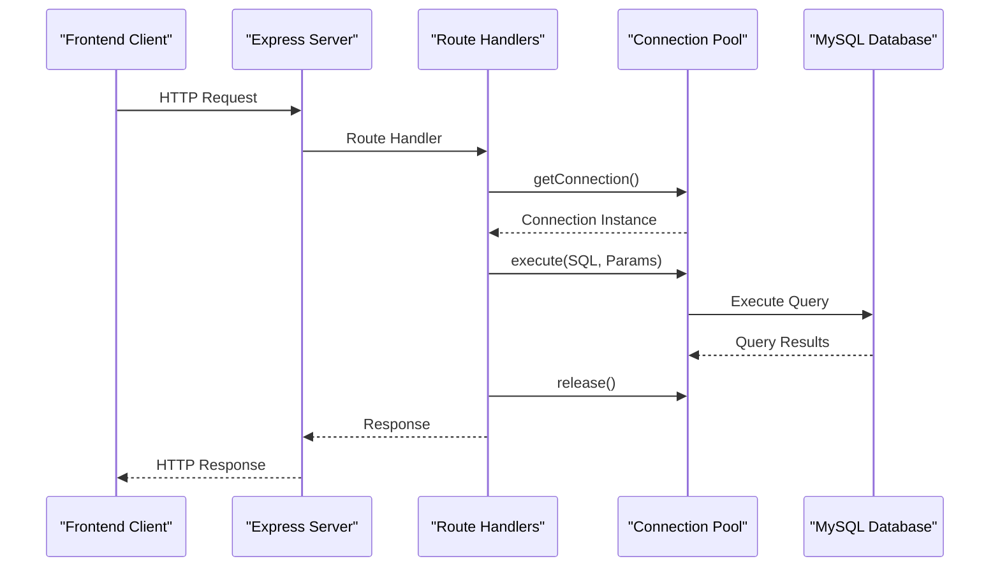
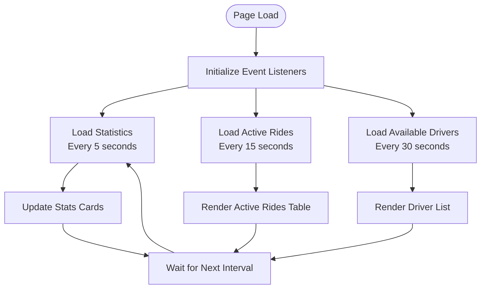
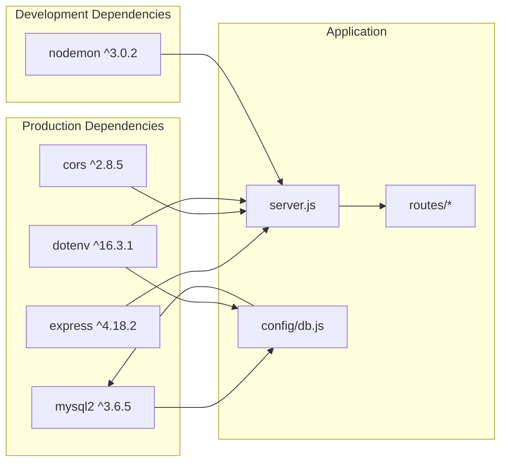

# Technology Stack Overview

<cite>
**Referenced Files in This Document**
- [package.json](file://package.json)
- [server.js](file://server.js)
- [config/db.js](file://config/db.js)
- [public/index.html](file://public/index.html)
- [public/js/app.js](file://public/js/app.js)
- [public/css/style.css](file://public/css/style.css)
- [routes/rides.js](file://routes/rides.js)
- [routes/drivers.js](file://routes/drivers.js)
- [scripts/init-db.js](file://scripts/init-db.js)
- [database/schema.sql](file://database/schema.sql)
- [README.md](file://README.md)
</cite>

## Table of Contents
1. [Introduction](#introduction)
2. [Project Structure](#project-structure)
3. [Core Components](#core-components)
4. [Architecture Overview](#architecture-overview)
5. [Detailed Component Analysis](#detailed-component-analysis)
6. [Dependency Analysis](#dependency-analysis)
7. [Performance Considerations](#performance-considerations)
8. [Troubleshooting Guide](#troubleshooting-guide)
9. [Conclusion](#conclusion)

## Introduction
This document provides a comprehensive overview of the technology stack used in the ride-sharing matching DBMS. The system is designed for high read operations, frequent updates, and peak-hour concurrency. It combines modern frontend technologies with a robust backend built on Node.js and Express.js, backed by MySQL 8.0+ with advanced connection pooling and atomic operations to ensure reliability under load.

## Project Structure
The project follows a layered architecture with clear separation between frontend assets, backend server, routing logic, database configuration, and initialization scripts. The structure supports rapid development and deployment while maintaining scalability and performance characteristics required for real-time ride matching.

**Diagram sources**
- [server.js:1-84](file://server.js#L1-L84)
- [routes/rides.js:1-272](file://routes/rides.js#L1-L272)
- [routes/drivers.js:1-182](file://routes/drivers.js#L1-L182)
- [config/db.js:1-50](file://config/db.js#L1-L50)
- [scripts/init-db.js:1-46](file://scripts/init-db.js#L1-L46)
- [database/schema.sql:1-297](file://database/schema.sql#L1-L297)

**Section sources**
- [README.md:29-48](file://README.md#L29-L48)
- [package.json:1-24](file://package.json#L1-L24)

## Core Components
The technology stack consists of four primary layers, each contributing to the system's performance, reliability, and real-time capabilities:

### Frontend Technologies
- **HTML5**: Provides semantic structure and form elements for user interactions
- **CSS3**: Implements responsive design, animations, and interactive UI components
- **JavaScript (Vanilla)**: Handles dynamic content loading, API communication, and real-time updates

### Backend Framework
- **Node.js**: Runtime environment enabling asynchronous, event-driven operations
- **Express.js**: Web application framework providing routing, middleware, and HTTP utilities

### Database System
- **MySQL 8.0+**: Relational database with advanced features for high-concurrency scenarios
- **mysql2**: High-performance MySQL driver with Promise API and connection pooling

### Development Tools
- **npm**: Package manager for dependency management
- **dotenv**: Environment configuration management
- **nodemon**: Development server with automatic restart on file changes

**Section sources**
- [README.md:18-26](file://README.md#L18-L26)
- [package.json:14-22](file://package.json#L14-L22)
- [server.js:1-84](file://server.js#L1-L84)

## Architecture Overview
The system employs a client-server architecture with a single-page application frontend communicating with a Node.js/Express backend through RESTful APIs. The backend interacts with MySQL using a connection pool optimized for peak-hour concurrency.

**Diagram sources**
- [server.js:10-67](file://server.js#L10-L67)
- [routes/rides.js:10-86](file://routes/rides.js#L10-L86)
- [routes/drivers.js:10-77](file://routes/drivers.js#L10-L77)
- [config/db.js:7-30](file://config/db.js#L7-L30)
- [database/schema.sql:160-272](file://database/schema.sql#L160-L272)

## Detailed Component Analysis

### Database Connection Pool Configuration
The mysql2 driver is configured with a connection pool sized for peak-hour concurrency, featuring 50 simultaneous connections and a queue limit of 100 to handle burst traffic without dropping requests.

**Diagram sources**
- [config/db.js:7-49](file://config/db.js#L7-L49)

**Section sources**
- [config/db.js:7-30](file://config/db.js#L7-L30)
- [README.md:144-146](file://README.md#L144-L146)

### API Route Implementation Patterns
The backend implements RESTful endpoints with transaction management and atomic operations to ensure data consistency under high concurrency.

**Diagram sources**
- [server.js:40-41](file://server.js#L40-L41)
- [routes/rides.js:89-133](file://routes/rides.js#L89-L133)
- [routes/drivers.js:101-126](file://routes/drivers.js#L101-L126)

**Section sources**
- [routes/rides.js:89-133](file://routes/rides.js#L89-L133)
- [routes/drivers.js:101-126](file://routes/drivers.js#L101-L126)

### Frontend Real-time Dashboard
The vanilla JavaScript frontend implements auto-refresh mechanisms and real-time status updates for optimal user experience during peak-hour operations.

**Diagram sources**
- [public/js/app.js:14-29](file://public/js/app.js#L14-L29)
- [public/js/app.js:155-169](file://public/js/app.js#L155-L169)
- [public/js/app.js:171-199](file://public/js/app.js#L171-L199)

**Section sources**
- [public/js/app.js:14-29](file://public/js/app.js#L14-L29)
- [public/js/app.js:155-169](file://public/js/app.js#L155-L169)

## Dependency Analysis
The project maintains minimal external dependencies focused on core functionality, ensuring lightweight deployment and reduced maintenance overhead.

**Diagram sources**
- [package.json:14-22](file://package.json#L14-L22)
- [server.js:1-8](file://server.js#L1-L8)

**Section sources**
- [package.json:14-22](file://package.json#L14-L22)
- [server.js:1-8](file://server.js#L1-L8)

## Performance Considerations
The technology stack incorporates several performance optimizations tailored for high-concurrency ride-sharing operations:

### Connection Pooling Strategy
- **Pool Size**: 50 concurrent connections to handle peak-hour bursts
- **Queue Management**: 100-item queue limit prevents resource exhaustion
- **Timeout Configuration**: 10-second timeouts prevent hanging connections
- **Keep-Alive**: Automatic connection refresh prevents idle timeouts

### Atomic Operations and Concurrency Control
- **Stored Procedures**: MySQL stored procedures with `FOR UPDATE` locks prevent race conditions
- **Optimistic Locking**: Version columns detect and prevent stale data updates
- **Upsert Operations**: Single atomic operations eliminate race conditions in location updates

### Strategic Indexing
- **Driver Availability**: `idx_status` enables fast available-driver queries
- **Ride Priority**: `idx_priority` ensures proper queue ordering during peak hours
- **Geographic Queries**: Location-based indexes optimize nearby driver searches

### Real-time Frontend Updates
- **Auto-refresh Intervals**: Different intervals for various data types balance freshness and performance
- **Conditional Loading**: Empty states and loading indicators improve perceived performance
- **Event-driven UI**: DOM manipulation minimizes unnecessary re-renders

**Section sources**
- [README.md:144-176](file://README.md#L144-L176)
- [config/db.js:14-29](file://config/db.js#L14-L29)
- [routes/rides.js:135-167](file://routes/rides.js#L135-L167)
- [database/schema.sql:46-98](file://database/schema.sql#L46-L98)

## Troubleshooting Guide
Common issues and their solutions for the technology stack:

### Database Connectivity Issues
- **Connection Refused**: Verify MySQL service is running and accessible on configured host/port
- **Authentication Failure**: Check database credentials in environment configuration
- **Schema Not Found**: Ensure database initialization script has been executed

### Performance Problems
- **Slow Response Times**: Monitor connection pool utilization and consider increasing pool size
- **Memory Leaks**: Verify proper connection release in route handlers
- **Query Performance**: Review index usage and consider adding missing indexes

### Development Environment Issues
- **Port Conflicts**: Change PORT environment variable to an available port
- **Hot Reload Not Working**: Ensure nodemon is installed and running in development mode
- **Environment Variables**: Verify .env file contains all required configuration values

**Section sources**
- [README.md:265-274](file://README.md#L265-L274)
- [scripts/init-db.js:6-45](file://scripts/init-db.js#L6-L45)

## Conclusion
The ride-sharing matching DBMS technology stack provides a robust foundation for high-concurrency, real-time operations. The combination of Express.js for backend logic, mysql2 with connection pooling for database access, and vanilla JavaScript for frontend interactivity delivers optimal performance characteristics. The strategic use of stored procedures, atomic operations, and connection pooling ensures reliable operation during peak-hour demand while maintaining code simplicity and maintainability.

The stack's design prioritizes:
- **Performance**: Connection pooling and atomic operations minimize latency
- **Reliability**: Stored procedures and optimistic locking prevent data inconsistencies
- **Scalability**: Modular architecture supports future enhancements
- **Maintainability**: Minimal dependencies reduce complexity and upgrade overhead

This technology foundation positions the system well for production deployment and future feature additions such as WebSocket real-time updates and Redis caching layers.