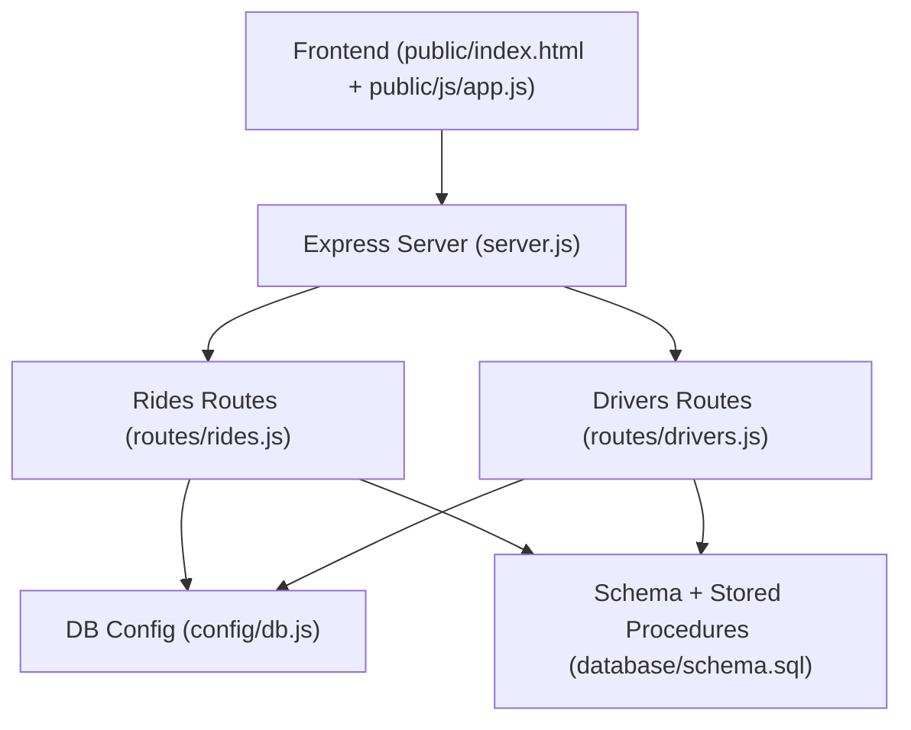
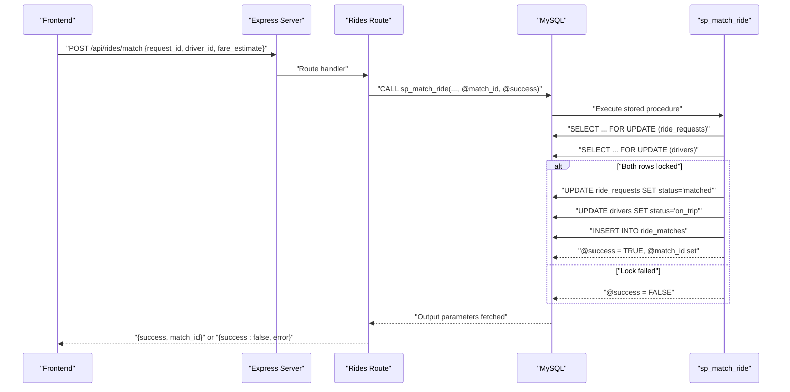
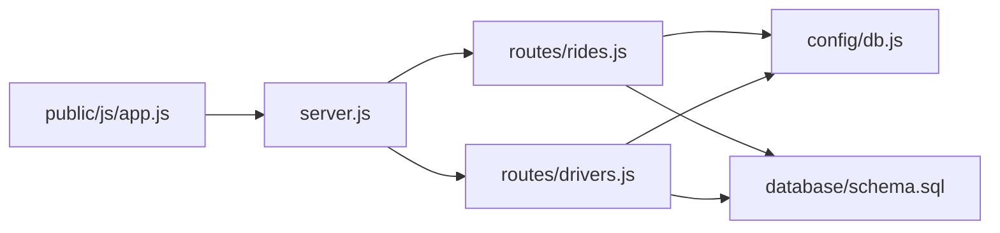

# Atomic Ride-Driver Matching

<cite>
**Referenced Files in This Document**
- [schema.sql](file://database/schema.sql)
- [rides.js](file://routes/rides.js)
- [drivers.js](file://routes/drivers.js)
- [db.js](file://config/db.js)
- [server.js](file://server.js)
- [app.js](file://public/js/app.js)
- [index.html](file://public/index.html)
- [init-db.js](file://scripts/init-db.js)
- [README.md](file://README.md)
</cite>

## Table of Contents
1. [Introduction](#introduction)
2. [Project Structure](#project-structure)
3. [Core Components](#core-components)
4. [Architecture Overview](#architecture-overview)
5. [Detailed Component Analysis](#detailed-component-analysis)
6. [Dependency Analysis](#dependency-analysis)
7. [Performance Considerations](#performance-considerations)
8. [Troubleshooting Guide](#troubleshooting-guide)
9. [Conclusion](#conclusion)

## Introduction
This document explains the atomic ride-driver matching mechanism implemented in the ride-sharing DBMS. It focuses on:
- The critical stored procedure that prevents race conditions using pessimistic locking
- The POST /api/rides/match endpoint that coordinates ride requests and driver availability
- Concrete examples of how multiple drivers competing for the same ride are handled atomically
- The use of MySQL output parameters (@match_id, @success) for returning match results and error conditions
- Prevention of double-booking scenarios and data consistency during peak-hour concurrency
- The relationship between ride status changes and driver availability updates
- Timeout handling for locked records and strategies for handling driver unavailability during matching attempts

## Project Structure
The system is organized around a MySQL schema with stored procedures, Express.js routes, and a simple frontend dashboard. The matching logic is centralized in the database to ensure atomicity and consistency.

**Diagram sources**
- [server.js:1-84](file://server.js#L1-L84)
- [rides.js:1-272](file://routes/rides.js#L1-L272)
- [drivers.js:1-182](file://routes/drivers.js#L1-L182)
- [db.js:1-50](file://config/db.js#L1-L50)
- [schema.sql:160-272](file://database/schema.sql#L160-L272)

**Section sources**
- [README.md:29-48](file://README.md#L29-L48)
- [server.js:37-41](file://server.js#L37-L41)
- [rides.js:1-272](file://routes/rides.js#L1-L272)
- [drivers.js:1-182](file://routes/drivers.js#L1-L182)
- [db.js:1-50](file://config/db.js#L1-L50)
- [schema.sql:160-272](file://database/schema.sql#L160-L272)

## Core Components
- Database schema with tables for users, drivers, driver_locations, ride_requests, ride_matches, peak_hour_stats, and driver_queue
- Stored procedures for atomic operations:
  - sp_match_ride: performs a pessimistic lock on both the ride request and the driver, then updates statuses and inserts a match record
  - sp_update_match_status: optimistic locking update for match status transitions
  - sp_cleanup_stale_locations: periodic cleanup of stale driver location entries
- Express routes for:
  - Ride requests and matching (including POST /api/rides/match)
  - Driver management (registration, location updates, status toggles)
  - Status updates and analytics
- Connection pooling configuration optimized for peak-hour concurrency

Key atomicity enablers:
- Pessimistic locking via SELECT ... FOR UPDATE in sp_match_ride
- Output parameters @match_id and @success to return match outcomes
- Optimistic locking via version columns on drivers and ride_requests
- Upsert pattern for driver_locations to avoid race conditions on frequent updates

**Section sources**
- [schema.sql:160-272](file://database/schema.sql#L160-L272)
- [rides.js:135-167](file://routes/rides.js#L135-L167)
- [drivers.js:101-126](file://routes/drivers.js#L101-L126)
- [db.js:7-30](file://config/db.js#L7-L30)

## Architecture Overview
The matching flow is orchestrated by the frontend selecting a pending ride and an available driver, then invoking the backend POST /api/rides/match endpoint. Internally, the route calls the stored procedure sp_match_ride, which:
- Locks the ride request row (pending)
- Locks the driver row (available)
- Updates the ride request to matched and increments its version
- Updates the driver to on_trip and increments its version
- Inserts a new match record
- Returns @match_id and @success to the caller

**Diagram sources**
- [rides.js:135-167](file://routes/rides.js#L135-L167)
- [schema.sql:167-234](file://database/schema.sql#L167-L234)

## Detailed Component Analysis

### Stored Procedure: sp_match_ride
Purpose:
- Atomically match a driver to a ride request while preventing race conditions
- Enforce business constraints: only pending requests and only available drivers

Implementation highlights:
- Transactional boundary with explicit rollback on exceptions
- Pessimistic locking:
  - SELECT ... FOR UPDATE on ride_requests where status = 'pending'
  - SELECT ... FOR UPDATE on drivers where status = 'available'
- Conditional logic to handle lock failures
- Atomic updates:
  - Increment version on both entities
  - Update statuses to matched and on_trip respectively
  - Insert a new match record
- Output parameters:
  - @match_id: last inserted match_id when successful
  - @success: boolean indicating whether the match succeeded

Concurrency guarantees:
- No double-booking: the FOR UPDATE locks ensure mutual exclusion
- No double assignment: driver cannot be assigned to multiple rides concurrently
- Idempotent retries: clients can retry safely because the procedure checks preconditions

Error handling:
- Exceptions are caught and rolled back; @success is set to FALSE
- Clients receive a 409 Conflict response when @success is FALSE

**Section sources**
- [schema.sql:167-234](file://database/schema.sql#L167-L234)
- [rides.js:135-167](file://routes/rides.js#L135-L167)

### Endpoint: POST /api/rides/match
Responsibilities:
- Validate request payload
- Call sp_match_ride with the provided parameters
- Read output parameters @match_id and @success
- Return success with match_id or conflict error when the match fails

Processing logic:
- Executes CALL sp_match_ride with three input parameters and two output parameters
- Issues a second query to select the output parameters
- On success, responds with match_id
- On failure, responds with a 409 Conflict and a descriptive message

Integration with frontend:
- The frontend selects a pending request and an available driver, then invokes this endpoint
- On success, the frontend refreshes lists and stats

**Section sources**
- [rides.js:135-167](file://routes/rides.js#L135-L167)
- [app.js:124-144](file://public/js/app.js#L124-L144)

### Example: Multiple Drivers Competing for the Same Ride
Scenario:
- Two drivers attempt to match to the same pending ride simultaneously
- Only one will succeed; the other will fail with @success = FALSE

Flow:
- Both drivers call POST /api/rides/match concurrently
- sp_match_ride executes SELECT ... FOR UPDATE on the ride request
- The first driver to acquire the lock proceeds to lock the driver row
- The second driver’s SELECT ... FOR UPDATE on the ride request blocks until the transaction commits or rolls back
- If the first transaction commits, the second transaction detects that the ride is no longer pending or the driver is no longer available and fails the match

Outcome:
- One match succeeds with a valid @match_id
- The other receives a 409 Conflict response indicating the ride was already matched or the driver became unavailable

**Section sources**
- [schema.sql:188-233](file://database/schema.sql#L188-L233)
- [rides.js:135-167](file://routes/rides.js#L135-L167)

### Output Parameters: @match_id and @success
- @match_id: populated only when the match succeeds; used to identify the newly created match
- @success: boolean flag indicating whether the match was successful
- The route reads both parameters and returns them to the client

Usage:
- Success path: return match_id and a success message
- Failure path: return a 409 Conflict with a descriptive error

**Section sources**
- [rides.js:141-167](file://routes/rides.js#L141-L167)
- [schema.sql:171-172](file://database/schema.sql#L171-L172)

### Preventing Double-Booking and Ensuring Consistency
Mechanisms:
- Pessimistic locking on both the ride request and the driver prevents concurrent modifications
- Version columns on drivers and ride_requests support optimistic locking elsewhere
- Atomic transactional updates ensure that status changes and match creation occur together
- Unique constraint on ride_matches.request_id prevents multiple matches per request

Peak-hour resilience:
- Connection pool with 50 connections and queue limits handles bursts
- Indexes on status and priority fields optimize lookups for pending rides and available drivers
- Upsert pattern for driver_locations minimizes contention on frequent updates

**Section sources**
- [schema.sql:101-126](file://database/schema.sql#L101-L126)
- [schema.sql:167-234](file://database/schema.sql#L167-L234)
- [db.js:7-30](file://config/db.js#L7-L30)

### Relationship Between Ride Status Changes and Driver Availability Updates
Status transitions:
- PUT /api/rides/:id/status updates ride_requests and syncs ride_matches accordingly
- Special handling for status values:
  - picked_up -> in_progress
  - matched -> assigned
- When a ride completes or is cancelled, drivers are freed back to available status

Driver availability:
- Drivers are marked available when a trip ends or is cancelled
- The available drivers list is refreshed by the frontend and backend endpoints

**Section sources**
- [rides.js:169-224](file://routes/rides.js#L169-L224)
- [drivers.js:38-77](file://routes/drivers.js#L38-L77)

### Timeout Handling for Locked Records
Strategies:
- Connection pool timeouts (connectTimeout, acquireTimeout, timeout) configured to 10 seconds
- Transactions are short-lived due to the stored procedure encapsulation
- Clients should implement retry with exponential backoff on 409 conflicts

Best practices:
- Retry only on transient failures; avoid retry loops on permanent errors
- Consider jittered backoff to reduce thundering herd effects
- Monitor slow queries and adjust pool sizes or indexes if needed

**Section sources**
- [db.js:19-27](file://config/db.js#L19-L27)
- [README.md:142-176](file://README.md#L142-L176)

### Handling Driver Unavailability During Matching Attempts
Scenarios:
- Driver becomes unavailable between selection and matching
- Driver is already on another trip

Prevention:
- The stored procedure checks driver status = 'available' during the FOR UPDATE lock
- If the driver’s status changed, the lock will fail and the match is aborted

Mitigation:
- Frontend should re-query available drivers before attempting a match
- Backend can return a 409 Conflict with a clear message for retry or selection of another driver

**Section sources**
- [schema.sql:199-204](file://database/schema.sql#L199-L204)
- [rides.js:135-167](file://routes/rides.js#L135-L167)

## Dependency Analysis
The matching pipeline depends on:
- Database schema and stored procedures for atomicity
- Express routes for API orchestration
- Connection pool configuration for concurrency
- Frontend for user-driven selection and feedback

**Diagram sources**
- [server.js:1-84](file://server.js#L1-L84)
- [rides.js:1-272](file://routes/rides.js#L1-L272)
- [drivers.js:1-182](file://routes/drivers.js#L1-L182)
- [db.js:1-50](file://config/db.js#L1-L50)
- [schema.sql:160-272](file://database/schema.sql#L160-L272)

**Section sources**
- [server.js:37-41](file://server.js#L37-L41)
- [rides.js:135-167](file://routes/rides.js#L135-L167)
- [drivers.js:101-126](file://routes/drivers.js#L101-L126)
- [db.js:7-30](file://config/db.js#L7-L30)
- [schema.sql:160-272](file://database/schema.sql#L160-L272)

## Performance Considerations
- Connection pooling: 50 connections with queue limits to handle peak-hour bursts
- Indexing: strategic indexes on status, created_at, pickup coordinates, and driver status to speed up lookups
- Upsert pattern: INSERT ... ON DUPLICATE KEY UPDATE for driver_locations to avoid race conditions on frequent updates
- Priority scoring: peak-hour priority scores help order pending requests fairly
- Transaction size: small, focused transactions minimize lock contention

[No sources needed since this section provides general guidance]

## Troubleshooting Guide
Common issues and resolutions:
- ECONNREFUSED: Ensure MySQL is running on the configured host/port
- Access denied: Verify DB_USER and DB_PASSWORD in .env
- Table doesn't exist: Run database/schema.sql to initialize the database
- Port 3000 in use: Change PORT in .env to another value
- Slow queries during peak: Monitor peak_hour_stats; consider increasing pool size if needed
- 409 Conflict on match: Indicates the ride was already matched or the driver became unavailable; retry with a different driver or request

**Section sources**
- [README.md:265-274](file://README.md#L265-L274)
- [rides.js:135-167](file://routes/rides.js#L135-L167)

## Conclusion
The atomic ride-driver matching mechanism relies on a combination of pessimistic locking in a stored procedure, output parameters for deterministic results, and robust frontend/backend coordination. Together, these components ensure data consistency, prevent double-booking, and maintain performance under peak-hour concurrency. Proper timeout handling, retry strategies, and index tuning further strengthen the system’s reliability.

[No sources needed since this section summarizes without analyzing specific files]