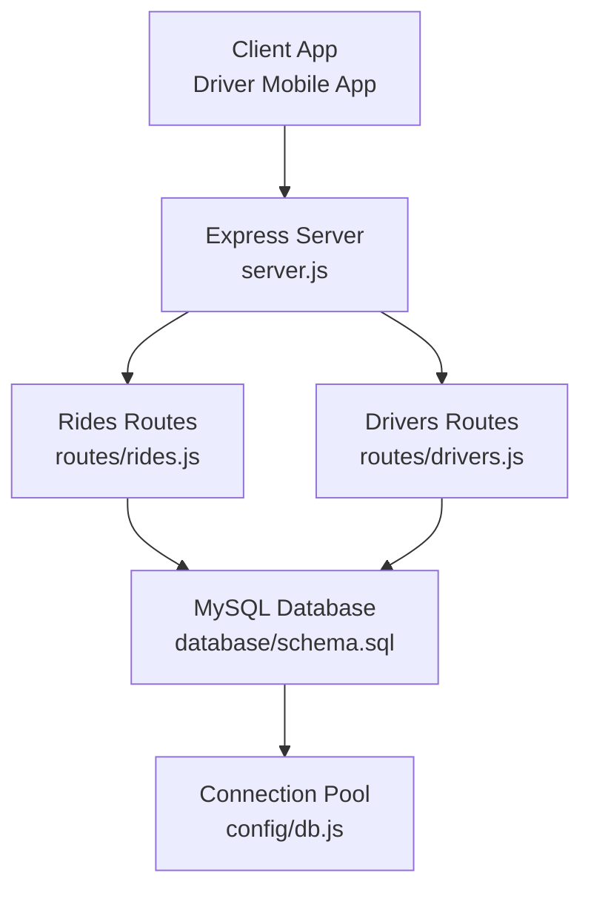
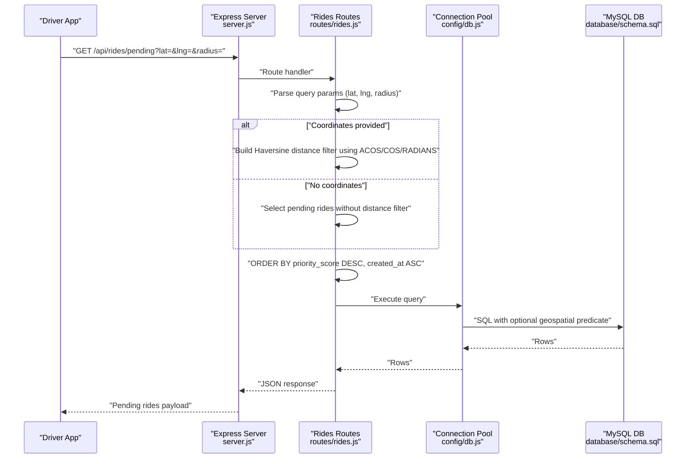
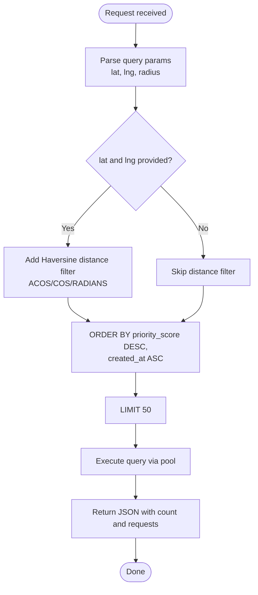
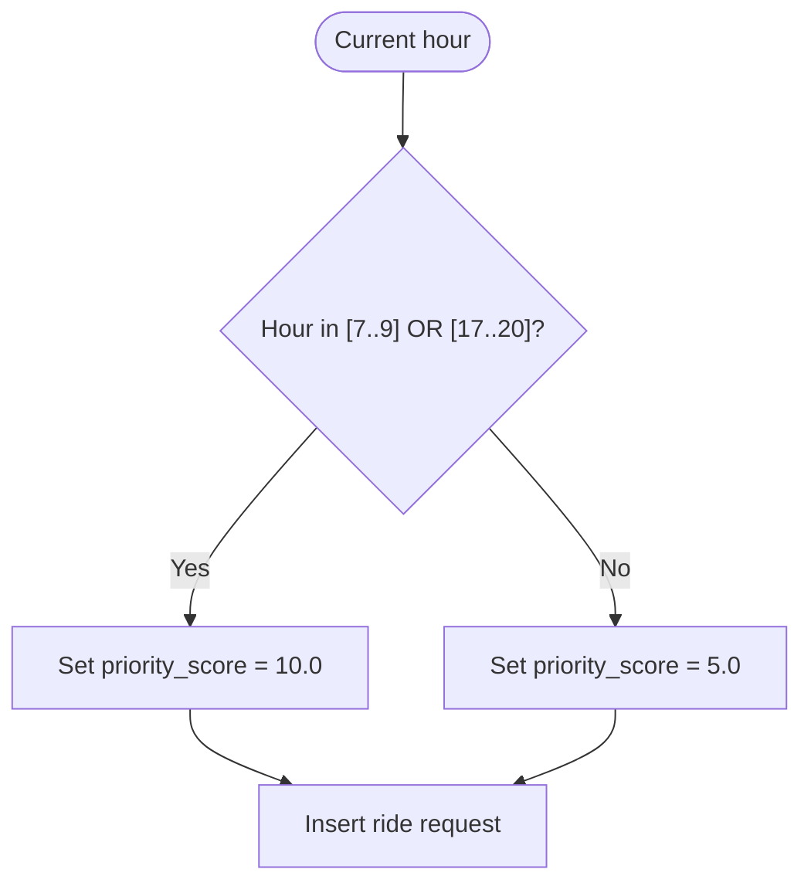
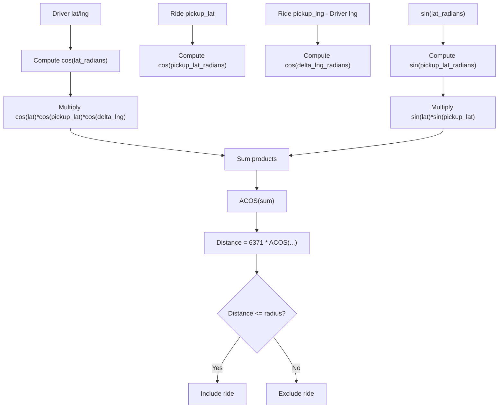
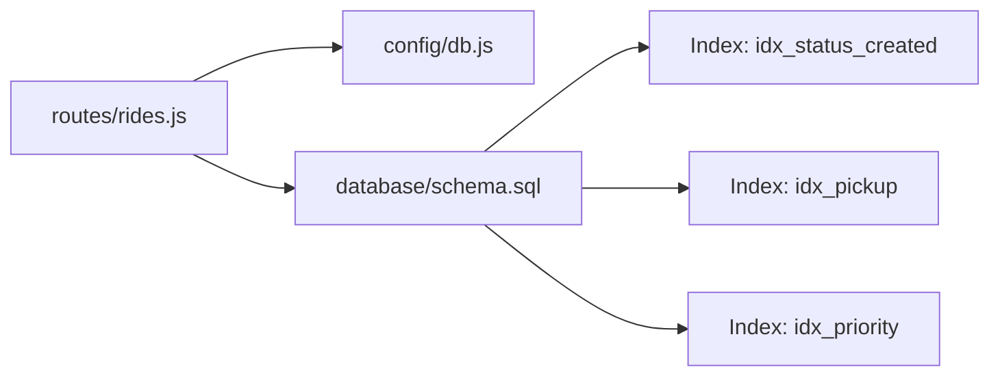

# Geospatial Filtering and Priority

<cite>
**Referenced Files in This Document**
- [server.js](file://server.js)
- [routes/rides.js](file://routes/rides.js)
- [routes/drivers.js](file://routes/drivers.js)
- [config/db.js](file://config/db.js)
- [database/schema.sql](file://database/schema.sql)
- [README.md](file://README.md)
</cite>

## Table of Contents
1. [Introduction](#introduction)
2. [Project Structure](#project-structure)
3. [Core Components](#core-components)
4. [Architecture Overview](#architecture-overview)
5. [Detailed Component Analysis](#detailed-component-analysis)
6. [Dependency Analysis](#dependency-analysis)
7. [Performance Considerations](#performance-considerations)
8. [Troubleshooting Guide](#troubleshooting-guide)
9. [Conclusion](#conclusion)

## Introduction
This document explains the geospatial filtering and priority scoring system powering the GET /api/rides/pending endpoint. It covers:
- Haversine formula-based distance filtering using MySQL’s ACOS and COS/RADIANS functions
- Optional latitude/longitude parameters and radius-based filtering that limits ride requests to nearby drivers
- The priority_score column and its role in ride matching algorithms, especially during peak hours when priority increases from 5.0 to 10.0
- Query optimization techniques, including the ORDER BY clause that prioritizes high-priority, recently created rides first
- Performance implications of geospatial queries and indexing strategies for optimal filtering performance
- Coordinate validation, radius parameter defaults, and the relationship between geographic proximity and matching success rates

## Project Structure
The system is a Node.js/Express backend backed by MySQL, with routes for rides and drivers, a connection pool configuration, and a schema that includes strategic indexes for geospatial and priority-based queries.

**Diagram sources**
- [server.js:1-84](file://server.js#L1-L84)
- [routes/rides.js:1-272](file://routes/rides.js#L1-L272)
- [routes/drivers.js:1-182](file://routes/drivers.js#L1-L182)
- [config/db.js:1-50](file://config/db.js#L1-L50)
- [database/schema.sql:1-297](file://database/schema.sql#L1-L297)

**Section sources**
- [README.md:29-48](file://README.md#L29-L48)
- [server.js:10-41](file://server.js#L10-L41)

## Core Components
- GET /api/rides/pending: Returns nearby pending ride requests for drivers, with optional geospatial filtering and peak-hour priority ordering.
- Priority scoring: Automatically computed based on the current hour to prioritize peak demand.
- Connection pool: Optimized for high read and frequent updates during peak hours.
- Schema indexes: Strategic indexes support geospatial filtering and priority ordering.

Key implementation references:
- Endpoint and query logic: [routes/rides.js:43-86](file://routes/rides.js#L43-L86)
- Priority score calculation: [routes/rides.js:261-269](file://routes/rides.js#L261-L269)
- Connection pool configuration: [config/db.js:7-30](file://config/db.js#L7-L30)
- Schema indexes for geospatial and priority: [database/schema.sql:94-97](file://database/schema.sql#L94-L97)

**Section sources**
- [routes/rides.js:43-86](file://routes/rides.js#L43-L86)
- [routes/rides.js:261-269](file://routes/rides.js#L261-L269)
- [config/db.js:7-30](file://config/db.js#L7-L30)
- [database/schema.sql:94-97](file://database/schema.sql#L94-L97)

## Architecture Overview
The geospatial filtering and priority scoring pipeline integrates the driver app’s request to the backend, applies optional distance filtering, orders by priority and recency, and returns a bounded set of nearby pending rides.

**Diagram sources**
- [routes/rides.js:43-86](file://routes/rides.js#L43-L86)
- [config/db.js:7-30](file://config/db.js#L7-L30)
- [database/schema.sql:74-98](file://database/schema.sql#L74-L98)

## Detailed Component Analysis

### GET /api/rides/pending: Geospatial Filtering and Priority Ordering
- Purpose: Provide nearby pending ride requests to drivers.
- Optional parameters:
  - lat: Latitude of the driver’s current position
  - lng: Longitude of the driver’s current position
  - radius: Radius in kilometers; defaults to 5 km if omitted
- Distance filtering:
  - When lat and lng are present, the query adds a Haversine-based distance predicate using MySQL’s ACOS and COS/RADIANS functions.
  - The Earth radius constant used is 6371 km.
- Priority ordering:
  - Results are ordered by priority_score descending, then by created_at ascending to favor newer requests among equal priority.
  - The limit is 50 rides to keep responses small and fast.
- Response:
  - Returns success flag, count, and a requests array containing selected fields including priority_score and timestamps.

Implementation references:
- Parameter parsing and defaults: [routes/rides.js:46](file://routes/rides.js#L46)
- Haversine predicate construction: [routes/rides.js:66-76](file://routes/rides.js#L66-L76)
- Ordering and limit: [routes/rides.js:78](file://routes/rides.js#L78)
- Query execution and response: [routes/rides.js:80-81](file://routes/rides.js#L80-L81)

**Diagram sources**
- [routes/rides.js:43-86](file://routes/rides.js#L43-L86)

**Section sources**
- [routes/rides.js:43-86](file://routes/rides.js#L43-L86)

### Priority Score and Peak Hour Behavior
- The priority_score column is part of the ride_requests table and influences matching order.
- The backend calculates a dynamic priority score based on the current hour:
  - Peak hours (7–9 AM and 5–8 PM): priority_score = 10.0
  - Off-peak hours: priority_score = 5.0
- This ensures that during high-demand periods, the system prioritizes matching requests to drivers who are likely to accept them quickly.

Implementation references:
- Priority calculation helper: [routes/rides.js:261-269](file://routes/rides.js#L261-L269)
- Column definition and default: [database/schema.sql:86](file://database/schema.sql#L86)

**Diagram sources**
- [routes/rides.js:261-269](file://routes/rides.js#L261-L269)
- [database/schema.sql:86](file://database/schema.sql#L86)

**Section sources**
- [routes/rides.js:261-269](file://routes/rides.js#L261-L269)
- [database/schema.sql:86](file://database/schema.sql#L86)

### Haversine Formula-Based Distance Filtering
- The query condition computes the great-circle distance between the driver’s coordinates and each ride’s pickup location using the Haversine formula embedded in SQL.
- Functions used:
  - COS(RADIANS(...)): Converts degrees to radians and computes cosine
  - ACOS(...): Computes arc cosine to derive central angle
  - Earth radius: 6371 km
- The condition filters rides where the computed distance is less than or equal to the provided radius.

Implementation references:
- Haversine predicate: [routes/rides.js:68-74](file://routes/rides.js#L68-L74)
- Earth radius constant: [routes/rides.js:69](file://routes/rides.js#L69)

**Diagram sources**
- [routes/rides.js:68-74](file://routes/rides.js#L68-L74)

**Section sources**
- [routes/rides.js:68-74](file://routes/rides.js#L68-L74)

### Query Optimization and Ordering Strategy
- The ORDER BY clause prioritizes:
  - priority_score DESC: Higher-priority requests are considered first
  - created_at ASC: Among equal priority, older requests are considered earlier to avoid starvation
- LIMIT 50 caps the number of returned rides, reducing network overhead and client-side rendering cost.
- Connection pooling (pool size 50) helps handle peak-hour bursts without blocking.

Implementation references:
- Ordering and limit: [routes/rides.js:78](file://routes/rides.js#L78)
- Pool configuration: [config/db.js:14-17](file://config/db.js#L14-L17)

**Section sources**
- [routes/rides.js:78](file://routes/rides.js#L78)
- [config/db.js:14-17](file://config/db.js#L14-L17)

### Indexing Strategy for Geospatial Queries
- Strategic indexes improve performance for:
  - Pending-queue ordering: (status, created_at)
  - Pickup proximity searches: (pickup_lat, pickup_lng)
  - Priority-based ordering: (priority_score DESC)
- These indexes support the Haversine predicate and ORDER BY without requiring full scans.

Implementation references:
- Indexes: [database/schema.sql:94-97](file://database/schema.sql#L94-L97)

**Section sources**
- [database/schema.sql:94-97](file://database/schema.sql#L94-L97)

### Relationship Between Geographic Proximity and Matching Success
- Proximity reduces perceived wait time and improves driver acceptance probability.
- Combined with priority_score, the endpoint ensures that nearby, high-priority requests are surfaced first, increasing the likelihood of successful matches during peak hours.

[No sources needed since this section synthesizes behavior without quoting specific code]

## Dependency Analysis
The endpoint depends on:
- Route handler for rides
- Connection pool for database access
- MySQL schema with indexes supporting geospatial and priority queries

**Diagram sources**
- [routes/rides.js:1-272](file://routes/rides.js#L1-L272)
- [config/db.js:1-50](file://config/db.js#L1-L50)
- [database/schema.sql:94-97](file://database/schema.sql#L94-L97)

**Section sources**
- [routes/rides.js:1-272](file://routes/rides.js#L1-L272)
- [config/db.js:1-50](file://config/db.js#L1-L50)
- [database/schema.sql:94-97](file://database/schema.sql#L94-L97)

## Performance Considerations
- Geospatial queries:
  - The Haversine predicate is computationally expensive on large datasets. Use the pickup index to minimize rows scanned before applying the distance filter.
  - Keep radius reasonable (default 5 km) to limit result sets.
- Ordering:
  - The ORDER BY on priority_score and created_at requires sorting; ensure the priority index supports efficient retrieval.
- Connection pool:
  - Pool size 50 is tuned for peak-hour concurrency. Monitor slow requests and adjust pool size if necessary.
- Frontend:
  - The driver app should pass lat/lng frequently to keep the distance filter meaningful and reduce mismatch risk.

[No sources needed since this section provides general guidance]

## Troubleshooting Guide
- ECONNREFUSED or Access Denied:
  - Verify MySQL is running and credentials in .env are correct.
- Table doesn’t exist:
  - Initialize the database by running the schema file.
- Slow queries during peak:
  - Confirm indexes exist and monitor slow logs; consider increasing pool size if needed.
- Unexpectedly empty results:
  - Ensure lat/lng are valid decimal coordinates and radius is a positive number.
- Incorrect ordering:
  - Confirm that priority_score values reflect peak-hour logic and that created_at is recent.

**Section sources**
- [README.md:265-274](file://README.md#L265-L274)

## Conclusion
The GET /api/rides/pending endpoint combines Haversine-based geospatial filtering with a peak-hour-aware priority_score to deliver nearby, high-priority ride requests to drivers efficiently. Strategic indexing, connection pooling, and a bounded result set ensure responsiveness during peak-hour concurrency. Proper coordinate validation and radius defaults are essential to maintain matching success rates and system performance.