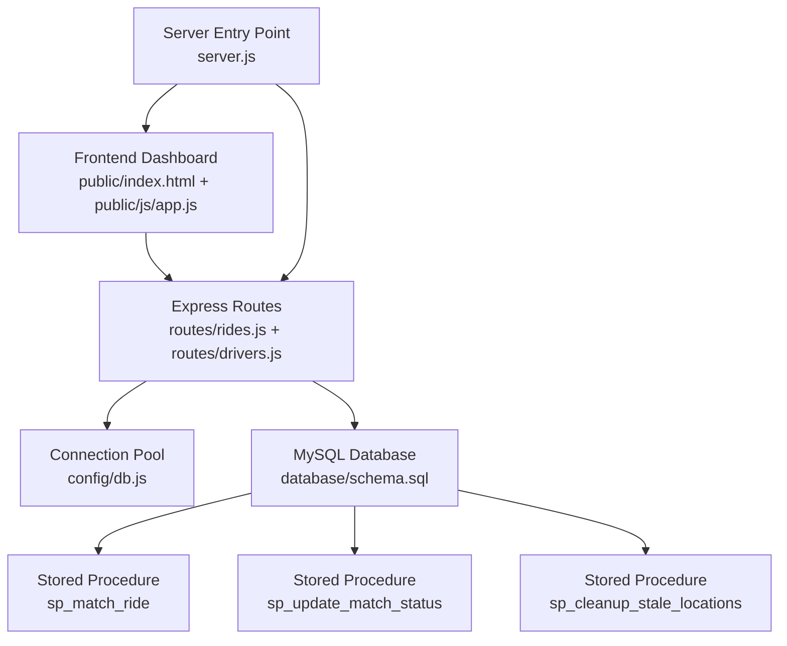
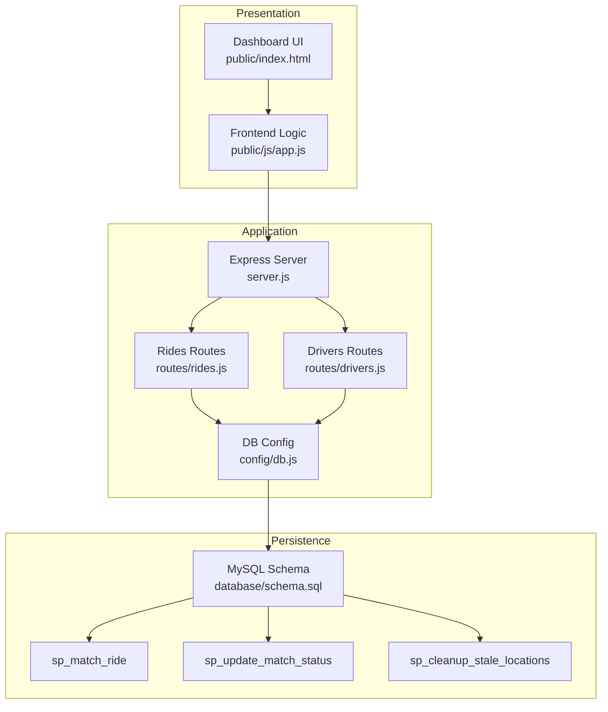
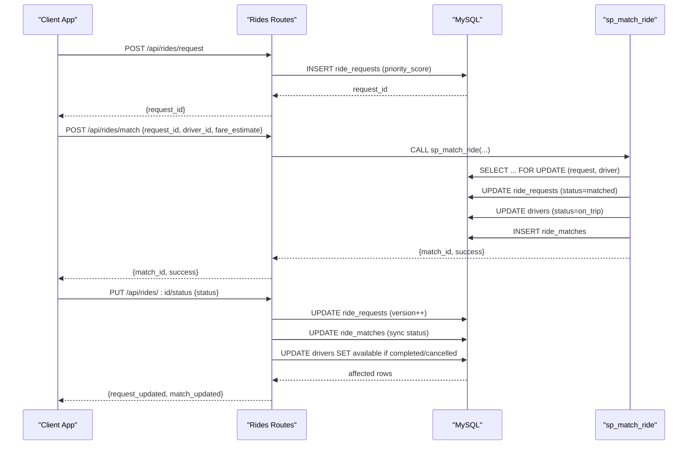
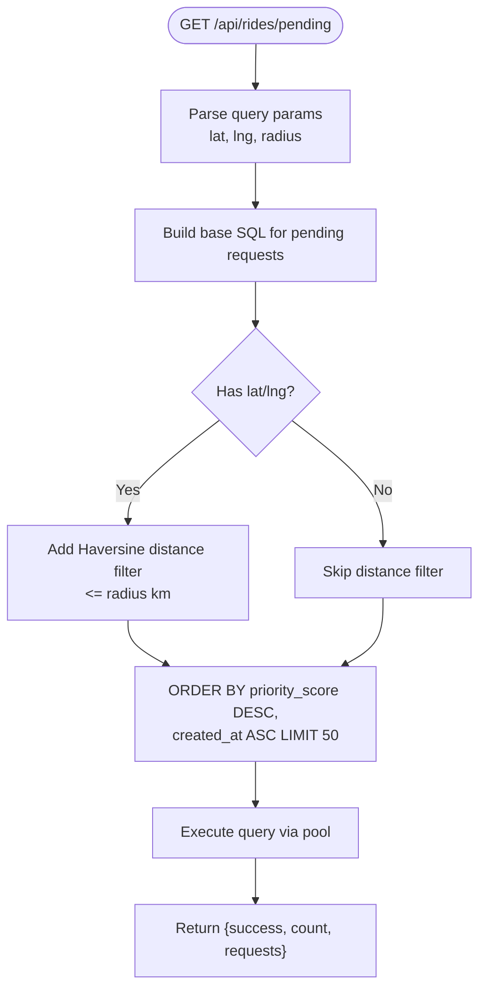
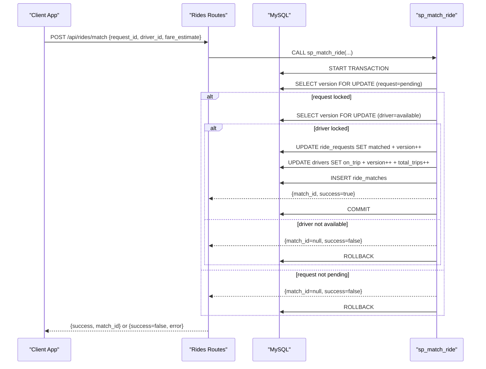
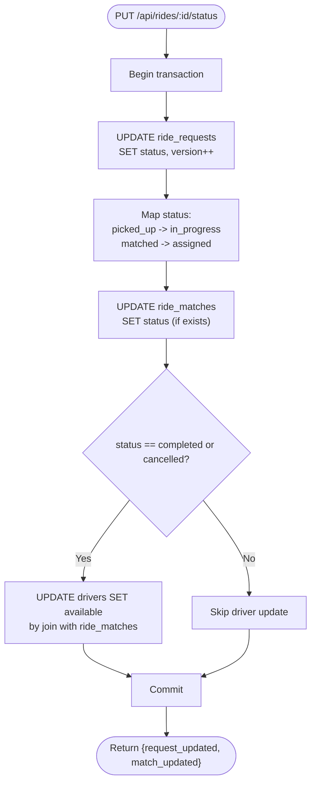
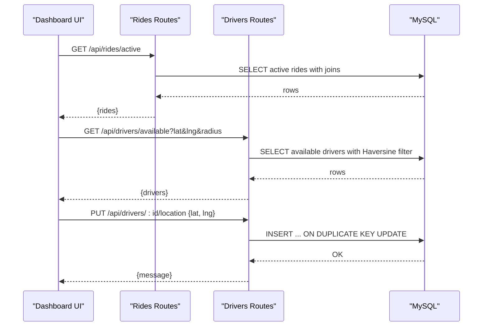
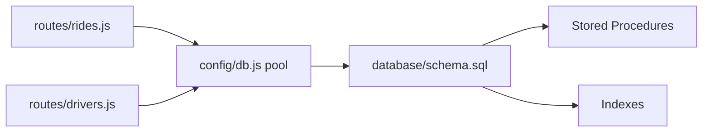

# Ride Management System

<cite>
**Referenced Files in This Document**
- [server.js](file://server.js)
- [routes/rides.js](file://routes/rides.js)
- [routes/drivers.js](file://routes/drivers.js)
- [database/schema.sql](file://database/schema.sql)
- [config/db.js](file://config/db.js)
- [scripts/init-db.js](file://scripts/init-db.js)
- [public/js/app.js](file://public/js/app.js)
- [public/index.html](file://public/index.html)
- [README.md](file://README.md)
- [package.json](file://package.json)
</cite>

## Table of Contents
1. [Introduction](#introduction)
2. [Project Structure](#project-structure)
3. [Core Components](#core-components)
4. [Architecture Overview](#architecture-overview)
5. [Detailed Component Analysis](#detailed-component-analysis)
6. [Dependency Analysis](#dependency-analysis)
7. [Performance Considerations](#performance-considerations)
8. [Troubleshooting Guide](#troubleshooting-guide)
9. [Conclusion](#conclusion)
10. [Appendices](#appendices)

## Introduction
This document explains the ride management system that powers a high-read, frequently updated, peak-hour-concurrent ride-sharing platform. It covers the complete ride lifecycle from request creation to completion, including pending ride listing with optional geospatial filtering, atomic ride-driver matching using stored procedures with pessimistic locking, and robust status update mechanisms. It also documents configuration options for priority scoring during peak hours, parameters for radius-based filtering, return values for matching operations, and the relationships with driver management and dashboard components. Practical guidance is included for preventing double-booking, handling stale data, and optimizing performance under high-frequency ride requests.

## Project Structure
The system is organized into backend routes, database schema and stored procedures, connection pooling configuration, and a lightweight frontend dashboard.

**Diagram sources**
- [server.js:1-84](file://server.js#L1-L84)
- [routes/rides.js:1-272](file://routes/rides.js#L1-L272)
- [routes/drivers.js:1-182](file://routes/drivers.js#L1-L182)
- [config/db.js:1-50](file://config/db.js#L1-L50)
- [database/schema.sql:160-272](file://database/schema.sql#L160-L272)

**Section sources**
- [README.md:29-48](file://README.md#L29-L48)
- [package.json:1-24](file://package.json#L1-L24)

## Core Components
- Ride Requests API: Creates ride requests with priority scoring, lists active and pending requests, and updates statuses with optimistic locking.
- Driver Management API: Registers drivers, updates GPS locations atomically, toggles availability, and lists drivers with optional geospatial filtering.
- Atomic Matching: Uses a stored procedure with pessimistic locking to prevent race conditions and double-booking.
- Dashboard: Real-time stats and tables for active rides, drivers, and match console.

Key implementation highlights:
- Priority scoring for peak hours (7–9 AM and 5–8 PM) increases queue priority for ride requests.
- Radius-based filtering for pending rides and available drivers uses approximate Haversine distance.
- Connection pooling tuned for peak-hour concurrency.
- Stored procedures encapsulate atomic operations for matching and status updates.

**Section sources**
- [routes/rides.js:88-133](file://routes/rides.js#L88-L133)
- [routes/rides.js:43-86](file://routes/rides.js#L43-L86)
- [routes/rides.js:169-224](file://routes/rides.js#L169-L224)
- [routes/drivers.js:101-126](file://routes/drivers.js#L101-L126)
- [routes/drivers.js:38-77](file://routes/drivers.js#L38-L77)
- [config/db.js:7-30](file://config/db.js#L7-L30)
- [database/schema.sql:160-272](file://database/schema.sql#L160-L272)

## Architecture Overview
The system follows a layered architecture:
- Presentation: Static frontend served by Express.
- API: Route handlers for rides and drivers.
- Persistence: MySQL with connection pooling and stored procedures for atomicity.
- Concurrency Control: Pessimistic locking in stored procedures and optimistic locking via version fields.

**Diagram sources**
- [server.js:10-51](file://server.js#L10-L51)
- [routes/rides.js:1-272](file://routes/rides.js#L1-L272)
- [routes/drivers.js:1-182](file://routes/drivers.js#L1-L182)
- [config/db.js:1-50](file://config/db.js#L1-L50)
- [database/schema.sql:160-272](file://database/schema.sql#L160-L272)

## Detailed Component Analysis

### Ride Lifecycle: Creation to Completion
The lifecycle spans request creation, matching, status transitions, and driver release upon completion or cancellation.

**Diagram sources**
- [routes/rides.js:88-133](file://routes/rides.js#L88-L133)
- [routes/rides.js:135-167](file://routes/rides.js#L135-L167)
- [routes/rides.js:169-224](file://routes/rides.js#L169-L224)
- [database/schema.sql:160-234](file://database/schema.sql#L160-L234)

**Section sources**
- [routes/rides.js:88-133](file://routes/rides.js#L88-L133)
- [routes/rides.js:135-167](file://routes/rides.js#L135-L167)
- [routes/rides.js:169-224](file://routes/rides.js#L169-L224)
- [database/schema.sql:160-234](file://database/schema.sql#L160-L234)

### Pending Ride Listing with Geospatial Filtering
- Endpoint: GET /api/rides/pending
- Optional query parameters: lat, lng, radius (km)
- Filtering: Haversine-based distance approximation around pickup coordinates
- Ordering: priority_score descending, created_at ascending
- Limits: 50 results

**Diagram sources**
- [routes/rides.js:43-86](file://routes/rides.js#L43-L86)

**Section sources**
- [routes/rides.js:43-86](file://routes/rides.js#L43-L86)

### Atomic Ride-Driver Matching with Stored Procedures
- Endpoint: POST /api/rides/match
- Calls stored procedure: sp_match_ride(request_id, driver_id, fare_estimate, OUT match_id, OUT success)
- Pessimistic locking: SELECT ... FOR UPDATE on ride_requests and drivers
- Prevents double-booking and ensures driver availability
- Returns success flag and match_id on success

**Diagram sources**
- [routes/rides.js:135-167](file://routes/rides.js#L135-L167)
- [database/schema.sql:167-234](file://database/schema.sql#L167-L234)

**Section sources**
- [routes/rides.js:135-167](file://routes/rides.js#L135-L167)
- [database/schema.sql:167-234](file://database/schema.sql#L167-L234)

### Status Update Mechanisms
- Endpoint: PUT /api/rides/:id/status
- Updates ride_requests with optimistic locking (version increment)
- Synchronizes ride_matches status (mapped values for picked_up/in_progress, matched/assigned)
- Frees driver by setting status to available upon completion or cancellation

**Diagram sources**
- [routes/rides.js:169-224](file://routes/rides.js#L169-L224)

**Section sources**
- [routes/rides.js:169-224](file://routes/rides.js#L169-L224)

### Driver Management and Dashboard Integration
- Driver listing and availability filtering with optional radius
- Frequent location updates via UPSERT to avoid race conditions
- Dashboard tabs for active rides, drivers, match console, and registration

**Diagram sources**
- [routes/rides.js:10-41](file://routes/rides.js#L10-L41)
- [routes/drivers.js:38-77](file://routes/drivers.js#L38-L77)
- [routes/drivers.js:101-126](file://routes/drivers.js#L101-L126)

**Section sources**
- [routes/rides.js:10-41](file://routes/rides.js#L10-L41)
- [routes/drivers.js:38-77](file://routes/drivers.js#L38-L77)
- [routes/drivers.js:101-126](file://routes/drivers.js#L101-L126)
- [public/js/app.js:147-260](file://public/js/app.js#L147-L260)

### Configuration Options and Parameters
- Priority Scoring During Peak Hours
  - Peak hours: 7–9 AM and 5–8 PM
  - Higher priority score (10.0) vs off-peak (5.0)
  - Implemented in route helper to compute priority_score during request creation

- Radius-Based Filtering Parameters
  - Pending rides: lat, lng, radius (km) query parameters
  - Available drivers: lat, lng, radius (km) query parameters
  - Distance computed using Haversine formula approximation

- Stored Procedure Parameters and Return Values
  - sp_match_ride(in request_id, in driver_id, in fare_estimate, out match_id, out success)
  - Returns success flag and match_id on successful atomic match

**Section sources**
- [routes/rides.js:261-269](file://routes/rides.js#L261-L269)
- [routes/rides.js:43-86](file://routes/rides.js#L43-L86)
- [routes/drivers.js:38-77](file://routes/drivers.js#L38-L77)
- [database/schema.sql:167-234](file://database/schema.sql#L167-L234)

## Dependency Analysis
- Routes depend on the connection pool for database operations.
- Stored procedures encapsulate atomic logic, reducing application-level complexity.
- Version fields on drivers and ride_requests support optimistic locking.
- Indexes optimize frequent queries for pending rides, available drivers, and recent matches.

**Diagram sources**
- [routes/rides.js:1-3](file://routes/rides.js#L1-L3)
- [routes/drivers.js:1-3](file://routes/drivers.js#L1-L3)
- [config/db.js:1-50](file://config/db.js#L1-L50)
- [database/schema.sql:94-126](file://database/schema.sql#L94-L126)

**Section sources**
- [routes/rides.js:1-3](file://routes/rides.js#L1-L3)
- [routes/drivers.js:1-3](file://routes/drivers.js#L1-L3)
- [database/schema.sql:94-126](file://database/schema.sql#L94-L126)

## Performance Considerations
- Connection Pooling
  - Pool size: 50 connections with queue limit of 100
  - Timeouts configured to prevent hanging connections
  - Keep-alive enabled to keep connections fresh

- Indexing Strategy
  - Drivers: idx_status for fast available-driver queries
  - Ride requests: idx_status_created for pending-queue ordering, idx_pickup for geo-radius searches, idx_priority for peak-hour queue
  - Matches: idx_driver_status for driver activity tracking

- Upsert Pattern
  - INSERT ... ON DUPLICATE KEY UPDATE for driver_locations eliminates race conditions on frequent updates

- Peak-Hour Monitoring
  - Stats endpoint aggregates counts for pending, matched, active trips, available drivers, and completed rides today

**Section sources**
- [config/db.js:7-30](file://config/db.js#L7-L30)
- [database/schema.sql:46-49](file://database/schema.sql#L46-L49)
- [database/schema.sql:94-98](file://database/schema.sql#L94-L98)
- [database/schema.sql:123-125](file://database/schema.sql#L123-L125)
- [routes/drivers.js:101-126](file://routes/drivers.js#L101-L126)
- [routes/rides.js:226-259](file://routes/rides.js#L226-L259)

## Troubleshooting Guide
Common issues and resolutions:
- Database Connectivity
  - ECONNREFUSED: Ensure MySQL is running on the configured host/port
  - Access Denied: Verify DB_USER and DB_PASSWORD in environment configuration
  - Table Not Found: Initialize the database by running the schema SQL

- Performance Under Load
  - Slow Queries During Peak: Monitor peak-hour stats; consider increasing pool size if needed
  - Connection Queue Backlog: Excessive requests are queued; adjust queueLimit and connectionLimit accordingly

- Double-Booking Prevention
  - Ensure sp_match_ride is used for all matches; it employs SELECT ... FOR UPDATE to lock rows and prevent races

- Stale Data Handling
  - Use optimistic locking via version fields on drivers and ride_requests; status updates increment version to detect conflicts

- Frontend Issues
  - Dashboard not loading: Confirm server is running and frontend static files are served
  - API errors: Check server logs for unhandled errors and verify endpoint correctness

**Section sources**
- [README.md:265-274](file://README.md#L265-L274)
- [server.js:58-67](file://server.js#L58-L67)
- [routes/rides.js:169-224](file://routes/rides.js#L169-L224)

## Conclusion
The ride management system is designed for high-read, frequent-update, and peak-hour-concurrent environments. It achieves concurrency safety through stored procedures with pessimistic locking, optimistic locking via version fields, and strategic indexing. The dashboard provides live visibility into system metrics and operations, while the API supports efficient ride request creation, geospatial filtering, atomic matching, and synchronized status updates. Proper configuration of connection pooling and indexes, combined with careful handling of peak-hour scenarios, ensures reliable performance under load.

## Appendices

### API Reference Summary
- Rides
  - GET /api/rides/active: List active and pending rides
  - GET /api/rides/pending: List pending rides with optional geospatial filtering
  - POST /api/rides/request: Create a new ride request
  - POST /api/rides/match: Atomically match a driver to a request
  - PUT /api/rides/:id/status: Update ride status and synchronize match status
  - GET /api/rides/stats: Dashboard statistics

- Drivers
  - GET /api/drivers: List all drivers
  - GET /api/drivers/available: List available drivers with optional geospatial filtering
  - POST /api/drivers/register: Register a new driver
  - PUT /api/drivers/:id/location: Update driver GPS location (frequent)
  - PUT /api/drivers/:id/status: Toggle driver status
  - GET /api/drivers/:id/rides: Get driver’s ride history

**Section sources**
- [README.md:110-139](file://README.md#L110-L139)
- [routes/rides.js:10-41](file://routes/rides.js#L10-L41)
- [routes/rides.js:43-86](file://routes/rides.js#L43-L86)
- [routes/rides.js:88-133](file://routes/rides.js#L88-L133)
- [routes/rides.js:135-167](file://routes/rides.js#L135-L167)
- [routes/rides.js:169-224](file://routes/rides.js#L169-L224)
- [routes/rides.js:226-259](file://routes/rides.js#L226-L259)
- [routes/drivers.js:10-36](file://routes/drivers.js#L10-L36)
- [routes/drivers.js:38-77](file://routes/drivers.js#L38-L77)
- [routes/drivers.js:79-99](file://routes/drivers.js#L79-L99)
- [routes/drivers.js:101-126](file://routes/drivers.js#L101-L126)
- [routes/drivers.js:128-148](file://routes/drivers.js#L128-L148)
- [routes/drivers.js:150-179](file://routes/drivers.js#L150-L179)

### Initialization and Setup
- Initialize database by running the schema SQL or using the provided initialization script
- Configure environment variables for database connection
- Start the server and open the dashboard in a browser

**Section sources**
- [README.md:60-106](file://README.md#L60-L106)
- [scripts/init-db.js:1-46](file://scripts/init-db.js#L1-L46)