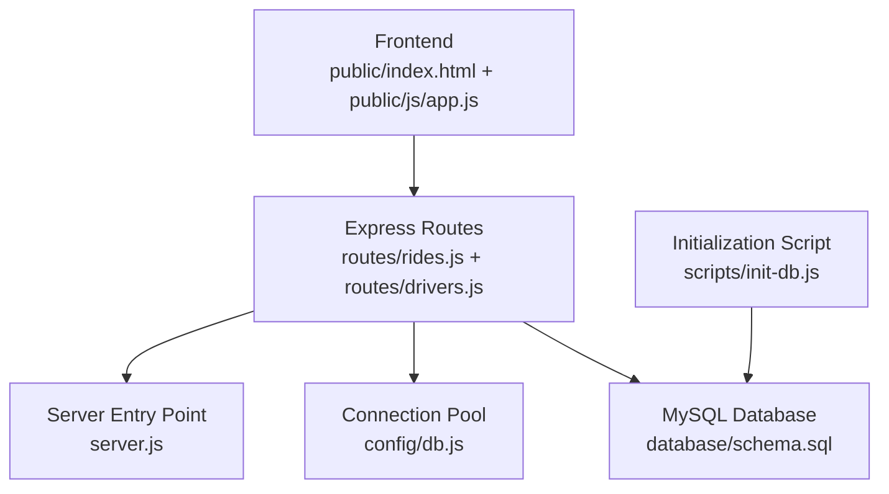
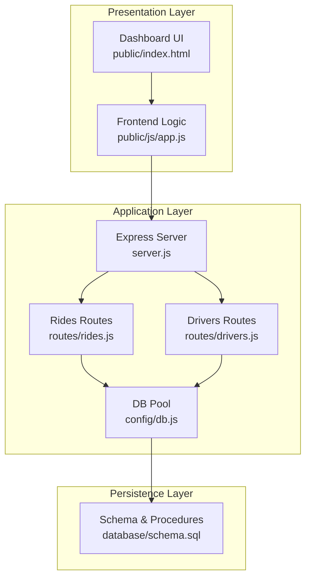
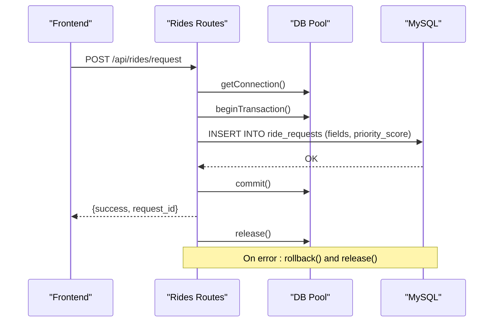
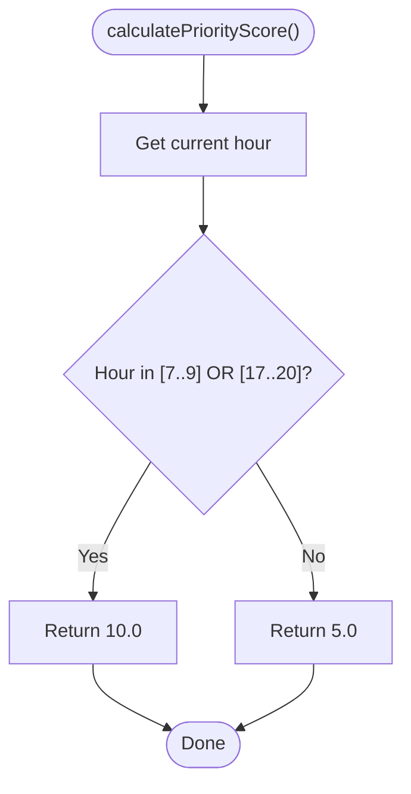
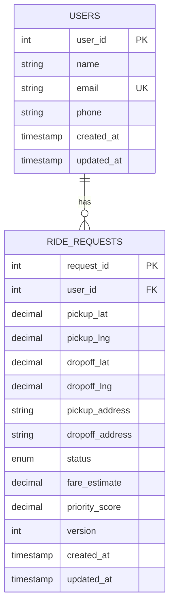
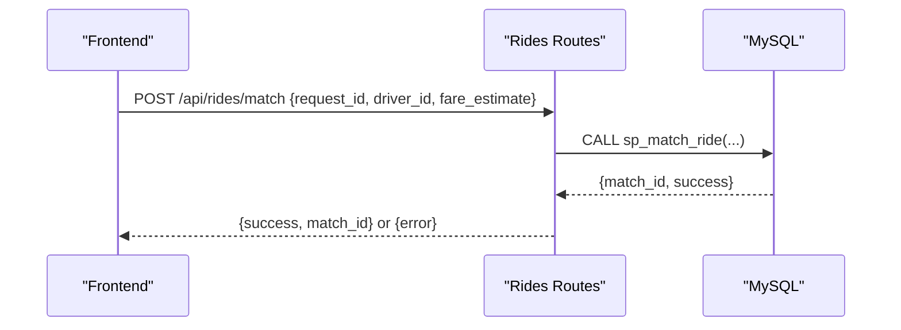
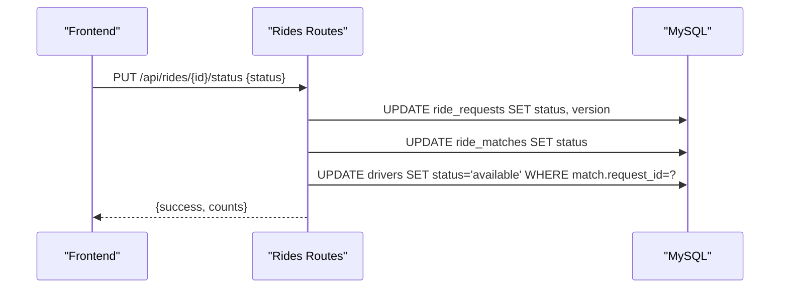
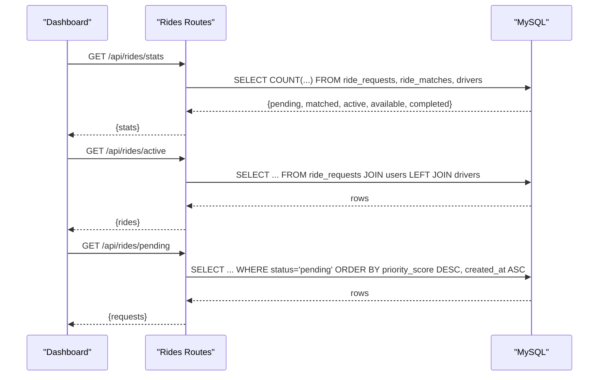
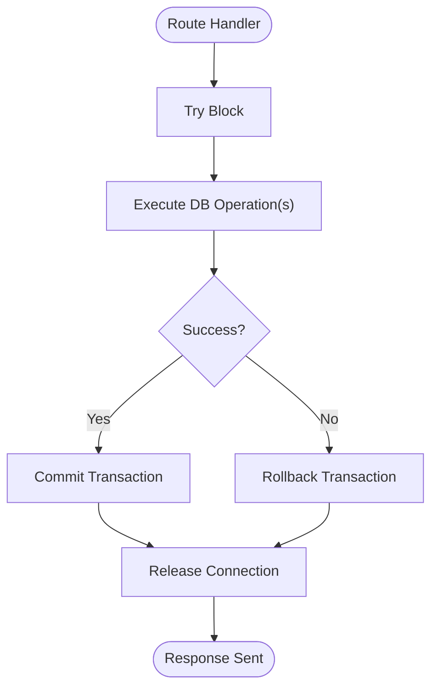
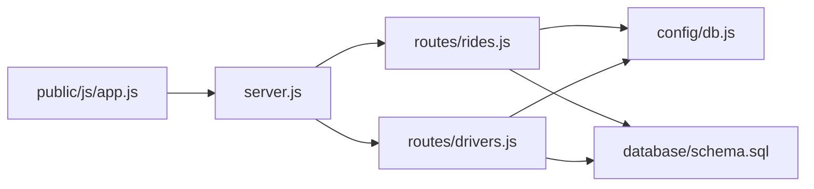

# Ride Request Lifecycle

<cite>
**Referenced Files in This Document**
- [server.js](file://server.js)
- [routes/rides.js](file://routes/rides.js)
- [routes/drivers.js](file://routes/drivers.js)
- [config/db.js](file://config/db.js)
- [database/schema.sql](file://database/schema.sql)
- [public/js/app.js](file://public/js/app.js)
- [public/index.html](file://public/index.html)
- [README.md](file://README.md)
- [package.json](file://package.json)
- [scripts/init-db.js](file://scripts/init-db.js)
</cite>

## Table of Contents
1. [Introduction](#introduction)
2. [Project Structure](#project-structure)
3. [Core Components](#core-components)
4. [Architecture Overview](#architecture-overview)
5. [Detailed Component Analysis](#detailed-component-analysis)
6. [Dependency Analysis](#dependency-analysis)
7. [Performance Considerations](#performance-considerations)
8. [Troubleshooting Guide](#troubleshooting-guide)
9. [Conclusion](#conclusion)
10. [Appendices](#appendices)

## Introduction
This document explains the complete ride request lifecycle in a high-concurrency ride-sharing system. It covers the journey from request creation through completion, focusing on the POST /api/rides/request endpoint that performs high-frequency inserts with transaction management. It documents the ride request data model, the priority scoring system that adjusts ride priority during peak hours (7–9 AM and 5–8 PM), and the dashboard monitoring system that tracks live metrics. It also outlines error handling, transaction rollback scenarios, and performance considerations for sustained insert rates.

## Project Structure
The system is a full-stack Node.js application with an Express server, MySQL database, and a vanilla JavaScript dashboard. The backend exposes REST endpoints for ride requests and driver management, while the frontend provides a live dashboard for monitoring and manual operations.

**Diagram sources**
- [server.js:1-84](file://server.js#L1-L84)
- [routes/rides.js:1-272](file://routes/rides.js#L1-L272)
- [routes/drivers.js:1-182](file://routes/drivers.js#L1-L182)
- [config/db.js:1-50](file://config/db.js#L1-L50)
- [database/schema.sql:1-297](file://database/schema.sql#L1-L297)
- [public/index.html:1-239](file://public/index.html#L1-L239)
- [public/js/app.js:1-373](file://public/js/app.js#L1-L373)
- [scripts/init-db.js:1-46](file://scripts/init-db.js#L1-L46)

**Section sources**
- [README.md:29-48](file://README.md#L29-L48)
- [package.json:1-24](file://package.json#L1-L24)

## Core Components
- Express server with middleware, static serving, and global error handling.
- Route modules for rides and drivers, exposing endpoints for CRUD and operational tasks.
- MySQL connection pool configured for high concurrency and timeouts.
- Database schema with tables for users, drivers, driver locations, ride requests, ride matches, and analytics.
- Frontend dashboard with auto-refreshed stats and manual controls for ride and driver operations.

Key responsibilities:
- Ride request creation and atomic matching with stored procedures.
- Priority scoring for peak-hour queue ordering.
- Live dashboard statistics and ride status updates.
- Driver registration, location updates, and availability queries.

**Section sources**
- [server.js:10-84](file://server.js#L10-L84)
- [routes/rides.js:1-272](file://routes/rides.js#L1-L272)
- [routes/drivers.js:1-182](file://routes/drivers.js#L1-L182)
- [config/db.js:7-30](file://config/db.js#L7-L30)
- [database/schema.sql:74-126](file://database/schema.sql#L74-L126)
- [public/js/app.js:14-29](file://public/js/app.js#L14-L29)

## Architecture Overview
The system follows a layered architecture:
- Presentation: Static HTML/CSS/JS served by Express.
- API: REST endpoints for rides and drivers.
- Persistence: MySQL with stored procedures for atomic operations and strategic indexing.
- Concurrency control: Connection pooling, transactions, stored procedures with row-level locks, and optimistic locking.

**Diagram sources**
- [server.js:10-84](file://server.js#L10-L84)
- [routes/rides.js:1-272](file://routes/rides.js#L1-L272)
- [routes/drivers.js:1-182](file://routes/drivers.js#L1-L182)
- [config/db.js:1-50](file://config/db.js#L1-L50)
- [database/schema.sql:164-272](file://database/schema.sql#L164-L272)

## Detailed Component Analysis

### Ride Request Creation Workflow
The POST /api/rides/request endpoint handles high-frequency insert operations with explicit transaction management:
- Acquires a pooled connection.
- Begins a transaction.
- Inserts a new ride request with calculated priority score.
- Commits the transaction on success; rolls back on failure.
- Releases the connection.

**Diagram sources**
- [routes/rides.js:88-133](file://routes/rides.js#L88-L133)
- [config/db.js:7-30](file://config/db.js#L7-L30)
- [database/schema.sql:74-98](file://database/schema.sql#L74-L98)

**Section sources**
- [routes/rides.js:88-133](file://routes/rides.js#L88-L133)
- [config/db.js:7-30](file://config/db.js#L7-L30)

### Priority Scoring System
The priority score is computed dynamically based on the current hour:
- Peak hours (7–9 AM and 5–8 PM): higher priority score.
- Off-peak hours: lower priority score.

This score influences the order of pending rides returned to drivers.

**Diagram sources**
- [routes/rides.js:261-269](file://routes/rides.js#L261-L269)

**Section sources**
- [routes/rides.js:261-269](file://routes/rides.js#L261-L269)
- [database/schema.sql:94-97](file://database/schema.sql#L94-L97)

### Ride Request Data Model
The ride_requests table captures all essential fields for a ride request:
- Identity: request_id (auto-increment primary key)
- Rider identity: user_id (foreign key to users)
- Locations: pickup_lat/lng, dropoff_lat/lng
- Addresses: pickup_address, dropoff_address
- Status: pending, matched, picked_up, completed, cancelled
- Fare: fare_estimate
- Priority: priority_score
- Version: optimistic locking
- Timestamps: created_at, updated_at

Indexes support:
- Pending queue ordering by status and created_at.
- User-specific active rides.
- Proximity searches by pickup coordinates.
- Peak-hour queue ordering by priority_score.

**Diagram sources**
- [database/schema.sql:15-26](file://database/schema.sql#L15-L26)
- [database/schema.sql:74-98](file://database/schema.sql#L74-L98)

**Section sources**
- [database/schema.sql:74-98](file://database/schema.sql#L74-L98)

### Atomic Matching with Stored Procedures
The POST /api/rides/match endpoint uses a stored procedure to atomically match a driver to a ride:
- Locks the ride request row for update.
- Locks the driver row for update.
- Updates statuses and increments versions.
- Creates a ride match record.
- Returns match_id and success flag.

**Diagram sources**
- [routes/rides.js:135-167](file://routes/rides.js#L135-L167)
- [database/schema.sql:167-234](file://database/schema.sql#L167-L234)

**Section sources**
- [routes/rides.js:135-167](file://routes/rides.js#L135-L167)
- [database/schema.sql:167-234](file://database/schema.sql#L167-L234)

### Status Updates and Driver Release
The PUT /api/rides/:id/status endpoint updates both ride request and ride match statuses, with driver availability restored upon completion or cancellation.

**Diagram sources**
- [routes/rides.js:169-224](file://routes/rides.js#L169-L224)
- [database/schema.sql:103-126](file://database/schema.sql#L103-L126)

**Section sources**
- [routes/rides.js:169-224](file://routes/rides.js#L169-L224)

### Dashboard Monitoring and Live Stats
The frontend dashboard auto-refreshes live metrics and displays active rides and drivers:
- Stats endpoint (/api/rides/stats) aggregates counts for pending, matched, active trips, available drivers, and completed rides today.
- Active rides endpoint (/api/rides/active) lists recent active and pending rides with join to users and drivers.
- Pending rides endpoint (/api/rides/pending) filters by proximity and orders by priority_score and created_at.

**Diagram sources**
- [routes/rides.js:10-41](file://routes/rides.js#L10-L41)
- [routes/rides.js:43-86](file://routes/rides.js#L43-L86)
- [routes/rides.js:226-259](file://routes/rides.js#L226-L259)
- [public/js/app.js:155-199](file://public/js/app.js#L155-L199)
- [public/js/app.js:262-288](file://public/js/app.js#L262-L288)

**Section sources**
- [routes/rides.js:10-41](file://routes/rides.js#L10-L41)
- [routes/rides.js:43-86](file://routes/rides.js#L43-L86)
- [routes/rides.js:226-259](file://routes/rides.js#L226-L259)
- [public/js/app.js:155-199](file://public/js/app.js#L155-L199)
- [public/js/app.js:262-288](file://public/js/app.js#L262-L288)

### Example Request Payloads
- Ride request payload fields: user_id, pickup_lat, pickup_lng, dropoff_lat, dropoff_lng, pickup_address, dropoff_address, fare_estimate.
- Driver registration payload fields: name, email, phone, vehicle_model, vehicle_plate.
- Driver location update payload fields: driver_id, latitude, longitude, accuracy.
- Match payload fields: request_id, driver_id, fare_estimate.

These are defined in the frontend forms and validated before submission.

**Section sources**
- [public/index.html:195-229](file://public/index.html#L195-L229)
- [public/js/app.js:71-91](file://public/js/app.js#L71-L91)
- [routes/drivers.js:79-99](file://routes/drivers.js#L79-L99)
- [routes/drivers.js:101-126](file://routes/drivers.js#L101-L126)
- [routes/rides.js:135-167](file://routes/rides.js#L135-L167)

### Error Handling and Transaction Rollback
- Request creation: On any error during insert, the transaction is rolled back and the connection is released.
- Status updates: Same pattern applies for ride and match status updates.
- Global error handling: Unhandled exceptions return a standardized 500 response.
- Health check: A dedicated endpoint verifies database connectivity.

**Diagram sources**
- [routes/rides.js:88-133](file://routes/rides.js#L88-L133)
- [routes/rides.js:169-224](file://routes/rides.js#L169-L224)
- [server.js:63-67](file://server.js#L63-L67)

**Section sources**
- [routes/rides.js:88-133](file://routes/rides.js#L88-L133)
- [routes/rides.js:169-224](file://routes/rides.js#L169-L224)
- [server.js:63-67](file://server.js#L63-L67)

## Dependency Analysis
- Express server depends on routes and config modules.
- Routes depend on the MySQL connection pool.
- Stored procedures encapsulate atomic operations and reduce application-level complexity.
- Frontend depends on REST endpoints for data and actions.

**Diagram sources**
- [server.js:1-84](file://server.js#L1-L84)
- [routes/rides.js:1-272](file://routes/rides.js#L1-L272)
- [routes/drivers.js:1-182](file://routes/drivers.js#L1-L182)
- [config/db.js:1-50](file://config/db.js#L1-L50)
- [database/schema.sql:1-297](file://database/schema.sql#L1-L297)
- [public/js/app.js:1-373](file://public/js/app.js#L1-L373)

**Section sources**
- [server.js:1-84](file://server.js#L1-L84)
- [routes/rides.js:1-272](file://routes/rides.js#L1-L272)
- [routes/drivers.js:1-182](file://routes/drivers.js#L1-L182)
- [config/db.js:1-50](file://config/db.js#L1-L50)
- [database/schema.sql:1-297](file://database/schema.sql#L1-L297)
- [public/js/app.js:1-373](file://public/js/app.js#L1-L373)

## Performance Considerations
- Connection pooling: 50 connections with queue limits to handle peak-hour bursts.
- Timeouts: Connect, acquire, and general timeouts prevent hanging connections.
- Keep-alive: Fresh connections reduce overhead.
- Indexing: Strategic indexes on status, created_at, pickup coordinates, and priority_score optimize queries.
- Upsert for locations: Single atomic operation reduces race conditions and improves throughput.
- Stored procedures: Encapsulate locking and multi-row updates to minimize application-side complexity.
- Auto-refresh intervals: Frontend refreshes stats every 5 seconds and tables at varying intervals to balance responsiveness and load.

[No sources needed since this section provides general guidance]

## Troubleshooting Guide
Common issues and resolutions:
- Database connectivity failures: Verify host, port, user, and password in environment configuration.
- Table not found errors: Run the schema initialization script to create tables and stored procedures.
- Port conflicts: Change the server port in environment configuration.
- Slow queries during peak hours: Monitor dashboard stats and adjust pool size if necessary.
- Transaction rollbacks: Inspect error logs for constraint violations or deadlocks; ensure proper rollback handling.

**Section sources**
- [README.md:265-274](file://README.md#L265-L274)
- [scripts/init-db.js:14-43](file://scripts/init-db.js#L14-L43)
- [config/db.js:33-41](file://config/db.js#L33-L41)

## Conclusion
The ride request lifecycle is designed for high-concurrency environments with robust transaction management, atomic matching via stored procedures, and a priority scoring system that favors peak-hour demand. The dashboard provides live monitoring and manual controls, enabling efficient operations during high-load periods. Proper indexing, connection pooling, and error handling ensure reliability and performance.

[No sources needed since this section summarizes without analyzing specific files]

## Appendices

### API Reference Summary
- POST /api/rides/request: Create a ride request with automatic priority score.
- POST /api/rides/match: Atomically match a driver to a ride.
- PUT /api/rides/:id/status: Update ride and match status; free driver on completion/cancellation.
- GET /api/rides/active: List recent active and pending rides.
- GET /api/rides/pending: List pending rides with optional proximity filtering.
- GET /api/rides/stats: Dashboard statistics for monitoring.
- GET /api/drivers/available: List available drivers with optional proximity filtering.
- PUT /api/drivers/:id/location: Update driver location via upsert.
- PUT /api/drivers/:id/status: Toggle driver availability.
- GET /api/drivers/:id/rides: Retrieve driver’s ride history.

**Section sources**
- [README.md:110-139](file://README.md#L110-L139)
- [routes/rides.js:88-259](file://routes/rides.js#L88-L259)
- [routes/drivers.js:10-179](file://routes/drivers.js#L10-L179)