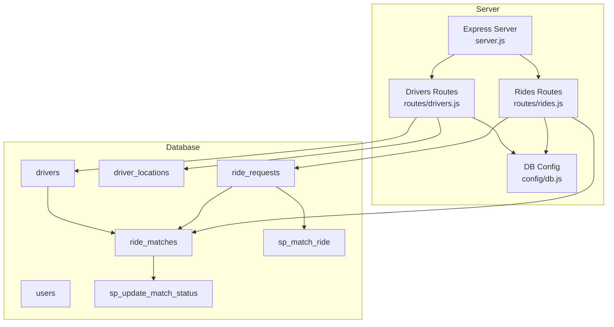
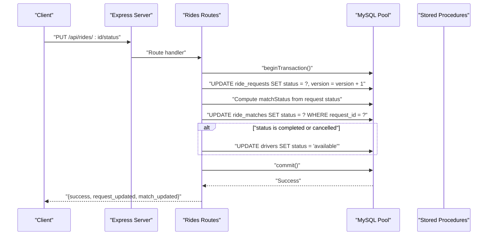
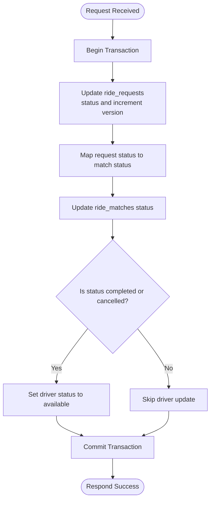
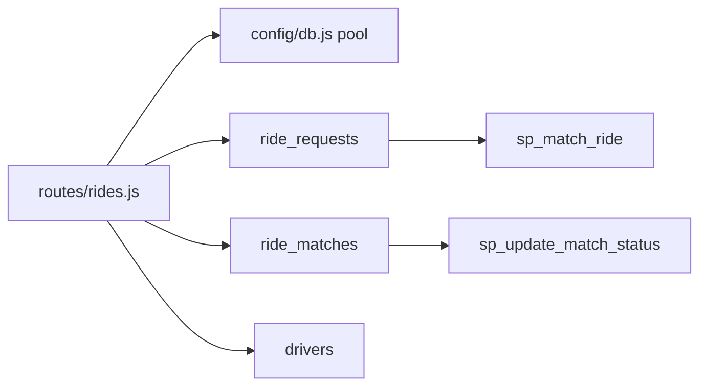

# Status Management and Updates

<cite>
**Referenced Files in This Document**
- [server.js](file://server.js)
- [config/db.js](file://config/db.js)
- [routes/rides.js](file://routes/rides.js)
- [routes/drivers.js](file://routes/drivers.js)
- [database/schema.sql](file://database/schema.sql)
- [README.md](file://README.md)
</cite>

## Table of Contents
1. [Introduction](#introduction)
2. [Project Structure](#project-structure)
3. [Core Components](#core-components)
4. [Architecture Overview](#architecture-overview)
5. [Detailed Component Analysis](#detailed-component-analysis)
6. [Dependency Analysis](#dependency-analysis)
7. [Performance Considerations](#performance-considerations)
8. [Troubleshooting Guide](#troubleshooting-guide)
9. [Conclusion](#conclusion)
10. [Appendices](#appendices)

## Introduction
This document explains the ride status management system with a focus on the PUT /api/rides/:id/status endpoint. It covers bidirectional status synchronization between ride_requests and ride_matches, the status mapping logic, optimistic locking via version columns, transactional guarantees, and the automatic driver availability restoration upon completion or cancellation. It also outlines realistic status transition sequences, edge cases, and the relationship between backend status changes and dashboard real-time updates.

## Project Structure
The ride sharing system is organized around a Node.js/Express server with a MySQL backend. The key components for status management are:
- Express server routing and middleware
- Database connection pooling
- Routes for rides and drivers
- Database schema with tables and stored procedures
- Frontend dashboard that consumes the APIs

**Diagram sources**
- [server.js:1-84](file://server.js#L1-L84)
- [routes/rides.js:1-272](file://routes/rides.js#L1-L272)
- [routes/drivers.js:1-182](file://routes/drivers.js#L1-L182)
- [config/db.js:1-50](file://config/db.js#L1-L50)
- [database/schema.sql:1-297](file://database/schema.sql#L1-L297)

**Section sources**
- [server.js:1-84](file://server.js#L1-L84)
- [routes/rides.js:1-272](file://routes/rides.js#L1-L272)
- [routes/drivers.js:1-182](file://routes/drivers.js#L1-L182)
- [config/db.js:1-50](file://config/db.js#L1-L50)
- [database/schema.sql:1-297](file://database/schema.sql#L1-L297)
- [README.md:29-48](file://README.md#L29-L48)

## Core Components
- PUT /api/rides/:id/status: Updates ride_requests status and synchronizes ride_matches status, with transactional guarantees and driver availability restoration.
- Stored procedures for atomic operations:
  - sp_match_ride: Atomic match preventing double-booking.
  - sp_update_match_status: Atomic status update with optimistic locking on ride_matches.
- Connection pooling and middleware for health checks and CORS.
- Database schema with version columns enabling optimistic locking on drivers and ride_requests.

Key implementation references:
- Status update endpoint and mapping logic: [routes/rides.js:169-224](file://routes/rides.js#L169-L224)
- Stored procedure for atomic match: [database/schema.sql:167-234](file://database/schema.sql#L167-L234)
- Stored procedure for atomic match status update: [database/schema.sql:237-263](file://database/schema.sql#L237-L263)
- Version columns in schema: [database/schema.sql:42](file://database/schema.sql#L42), [database/schema.sql:87](file://database/schema.sql#L87), [database/schema.sql:113](file://database/schema.sql#L113)

**Section sources**
- [routes/rides.js:169-224](file://routes/rides.js#L169-L224)
- [database/schema.sql:167-234](file://database/schema.sql#L167-L234)
- [database/schema.sql:237-263](file://database/schema.sql#L237-L263)
- [database/schema.sql:42](file://database/schema.sql#L42)
- [database/schema.sql:87](file://database/schema.sql#L87)
- [database/schema.sql:113](file://database/schema.sql#L113)

## Architecture Overview
The status update flow is transactional and ensures consistency across ride_requests and ride_matches. It also updates driver availability when a ride completes or is cancelled.

**Diagram sources**
- [routes/rides.js:169-224](file://routes/rides.js#L169-L224)
- [database/schema.sql:104-126](file://database/schema.sql#L104-L126)

## Detailed Component Analysis

### PUT /api/rides/:id/status Endpoint
Purpose:
- Update the status of a ride request and synchronize the corresponding match status.
- Enforce optimistic locking via version increments on ride_requests.
- Automatically free the driver when the ride is completed or cancelled.
- Wrap all operations in a single transaction to ensure atomicity.

Processing logic:
- Acquire a database connection and start a transaction.
- Update ride_requests with the new status and increment version.
- Compute matchStatus based on the request status:
  - matched -> assigned
  - picked_up -> in_progress
- Update ride_matches with the computed matchStatus for the given request_id.
- If the new status is completed or cancelled:
  - Join drivers and ride_matches to set driver status to available.
- Commit the transaction; rollback on errors.

Response:
- Returns success with counts of affected rows for request and match updates.

Edge cases handled:
- Partial updates: The transaction ensures either all updates succeed or none do.
- Failed transitions: Errors are caught, rolled back, and surfaced to the client.
- Driver availability: Automatic restoration occurs only when the request status is completed or cancelled.

**Diagram sources**
- [routes/rides.js:169-224](file://routes/rides.js#L169-L224)
- [database/schema.sql:104-126](file://database/schema.sql#L104-L126)

**Section sources**
- [routes/rides.js:169-224](file://routes/rides.js#L169-L224)

### Status Mapping Logic
Bidirectional synchronization rules:
- matched (request) -> assigned (match)
- picked_up (request) -> in_progress (match)
- Other statuses remain unchanged in the match table.

These mappings ensure that the match table reflects the operational state of the trip consistently with the request table.

**Section sources**
- [routes/rides.js:186-196](file://routes/rides.js#L186-L196)

### Optimistic Locking Implementation
Optimistic locking via version columns:
- ride_requests.version: incremented on each status update to detect concurrent modifications.
- drivers.version: used by the atomic match procedure to prevent lost updates.
- ride_matches.version: used by sp_update_match_status to enforce atomicity.

Behavior:
- When a client attempts to update a record, the version is incremented atomically.
- If another process has concurrently updated the record, the version mismatch prevents the update, signaling a conflict.

Note: The current endpoint increments version but does not return the new version to clients. For full optimistic locking enforcement, clients would need to pass the expected version in subsequent requests. The system includes a dedicated stored procedure for atomic match status updates with explicit version checks.

**Section sources**
- [database/schema.sql:87](file://database/schema.sql#L87)
- [database/schema.sql:113](file://database/schema.sql#L113)
- [database/schema.sql:42](file://database/schema.sql#L42)
- [database/schema.sql:237-263](file://database/schema.sql#L237-L263)

### Transactional Nature and Data Consistency
- All status updates are wrapped in a single transaction:
  - Update request status and increment version.
  - Update match status.
  - Optionally update driver availability.
- Rollback on any error prevents partial state changes.
- This ensures referential integrity and consistent views across related tables.

**Section sources**
- [routes/rides.js:170-224](file://routes/rides.js#L170-L224)

### Automatic Driver Availability Restoration
When a ride reaches a terminal state:
- completed: driver’s status is set to available.
- cancelled: driver’s status is set to available.

This cleanup ensures drivers become available for new trips immediately after a ride ends.

**Section sources**
- [routes/rides.js:198-207](file://routes/rides.js#L198-L207)

### Real-time Dashboard Updates
- The frontend dashboard polls endpoints like GET /api/rides/active to reflect live status changes.
- PUT /api/rides/:id/status triggers immediate state changes in the database; the dashboard will show updated statuses on the next poll.
- Future enhancements (not implemented) include WebSocket integration for real-time push updates.

**Section sources**
- [routes/rides.js:10-41](file://routes/rides.js#L10-L41)
- [README.md:279-283](file://README.md#L279-L283)

## Dependency Analysis
- Rides routes depend on the database pool for transactions and on stored procedures for atomic operations.
- Drivers routes manage driver availability independently; however, the rides status endpoint coordinates driver availability based on ride outcomes.
- The schema defines foreign keys and unique constraints that maintain referential integrity.

**Diagram sources**
- [routes/rides.js:1-272](file://routes/rides.js#L1-L272)
- [config/db.js:1-50](file://config/db.js#L1-L50)
- [database/schema.sql:167-234](file://database/schema.sql#L167-L234)
- [database/schema.sql:237-263](file://database/schema.sql#L237-L263)

**Section sources**
- [routes/rides.js:1-272](file://routes/rides.js#L1-L272)
- [config/db.js:1-50](file://config/db.js#L1-L50)
- [database/schema.sql:167-234](file://database/schema.sql#L167-L234)
- [database/schema.sql:237-263](file://database/schema.sql#L237-L263)

## Performance Considerations
- Connection pooling: The pool is sized for peak-hour concurrency to handle bursts without dropping requests.
- Indexes: Strategic indexes support high-read endpoints and reduce query times.
- Upsert pattern: Frequent driver location updates use a single atomic upsert to avoid race conditions.
- Stored procedures: Encapsulate atomic operations to minimize client-side complexity and reduce network round-trips.

**Section sources**
- [config/db.js:7-30](file://config/db.js#L7-L30)
- [database/schema.sql:46](file://database/schema.sql#L46)
- [database/schema.sql:94](file://database/schema.sql#L94)
- [database/schema.sql:124](file://database/schema.sql#L124)
- [routes/drivers.js:101-126](file://routes/drivers.js#L101-L126)

## Troubleshooting Guide
Common issues and resolutions:
- ECONNREFUSED: Verify MySQL is running and reachable with the configured host/port.
- Access denied: Confirm DB_USER and DB_PASSWORD in the environment configuration.
- Table doesn't exist: Run the schema initialization script to create tables and stored procedures.
- Port 3000 in use: Change the PORT environment variable to an available port.
- Slow queries during peak: Monitor peak-hour statistics and adjust pool size if needed.

Operational tips:
- Use GET /api/rides/active to monitor live statuses and recent activity.
- Use GET /api/rides/stats to track pending, matched, active trips, and available drivers.

**Section sources**
- [README.md:265-274](file://README.md#L265-L274)
- [routes/rides.js:226-259](file://routes/rides.js#L226-L259)

## Conclusion
The status management system provides robust, transactional updates for ride lifecycle events. The PUT /api/rides/:id/status endpoint enforces bidirectional synchronization between ride_requests and ride_matches, uses optimistic locking to prevent conflicts, and automatically restores driver availability upon completion or cancellation. Together with stored procedures and strategic indexing, the system maintains consistency and performance under peak-hour loads.

## Appendices

### Status Transition Sequences
Example sequences from pending through matched to completed:
- pending -> matched -> picked_up -> completed
  - pending (request) -> matched (request) -> assigned (match)
  - matched (request) -> picked_up (request) -> in_progress (match)
  - in_progress (match) -> completed (match) triggers driver availability restoration

Note: The endpoint does not enforce strict state machine validation; it applies mapping rules and performs the updates. Additional validation could be implemented at the application level if needed.

**Section sources**
- [routes/rides.js:186-196](file://routes/rides.js#L186-L196)
- [routes/rides.js:198-207](file://routes/rides.js#L198-L207)