# Component Interactions

<cite>
**Referenced Files in This Document**
- [server.js](file://server.js)
- [config/db.js](file://config/db.js)
- [routes/rides.js](file://routes/rides.js)
- [routes/drivers.js](file://routes/drivers.js)
- [public/js/app.js](file://public/js/app.js)
- [public/index.html](file://public/index.html)
- [database/schema.sql](file://database/schema.sql)
- [scripts/init-db.js](file://scripts/init-db.js)
- [package.json](file://package.json)
- [README.md](file://README.md)
</cite>

## Table of Contents
1. [Introduction](#introduction)
2. [Project Structure](#project-structure)
3. [Core Components](#core-components)
4. [Architecture Overview](#architecture-overview)
5. [Detailed Component Analysis](#detailed-component-analysis)
6. [Dependency Analysis](#dependency-analysis)
7. [Performance Considerations](#performance-considerations)
8. [Troubleshooting Guide](#troubleshooting-guide)
9. [Conclusion](#conclusion)
10. [Appendices](#appendices)

## Introduction
This document explains how the ride-sharing system orchestrates component interactions across the backend server, middleware, routing, database configuration, and the frontend dashboard. It focuses on:
- How server.js initializes the Express app, sets up middleware, serves static files, registers routes, and exposes health checks.
- How route handlers depend on the database configuration for connection pooling and perform database operations.
- How frontend static files communicate with backend APIs via CORS and request-response cycles.
- The health check mechanism and error handling propagation.
- Sequence diagrams for typical flows: ride creation, driver registration, and matching operations.
- Component lifecycle management and dependency injection patterns used in the system.

## Project Structure
The project follows a layered structure:
- Server entry point initializes Express, middleware, static serving, routes, health checks, and error handlers.
- Database configuration encapsulates a connection pool and helper functions.
- Route modules define API endpoints that use the shared database pool.
- Frontend static assets include HTML, CSS, and a vanilla JS application that consumes the backend APIs.

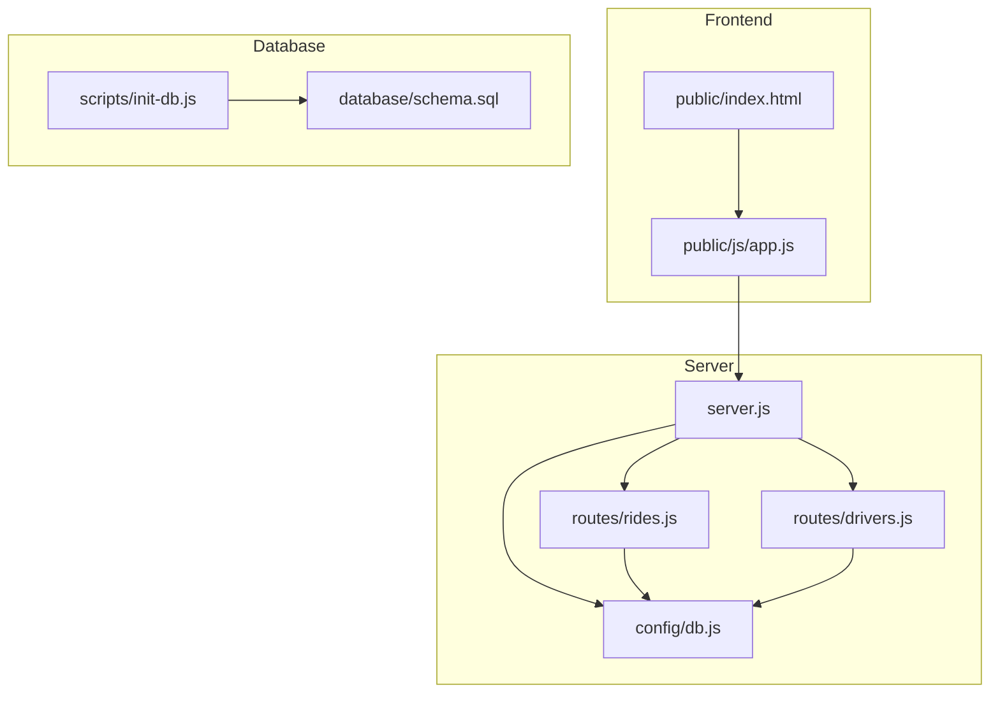

**Diagram sources**
- [server.js:1-84](file://server.js#L1-L84)
- [config/db.js:1-50](file://config/db.js#L1-L50)
- [routes/rides.js:1-272](file://routes/rides.js#L1-L272)
- [routes/drivers.js:1-182](file://routes/drivers.js#L1-L182)
- [public/index.html:1-239](file://public/index.html#L1-L239)
- [public/js/app.js:1-373](file://public/js/app.js#L1-L373)
- [database/schema.sql:1-297](file://database/schema.sql#L1-L297)
- [scripts/init-db.js:1-46](file://scripts/init-db.js#L1-L46)

**Section sources**
- [README.md:29-48](file://README.md#L29-L48)
- [package.json:1-24](file://package.json#L1-L24)

## Core Components
- Express server initialization and middleware pipeline in server.js.
- Database connection pool abstraction and health check helpers in config/db.js.
- Route modules for rides and drivers that depend on the shared database pool.
- Frontend SPA that communicates with backend APIs and renders live stats.

Key responsibilities:
- server.js: Orchestrates middleware, static file serving, route registration, health checks, and global error handling.
- config/db.js: Provides a pooled connection interface and helper functions for testing connectivity and graceful shutdown.
- routes/rides.js and routes/drivers.js: Expose REST endpoints backed by MySQL operations, including transactions and stored procedures.
- public/js/app.js and public/index.html: Present a dashboard UI and drive API interactions.

**Section sources**
- [server.js:10-84](file://server.js#L10-L84)
- [config/db.js:7-49](file://config/db.js#L7-L49)
- [routes/rides.js:1-272](file://routes/rides.js#L1-L272)
- [routes/drivers.js:1-182](file://routes/drivers.js#L1-L182)
- [public/js/app.js:14-29](file://public/js/app.js#L14-L29)
- [public/index.html:10-188](file://public/index.html#L10-L188)

## Architecture Overview
The system uses a classic Express server with:
- Middleware stack for CORS, JSON parsing, URL-encoded parsing, request logging, and slow request warnings.
- Static file serving for the frontend.
- Route modules mounted under /api/rides and /api/drivers.
- A centralized database configuration module providing a connection pool.
- Health check endpoint that validates database connectivity.
- Global 404 and error handlers.

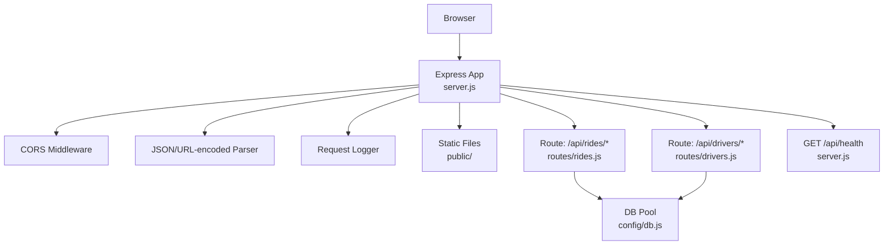

**Diagram sources**
- [server.js:16-67](file://server.js#L16-L67)
- [config/db.js:7-30](file://config/db.js#L7-L30)
- [routes/rides.js:1-4](file://routes/rides.js#L1-L4)
- [routes/drivers.js:1-4](file://routes/drivers.js#L1-L4)

**Section sources**
- [server.js:16-67](file://server.js#L16-L67)
- [config/db.js:7-30](file://config/db.js#L7-L30)

## Detailed Component Analysis

### Express Server Orchestration (server.js)
- Initializes Express app and loads environment variables.
- Registers middleware in order: CORS, JSON, URL-encoded, request logger, and slow request detection.
- Serves static files from public/.
- Mounts route modules under /api/rides and /api/drivers.
- Defines a health check endpoint that tests database connectivity.
- Defines a root redirect to the frontend index page.
- Registers 404 and global error handlers.
- Starts the server and logs startup messages including database connectivity status.

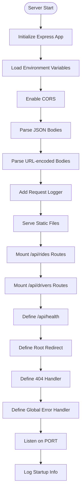

**Diagram sources**
- [server.js:10-81](file://server.js#L10-L81)

**Section sources**
- [server.js:10-81](file://server.js#L10-L81)

### Database Configuration (config/db.js)
- Creates a MySQL connection pool with:
  - Connection limit tuned for peak-hour concurrency.
  - Queue limits and timeouts to manage overload.
  - Keep-alive settings to maintain healthy connections.
  - Helper function to test connectivity by executing a simple query.
  - Graceful shutdown function to end the pool.

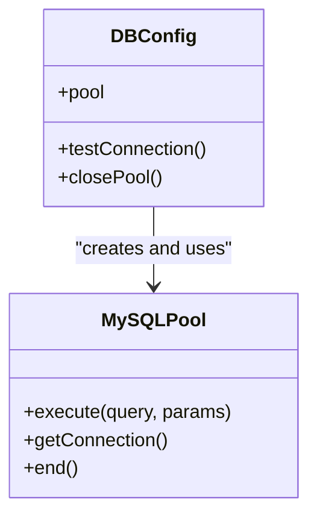

**Diagram sources**
- [config/db.js:7-49](file://config/db.js#L7-L49)

**Section sources**
- [config/db.js:7-49](file://config/db.js#L7-L49)

### Route Handlers: Rides (routes/rides.js)
- Exposes endpoints for:
  - Listing active rides with joined driver info.
  - Listing pending rides with optional geolocation filtering.
  - Creating ride requests with transaction support and priority scoring.
  - Matching a driver to a request via a stored procedure to ensure atomicity.
  - Updating ride status with coordinated updates to requests and matches.
  - Retrieving dashboard statistics.
- Uses the shared pool for all operations, including:
  - Transaction management for request creation and status updates.
  - Stored procedure calls for atomic matching.
  - Prepared statements with parameter binding.

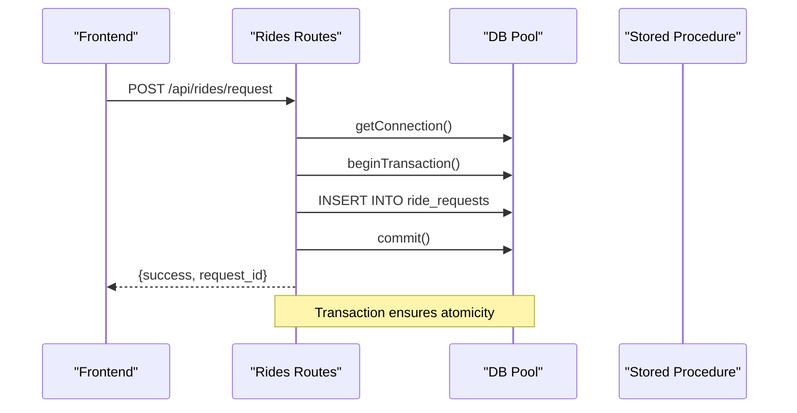

**Diagram sources**
- [routes/rides.js:88-133](file://routes/rides.js#L88-L133)

**Section sources**
- [routes/rides.js:10-86](file://routes/rides.js#L10-L86)
- [routes/rides.js:88-133](file://routes/rides.js#L88-L133)
- [routes/rides.js:135-167](file://routes/rides.js#L135-L167)
- [routes/rides.js:169-224](file://routes/rides.js#L169-L224)
- [routes/rides.js:226-259](file://routes/rides.js#L226-L259)

### Route Handlers: Drivers (routes/drivers.js)
- Exposes endpoints for:
  - Listing all drivers with optional join to latest location.
  - Listing available drivers filtered by proximity.
  - Registering new drivers.
  - Updating driver location using an atomic upsert.
  - Toggling driver status.
  - Retrieving driver ride history.
- Uses the shared pool for all operations, including:
  - Parameterized queries.
  - Atomic upsert for location updates.

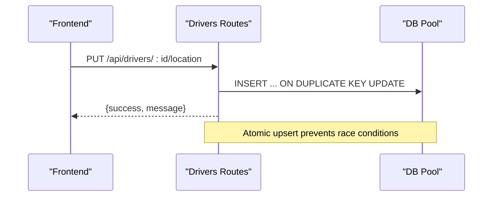

**Diagram sources**
- [routes/drivers.js:101-126](file://routes/drivers.js#L101-L126)

**Section sources**
- [routes/drivers.js:10-77](file://routes/drivers.js#L10-L77)
- [routes/drivers.js:79-99](file://routes/drivers.js#L79-L99)
- [routes/drivers.js:101-126](file://routes/drivers.js#L101-L126)
- [routes/drivers.js:128-148](file://routes/drivers.js#L128-L148)
- [routes/drivers.js:150-179](file://routes/drivers.js#L150-L179)

### Frontend Interaction (public/index.html + public/js/app.js)
- The frontend is a single-page application served statically by the Express server.
- The JS app initializes tabs, modals, forms, and refresh loops.
- It performs API calls to:
  - GET /api/rides/stats for live stats.
  - GET /api/rides/active and GET /api/drivers for lists.
  - POST /api/rides/request to create a ride.
  - POST /api/rides/match to match a driver to a request.
  - PUT /api/drivers/:id/status and PUT /api/drivers/:id/location to update driver state.
- The app uses fetch with JSON headers and handles responses with toast notifications.

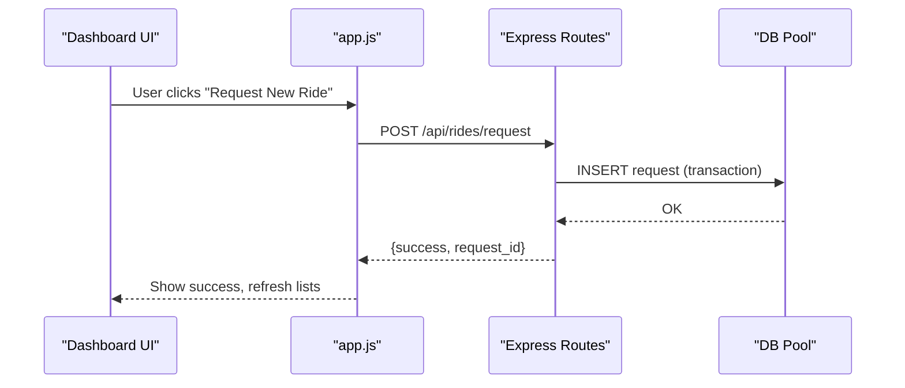

**Diagram sources**
- [public/js/app.js:70-91](file://public/js/app.js#L70-L91)
- [routes/rides.js:88-133](file://routes/rides.js#L88-L133)

**Section sources**
- [public/index.html:10-188](file://public/index.html#L10-L188)
- [public/js/app.js:14-29](file://public/js/app.js#L14-L29)
- [public/js/app.js:70-91](file://public/js/app.js#L70-L91)
- [public/js/app.js:124-144](file://public/js/app.js#L124-L144)
- [public/js/app.js:155-169](file://public/js/app.js#L155-L169)

### Health Check Mechanism
- The server exposes GET /api/health that calls the database health check helper.
- The helper executes a simple query against the pool to verify connectivity.
- On startup, the server also runs a health check and logs the result.

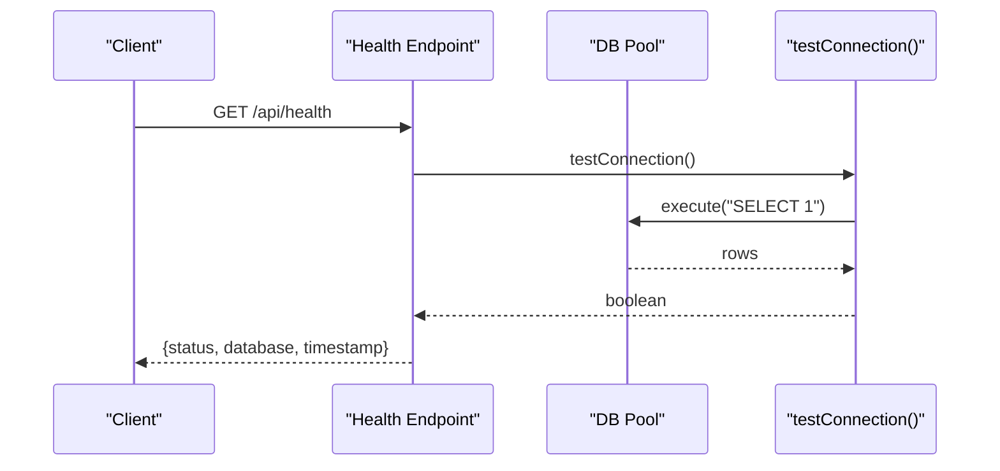

**Diagram sources**
- [server.js:43-51](file://server.js#L43-L51)
- [config/db.js:32-41](file://config/db.js#L32-L41)

**Section sources**
- [server.js:43-51](file://server.js#L43-L51)
- [config/db.js:32-41](file://config/db.js#L32-L41)

### Error Handling Propagation
- 404 handler responds with a JSON error for unknown endpoints.
- Global error handler logs unhandled errors and returns a generic internal server error response.
- Route handlers catch errors and return structured JSON responses with success flags and error messages.

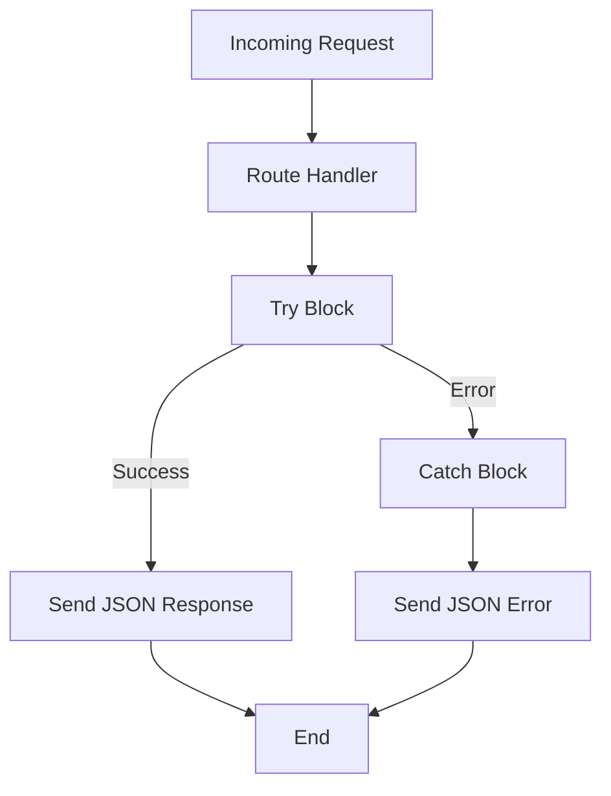

**Diagram sources**
- [server.js:58-67](file://server.js#L58-L67)
- [routes/rides.js:126-129](file://routes/rides.js#L126-L129)
- [routes/drivers.js:32-35](file://routes/drivers.js#L32-L35)

**Section sources**
- [server.js:58-67](file://server.js#L58-L67)
- [routes/rides.js:126-129](file://routes/rides.js#L126-L129)
- [routes/drivers.js:32-35](file://routes/drivers.js#L32-L35)

### Typical Request Flows

#### Ride Creation Flow
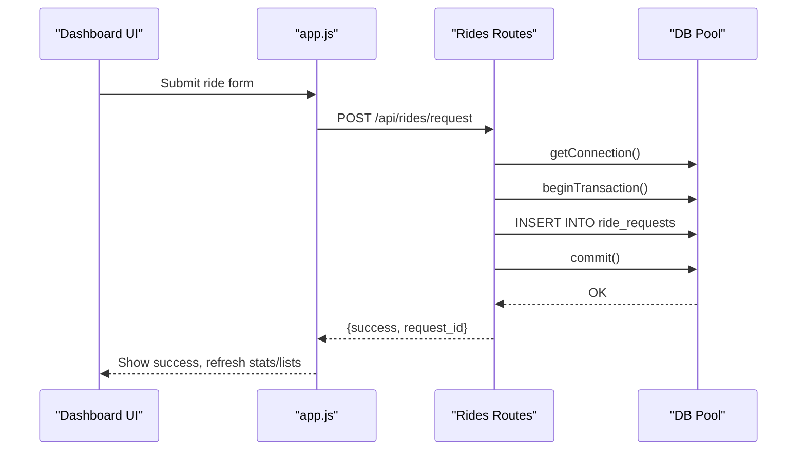

**Diagram sources**
- [public/js/app.js:70-91](file://public/js/app.js#L70-L91)
- [routes/rides.js:88-133](file://routes/rides.js#L88-L133)

#### Driver Registration Flow
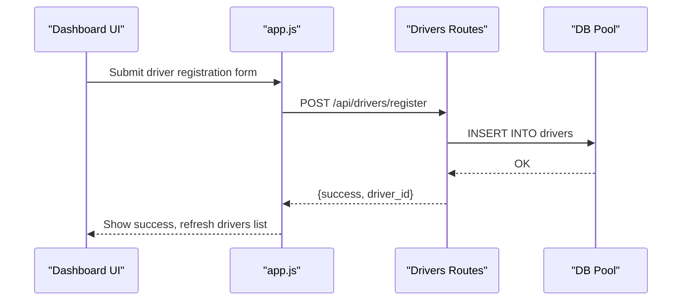

**Diagram sources**
- [public/js/app.js:93-105](file://public/js/app.js#L93-L105)
- [routes/drivers.js:79-99](file://routes/drivers.js#L79-L99)

#### Matching Operation Flow
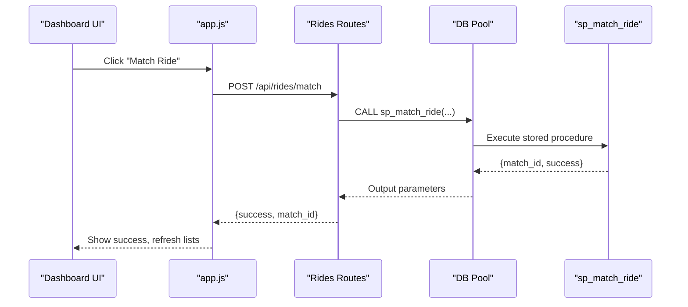

**Diagram sources**
- [public/js/app.js:124-144](file://public/js/app.js#L124-L144)
- [routes/rides.js:135-167](file://routes/rides.js#L135-L167)
- [database/schema.sql:164-234](file://database/schema.sql#L164-L234)

### Component Lifecycle and Dependency Injection Patterns
- Dependency injection pattern:
  - routes/rides.js and routes/drivers.js import the shared pool from config/db.js.
  - server.js imports route modules and the database helper for health checks.
- Lifecycle:
  - Server starts, initializes middleware, mounts routes, and serves static files.
  - Routes execute database operations using the shared pool.
  - Health checks validate connectivity on demand and at startup.
  - Global error handlers ensure consistent error responses.

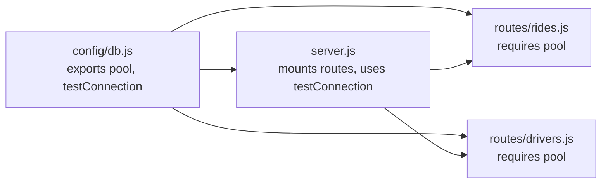

**Diagram sources**
- [config/db.js:49](file://config/db.js#L49)
- [routes/rides.js:3](file://routes/rides.js#L3)
- [routes/drivers.js:3](file://routes/drivers.js#L3)
- [server.js:6](file://server.js#L6)

**Section sources**
- [routes/rides.js:3](file://routes/rides.js#L3)
- [routes/drivers.js:3](file://routes/drivers.js#L3)
- [server.js:6](file://server.js#L6)

## Dependency Analysis
- server.js depends on:
  - config/db.js for database connectivity testing.
  - routes/rides.js and routes/drivers.js for API endpoints.
- routes/rides.js and routes/drivers.js depend on:
  - config/db.js for the shared pool.
- Frontend depends on:
  - server.js for API endpoints.
- Database depends on:
  - schema.sql for tables and stored procedures.
  - scripts/init-db.js for initialization.

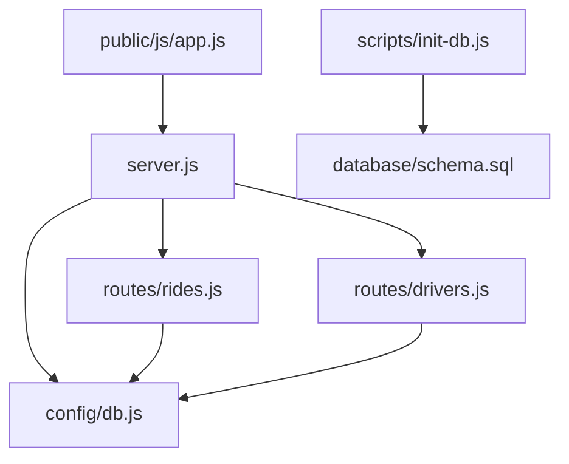

**Diagram sources**
- [server.js:6-8](file://server.js#L6-L8)
- [routes/rides.js:3](file://routes/rides.js#L3)
- [routes/drivers.js:3](file://routes/drivers.js#L3)
- [scripts/init-db.js:17](file://scripts/init-db.js#L17)
- [database/schema.sql:164](file://database/schema.sql#L164)

**Section sources**
- [server.js:6-8](file://server.js#L6-L8)
- [routes/rides.js:3](file://routes/rides.js#L3)
- [routes/drivers.js:3](file://routes/drivers.js#L3)
- [scripts/init-db.js:17](file://scripts/init-db.js#L17)

## Performance Considerations
- Connection pooling:
  - The pool is configured with a high connection limit and queue limits to handle peak-hour bursts.
- Atomic operations:
  - Stored procedures enforce concurrency safety for matching and status updates.
- Indexing:
  - Strategic indexes optimize frequent queries for available drivers, pending requests, and location searches.
- Upsert pattern:
  - Atomic upsert minimizes race conditions for frequent location updates.
- Request logging:
  - Slow request detection helps monitor performance under load.

[No sources needed since this section provides general guidance]

## Troubleshooting Guide
Common issues and resolutions:
- Connection refused: Verify MySQL is running and reachable.
- Access denied: Confirm DB credentials in environment variables.
- Table not found: Initialize the database using the schema script.
- Port conflict: Change the server port in environment variables.
- Slow queries during peak hours: Review analytics and adjust pool size if needed.

**Section sources**
- [README.md:265-274](file://README.md#L265-L274)

## Conclusion
The system integrates an Express server, a shared database pool, modular route handlers, and a static frontend dashboard. The orchestration emphasizes:
- Clear middleware setup and static file serving.
- Centralized database configuration with health checks.
- Robust route handlers leveraging transactions and stored procedures for concurrency safety.
- Frontend API consumption with structured request-response flows.
- Consistent error handling and lifecycle management through dependency injection.

[No sources needed since this section summarizes without analyzing specific files]

## Appendices

### API Endpoints Overview
- Rides:
  - GET /api/rides/active
  - GET /api/rides/pending
  - POST /api/rides/request
  - POST /api/rides/match
  - PUT /api/rides/:id/status
  - GET /api/rides/stats
- Drivers:
  - GET /api/drivers
  - GET /api/drivers/available
  - POST /api/drivers/register
  - PUT /api/drivers/:id/location
  - PUT /api/drivers/:id/status
  - GET /api/drivers/:id/rides
- System:
  - GET /api/health

**Section sources**
- [README.md:110-139](file://README.md#L110-L139)

### Database Initialization Script
- The initialization script connects to MySQL, reads the schema file, splits statements, and executes them while handling known errors gracefully.

**Section sources**
- [scripts/init-db.js:6-45](file://scripts/init-db.js#L6-L45)