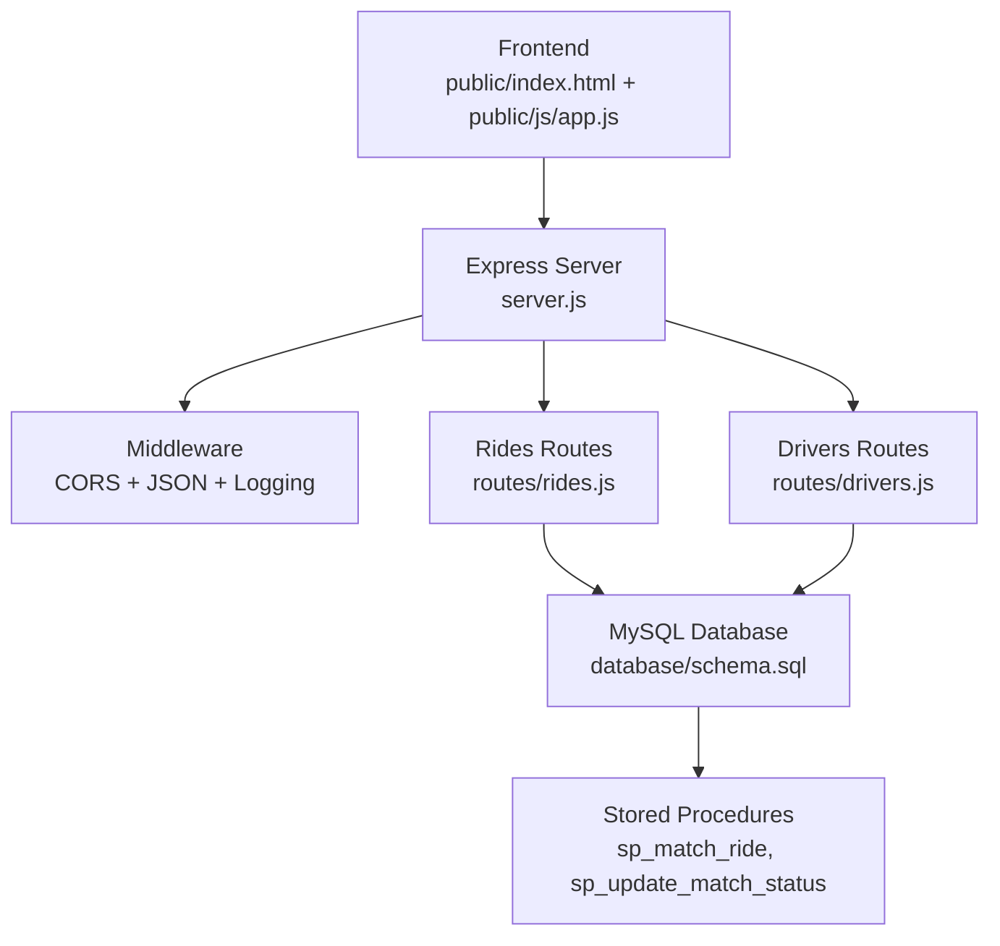
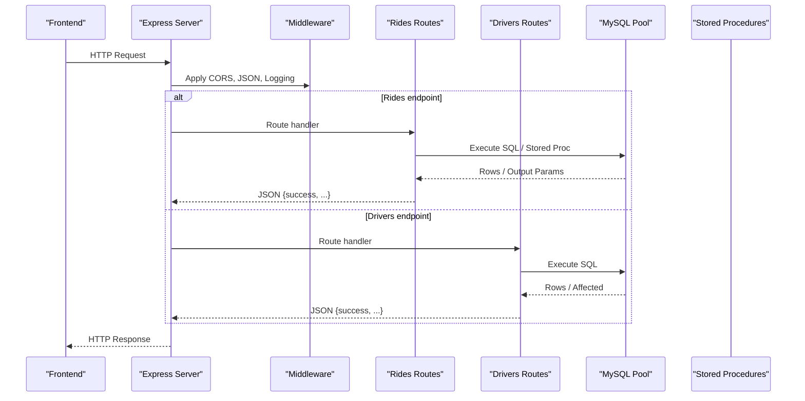
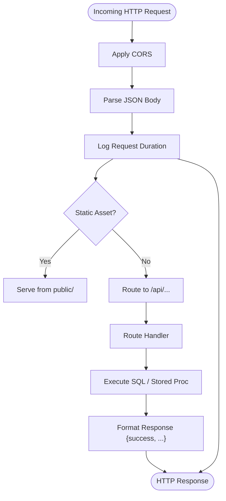
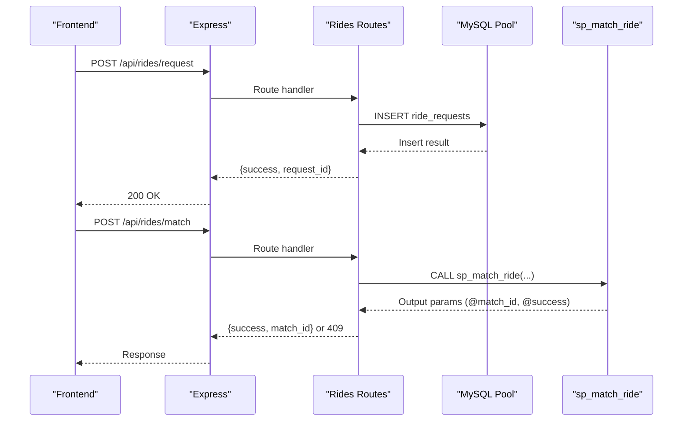
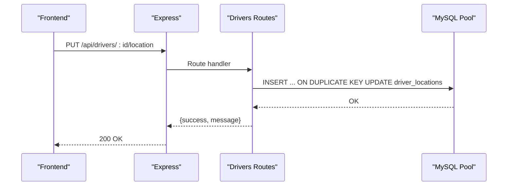
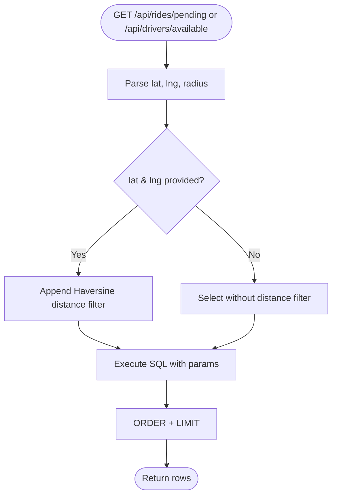
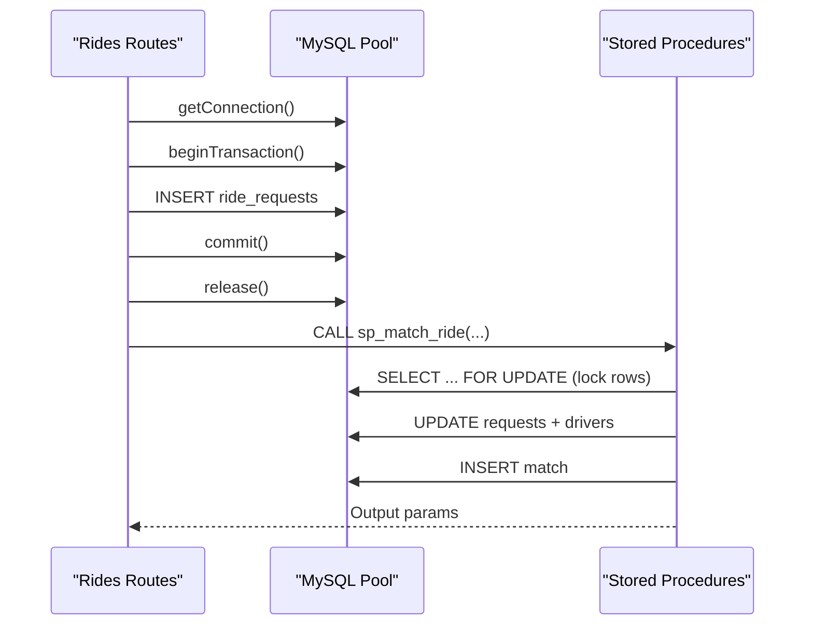
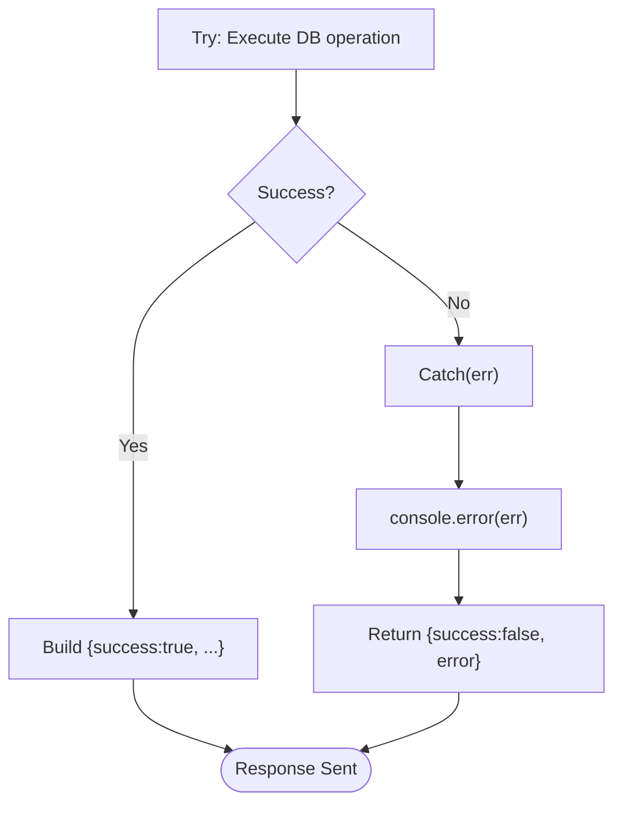
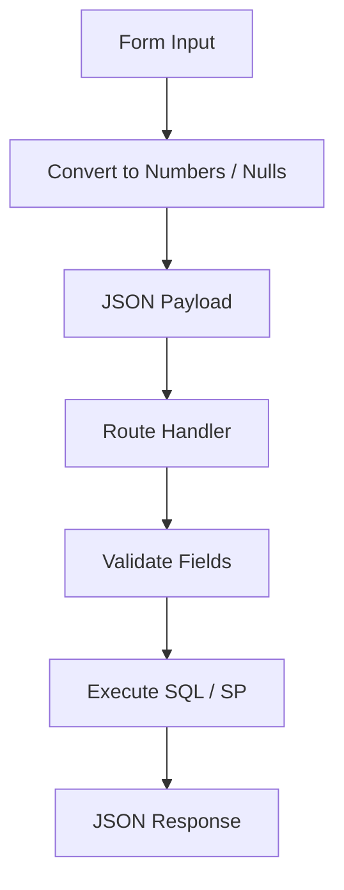
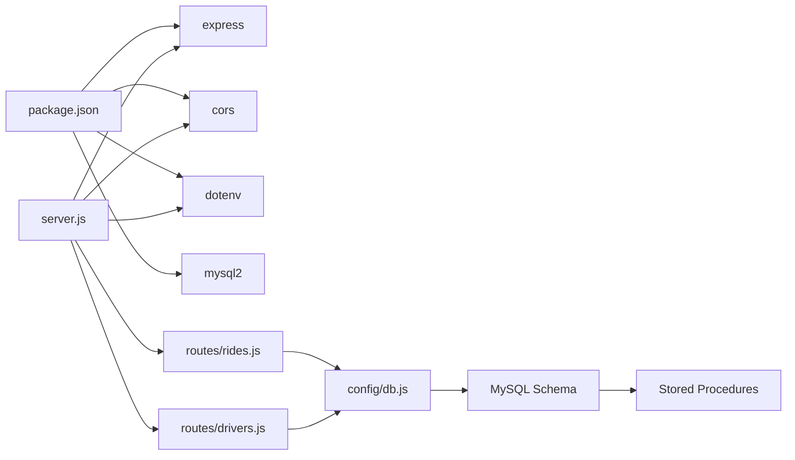

# Data Flow and Processing

<cite>
**Referenced Files in This Document**
- [server.js](file://server.js)
- [routes/rides.js](file://routes/rides.js)
- [routes/drivers.js](file://routes/drivers.js)
- [config/db.js](file://config/db.js)
- [database/schema.sql](file://database/schema.sql)
- [public/js/app.js](file://public/js/app.js)
- [public/index.html](file://public/index.html)
- [scripts/init-db.js](file://scripts/init-db.js)
- [package.json](file://package.json)
- [README.md](file://README.md)
</cite>

## Table of Contents
1. [Introduction](#introduction)
2. [Project Structure](#project-structure)
3. [Core Components](#core-components)
4. [Architecture Overview](#architecture-overview)
5. [Detailed Component Analysis](#detailed-component-analysis)
6. [Dependency Analysis](#dependency-analysis)
7. [Performance Considerations](#performance-considerations)
8. [Troubleshooting Guide](#troubleshooting-guide)
9. [Conclusion](#conclusion)

## Introduction
This document explains the complete data flow in the ride-sharing system from frontend HTTP requests through Express middleware to database operations and back to client responses. It covers the request processing pipeline (CORS handling, JSON parsing, logging), how ride and driver data moves through the system, geospatial filtering for ride matching, location tracking updates, transaction handling for atomic operations, error propagation, response formatting, data transformation patterns, validation flows, and performance monitoring. It also addresses connection pool management for concurrent operations and outlines potential caching considerations.

## Project Structure
The system follows a layered architecture:
- Frontend: static HTML/CSS/JS served by Express
- Backend: Express server with route handlers for rides and drivers
- Database: MySQL 8.0+ with stored procedures and indexes optimized for peak-hour concurrency
- Configuration: connection pool and health checks

**Diagram sources**
- [server.js:10-67](file://server.js#L10-L67)
- [routes/rides.js:1-272](file://routes/rides.js#L1-L272)
- [routes/drivers.js:1-182](file://routes/drivers.js#L1-L182)
- [database/schema.sql:164-272](file://database/schema.sql#L164-L272)

**Section sources**
- [README.md:29-48](file://README.md#L29-L48)
- [package.json:14-22](file://package.json#L14-L22)

## Core Components
- Express server initializes middleware, static serving, routes, health checks, and global error handling.
- Route modules encapsulate ride and driver APIs with database interactions.
- Connection pool manages concurrent database operations with timeouts and queue limits.
- Stored procedures enforce atomicity and prevent race conditions during matching and status updates.
- Frontend uses vanilla JS to call REST endpoints and render live dashboards.

Key implementation references:
- Middleware stack and health endpoint: [server.js:16-67](file://server.js#L16-L67)
- Rides API endpoints: [routes/rides.js:10-259](file://routes/rides.js#L10-L259)
- Drivers API endpoints: [routes/drivers.js:10-179](file://routes/drivers.js#L10-L179)
- Connection pool configuration: [config/db.js:7-30](file://config/db.js#L7-L30)
- Stored procedures: [database/schema.sql:164-272](file://database/schema.sql#L164-L272)
- Frontend API helpers and periodic refresh: [public/js/app.js:326-347](file://public/js/app.js#L326-L347)

**Section sources**
- [server.js:16-67](file://server.js#L16-L67)
- [routes/rides.js:10-259](file://routes/rides.js#L10-L259)
- [routes/drivers.js:10-179](file://routes/drivers.js#L10-L179)
- [config/db.js:7-30](file://config/db.js#L7-L30)
- [database/schema.sql:164-272](file://database/schema.sql#L164-L272)
- [public/js/app.js:326-347](file://public/js/app.js#L326-L347)

## Architecture Overview
The request lifecycle:
1. Frontend sends HTTP requests to backend endpoints.
2. Express applies CORS, JSON parsing, and logging middleware.
3. Route handlers execute database queries or stored procedures.
4. Responses are formatted consistently with a success/error envelope.
5. Errors are propagated to a global error handler.

**Diagram sources**
- [server.js:16-67](file://server.js#L16-L67)
- [routes/rides.js:10-259](file://routes/rides.js#L10-L259)
- [routes/drivers.js:10-179](file://routes/drivers.js#L10-L179)
- [config/db.js:7-30](file://config/db.js#L7-L30)
- [database/schema.sql:164-272](file://database/schema.sql#L164-L272)

## Detailed Component Analysis

### Request Processing Pipeline
- CORS: Enabled globally for cross-origin frontend access.
- JSON parsing: Parses request bodies for POST/PUT.
- Logging: Measures request duration and logs slow requests (>500 ms).
- Static files: Serves the SPA from the public directory.
- Routes: Mounts rides and drivers endpoints under /api.
- Health check: Tests database connectivity.
- 404 and global error handlers: Standardized error responses.

**Diagram sources**
- [server.js:16-67](file://server.js#L16-L67)
- [server.js:35](file://server.js#L35)
- [server.js:40-51](file://server.js#L40-L51)

**Section sources**
- [server.js:16-67](file://server.js#L16-L67)

### Rides Data Flow
Endpoints and flows:
- GET /api/rides/active: Aggregates ride requests with user and driver info, ordered by creation time.
- GET /api/rides/pending: Filters pending requests by proximity using a Haversine-based radius filter.
- POST /api/rides/request: Inserts a new ride request with priority scoring and returns the inserted ID.
- POST /api/rides/match: Calls a stored procedure to atomically match a driver to a request.
- PUT /api/rides/:id/status: Updates request and match statuses, frees driver on completion/cancellation.
- GET /api/rides/stats: Provides dashboard metrics.

**Diagram sources**
- [routes/rides.js:88-133](file://routes/rides.js#L88-L133)
- [routes/rides.js:135-167](file://routes/rides.js#L135-L167)
- [database/schema.sql:164-234](file://database/schema.sql#L164-L234)

**Section sources**
- [routes/rides.js:10-259](file://routes/rides.js#L10-L259)
- [database/schema.sql:164-234](file://database/schema.sql#L164-L234)

### Drivers Data Flow
Endpoints and flows:
- GET /api/drivers: Lists drivers with optional latest location.
- GET /api/drivers/available: Filters available drivers by proximity using a Haversine-based radius filter.
- POST /api/drivers/register: Registers a new driver.
- PUT /api/drivers/:id/location: Upserts driver location using a single atomic statement.
- PUT /api/drivers/:id/status: Toggles driver availability.
- GET /api/drivers/:id/rides: Retrieves driver’s ride history.

**Diagram sources**
- [routes/drivers.js:101-126](file://routes/drivers.js#L101-L126)
- [database/schema.sql:54-69](file://database/schema.sql#L54-L69)

**Section sources**
- [routes/drivers.js:10-179](file://routes/drivers.js#L10-L179)
- [database/schema.sql:54-69](file://database/schema.sql#L54-L69)

### Geospatial Filtering for Matching and Availability
- Proximity filtering uses a Haversine-like formula to compute distances in kilometers and restrict results to a configurable radius.
- The filter is applied conditionally when lat/lng query parameters are present.
- Indexes on location coordinates support efficient spatial queries.

**Diagram sources**
- [routes/rides.js:44-86](file://routes/rides.js#L44-L86)
- [routes/drivers.js:39-77](file://routes/drivers.js#L39-L77)
- [database/schema.sql:74-98](file://database/schema.sql#L74-L98)
- [database/schema.sql:31-49](file://database/schema.sql#L31-L49)

**Section sources**
- [routes/rides.js:44-86](file://routes/rides.js#L44-L86)
- [routes/drivers.js:39-77](file://routes/drivers.js#L39-L77)
- [database/schema.sql:74-98](file://database/schema.sql#L74-L98)
- [database/schema.sql:31-49](file://database/schema.sql#L31-L49)

### Transaction Handling and Atomic Operations
- Explicit transactions: Ride request creation and status updates wrap DML in beginTransaction/commit/rollback with per-connection pooling.
- Stored procedures: Atomic matching and status updates use row-level locks and single-statement inserts/updates to prevent race conditions.
- Optimistic locking: version columns detect concurrent modifications.

**Diagram sources**
- [routes/rides.js:89-133](file://routes/rides.js#L89-L133)
- [routes/rides.js:169-224](file://routes/rides.js#L169-L224)
- [database/schema.sql:164-234](file://database/schema.sql#L164-L234)

**Section sources**
- [routes/rides.js:89-133](file://routes/rides.js#L89-L133)
- [routes/rides.js:169-224](file://routes/rides.js#L169-L224)
- [database/schema.sql:164-234](file://database/schema.sql#L164-L234)

### Response Formatting and Error Propagation
- Consistent envelope: {success: boolean, ...}. On error, {success: false, error: string}.
- Route handlers catch exceptions and return 500 with error messages.
- Global error handler logs unhandled errors and returns standardized 500 responses.
- 404 handler responds with a JSON error for unknown endpoints.

**Diagram sources**
- [routes/rides.js:37-40](file://routes/rides.js#L37-L40)
- [routes/drivers.js:32-35](file://routes/drivers.js#L32-L35)
- [server.js:63-67](file://server.js#L63-L67)
- [server.js:58-61](file://server.js#L58-L61)

**Section sources**
- [routes/rides.js:37-40](file://routes/rides.js#L37-L40)
- [routes/drivers.js:32-35](file://routes/drivers.js#L32-L35)
- [server.js:58-67](file://server.js#L58-L67)

### Data Transformation Patterns and Validation Flows
- Frontend transforms form inputs to numeric coordinates and optional amounts before sending JSON.
- Route handlers extract and validate required fields from request bodies and query parameters.
- Stored procedures enforce referential integrity and atomicity.

**Diagram sources**
- [public/js/app.js:71-91](file://public/js/app.js#L71-L91)
- [public/js/app.js:107-122](file://public/js/app.js#L107-L122)
- [routes/rides.js:89-133](file://routes/rides.js#L89-L133)
- [routes/drivers.js:79-99](file://routes/drivers.js#L79-L99)

**Section sources**
- [public/js/app.js:71-91](file://public/js/app.js#L71-L91)
- [public/js/app.js:107-122](file://public/js/app.js#L107-L122)
- [routes/rides.js:89-133](file://routes/rides.js#L89-L133)
- [routes/drivers.js:79-99](file://routes/drivers.js#L79-L99)

### Caching Considerations
- Current implementation does not include a caching layer.
- Potential enhancements (future): Redis caching for driver location reads and frequently accessed lists.

**Section sources**
- [README.md:280](file://README.md#L280)

## Dependency Analysis
- Express depends on cors, express.json, express.urlencoded, dotenv.
- Routes depend on the shared connection pool.
- Stored procedures depend on tables and foreign keys.
- Frontend depends on server endpoints and static assets.

**Diagram sources**
- [package.json:14-18](file://package.json#L14-L18)
- [server.js:1-8](file://server.js#L1-L8)
- [config/db.js:1](file://config/db.js#L1)
- [database/schema.sql:164-272](file://database/schema.sql#L164-L272)

**Section sources**
- [package.json:14-18](file://package.json#L14-L18)
- [server.js:1-8](file://server.js#L1-L8)
- [config/db.js:1](file://config/db.js#L1)
- [database/schema.sql:164-272](file://database/schema.sql#L164-L272)

## Performance Considerations
- Connection pool sizing: 50 connections with queue limit 100 to handle peak-hour bursts.
- Timeouts: connect/acquire/timeout set to 10 seconds to prevent hanging connections.
- Keep-alive: enabled to keep connections fresh.
- Indexes: strategic indexes on status, timestamps, and coordinates for fast reads.
- Upsert pattern: reduces race conditions and minimizes round-trips for frequent location updates.
- Priority scoring: increases throughput during peak hours by prioritizing high-demand periods.
- Slow request detection: middleware logs requests exceeding 500 ms.

Recommendations:
- Add Redis caching for driver location reads and dashboard stats.
- Consider geohash-based spatial indexing for faster nearby searches.
- Introduce WebSocket for real-time UI updates.

**Section sources**
- [config/db.js:7-30](file://config/db.js#L7-L30)
- [database/schema.sql:46-68](file://database/schema.sql#L46-L68)
- [database/schema.sql:94-97](file://database/schema.sql#L94-L97)
- [routes/rides.js:261-269](file://routes/rides.js#L261-L269)
- [server.js:20-30](file://server.js#L20-L30)
- [README.md:144-176](file://README.md#L144-L176)

## Troubleshooting Guide
Common issues and resolutions:
- Connection refused: Verify MySQL is running and reachable.
- Access denied: Confirm DB credentials in environment variables.
- Table not found: Initialize the database using the schema script.
- Port in use: Change PORT in environment variables.
- Slow queries during peak: Monitor dashboard stats and adjust pool size if needed.

Operational checks:
- Health endpoint: GET /api/health validates database connectivity.
- Initialization script: scripts/init-db.js executes schema.sql to create tables and stored procedures.

**Section sources**
- [server.js:44-51](file://server.js#L44-L51)
- [scripts/init-db.js:6-45](file://scripts/init-db.js#L6-L45)
- [README.md:265-274](file://README.md#L265-L274)

## Conclusion
The ride-sharing system implements a robust data flow from frontend to database with explicit middleware, consistent response envelopes, and atomic operations enforced by stored procedures and transactions. Geospatial filtering ensures efficient matching and availability queries, while connection pooling and strategic indexing support peak-hour concurrency. The modular design enables straightforward enhancements such as caching and real-time updates.