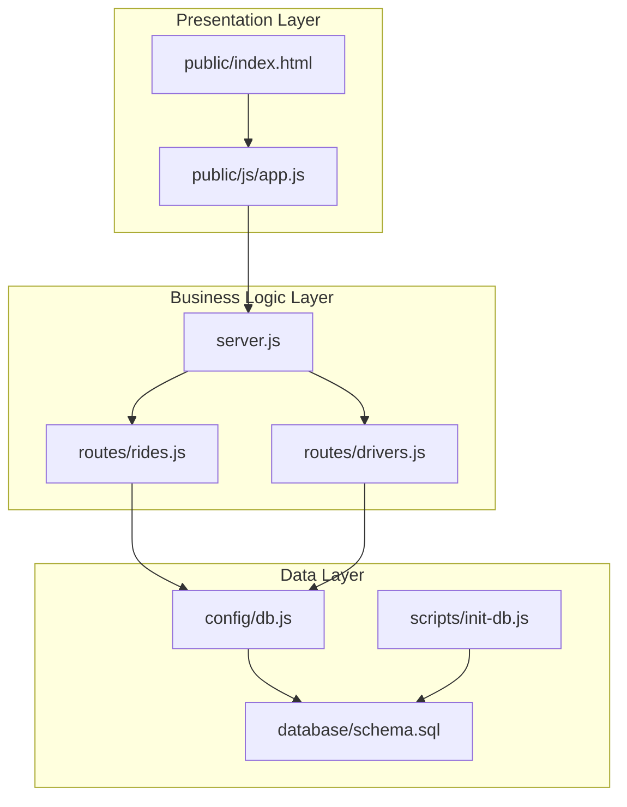
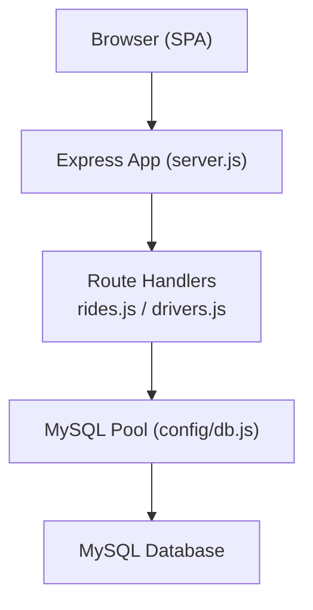
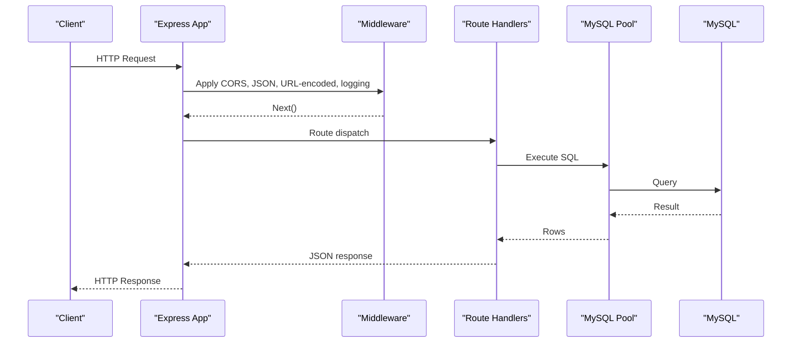
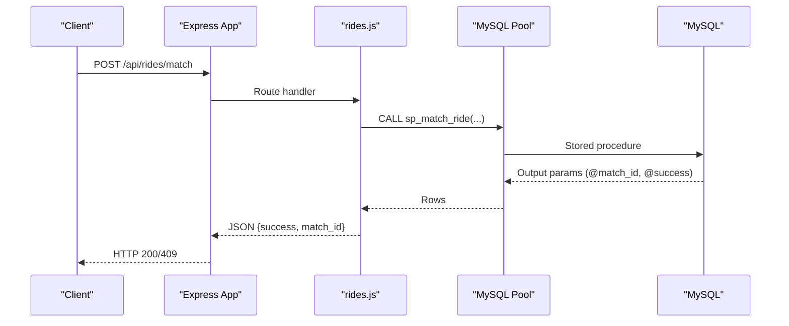
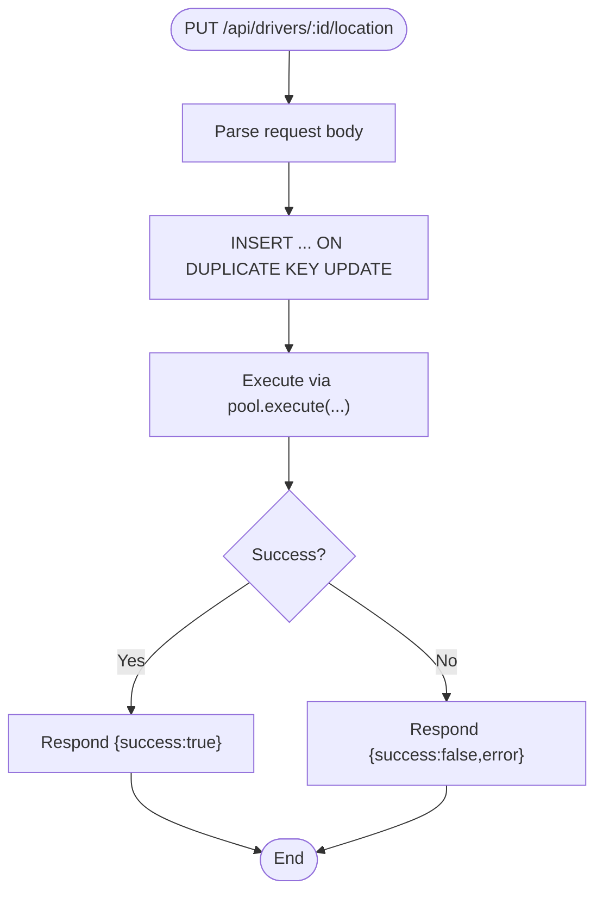
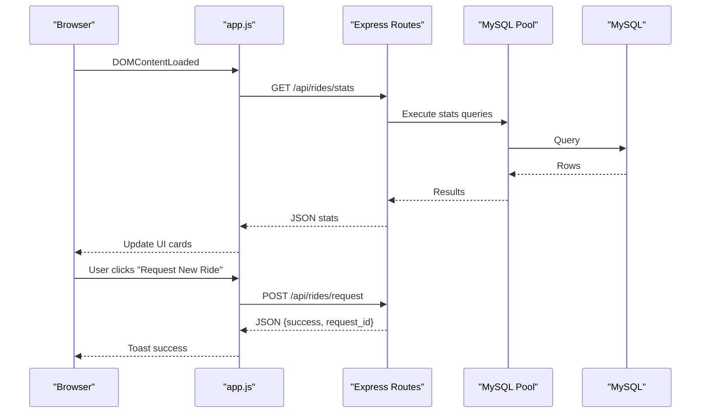
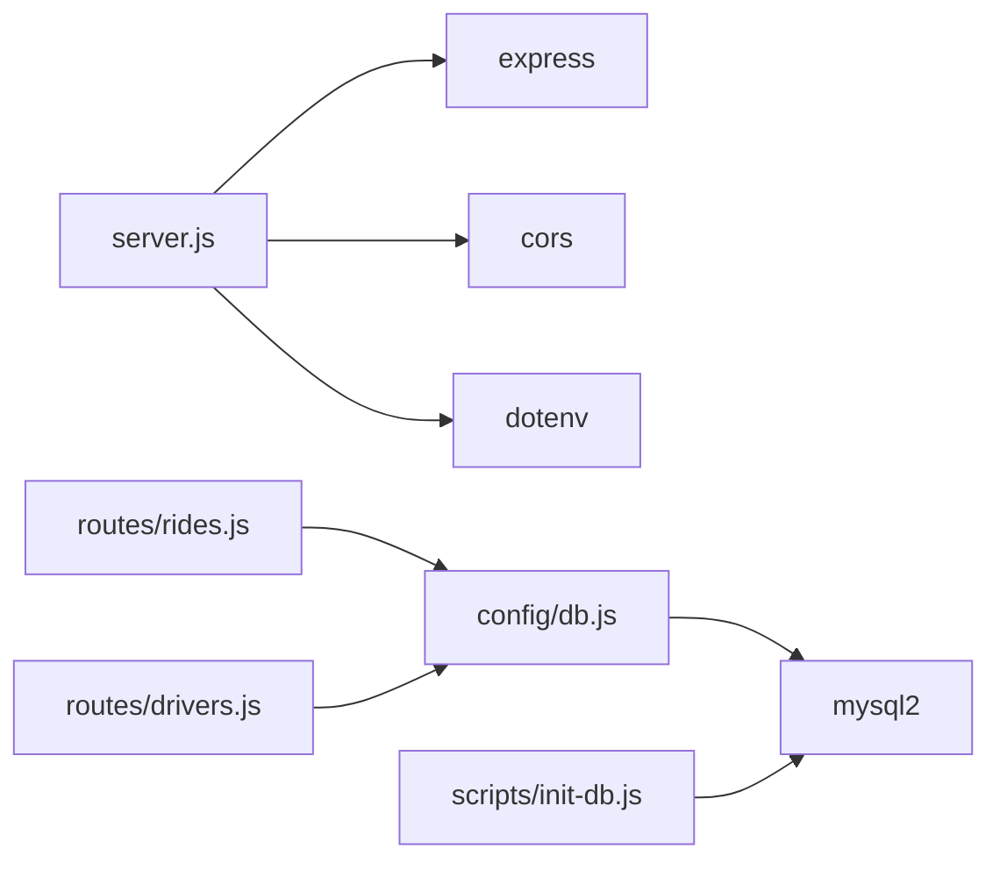

# Overall System Design

<cite>
**Referenced Files in This Document**
- [server.js](file://server.js)
- [package.json](file://package.json)
- [config/db.js](file://config/db.js)
- [routes/rides.js](file://routes/rides.js)
- [routes/drivers.js](file://routes/drivers.js)
- [public/js/app.js](file://public/js/app.js)
- [public/index.html](file://public/index.html)
- [database/schema.sql](file://database/schema.sql)
- [scripts/init-db.js](file://scripts/init-db.js)
- [README.md](file://README.md)
</cite>

## Table of Contents
1. [Introduction](#introduction)
2. [Project Structure](#project-structure)
3. [Core Components](#core-components)
4. [Architecture Overview](#architecture-overview)
5. [Detailed Component Analysis](#detailed-component-analysis)
6. [Dependency Analysis](#dependency-analysis)
7. [Performance Considerations](#performance-considerations)
8. [Troubleshooting Guide](#troubleshooting-guide)
9. [Conclusion](#conclusion)

## Introduction
This document describes the overall system design of the ride-sharing matching DBMS. The system follows a layered architecture with clear separation between presentation, business logic, and data layers. It is built around Express.js for the backend web framework, MySQL with connection pooling for database management, and vanilla JavaScript for the frontend. The design emphasizes peak-hour concurrency, atomic operations, and a middleware pattern for request processing. The system is structured in an MVC-like manner where controllers are Express route handlers, services encapsulate business logic, and repositories manage database operations.

## Project Structure
The project is organized into distinct layers and responsibilities:
- Presentation layer: static assets and a single-page application (SPA) served by Express
- Business logic layer: Express route handlers that orchestrate operations
- Data layer: MySQL database with connection pooling and stored procedures



**Diagram sources**
- [server.js:1-84](file://server.js#L1-L84)
- [routes/rides.js:1-272](file://routes/rides.js#L1-L272)
- [routes/drivers.js:1-182](file://routes/drivers.js#L1-L182)
- [config/db.js:1-50](file://config/db.js#L1-L50)
- [database/schema.sql:1-297](file://database/schema.sql#L1-L297)
- [scripts/init-db.js:1-46](file://scripts/init-db.js#L1-L46)
- [public/index.html:1-239](file://public/index.html#L1-L239)
- [public/js/app.js:1-373](file://public/js/app.js#L1-L373)

**Section sources**
- [README.md:29-48](file://README.md#L29-L48)
- [server.js:10-56](file://server.js#L10-L56)
- [package.json:14-22](file://package.json#L14-L22)

## Core Components
- Express server entry point initializes middleware, static serving, routes, health checks, and error handling.
- Route handlers implement CRUD and orchestration endpoints for rides and drivers.
- Database configuration defines a connection pool sized for peak-hour concurrency and includes health checks and graceful shutdown.
- Frontend SPA communicates with the backend via REST endpoints and auto-refreshes data.

Key implementation patterns:
- Middleware pattern for CORS, JSON parsing, URL-encoded parsing, request logging, and global error handling.
- MVC-like separation: controllers are route handlers, business logic is embedded in route handlers, and repositories are implemented via direct SQL queries executed against the connection pool.
- Atomic operations via stored procedures and upserts to prevent race conditions.

**Section sources**
- [server.js:14-67](file://server.js#L14-L67)
- [routes/rides.js:10-167](file://routes/rides.js#L10-L167)
- [routes/drivers.js:10-126](file://routes/drivers.js#L10-L126)
- [config/db.js:7-47](file://config/db.js#L7-L47)
- [public/js/app.js:14-29](file://public/js/app.js#L14-L29)

## Architecture Overview
The system follows a layered architecture with explicit boundaries:
- Presentation boundary: static files and SPA served by Express
- API boundary: route handlers expose REST endpoints
- Data boundary: MySQL with connection pooling and stored procedures



**Diagram sources**
- [server.js:10-56](file://server.js#L10-L56)
- [routes/rides.js:1-272](file://routes/rides.js#L1-L272)
- [routes/drivers.js:1-182](file://routes/drivers.js#L1-L182)
- [config/db.js:7-30](file://config/db.js#L7-L30)

## Detailed Component Analysis

### Express Server and Middleware
The server initializes Express, registers middleware, serves static files, mounts route handlers, exposes health checks, and handles errors globally. It logs slow requests and provides a health endpoint that validates database connectivity.



**Diagram sources**
- [server.js:14-67](file://server.js#L14-L67)
- [routes/rides.js:10-41](file://routes/rides.js#L10-L41)
- [routes/drivers.js:10-36](file://routes/drivers.js#L10-L36)
- [config/db.js:33-41](file://config/db.js#L33-L41)

**Section sources**
- [server.js:14-67](file://server.js#L14-L67)
- [server.js:44-51](file://server.js#L44-L51)

### Rides API (Controllers and Business Logic)
The rides routes implement:
- Listing active and pending rides
- Creating ride requests with transactional inserts
- Atomic matching via stored procedures
- Status updates with transactional synchronization
- Statistics aggregation



**Diagram sources**
- [routes/rides.js:135-167](file://routes/rides.js#L135-L167)
- [database/schema.sql:164-234](file://database/schema.sql#L164-L234)

**Section sources**
- [routes/rides.js:10-86](file://routes/rides.js#L10-L86)
- [routes/rides.js:88-133](file://routes/rides.js#L88-L133)
- [routes/rides.js:135-167](file://routes/rides.js#L135-L167)
- [routes/rides.js:169-224](file://routes/rides.js#L169-L224)
- [routes/rides.js:226-259](file://routes/rides.js#L226-L259)

### Drivers API (Controllers and Business Logic)
The drivers routes implement:
- Listing all drivers and available drivers filtered by proximity
- Registering new drivers
- Updating driver locations atomically via upsert
- Toggling driver status
- Retrieving driver ride history



**Diagram sources**
- [routes/drivers.js:101-126](file://routes/drivers.js#L101-L126)
- [config/db.js:33-41](file://config/db.js#L33-L41)

**Section sources**
- [routes/drivers.js:10-77](file://routes/drivers.js#L10-L77)
- [routes/drivers.js:79-99](file://routes/drivers.js#L79-L99)
- [routes/drivers.js:101-126](file://routes/drivers.js#L101-L126)
- [routes/drivers.js:128-148](file://routes/drivers.js#L128-L148)
- [routes/drivers.js:150-179](file://routes/drivers.js#L150-L179)

### Frontend SPA (Presentation Layer)
The SPA is a vanilla JavaScript application that:
- Initializes tabs, modals, forms, and refresh intervals
- Loads stats, rides, and drivers via REST endpoints
- Performs CRUD operations by calling backend endpoints
- Provides toast notifications and basic HTML escaping



**Diagram sources**
- [public/js/app.js:14-29](file://public/js/app.js#L14-L29)
- [public/js/app.js:155-169](file://public/js/app.js#L155-L169)
- [public/js/app.js:71-91](file://public/js/app.js#L71-L91)
- [routes/rides.js:88-133](file://routes/rides.js#L88-L133)

**Section sources**
- [public/js/app.js:14-29](file://public/js/app.js#L14-L29)
- [public/js/app.js:155-223](file://public/js/app.js#L155-L223)
- [public/js/app.js:262-321](file://public/js/app.js#L262-L321)
- [public/index.html:1-239](file://public/index.html#L1-L239)

### Database Schema and Stored Procedures
The schema defines core entities and indexes optimized for high read and frequent update scenarios. Stored procedures encapsulate atomic operations to prevent race conditions during matching and status updates.

```mermaid
erDiagram
USERS {
int user_id PK
string name
string email UK
string phone
timestamp created_at
timestamp updated_at
}
DRIVERS {
int driver_id PK
string name
string email UK
string phone
string vehicle_model
string vehicle_plate UK
enum status
decimal rating
int total_trips
int version
timestamp created_at
timestamp updated_at
}
DRIVER_LOCATIONS {
int location_id PK
int driver_id FK
decimal latitude
decimal longitude
decimal accuracy
timestamp updated_at
}
RIDE_REQUESTS {
int request_id PK
int user_id FK
decimal pickup_lat
decimal pickup_lng
decimal dropoff_lat
decimal dropoff_lng
string pickup_address
string dropoff_address
enum status
decimal fare_estimate
decimal priority_score
int version
timestamp created_at
timestamp updated_at
}
RIDE_MATCHES {
int match_id PK
int request_id FK UK
int driver_id FK
enum status
decimal fare_final
decimal distance_km
timestamp started_at
timestamp completed_at
int version
timestamp created_at
timestamp updated_at
}
USERS ||--o{ RIDE_REQUESTS : "creates"
DRIVERS ||--o{ DRIVER_LOCATIONS : "has"
DRIVERS ||--o{ RIDE_MATCHES : "drives"
RIDE_REQUESTS ||--|| RIDE_MATCHES : "matches"
```

**Diagram sources**
- [database/schema.sql:14-126](file://database/schema.sql#L14-L126)

**Section sources**
- [database/schema.sql:14-126](file://database/schema.sql#L14-L126)
- [database/schema.sql:164-272](file://database/schema.sql#L164-L272)

## Dependency Analysis
The system’s dependencies are straightforward and intentionally minimal:
- Express for routing and middleware
- mysql2 for MySQL connectivity with Promise API and connection pooling
- dotenv for environment configuration
- cors for cross-origin support
- nodemon for development hot reload



**Diagram sources**
- [server.js:1-8](file://server.js#L1-L8)
- [routes/rides.js:1-3](file://routes/rides.js#L1-L3)
- [routes/drivers.js:1-3](file://routes/drivers.js#L1-L3)
- [config/db.js:1](file://config/db.js#L1)
- [scripts/init-db.js:1-4](file://scripts/init-db.js#L1-L4)
- [package.json:14-19](file://package.json#L14-L19)

**Section sources**
- [package.json:14-19](file://package.json#L14-L19)
- [server.js:1-8](file://server.js#L1-L8)

## Performance Considerations
The system is designed to handle peak-hour concurrency and frequent updates with the following strategies:
- Connection pooling: configured with 50 connections and queue limits to absorb bursts without dropping requests.
- Atomic operations: stored procedures and upserts prevent race conditions and reduce contention.
- Indexing: strategic indexes on status, timestamps, and location fields optimize read-heavy and spatial queries.
- Upsert pattern: reduces round-trips and eliminates read-then-write race conditions for driver locations.
- Priority scoring: dynamic priority during peak hours ensures fair queue ordering.
- Transactional writes: ride requests and status updates are wrapped in transactions to maintain consistency.

Scalability targets:
- 50 concurrent connections in the pool to support high throughput during peak hours.
- Stored procedures enforce atomicity for critical matching operations to prevent double-booking.
- Middleware logs slow requests to monitor performance under load.

**Section sources**
- [config/db.js:7-30](file://config/db.js#L7-L30)
- [routes/rides.js:135-167](file://routes/rides.js#L135-L167)
- [routes/drivers.js:108-119](file://routes/drivers.js#L108-L119)
- [routes/rides.js:261-269](file://routes/rides.js#L261-L269)
- [database/schema.sql:46-98](file://database/schema.sql#L46-L98)

## Troubleshooting Guide
Common issues and resolutions:
- Connection refused: ensure MySQL is running on the configured host/port.
- Access denied: verify DB_USER and DB_PASSWORD in the environment configuration.
- Table doesn't exist: run the schema initialization script to create tables and stored procedures.
- Port 3000 in use: change the PORT environment variable to an available port.
- Slow queries during peak: monitor dashboard statistics and consider increasing pool size if needed.

Operational checks:
- Health endpoint: GET /api/health validates database connectivity.
- Request logging: middleware logs slow requests to help identify bottlenecks.

**Section sources**
- [server.js:44-51](file://server.js#L44-L51)
- [server.js:20-30](file://server.js#L20-L30)
- [README.md:265-274](file://README.md#L265-L274)

## Conclusion
The ride-sharing matching DBMS employs a clean layered architecture with Express as the web framework, MySQL with connection pooling for data persistence, and a vanilla JavaScript SPA for presentation. The design prioritizes peak-hour concurrency through connection pooling, atomic stored procedures, and strategic indexing. The MVC-like separation keeps controllers (route handlers) focused on request orchestration, while business logic is embedded within route handlers and repositories are implemented via direct SQL against the connection pool. These architectural decisions enable the system to scale to 50 concurrent connections and maintain performance under high read and frequent update loads.