# Performance and Scalability

<cite>
**Referenced Files in This Document**
- [server.js](file://server.js)
- [config/db.js](file://config/db.js)
- [routes/rides.js](file://routes/rides.js)
- [routes/drivers.js](file://routes/drivers.js)
- [database/schema.sql](file://database/schema.sql)
- [scripts/init-db.js](file://scripts/init-db.js)
- [package.json](file://package.json)
- [README.md](file://README.md)
</cite>

## Table of Contents
1. [Introduction](#introduction)
2. [Project Structure](#project-structure)
3. [Core Components](#core-components)
4. [Architecture Overview](#architecture-overview)
5. [Detailed Component Analysis](#detailed-component-analysis)
6. [Dependency Analysis](#dependency-analysis)
7. [Performance Considerations](#performance-considerations)
8. [Troubleshooting Guide](#troubleshooting-guide)
9. [Conclusion](#conclusion)
10. [Appendices](#appendices)

## Introduction
This document focuses on performance optimization and scalability for the ride-sharing matching system. It covers connection pooling tuned for peak-hour concurrency, timeout and queue management, connection reuse strategies, performance monitoring (slow request detection and health checks), concurrency control (stored procedures, optimistic/pessimistic locking), and recommendations for horizontal scaling, load balancing, and capacity planning. Memory management and resource cleanup patterns are also addressed.

## Project Structure
The system follows a layered architecture:
- Express server handles HTTP requests and middleware.
- Routes define API endpoints for rides and drivers.
- Database configuration encapsulates connection pooling and health checks.
- Stored procedures enforce atomicity and prevent race conditions.
- Initialization script sets up schema and sample data.

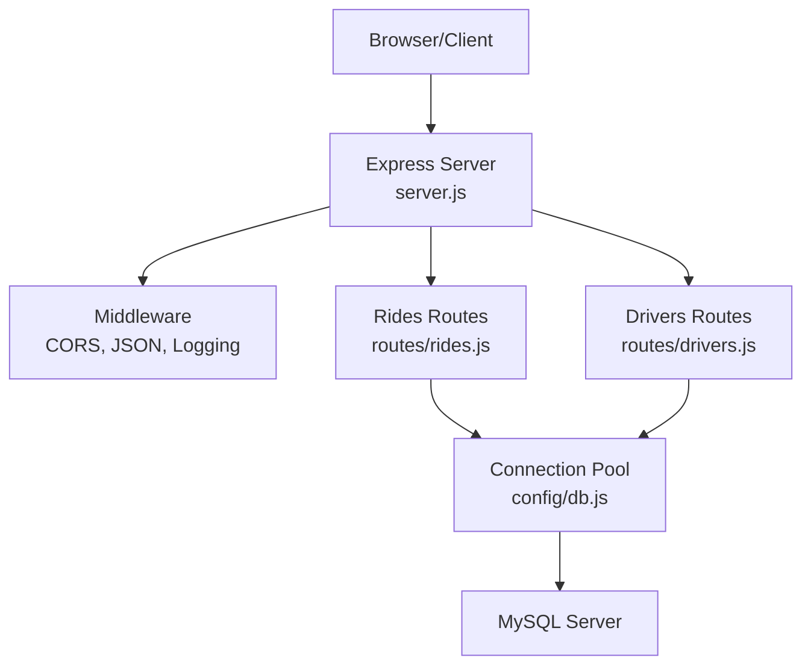

**Diagram sources**
- [server.js:10-51](file://server.js#L10-L51)
- [routes/rides.js:1-272](file://routes/rides.js#L1-L272)
- [routes/drivers.js:1-182](file://routes/drivers.js#L1-L182)
- [config/db.js:7-30](file://config/db.js#L7-L30)

**Section sources**
- [server.js:1-84](file://server.js#L1-L84)
- [package.json:1-24](file://package.json#L1-L24)
- [README.md:29-48](file://README.md#L29-L48)

## Core Components
- Connection Pool: Configured with 50 concurrent connections and a queue limit to handle peak-hour bursts.
- Health Checks: Database connectivity verification via a dedicated endpoint and startup check.
- Slow Request Detection: Middleware logs requests exceeding 500 ms.
- Atomic Operations: Stored procedures with pessimistic locking for ride matching and optimistic locking for status updates.
- Upsert Pattern: Atomic upsert for driver location updates to avoid race conditions.
- Priority Scoring: Dynamic priority score to manage queues during peak hours.

**Section sources**
- [config/db.js:7-30](file://config/db.js#L7-L30)
- [server.js:20-30](file://server.js#L20-L30)
- [server.js:43-51](file://server.js#L43-L51)
- [routes/rides.js:135-167](file://routes/rides.js#L135-L167)
- [routes/drivers.js:101-126](file://routes/drivers.js#L101-L126)
- [database/schema.sql:167-234](file://database/schema.sql#L167-L234)

## Architecture Overview
The runtime flow integrates Express middleware, route handlers, and database operations through a shared connection pool. Health checks and slow request detection are embedded in the server lifecycle.

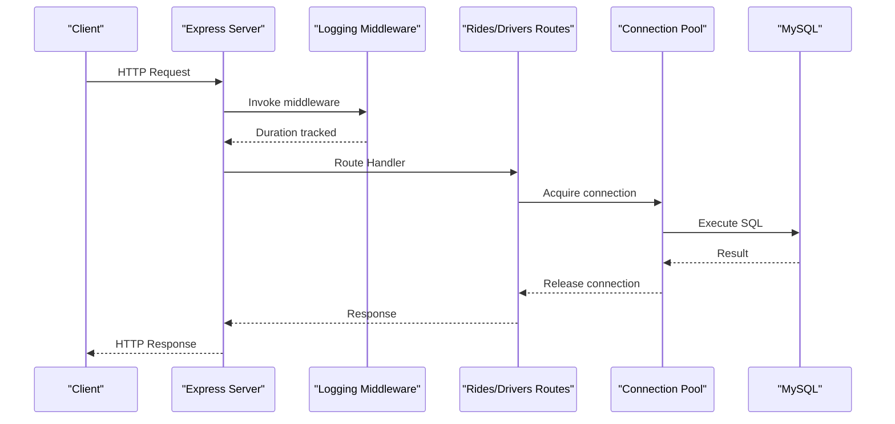

**Diagram sources**
- [server.js:20-30](file://server.js#L20-L30)
- [routes/rides.js:88-133](file://routes/rides.js#L88-L133)
- [routes/drivers.js:101-126](file://routes/drivers.js#L101-L126)
- [config/db.js:7-30](file://config/db.js#L7-L30)

## Detailed Component Analysis

### Connection Pool Configuration and Reuse
- Pool sizing: 50 concurrent connections to absorb bursty traffic during peak hours.
- Queue management: Excess requests are queued up to 100 before rejection/backpressure.
- Timeouts: Connect, acquire, and general timeouts set to 10 seconds to prevent hanging connections.
- Keep-alive: Enabled with initial delay to keep connections fresh.
- Row streaming: Rows returned as objects for efficient parsing.

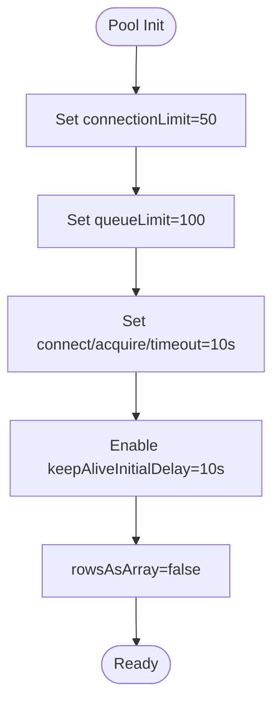

**Diagram sources**
- [config/db.js:7-30](file://config/db.js#L7-L30)

**Section sources**
- [config/db.js:7-30](file://config/db.js#L7-L30)

### Slow Request Detection
- Middleware measures request duration and logs warnings for requests exceeding 500 ms.
- This enables proactive identification of hotspots and performance regressions during peak hours.

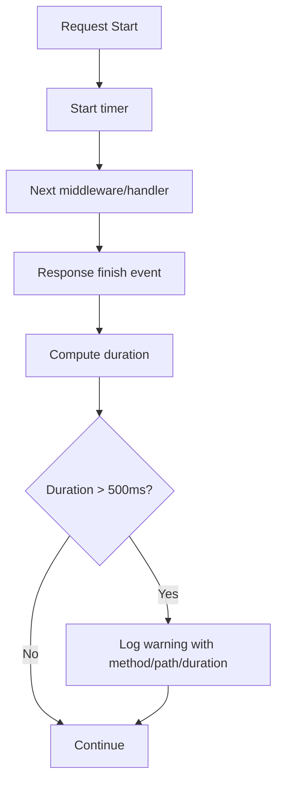

**Diagram sources**
- [server.js:20-30](file://server.js#L20-L30)

**Section sources**
- [server.js:20-30](file://server.js#L20-L30)

### Health Check Mechanism
- Dedicated endpoint performs a simple database ping to verify connectivity.
- Startup routine also validates database connectivity before listening.

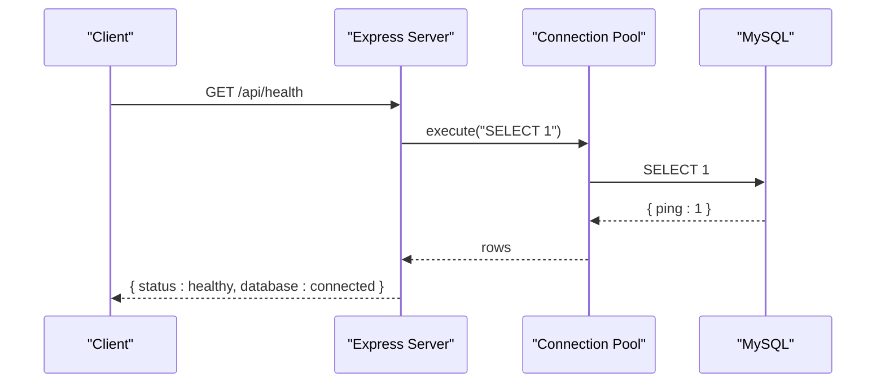

**Diagram sources**
- [server.js:43-51](file://server.js#L43-L51)
- [config/db.js:33-41](file://config/db.js#L33-L41)

**Section sources**
- [server.js:43-51](file://server.js#L43-L51)
- [config/db.js:33-41](file://config/db.js#L33-L41)

### Atomic Ride Matching with Stored Procedures
- The stored procedure enforces atomicity using pessimistic locking:
  - Locks the ride request row for update.
  - Locks the driver row for update.
  - Updates statuses and inserts a match record atomically.
- Output parameters indicate success/failure to prevent double-booking.

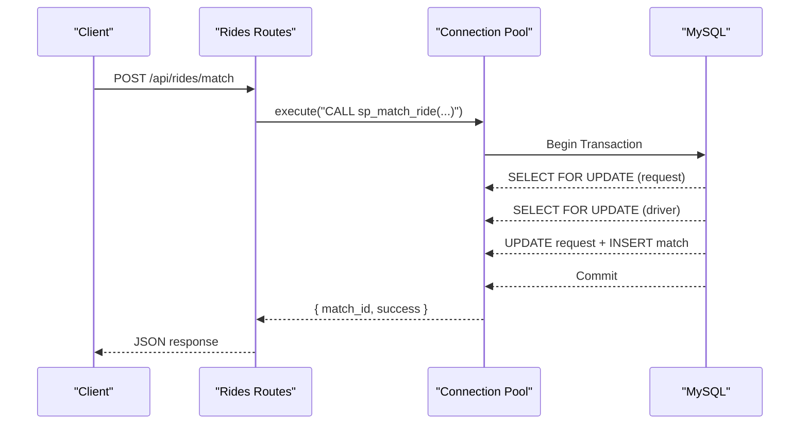

**Diagram sources**
- [routes/rides.js:135-167](file://routes/rides.js#L135-L167)
- [database/schema.sql:167-234](file://database/schema.sql#L167-L234)

**Section sources**
- [routes/rides.js:135-167](file://routes/rides.js#L135-L167)
- [database/schema.sql:167-234](file://database/schema.sql#L167-L234)

### Optimistic Locking for Status Updates
- Version columns on drivers and ride requests detect concurrent modifications.
- The stored procedure for status updates compares expected version and increments atomically.
- This prevents lost updates when multiple clients modify the same record.

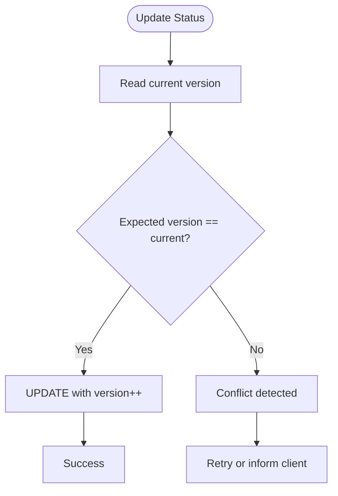

**Diagram sources**
- [database/schema.sql:236-263](file://database/schema.sql#L236-L263)
- [routes/rides.js:169-224](file://routes/rides.js#L169-L224)

**Section sources**
- [database/schema.sql:236-263](file://database/schema.sql#L236-L263)
- [routes/rides.js:169-224](file://routes/rides.js#L169-L224)

### Upsert Pattern for Driver Location Updates
- Frequent location updates use an atomic upsert to avoid race conditions.
- Single statement updates existing rows or inserts new ones.

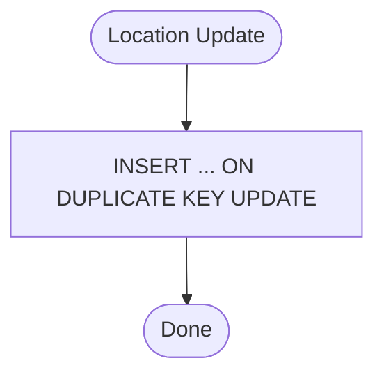

**Diagram sources**
- [routes/drivers.js:101-126](file://routes/drivers.js#L101-L126)
- [database/schema.sql:54-69](file://database/schema.sql#L54-L69)

**Section sources**
- [routes/drivers.js:101-126](file://routes/drivers.js#L101-L126)
- [database/schema.sql:54-69](file://database/schema.sql#L54-L69)

### Priority Scoring for Peak Hour Queues
- Priority score increases during peak hours (7–9 AM and 5–8 PM).
- Pending ride queries order by priority score to ensure fair and timely matching.

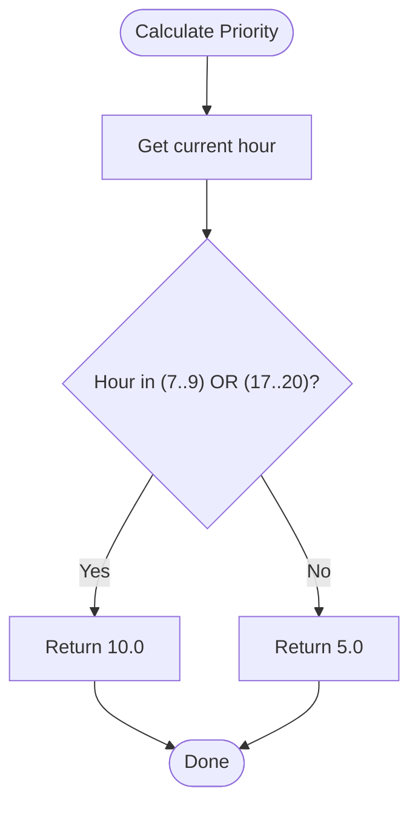

**Diagram sources**
- [routes/rides.js:261-269](file://routes/rides.js#L261-L269)

**Section sources**
- [routes/rides.js:261-269](file://routes/rides.js#L261-L269)

### Resource Cleanup Patterns
- Connection release after each route handler completes.
- Graceful pool closure on shutdown to free resources.

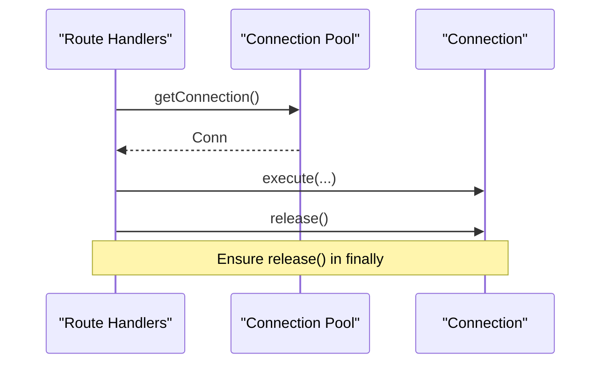

**Diagram sources**
- [routes/rides.js:170-224](file://routes/rides.js#L170-L224)
- [routes/drivers.js:101-126](file://routes/drivers.js#L101-L126)
- [config/db.js:44-47](file://config/db.js#L44-L47)

**Section sources**
- [routes/rides.js:170-224](file://routes/rides.js#L170-L224)
- [routes/drivers.js:101-126](file://routes/drivers.js#L101-L126)
- [config/db.js:44-47](file://config/db.js#L44-L47)

## Dependency Analysis
- Express server depends on routes and database configuration.
- Routes depend on the shared connection pool.
- Stored procedures encapsulate atomic logic and reduce application-level complexity.
- Initialization script ensures schema readiness before runtime.

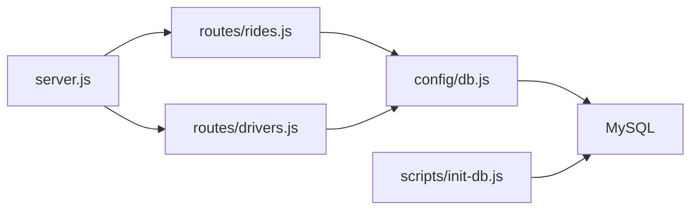

**Diagram sources**
- [server.js:6-8](file://server.js#L6-L8)
- [routes/rides.js:1-4](file://routes/rides.js#L1-L4)
- [routes/drivers.js:1-4](file://routes/drivers.js#L1-L4)
- [config/db.js:1-2](file://config/db.js#L1-L2)
- [scripts/init-db.js:1-5](file://scripts/init-db.js#L1-L5)

**Section sources**
- [server.js:6-8](file://server.js#L6-L8)
- [routes/rides.js:1-4](file://routes/rides.js#L1-L4)
- [routes/drivers.js:1-4](file://routes/drivers.js#L1-L4)
- [config/db.js:1-2](file://config/db.js#L1-L2)
- [scripts/init-db.js:1-5](file://scripts/init-db.js#L1-L5)

## Performance Considerations

### Connection Pooling and Queue Management
- Pool size: 50 concurrent connections to handle bursty peak-hour traffic.
- Queue limit: 100 extra requests queued to avoid immediate failures.
- Timeouts: 10 seconds for connect/acquire/overall to prevent deadlocks and resource starvation.
- Keep-alive: Connections refreshed to minimize reconnect overhead.
- Reuse strategy: Acquire/release per request; use transactions for multi-statement atomicity.

**Section sources**
- [config/db.js:7-30](file://config/db.js#L7-L30)
- [routes/rides.js:88-133](file://routes/rides.js#L88-L133)
- [routes/rides.js:169-224](file://routes/rides.js#L169-L224)

### Timeout Configurations
- connectTimeout: Prevents long waits while establishing connections.
- acquireTimeout: Limits time spent waiting for a free connection from the pool.
- timeout: General query timeout to avoid long-running queries.

**Section sources**
- [config/db.js:19-27](file://config/db.js#L19-L27)

### Slow Request Detection
- Middleware logs requests taking longer than 500 ms to identify hotspots and optimize queries.

**Section sources**
- [server.js:20-30](file://server.js#L20-L30)

### Health Check and Connectivity Verification
- Dedicated endpoint verifies database connectivity.
- Startup routine ensures the service does not start with a broken database.

**Section sources**
- [server.js:43-51](file://server.js#L43-L51)
- [config/db.js:33-41](file://config/db.js#L33-L41)

### Concurrency Control Strategies
- Atomic operations via stored procedures with pessimistic locking for ride matching.
- Optimistic locking using version columns to detect and prevent lost updates.
- Upsert pattern for driver location updates to eliminate race conditions.

**Section sources**
- [database/schema.sql:167-234](file://database/schema.sql#L167-L234)
- [database/schema.sql:236-263](file://database/schema.sql#L236-L263)
- [routes/drivers.js:101-126](file://routes/drivers.js#L101-L126)

### Horizontal Scaling and Load Balancing
- Multiple Node.js instances behind a load balancer to distribute traffic.
- Stateless design allows easy scaling; ensure shared database remains the bottleneck.
- Consider adding a caching layer (e.g., Redis) for read-heavy endpoints like available drivers and active rides.

**Section sources**
- [README.md:277-283](file://README.md#L277-L283)

### Capacity Planning for High Volume
- Monitor peak-hour stats and slow request logs to adjust pool size and optimize queries.
- Use queue limits to trigger alerts when load exceeds capacity.
- Plan for CPU-bound tasks (matching logic) and I/O-bound tasks (database queries).

**Section sources**
- [routes/rides.js:226-259](file://routes/rides.js#L226-L259)
- [server.js:20-30](file://server.js#L20-L30)

### Memory Management and Garbage Collection
- Prefer streaming or chunked responses for large datasets.
- Avoid accumulating large arrays in memory; use pagination and limits.
- Ensure connections are released promptly to prevent memory leaks.

**Section sources**
- [routes/drivers.js:11-36](file://routes/drivers.js#L11-L36)
- [routes/rides.js:11-41](file://routes/rides.js#L11-L41)

## Troubleshooting Guide
- ECONNREFUSED: Verify MySQL is running and reachable on the configured host/port.
- Access denied: Confirm DB credentials in environment variables.
- Table doesn't exist: Run the initialization script to create schema and stored procedures.
- Port 3000 in use: Change the port in environment variables.
- Slow queries during peak: Review slow request logs and consider increasing pool size or optimizing queries.

**Section sources**
- [README.md:265-274](file://README.md#L265-L274)

## Conclusion
The system employs robust connection pooling, atomic stored procedures, and strategic indexing to achieve high throughput and reliability during peak hours. Monitoring via slow request detection and health checks enables proactive performance tuning. For horizontal growth, scale the application behind a load balancer and consider caching for read-heavy workloads. Proper resource cleanup and timeout configurations ensure stability under sustained load.

## Appendices

### Database Initialization
- The initialization script connects to MySQL and executes the schema file, creating tables, indexes, and stored procedures.

**Section sources**
- [scripts/init-db.js:6-46](file://scripts/init-db.js#L6-L46)

### API Endpoints and Monitoring
- Health check endpoint provides database connectivity status.
- Stats endpoint aggregates counts for operational dashboards.

**Section sources**
- [server.js:43-51](file://server.js#L43-L51)
- [routes/rides.js:226-259](file://routes/rides.js#L226-L259)