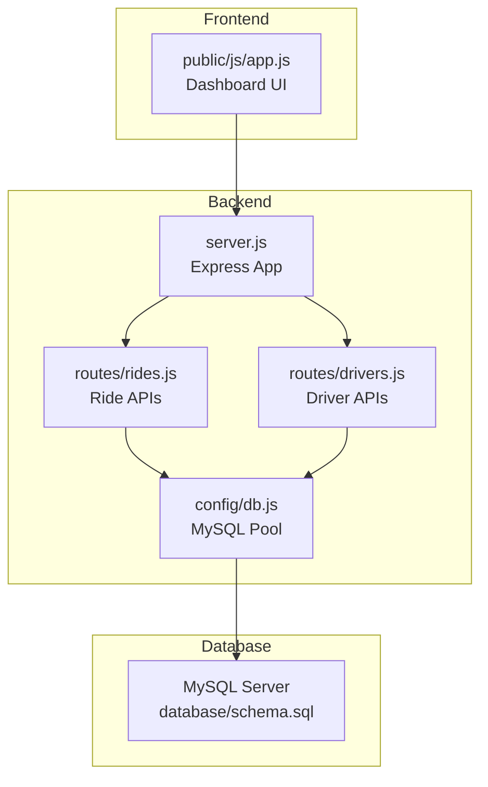
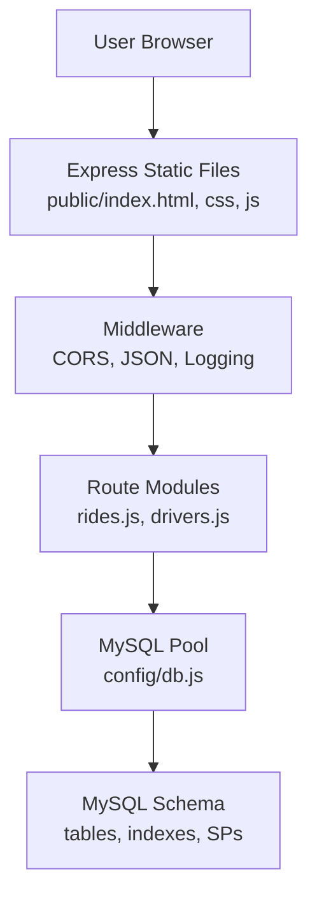
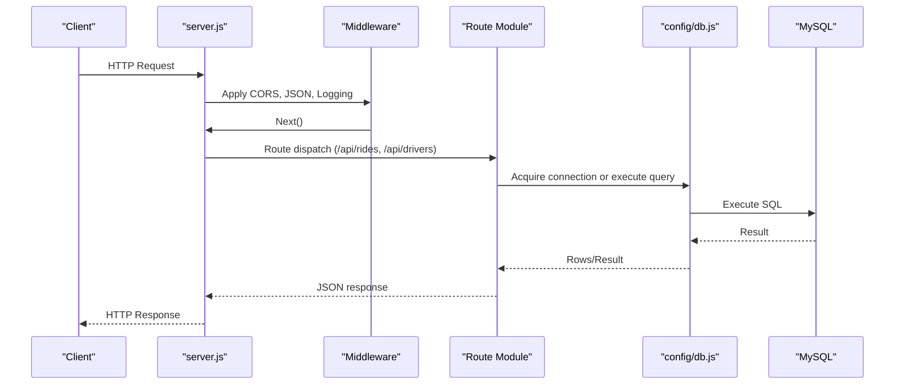
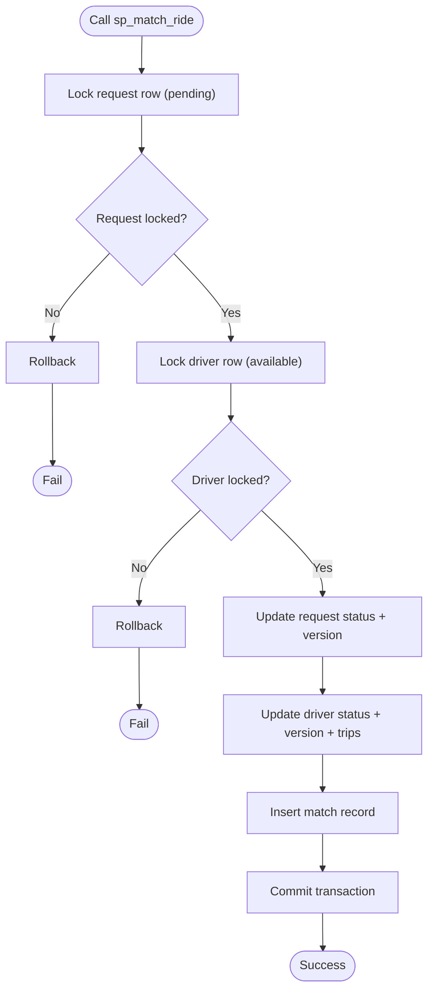
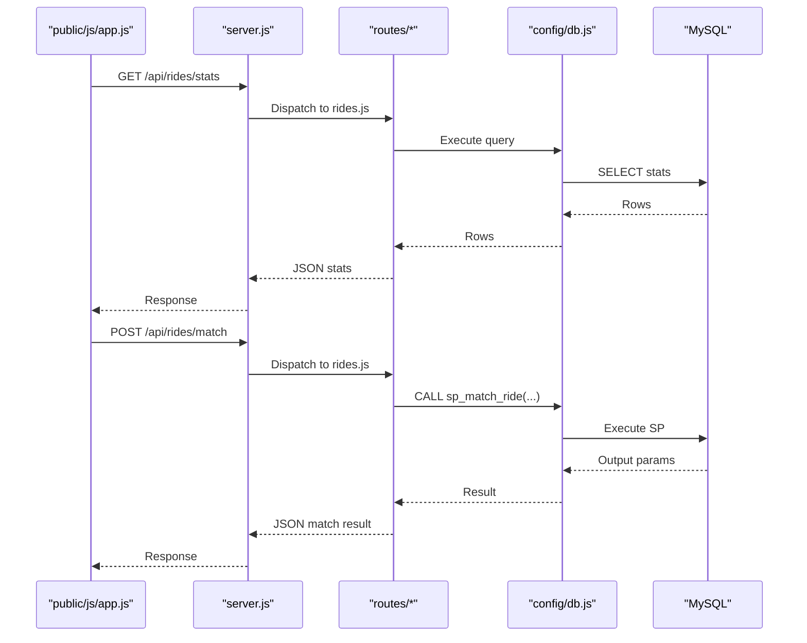
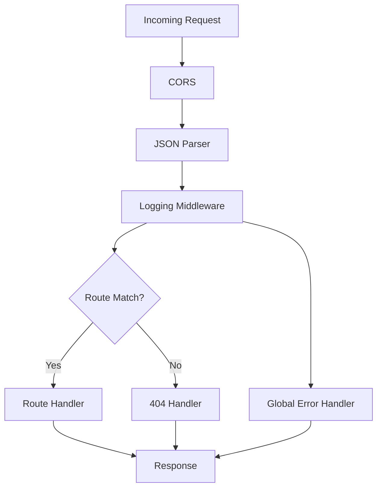
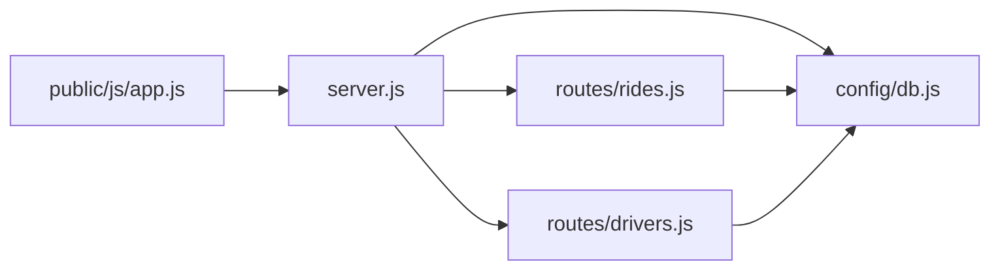

# System Architecture

<cite>
**Referenced Files in This Document**
- [server.js](file://server.js)
- [config/db.js](file://config/db.js)
- [routes/rides.js](file://routes/rides.js)
- [routes/drivers.js](file://routes/drivers.js)
- [public/js/app.js](file://public/js/app.js)
- [database/schema.sql](file://database/schema.sql)
- [scripts/init-db.js](file://scripts/init-db.js)
- [package.json](file://package.json)
- [README.md](file://README.md)
</cite>

## Table of Contents
1. [Introduction](#introduction)
2. [Project Structure](#project-structure)
3. [Core Components](#core-components)
4. [Architecture Overview](#architecture-overview)
5. [Detailed Component Analysis](#detailed-component-analysis)
6. [Dependency Analysis](#dependency-analysis)
7. [Performance Considerations](#performance-considerations)
8. [Troubleshooting Guide](#troubleshooting-guide)
9. [Conclusion](#conclusion)
10. [Appendices](#appendices)

## Introduction
This document describes the architecture of a ride-sharing matching system with a layered design:
- Frontend: Vanilla JavaScript single-page application serving as the dashboard and operator console.
- Backend: Express.js server orchestrating middleware, routing, and REST API exposure.
- Database: MySQL with connection pooling, strategic indexing, and stored procedures to enforce atomicity and concurrency safety.

The system emphasizes high read throughput, frequent updates (driver locations), and peak-hour concurrency. It uses connection pooling for resource management, stored procedures for atomic operations, and a middleware pattern for request processing. The deployment topology is designed for a single-node Express server with a local MySQL instance, with scalability considerations for up to 50 concurrent connections.

## Project Structure
The repository follows a clear separation of concerns:
- server.js: Express application bootstrap, middleware, static file serving, route wiring, health checks, and global error handling.
- config/db.js: Centralized MySQL connection pool configuration and helpers for health checks and graceful shutdown.
- routes/rides.js: Ride lifecycle APIs (request creation, matching, status updates, stats).
- routes/drivers.js: Driver lifecycle APIs (registration, location updates, status toggles, listing).
- public/js/app.js: Frontend application performing REST calls, rendering dashboards, and managing user interactions.
- database/schema.sql: Complete database schema, indexes, and stored procedures.
- scripts/init-db.js: Utility to initialize the database by applying schema.sql.
- package.json: Dependencies and scripts.
- README.md: High-level overview, setup, API reference, and operational guidance.



**Diagram sources**
- [server.js:1-84](file://server.js#L1-L84)
- [config/db.js:1-50](file://config/db.js#L1-L50)
- [routes/rides.js:1-272](file://routes/rides.js#L1-L272)
- [routes/drivers.js:1-182](file://routes/drivers.js#L1-L182)
- [database/schema.sql:1-297](file://database/schema.sql#L1-L297)

**Section sources**
- [server.js:1-84](file://server.js#L1-L84)
- [config/db.js:1-50](file://config/db.js#L1-L50)
- [routes/rides.js:1-272](file://routes/rides.js#L1-L272)
- [routes/drivers.js:1-182](file://routes/drivers.js#L1-L182)
- [database/schema.sql:1-297](file://database/schema.sql#L1-L297)
- [scripts/init-db.js:1-46](file://scripts/init-db.js#L1-L46)
- [package.json:1-24](file://package.json#L1-L24)
- [README.md:1-290](file://README.md#L1-L290)

## Core Components
- Express Server (server.js): Initializes Express, registers CORS, JSON parsing, logging middleware, serves static assets, mounts route modules, exposes health check, and global error handling.
- Database Pool (config/db.js): Creates a MySQL connection pool sized for 50 concurrent connections, with timeouts and keep-alive to manage resources efficiently.
- Routes (routes/rides.js, routes/drivers.js): Implement REST endpoints for ride requests, matching, status updates, driver registration, location updates, and availability queries.
- Frontend (public/js/app.js): Implements a dashboard with tabs, modals, forms, and periodic polling to fetch live stats, active rides, and driver lists.
- Database Schema (database/schema.sql): Defines tables, indexes, and stored procedures for atomic operations and peak-hour optimizations.

Key technical decisions:
- Connection pooling for resource management and peak-hour concurrency.
- Stored procedures for atomic operations preventing race conditions.
- Middleware pattern for request processing and logging.
- Upsert pattern for frequent location updates.
- Optimistic locking via version fields.

**Section sources**
- [server.js:10-84](file://server.js#L10-L84)
- [config/db.js:7-30](file://config/db.js#L7-L30)
- [routes/rides.js:135-167](file://routes/rides.js#L135-L167)
- [routes/drivers.js:101-126](file://routes/drivers.js#L101-L126)
- [public/js/app.js:14-29](file://public/js/app.js#L14-L29)
- [database/schema.sql:160-272](file://database/schema.sql#L160-L272)

## Architecture Overview
The system follows a classic layered architecture:
- Presentation Layer: Static HTML/CSS/JS served by Express.
- Application Layer: Express routes delegate to the database layer.
- Data Access Layer: MySQL via a connection pool with stored procedures and indexes.
- Data Layer: Relational schema optimized for read-heavy and frequent-update workloads.



**Diagram sources**
- [server.js:16-41](file://server.js#L16-L41)
- [config/db.js:7-30](file://config/db.js#L7-L30)
- [routes/rides.js:1-272](file://routes/rides.js#L1-L272)
- [routes/drivers.js:1-182](file://routes/drivers.js#L1-L182)
- [database/schema.sql:1-297](file://database/schema.sql#L1-L297)

## Detailed Component Analysis

### Express Server Orchestration
The server initializes middleware, static file serving, routes, health checks, and error handling. It logs slow requests and exposes a health endpoint that validates database connectivity.



**Diagram sources**
- [server.js:16-67](file://server.js#L16-L67)
- [config/db.js:33-41](file://config/db.js#L33-L41)
- [routes/rides.js:10-41](file://routes/rides.js#L10-L41)
- [routes/drivers.js:10-36](file://routes/drivers.js#L10-L36)

**Section sources**
- [server.js:16-67](file://server.js#L16-L67)

### Database Layer and Stored Procedures
The schema defines tables optimized for peak-hour operations and includes stored procedures to guarantee atomicity:
- sp_match_ride: Locks request and driver rows, updates statuses, and inserts a match record atomically.
- sp_update_match_status: Uses optimistic locking to safely update status with version checks.
- sp_cleanup_stale_locations: Periodic cleanup of stale driver locations.



**Diagram sources**
- [database/schema.sql:167-234](file://database/schema.sql#L167-L234)

**Section sources**
- [database/schema.sql:160-272](file://database/schema.sql#L160-L272)

### Frontend Communication with REST APIs
The frontend performs periodic polling and targeted API calls:
- Stats: GET /api/rides/stats
- Active rides: GET /api/rides/active
- Available drivers: GET /api/drivers/available
- Pending requests: GET /api/rides/pending
- Create ride request: POST /api/rides/request
- Match ride: POST /api/rides/match
- Update driver location: PUT /api/drivers/:id/location
- Update driver status: PUT /api/drivers/:id/status
- Update ride status: PUT /api/rides/:id/status



**Diagram sources**
- [public/js/app.js:155-169](file://public/js/app.js#L155-L169)
- [public/js/app.js:124-144](file://public/js/app.js#L124-L144)
- [routes/rides.js:135-167](file://routes/rides.js#L135-L167)
- [config/db.js:33-41](file://config/db.js#L33-L41)
- [database/schema.sql:167-234](file://database/schema.sql#L167-L234)

**Section sources**
- [public/js/app.js:155-223](file://public/js/app.js#L155-L223)
- [routes/rides.js:88-133](file://routes/rides.js#L88-L133)
- [routes/rides.js:135-167](file://routes/rides.js#L135-L167)
- [routes/drivers.js:79-148](file://routes/drivers.js#L79-L148)

### Middleware Pattern and Request Processing
The server applies middleware for:
- CORS enabling cross-origin requests.
- JSON body parsing for request payloads.
- Request logging middleware that measures latency and warns on slow requests.
- Static file serving for the frontend.
- Route mounting for API endpoints.
- Global 404 and error handlers.



**Diagram sources**
- [server.js:16-67](file://server.js#L16-L67)

**Section sources**
- [server.js:16-67](file://server.js#L16-L67)

### Data Model and Indexing Strategy
The schema defines tables and indexes optimized for:
- Finding available drivers quickly.
- Ordering pending requests by priority and age.
- Locating nearby requests for drivers.
- Tracking driver activity and recent matches.

```mermaid
erDiagram
USERS {
int user_id PK
string name
string email UK
string phone
timestamp created_at
timestamp updated_at
}
DRIVERS {
int driver_id PK
string name
string email UK
string phone
string vehicle_model
string vehicle_plate UK
enum status
decimal rating
int total_trips
int version
timestamp created_at
timestamp updated_at
}
DRIVER_LOCATIONS {
int location_id PK
int driver_id FK
decimal latitude
decimal longitude
decimal accuracy
timestamp updated_at
unique uk_driver
}
RIDE_REQUESTS {
int request_id PK
int user_id FK
decimal pickup_lat
decimal pickup_lng
decimal dropoff_lat
decimal dropoff_lng
string pickup_address
string dropoff_address
enum status
decimal fare_estimate
decimal priority_score
int version
timestamp created_at
timestamp updated_at
}
RIDE_MATCHES {
int match_id PK
int request_id FK UK
int driver_id FK
enum status
decimal fare_final
decimal distance_km
timestamp started_at
timestamp completed_at
int version
timestamp created_at
timestamp updated_at
}
USERS ||--o{ RIDE_REQUESTS : "creates"
DRIVERS ||--o{ DRIVER_LOCATIONS : "has"
DRIVERS ||--o{ RIDE_MATCHES : "drives"
RIDE_REQUESTS ||--|| RIDE_MATCHES : "matches"
```

**Diagram sources**
- [database/schema.sql:14-126](file://database/schema.sql#L14-L126)

**Section sources**
- [database/schema.sql:14-126](file://database/schema.sql#L14-L126)

## Dependency Analysis
- server.js depends on:
  - config/db.js for database connectivity and health checks.
  - routes/rides.js and routes/drivers.js for API endpoints.
- routes/rides.js and routes/drivers.js depend on:
  - config/db.js for database operations.
- public/js/app.js depends on:
  - server.js endpoints for data and actions.



**Diagram sources**
- [server.js:6-8](file://server.js#L6-L8)
- [routes/rides.js:3](file://routes/rides.js#L3)
- [routes/drivers.js:3](file://routes/drivers.js#L3)
- [public/js/app.js:14-29](file://public/js/app.js#L14-L29)

**Section sources**
- [server.js:6-8](file://server.js#L6-L8)
- [routes/rides.js:3](file://routes/rides.js#L3)
- [routes/drivers.js:3](file://routes/drivers.js#L3)
- [public/js/app.js:14-29](file://public/js/app.js#L14-L29)

## Performance Considerations
- Connection Pooling:
  - Pool size set to 50 connections with queue limits to handle peak-hour bursts.
  - Timeouts and keep-alive prevent idle connection leaks.
- Atomic Operations:
  - Stored procedures enforce atomicity for critical paths (matching, status updates).
- Upsert Pattern:
  - INSERT ... ON DUPLICATE KEY UPDATE reduces race conditions for frequent location updates.
- Indexing:
  - Strategic indexes on status, priority, and location fields optimize read-heavy queries.
- Optimistic Locking:
  - Version fields on drivers and ride requests detect conflicts during concurrent updates.
- Frontend Polling:
  - Auto-refresh intervals balance responsiveness with load; adjust intervals for production capacity.
- Priority Scoring:
  - Higher priority during peak hours ensures fair queue ordering.

[No sources needed since this section provides general guidance]

## Troubleshooting Guide
Common issues and resolutions:
- Connection refused: Verify MySQL is running and reachable on the configured host/port.
- Access denied: Confirm DB_USER and DB_PASSWORD in environment configuration.
- Table not found: Initialize the database using the schema file or the initialization script.
- Port 3000 in use: Change PORT in environment configuration.
- Slow queries during peak: Monitor dashboard stats and consider increasing pool size if needed.

**Section sources**
- [README.md:265-274](file://README.md#L265-L274)

## Conclusion
The system employs a clean layered architecture with Express.js as the application orchestrator, a MySQL-backed data layer with connection pooling and atomic stored procedures, and a lightweight vanilla JavaScript frontend. The design prioritizes concurrency safety, performance, and maintainability, with explicit mechanisms for peak-hour load handling and operational visibility.

[No sources needed since this section summarizes without analyzing specific files]

## Appendices

### Infrastructure Requirements
- Node.js runtime and npm dependencies.
- MySQL 8.0+ with the schema applied.
- Environment variables for database credentials and server port.

**Section sources**
- [package.json:14-19](file://package.json#L14-L19)
- [README.md:52-107](file://README.md#L52-L107)

### Deployment Topology
- Single-node Express server serving static assets and REST APIs.
- Local MySQL instance hosting the schema and stored procedures.
- Optional: Reverse proxy or load balancer for scaling beyond a single instance.

**Section sources**
- [README.md:109-139](file://README.md#L109-L139)

### Scalability Considerations with 50 Concurrent Connections
- Connection pool size tuned to 50 concurrent connections.
- Queue limits to buffer bursts.
- Stored procedures and indexes to minimize contention.
- Frontend polling cadence to balance freshness and load.

**Section sources**
- [config/db.js:14-17](file://config/db.js#L14-L17)
- [README.md:144-176](file://README.md#L144-L176)