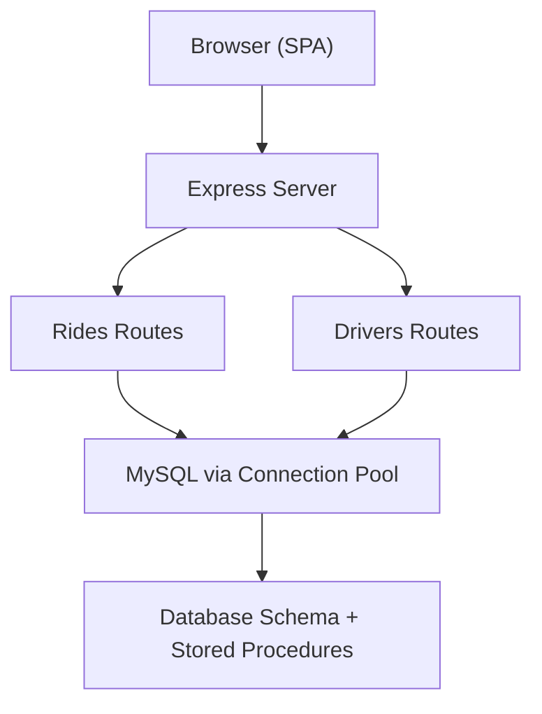
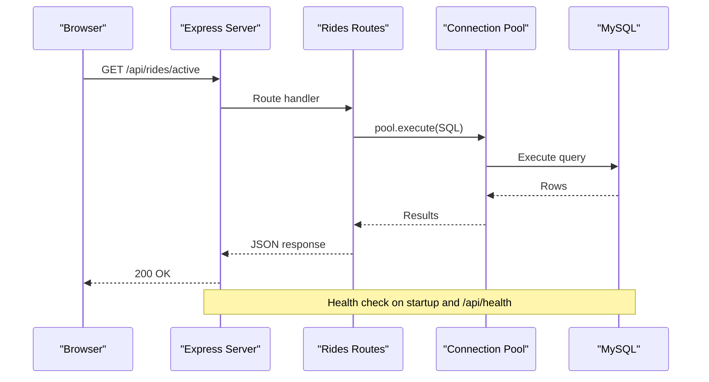
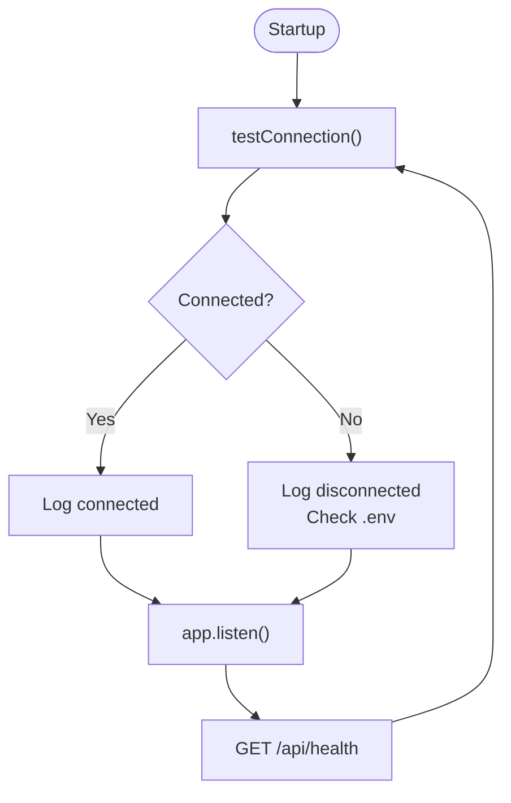
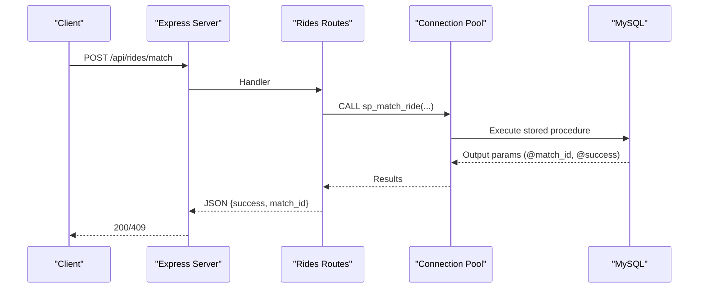
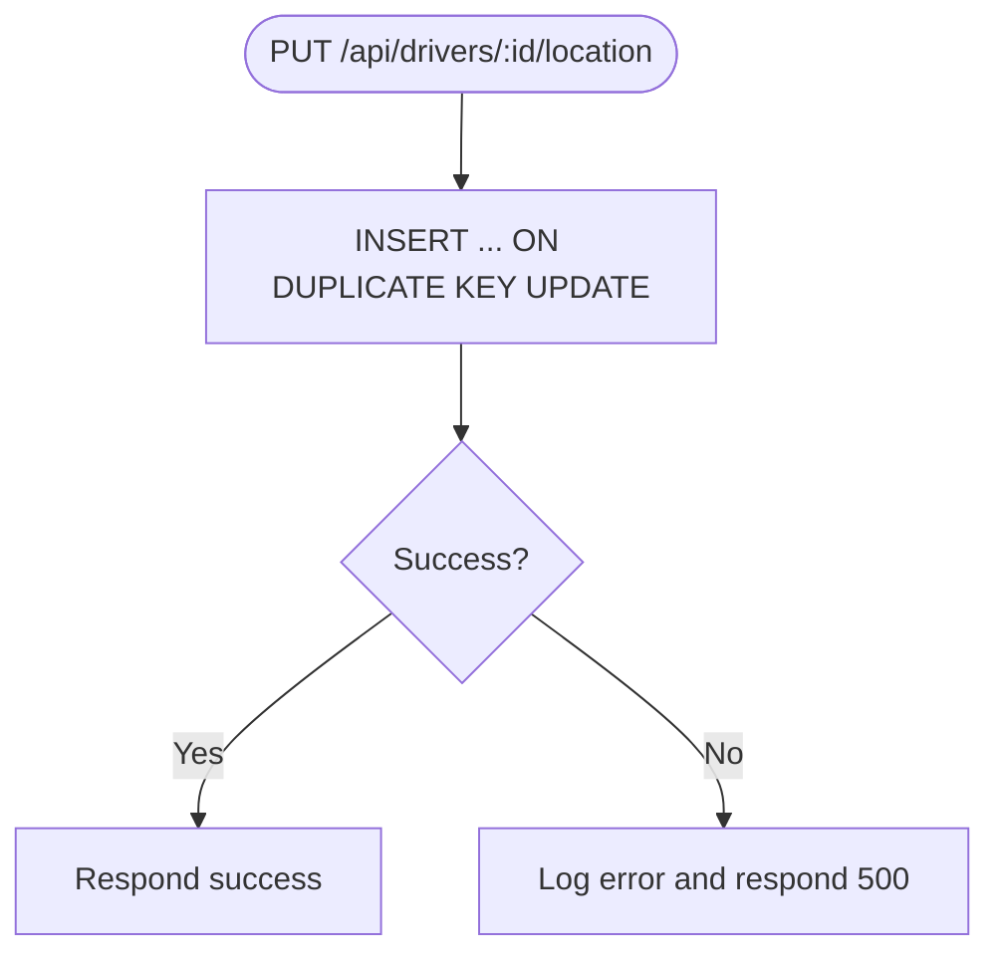
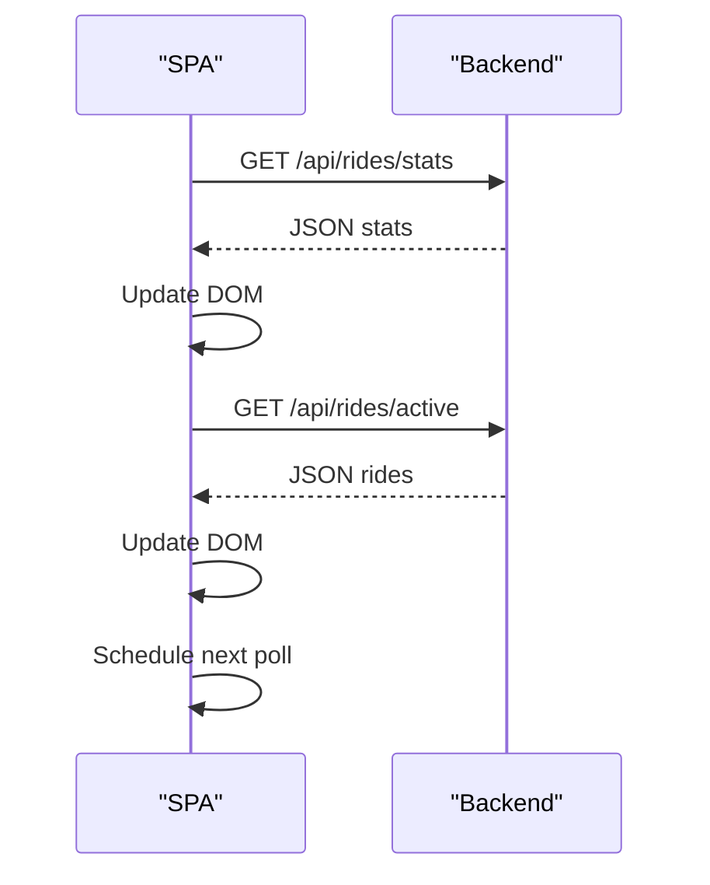
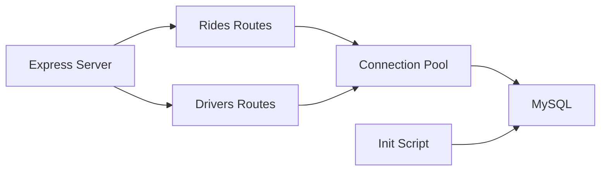

# Troubleshooting and FAQ

<cite>
**Referenced Files in This Document**
- [server.js](file://server.js)
- [config/db.js](file://config/db.js)
- [database/schema.sql](file://database/schema.sql)
- [scripts/init-db.js](file://scripts/init-db.js)
- [routes/rides.js](file://routes/rides.js)
- [routes/drivers.js](file://routes/drivers.js)
- [public/js/app.js](file://public/js/app.js)
- [public/index.html](file://public/index.html)
- [README.md](file://README.md)
- [package.json](file://package.json)
</cite>

## Table of Contents
1. [Introduction](#introduction)
2. [Project Structure](#project-structure)
3. [Core Components](#core-components)
4. [Architecture Overview](#architecture-overview)
5. [Detailed Component Analysis](#detailed-component-analysis)
6. [Dependency Analysis](#dependency-analysis)
7. [Performance Considerations](#performance-considerations)
8. [Troubleshooting Guide](#troubleshooting-guide)
9. [Error Code Reference and Diagnostics](#error-code-reference-and-diagnostics)
10. [Debugging Tools and Techniques](#debugging-tools-and-techniques)
11. [FAQ](#faq)
12. [Conclusion](#conclusion)

## Introduction
This document provides comprehensive troubleshooting and FAQ guidance for the ride-sharing DBMS system. It covers common operational issues such as MySQL connectivity failures, authentication errors, missing schema, and port conflicts. It also includes performance troubleshooting for peak-hour scenarios, connection pool exhaustion, and memory usage optimization. Additionally, it documents database maintenance procedures, error code references, diagnostics, debugging techniques, and answers frequently asked questions about system limitations, capacity planning, and feature extensions.

## Project Structure
The system follows a layered architecture:
- Server entry point initializes Express, middleware, static assets, routes, health checks, and graceful shutdown.
- Database configuration defines a connection pool tuned for high read and frequent updates.
- Routes implement ride and driver APIs with transactional safety and atomic operations.
- Frontend is a single-page application that polls backend endpoints and displays live stats.

**Diagram sources**
- [server.js:10-51](file://server.js#L10-L51)
- [config/db.js:7-30](file://config/db.js#L7-L30)
- [routes/rides.js:10-41](file://routes/rides.js#L10-L41)
- [routes/drivers.js:10-36](file://routes/drivers.js#L10-L36)

**Section sources**
- [server.js:10-51](file://server.js#L10-L51)
- [config/db.js:7-30](file://config/db.js#L7-L30)
- [routes/rides.js:10-41](file://routes/rides.js#L10-L41)
- [routes/drivers.js:10-36](file://routes/drivers.js#L10-L36)
- [README.md:29-48](file://README.md#L29-L48)

## Core Components
- Express server with CORS, JSON parsing, static serving, and global error handling.
- Health check endpoint that validates database connectivity.
- Connection pool configured for peak-hour concurrency with timeouts and keep-alive.
- Route handlers for rides and drivers with transactional updates and atomic stored procedures.
- Frontend SPA that auto-refreshes stats and lists, and interacts with backend APIs.

Key implementation references:
- Server bootstrap and middleware: [server.js:10-30](file://server.js#L10-L30)
- Health endpoint: [server.js:43-51](file://server.js#L43-L51)
- Connection pool configuration: [config/db.js:7-30](file://config/db.js#L7-L30)
- Rides routes (atomic match, transactions): [routes/rides.js:135-167](file://routes/rides.js#L135-L167)
- Drivers routes (location upsert): [routes/drivers.js:101-126](file://routes/drivers.js#L101-L126)
- Frontend polling and error handling: [public/js/app.js:155-169](file://public/js/app.js#L155-L169)

**Section sources**
- [server.js:10-81](file://server.js#L10-L81)
- [config/db.js:7-47](file://config/db.js#L7-L47)
- [routes/rides.js:135-224](file://routes/rides.js#L135-L224)
- [routes/drivers.js:101-148](file://routes/drivers.js#L101-L148)
- [public/js/app.js:155-169](file://public/js/app.js#L155-L169)

## Architecture Overview
The system architecture integrates a frontend SPA with an Express backend and a MySQL database. The backend uses a connection pool to manage concurrent requests, stored procedures for atomic operations, and strategic indexing for performance.

**Diagram sources**
- [server.js:43-51](file://server.js#L43-L51)
- [routes/rides.js:10-41](file://routes/rides.js#L10-L41)
- [config/db.js:33-41](file://config/db.js#L33-L41)

**Section sources**
- [server.js:43-51](file://server.js#L43-L51)
- [routes/rides.js:10-41](file://routes/rides.js#L10-L41)
- [config/db.js:33-41](file://config/db.js#L33-L41)

## Detailed Component Analysis

### Database Connectivity and Pool
- Connection pool parameters include connectionLimit, queueLimit, waitForConnections, and timeouts to prevent hangs.
- Health check executes a simple SELECT to verify connectivity.
- Graceful shutdown ends the pool to release resources.

**Diagram sources**
- [config/db.js:33-41](file://config/db.js#L33-L41)
- [server.js:72-81](file://server.js#L72-L81)
- [server.js:43-51](file://server.js#L43-L51)

**Section sources**
- [config/db.js:7-30](file://config/db.js#L7-L30)
- [config/db.js:33-41](file://config/db.js#L33-L41)
- [server.js:72-81](file://server.js#L72-L81)

### Rides API: Atomic Matching and Transactions
- Atomic match uses a stored procedure with FOR UPDATE locks to prevent race conditions.
- Transactional inserts and updates ensure data consistency.
- Status transitions are coordinated across related tables.

**Diagram sources**
- [routes/rides.js:135-167](file://routes/rides.js#L135-L167)
- [database/schema.sql:167-234](file://database/schema.sql#L167-L234)

**Section sources**
- [routes/rides.js:135-167](file://routes/rides.js#L135-L167)
- [database/schema.sql:167-234](file://database/schema.sql#L167-L234)

### Drivers API: Location Upsert and Status Updates
- Location updates use INSERT ... ON DUPLICATE KEY UPDATE for atomicity.
- Status toggles are handled with simple updates and 404 handling for missing drivers.

**Diagram sources**
- [routes/drivers.js:101-126](file://routes/drivers.js#L101-L126)

**Section sources**
- [routes/drivers.js:101-126](file://routes/drivers.js#L101-L126)

### Frontend Monitoring and Auto-Refresh
- The SPA auto-refreshes stats every 5 seconds and other lists at intervals.
- On network errors, the frontend marks connection as disconnected.

**Diagram sources**
- [public/js/app.js:25-29](file://public/js/app.js#L25-L29)
- [public/js/app.js:155-169](file://public/js/app.js#L155-L169)

**Section sources**
- [public/js/app.js:25-29](file://public/js/app.js#L25-L29)
- [public/js/app.js:155-169](file://public/js/app.js#L155-L169)

## Dependency Analysis
- Express depends on mysql2/promise for database operations.
- Routes depend on the shared connection pool.
- Initialization script depends on mysql2/promise to apply schema.

**Diagram sources**
- [server.js:6-8](file://server.js#L6-L8)
- [routes/rides.js:3](file://routes/rides.js#L3)
- [routes/drivers.js:3](file://routes/drivers.js#L3)
- [config/db.js:1](file://config/db.js#L1)
- [scripts/init-db.js:3](file://scripts/init-db.js#L3)

**Section sources**
- [server.js:6-8](file://server.js#L6-L8)
- [routes/rides.js:3](file://routes/rides.js#L3)
- [routes/drivers.js:3](file://routes/drivers.js#L3)
- [config/db.js:1](file://config/db.js#L1)
- [scripts/init-db.js:3](file://scripts/init-db.js#L3)

## Performance Considerations
- Connection pool sizing: 50 connections with queue limit 100 to handle peak-hour bursts.
- Timeouts: connectTimeout, acquireTimeout, and timeout to prevent hanging connections.
- Keep-alive: enableKeepAlive with initial delay to refresh idle connections.
- Indexing: strategic indexes on status, created_at, pickup coordinates, and driver status.
- Upsert pattern: reduces race conditions and minimizes round-trips for frequent location updates.
- Priority scoring: increases priority during peak hours to improve fairness.

Practical recommendations:
- Monitor pool usage and adjust connectionLimit and queueLimit based on observed wait times.
- Use EXPLAIN to analyze slow queries and add missing indexes.
- Consider adding a caching layer for read-heavy endpoints if latency remains high.
- Tune MySQL server settings (innodb_buffer_pool_size, innodb_log_file_size) for workload characteristics.

**Section sources**
- [config/db.js:7-30](file://config/db.js#L7-L30)
- [database/schema.sql:24-68](file://database/schema.sql#L24-L68)
- [routes/rides.js:261-269](file://routes/rides.js#L261-L269)

## Troubleshooting Guide

### MySQL Connectivity Issues
Symptoms:
- ECONNREFUSED on startup or health check.
- Database appears disconnected in logs.

Common causes and fixes:
- MySQL service not running: start MySQL server.
- Incorrect host/port in environment variables: verify DB_HOST and DB_PORT.
- Firewall blocking the port: ensure port 3306 is accessible.
- Wrong database name: confirm DB_NAME matches the initialized schema.

Verification steps:
- Confirm environment variables in .env.
- Test connectivity externally with a MySQL client.
- Check server logs for error messages from testConnection.

**Section sources**
- [server.js:72-81](file://server.js#L72-L81)
- [config/db.js:33-41](file://config/db.js#L33-L41)
- [README.md:269](file://README.md#L269)

### Authentication Problems
Symptoms:
- Access denied errors when connecting to MySQL.

Common causes and fixes:
- Incorrect DB_USER or DB_PASSWORD.
- User lacks privileges for the target database.
- Using legacy authentication plugin mismatch.

Verification steps:
- Verify credentials in .env.
- Ensure the user exists and has access to DB_NAME.
- Check MySQL error logs for detailed access denial reasons.

**Section sources**
- [config/db.js:8-12](file://config/db.js#L8-L12)
- [README.md:270](file://README.md#L270)

### Missing Database Schema
Symptoms:
- “Table doesn't exist” errors when calling routes.
- Queries fail due to unknown tables.

Common causes and fixes:
- Schema not initialized.
- Using a different database instance than intended.

Verification steps:
- Run the initialization script to apply schema.
- Confirm DB_NAME and that schema.sql was executed successfully.
- Check for DROP/CREATE statements and foreign keys.

**Section sources**
- [scripts/init-db.js:14-42](file://scripts/init-db.js#L14-L42)
- [database/schema.sql:6-10](file://database/schema.sql#L6-L10)
- [README.md:271](file://README.md#L271)

### Port Conflicts
Symptoms:
- Server fails to start with port binding errors.

Common causes and fixes:
- Another process is using the configured PORT.

Verification steps:
- Change PORT in .env to an available port.
- Use netstat or lsof to identify the conflicting process.
- Restart the server after changing the port.

**Section sources**
- [server.js:11](file://server.js#L11)
- [README.md:272](file://README.md#L272)

### Slow Queries During Peak Hours
Symptoms:
- Increased response times and slow stats/dashboard loading.

Common causes and fixes:
- Insufficient connection pool size or queue overflow.
- Missing or inefficient indexes.
- High contention on frequently updated tables.

Verification steps:
- Review pool metrics and adjust connectionLimit/queueLimit.
- Analyze slow queries with EXPLAIN and add indexes as needed.
- Consider reducing contention by batching updates or using stored procedures.

**Section sources**
- [config/db.js:14-30](file://config/db.js#L14-L30)
- [database/schema.sql:94-97](file://database/schema.sql#L94-L97)
- [README.md:273](file://README.md#L273)

### Connection Pool Exhaustion
Symptoms:
- Requests hang or timeout during spikes.

Common causes and fixes:
- Too few connections or queueLimit too low.
- Long-running queries or transactions blocking acquisition.

Verification steps:
- Increase connectionLimit and queueLimit cautiously.
- Investigate long-running transactions and optimize queries.
- Enable pool monitoring and set alerts for high queue waits.

**Section sources**
- [config/db.js:14-17](file://config/db.js#L14-L17)
- [config/db.js:20-22](file://config/db.js#L20-L22)

### Memory Usage Optimization
Symptoms:
- High memory consumption under load.

Common causes and fixes:
- Large result sets without pagination.
- Streaming large datasets unnecessarily.

Verification steps:
- Limit result sizes and implement pagination.
- Use streaming options judiciously.
- Monitor heap usage and tune Node.js garbage collection settings.

**Section sources**
- [config/db.js:29](file://config/db.js#L29)
- [routes/rides.js:34](file://routes/rides.js#L34)
- [routes/drivers.js:29](file://routes/drivers.js#L29)

### Database Maintenance Procedures
- Schema validation: verify tables and indexes exist and are aligned with expectations.
- Index rebuilding: re-create missing or fragmented indexes.
- Performance tuning: analyze slow queries, add indexes, and tune MySQL server settings.

Operational checklist:
- Validate schema with a migration verification step.
- Periodically rebuild indexes if fragmentation is detected.
- Monitor peak-hour stats and adjust pool and indexes accordingly.

**Section sources**
- [database/schema.sql:6-141](file://database/schema.sql#L6-L141)
- [README.md:142-176](file://README.md#L142-L176)

## Error Code Reference and Diagnostics
Common MySQL error categories and typical causes:
- 2003 (Can’t connect to MySQL server): host/port unreachable or service down.
- 1045 (Access denied): wrong credentials or insufficient privileges.
- 1146 (Table doesn't exist): schema not initialized or wrong database.
- 2013 (Lost connection): network issues or timeouts exceeded.

Diagnostic procedures:
- Capture stack traces from global error handler.
- Use testConnection to validate database health.
- Enable slow query log and analyze with EXPLAIN.
- Monitor pool queue length and acquireTimeout metrics.

**Section sources**
- [server.js:64-67](file://server.js#L64-L67)
- [config/db.js:33-41](file://config/db.js#L33-L41)
- [README.md:265-274](file://README.md#L265-L274)

## Debugging Tools and Techniques
- Connection pool debugging:
  - Observe pool queue waits and connection usage.
  - Add instrumentation around pool.acquire and pool.release.
- Query performance:
  - Use EXPLAIN to analyze query plans.
  - Profile slow endpoints with middleware timing.
- Race condition detection:
  - Verify stored procedure usage for atomic operations.
  - Check optimistic locking version fields on concurrent updates.
- Frontend diagnostics:
  - Monitor connection-status indicators and toast notifications.
  - Inspect network tab for failed requests and error payloads.

**Section sources**
- [server.js:20-30](file://server.js#L20-L30)
- [routes/rides.js:135-167](file://routes/rides.js#L135-L167)
- [routes/drivers.js:101-126](file://routes/drivers.js#L101-L126)
- [public/js/app.js:155-169](file://public/js/app.js#L155-L169)

## FAQ
- What happens if the database is down?
  - The server starts but reports unhealthy status on /api/health and logs connectivity failures.
- How do I scale for more concurrent users?
  - Increase pool.connectionLimit and queueLimit; consider horizontal scaling with multiple Node.js instances behind a load balancer.
- Can I change the database host/port at runtime?
  - Yes, configure DB_HOST, DB_PORT, and DB_NAME in .env and restart the server.
- Why does matching sometimes fail?
  - The stored procedure returns a conflict when the ride is already matched or the driver is unavailable.
- How often should I rebuild indexes?
  - Rebuild indexes periodically if fragmentation is observed; monitor query performance to decide.
- Are there limits on concurrent updates?
  - The system uses atomic operations and optimistic locking to minimize conflicts; excessive contention may still occur under extreme load.

**Section sources**
- [server.js:43-51](file://server.js#L43-L51)
- [routes/rides.js:157-162](file://routes/rides.js#L157-L162)
- [README.md:277-283](file://README.md#L277-L283)

## Conclusion
This guide consolidates practical troubleshooting steps, performance tuning advice, maintenance procedures, and FAQs for the ride-sharing DBMS. By validating connectivity, ensuring schema integrity, optimizing the connection pool, and applying targeted database tuning, you can maintain reliable operations during peak hours. Use the provided diagnostics and debugging techniques to quickly isolate and resolve issues.